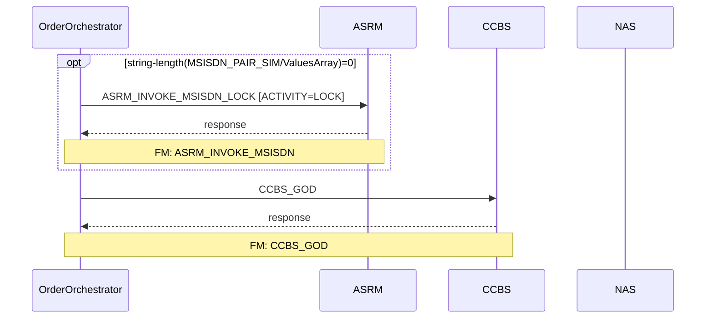

# gen-ordr-doc

Generate an Order Journey HTML and Markdown documentation page for a TIBCO ProcessConfig XML file,
with step-by-step activity table, PreExecCheck details, and links to each FM's generated documentation.

**Usage:**
- `gen-ordr-doc ACTIVATION_CREATE_SUBSCRIBER`
- `gen-ordr-doc ACTIVATION_CREATE_SUBSCRIBER resume`  ← resume a paused run

The argument is the filename **without extension** from:
`TRUEOMX_20250719 - AI/SupportingFiles/Configs/ProcessConfig/<filename>.xml`

---

## Workspace root

```
c:\Users\ChailucK\OneDrive - True Corporation Public Company Limited\DTAC\Source code\TRUE OMX\TRUEOMX AI
```

## Source file location

```
<workspace root>/TRUEOMX_20250719 - AI/SupportingFiles/Configs/ProcessConfig/<FILENAME>.xml
```

## Output locations

| File | Path |
|------|------|
| HTML | `output/order/<FILENAME>.html` |
| Markdown | `output/orderMD/<FILENAME>.md` |
| State (resume tracking) | `output/order/.state/<FILENAME>.json` |

FM logic docs (generated by gen-FM-doc) land at:
- `output/FMlogic/Request_<ActivityID>.html`
- `output/FMlogic_markdown/Request_<ActivityID>.md`

---

## Steps

### Step 0 — Resolve arguments

Parse `$ARGUMENTS`:
- First token → `FILENAME` (required, no `.xml` extension).
- Second token → `resume` keyword (optional).

If `FILENAME` is empty, ask the user for it and stop.

Derive the full source path:
```
<workspace root>/TRUEOMX_20250719 - AI/SupportingFiles/Configs/ProcessConfig/<FILENAME>.xml
```

---

### Step 1 — Load state (resume mode)

If the `resume` keyword was given **or** the state file `output/order/.state/<FILENAME>.json` exists,
read it and note which `ActivityID` values have already been processed (`"done": true`).

State file schema:
```json
{
  "filename": "ACTIVATION_CREATE_SUBSCRIBER",
  "activities": [
    { "step": 1, "extId": "ACTIVATION_CREATE_SUBSCRIBER:ASRM_INVOKE_MSISDN_LOCK",
      "activityId": "ASRM_INVOKE_MSISDN", "done": false }
  ],
  "orderHtmlWritten": false,
  "orderMdWritten": false
}
```

If no state file exists, this is a fresh run.

---

### Step 2 — Parse the ProcessConfig XML

Read the ProcessConfig XML file. Extract the following from **every** `<ns0:Activities>` element in document order:

| Field | Source |
|-------|--------|
| `stepExtId` | `extId` attribute on `<ns0:Activities>` |
| `activityId` | `<ns0:ActivityID>` child text — **this is the FM name** |
| `parameter` | All `<ns0:Parameter>` child text values (join with ` \| `) |
| `preExecCheck` | `<ns0:PreExecCheck>` child text (may be absent) |
| `previousActivity` | `<ns0:PreviousActivity>` child text (may be absent) |
| `nextActivity` | `<ns0:NextActivity>` child text (may be absent) |

Also read from the root `<ns0:ProcessConfig>`:
- `processName` → `extId` attribute on the root element (e.g., `ACTIVATION_CREATE_SUBSCRIBER`)
- `description` → `<ns0:ProcessFlowDescription>` text
- `firstActivity` → `<ns0:NextActivityName>` text (entry point)

Assign a sequential `step` number (1-based, document order).

**Deduplicate FM docs:** build a list of unique `activityId` values across all activities — each unique FM needs one `gen-FM-doc` call.

---

### Step 3 — Show the activity table and confirm start

Print a summary to the user:

```
Process: ACTIVATION_CREATE_SUBSCRIBER
Total activities: N
Unique FM names to document: M
State: fresh run  [or: resuming from step X]

Step | Step ExtId (short)                        | FM (ActivityID)             | Parameter         | Has PreExecCheck
-----|-------------------------------------------|-----------------------------|-------------------|------------------
  1  | ...ASRM_INVOKE_MSISDN_LOCK                | ASRM_INVOKE_MSISDN          | ACTIVITY=LOCK     | Yes
  2  | ...ASRM_INVOKE_MSISDN_RESERVE             | ASRM_INVOKE_MSISDN          | ACTIVITY=RESERVE  | Yes
  ...
```

Then ask:
> **Ready to generate FM documentation for each unique ActivityID above.**
> Type **continue** to start (or **pause** to stop here).

If the user says pause/stop, save the current state (all steps as `done: false`) and exit.

---

### Step 4 — Generate FM documentation for each unique ActivityID

For each **unique** `activityId` in activity order (first occurrence):
if the activity name already has markdown and html file, please ask whether to overwrite or skip.

**4a. Check if already done**
If resume mode and this `activityId` is already `done: true` in the state file → skip and move on.

**4b. Announce the FM**
Print:
```
━━━━━━━━━━━━━━━━━━━━━━━━━━━━━━━━━━━━━━━━━━━━━━━━━━━━━
FM [X of M]: <activityId>
Used in steps: N, N, N (list all step numbers that reference this FM)
━━━━━━━━━━━━━━━━━━━━━━━━━━━━━━━━━━━━━━━━━━━━━━━━━━━━━
Calling /gen-FM-doc <activityId> …
```

**4c. Call gen-FM-doc**
Invoke the `gen-FM-doc` skill with the `activityId` as the argument. That skill will:
- Find and read `Request_<activityId>.rule` + `Response_<activityId>.rulefunction`
- Write `output/FMlogic/Request_<activityId>.html`
- Write `output/FMlogic_markdown/Request_<activityId>.md`

If `gen-FM-doc` reports that the rule file was **not found**, note it as a warning (FM may be an internal OMX function, not a rule file) — mark the step as done with `"notFound": true`.

**4d. Update state**
After each FM doc is generated (or skipped as not-found), update the state JSON:
- Set `done: true` for all activities whose `activityId` matches the just-processed FM.
- Write the state file immediately so a pause mid-run can be resumed.

**4e. Confirm continue or pause**
Print:
```
✓ FM doc generated: output/FMlogic/Request_<activityId>.html
  [X of M unique FMs done — Y activities remaining]

Type 'continue' to proceed to the next FM, or 'pause' to stop here (you can resume later with: gen-ordr-doc <FILENAME> resume).
```

Wait for user input:
- **continue** → proceed to the next unique FM (4a).
- **pause** / **stop** / anything else → save state and exit with a resume hint message.

---

### Step 5 — Generate the Order Journey HTML

Once ALL unique FMs are done (or the user explicitly says "generate page now" after a pause),
produce `output/order/<FILENAME>.html`.

#### HTML structure

Apply the TRUE Corporation HTML theme (same CSS variables as gen-FM-doc):

```css
:root {
  --true-red:  #CC0000;
  --true-dark: #8B0000;
  --true-deep: #5C0000;
  --true-light:#FF5252;
  --true-pale: #FFF5F5;
  --success:   #2e7d32;
  --warning:   #e65100;
  --info:      #1565c0;
  --skip:      #6a1b9a;
  --bg:        #F9F9F9;
  --card:      #FFFFFF;
  --border:    #E0E0E0;
  --code-bg:   #1e1e2e;
  --code-fg:   #cdd6f4;
}
```

- Page header gradient: `linear-gradient(135deg, var(--true-deep), var(--true-dark), var(--true-red))`
- Card headers: `linear-gradient(90deg, var(--true-dark), var(--true-red))`
- Table `<th>`: `background: #F5E6E6; color: var(--true-dark); border-bottom: 2px solid var(--true-red)`

#### Sections

**§1 — Header**
- `<h1>` = process name (e.g., `ACTIVATION_CREATE_SUBSCRIBER`)
- Sub-title: process description from `<ns0:ProcessFlowDescription>`
- Metadata row: Total steps | Unique FMs | Entry point activity | Generated date

**§2 — Order Flow Table**

A wide HTML table with one row per `<ns0:Activities>` entry, in document order:

| Column | Content |
|--------|---------|
| **Step #** | Sequential number |
| **Step ID** | The part after `:` in `stepExtId` (short form, e.g., `ASRM_INVOKE_MSISDN_LOCK`) |
| **FM (ActivityID)** | `activityId` value — linked to `../../output/FMlogic/Request_<activityId>.html` (relative path) if that file exists; plain text if not-found |
| **Parameter(s)** | All `<ns0:Parameter>` values, one per line |
| **PreExecCheck** | Full XPath expression in a `<code>` block; row highlighted in light yellow if present; "—" if absent |
| **Previous Step** | Short step ID of the previous activity (or "START" for the first) |
| **Next Step** | Short step ID of the next activity (or "END" for the last) |
| **FM Doc** | Badge: green "✓ Generated" link to HTML if found; amber "⚠ Not Found" if the rule file was missing |

Rows with a PreExecCheck should have a subtle left yellow border to visually distinguish conditional steps from unconditional ones.

**§3 — PreExecCheck Details**

For each activity that has a `<ns0:PreExecCheck>`, render a collapsible card (HTML `<details><summary>`) showing:
- Step number and step ID in the summary line
- The full XPath expression in a syntax-highlighted code block
- FM link

Group under a section header: `§3 — Conditional Execution Rules (PreExecCheck)`

**§4 — FM Documentation Index**

A grid of cards, one per **unique** `activityId`, showing:
- FM name as card title
- Steps that use this FM (comma-separated step numbers)
- Link to `output/FMlogic/Request_<activityId>.html`
- Status badge: "Generated" / "Not Found"

**§5 — Sequence Diagram (Mermaid)**

Render a Mermaid `sequenceDiagram` using the standard Mermaid sequence diagram syntax.
Include the Mermaid CDN script once in the page (shared with §6):
```html
<script src="https://cdn.jsdelivr.net/npm/mermaid/dist/mermaid.min.js"></script>
<script>mermaid.initialize({ startOnLoad: true, theme: 'default' });</script>
```

**Derive participants** from the `activityId` prefix (the text before the first `_`):

| Prefix | Participant label |
|--------|------------------|
| `ASRM` | ASRM |
| `CCBS` | CCBS |
| `NAS` | NAS |
| `AA` | AA |
| `SBM` | SBM |
| `BL` | BL |
| `MCS` | MCS |
| `CJ` | CJ |
| `INTX` | INTX |
| `SMDP` | SMDP |
| `OMX` | OMX (internal) |
| anything else | use full `activityId` prefix |

Always declare `participant O as OrderOrchestrator` first, then one `participant` per unique derived backend (in first-occurrence order).

**Build the diagram body** — one row per `<ns0:Activities>` in document order:

- **Unconditional activity** (no PreExecCheck):
  ```
  O->>BACKEND: stepId [param1 | param2]
  BACKEND-->>O: response
  ```
- **Conditional activity** (has PreExecCheck): wrap in `opt` using a short label derived from the PreExecCheck. Keep the label ≤ 60 characters — truncate with `...` if longer:
  ```
  opt [short PreExecCheck label]
      O->>BACKEND: stepId [param]
      BACKEND-->>O: response
  end
  ```
- Where `stepId` is the short step ID (part after `:` in the `extId`).
- Where `[param]` is the Parameter values joined with ` | ` (omit if no Parameter).
- Where `BACKEND` is the participant derived from the `activityId` prefix above.
- Add a `Note over O,BACKEND: FM: <activityId>` line after the response arrow, so the FM name is visible on the diagram.

**Sequence diagram example** (partial, for illustration):
```
sequenceDiagram
    participant O as OrderOrchestrator
    participant ASRM as ASRM
    participant CCBS as CCBS
    participant NAS as NAS

    opt string-length(MSISDN_PAIR_SIM/ValuesArray)=0
        O->>ASRM: ASRM_INVOKE_MSISDN_LOCK [ACTIVITY=LOCK]
        ASRM-->>O: response
        Note over O,ASRM: FM: ASRM_INVOKE_MSISDN
    end
    opt string-length(MSISDN_PAIR_SIM/ValuesArray)=0
        O->>ASRM: ASRM_INVOKE_MSISDN_RESERVE [ACTIVITY=RESERVE]
        ASRM-->>O: response
        Note over O,ASRM: FM: ASRM_INVOKE_MSISDN
    end
    O->>CCBS: CCBS_GOD
    CCBS-->>O: response
    Note over O,CCBS: FM: CCBS_GOD
    O->>NAS: NAS_ACTIVATE_SUBS
    NAS-->>O: response
    Note over O,NAS: FM: NAS_ACTIVATE_SUBS
```

Render this inside the page with:
```html
<div class="mermaid">
sequenceDiagram
    ...
</div>
```

Wrap the `<div class="mermaid">` in a horizontally scrollable container so wide diagrams do not break the layout:
```html
<div style="overflow-x:auto; border:1px solid var(--border); border-radius:8px; padding:16px; background:var(--card);">
  <div class="mermaid">
  sequenceDiagram
      ...
  </div>
</div>
```

Skip the sequence diagram if the number of activities exceeds 60 (add a note: "Sequence diagram omitted — too many steps to render readably").

**§6 — Flow Diagram (Mermaid)**

Render a Mermaid `flowchart TD` inside a `<div>` (reuses the same CDN script from §5):

Build the diagram from the activity chain:
```
flowchart TD
    START([START]) --> S1[ASRM_INVOKE_MSISDN_LOCK\nFM: ASRM_INVOKE_MSISDN]
    S1 -->|PreExecCheck| S2[...]
    ...
    SN --> END([END])
```

For conditional steps (has PreExecCheck), use a diamond decision shape:
```
S1{ASRM_INVOKE_MSISDN_LOCK\nFM: ASRM_INVOKE_MSISDN\n[Conditional]}
```

---

### Step 6 — Generate the Order Journey Markdown

Write `output/orderMD/<FILENAME>.md` with:

```markdown
# <FILENAME>

> <ProcessFlowDescription>

**Total steps:** N | **Unique FMs:** M | **Entry point:** <firstActivity>

---

## §2 — Order Flow

| Step | Step ID | FM (ActivityID) | Parameter(s) | PreExecCheck | Previous | Next |
|------|---------|-----------------|--------------|--------------|----------|------|
| 1 | ASRM_INVOKE_MSISDN_LOCK | ASRM_INVOKE_MSISDN | ACTIVITY=LOCK | `string-length(...)=0` | START | ASRM_INVOKE_MSISDN_RESERVE |
| ... |

---

## §3 — PreExecCheck Details

### Step 1 — ASRM_INVOKE_MSISDN_LOCK

**FM:** `ASRM_INVOKE_MSISDN`

```xpath
string-length(//Subscriber/ResourceInfo[ResourceName="MSISDN_PAIR_SIM"]/ValuesArray/text())=0
```

---

## §4 — FM Documentation Index

| FM (ActivityID) | Used in Steps | Doc Link |
|-----------------|---------------|----------|
| ASRM_INVOKE_MSISDN | 1, 2, ... | [Request_ASRM_INVOKE_MSISDN.html](../../output/FMlogic/Request_ASRM_INVOKE_MSISDN.html) |
| ...

---

## §5 — Sequence Diagram



> Rendered from ProcessConfig activity chain. Conditional steps wrapped in `opt` blocks.
> Full sequence diagram: see the companion HTML at `output/order/<FILENAME>.html`

---

*TRUE Corporation OMX · Order Journey Documentation*
```

---

### Step 7 — Update state and report completion

Mark `"orderHtmlWritten": true` and `"orderMdWritten": true` in the state file.

Report to the user:

```
━━━━━━━━━━━━━━━━━━━━━━━━━━━━━━━━━━━━━━━━━━━━━━━━━━━━━━━
Order Journey Documentation Generated
━━━━━━━━━━━━━━━━━━━━━━━━━━━━━━━━━━━━━━━━━━━━━━━━━━━━━━━
Process       : ACTIVATION_CREATE_SUBSCRIBER
Total steps   : N
Unique FMs    : M  (X generated, Y not found)
─────────────────────────────────────────────────────────
HTML          : output/order/<FILENAME>.html
Markdown      : output/orderMD/<FILENAME>.md
─────────────────────────────────────────────────────────
FM docs written:
  ✓ Request_ASRM_INVOKE_MSISDN.html
  ✓ Request_CCBS_GOD.html
  ⚠ Request_OMX_NOTIFY_CHILD_ORDER_COMPLETED.html  [rule not found]
─────────────────────────────────────────────────────────
Warnings: <list any not-found FMs or other issues>
━━━━━━━━━━━━━━━━━━━━━━━━━━━━━━━━━━━━━━━━━━━━━━━━━━━━━━━
```

---

## Resume behaviour

When invoked as `gen-ordr-doc <FILENAME> resume`:
1. Load the state file.
2. Skip all activities whose `activityId` is already `done: true`.
3. If `orderHtmlWritten` is false, regenerate the order HTML/MD at the end (even in a partial run).
4. Continue from the first `done: false` activity — announce which FM it is resuming from.
5. Follow the normal pause/continue prompts from Step 4e onward.

If all FMs are already `done: true` but `orderHtmlWritten` is false, go straight to Step 5.

---

## Important notes

- The FM name is taken from `<ns0:ActivityID>` (the child element), **not** directly from the `extId` attribute. The `extId` contains `PROCESS_NAME:STEP_INSTANCE_ID` which may have suffixes like `_LOCK`, `_RESERVE` that differ from the FM name.
- Multiple activities can share the same `activityId` (same FM called with different Parameters). Only one `gen-FM-doc` call is made per **unique** `activityId`.
- The order HTML always links to `Request_<activityId>.html` using a **relative path** from the output folder.
- Always use the TRUE Corporation HTML theme (same CSS as gen-FM-doc).
- The Mermaid diagram is optional — include it only if the flowchart will render correctly. Skip if the number of activities exceeds 40 (diagram becomes unreadable).
