# ACTIVATION_CREATE_SUBSCRIBER

> Process Configuration for ACTIVATION_CREATE_SUBSCRIBER.

**Total steps:** 36 | **Unique FMs:** 30 | **Steps with PreExecCheck:** 26 | **Entry point:** ASRM_INVOKE_MSISDN_LOCK

---

## §2 — Order Flow

| Step | Step ID | FM (ActivityID) | Parameter(s) | PreExecCheck | Previous | Next |
|------|---------|-----------------|--------------|--------------|----------|------|
| 1 | ASRM_INVOKE_MSISDN_LOCK | ASRM_INVOKE_MSISDN | ACTIVITY=LOCK | `string-length(//Subscriber/ResourceInfo[ResourceName="MSISDN_PAIR_SIM"]/ValuesArray/text())=0` | START | ASRM_INVOKE_MSISDN_RESERVE |
| 2 | ASRM_INVOKE_MSISDN_RESERVE | ASRM_INVOKE_MSISDN | ACTIVITY=RESERVE | `string-length(//Subscriber/ResourceInfo[ResourceName="MSISDN_PAIR_SIM"]/ValuesArray/text())=0` | ASRM_INVOKE_MSISDN_LOCK | ASRM_INVOKE_SIM_RESERVE |
| 3 | ASRM_INVOKE_SIM_RESERVE | ASRM_INVOKE_SIM | ACTIVITY=RESERVE | `(SIM_PAIR_MSISDN empty AND PEID empty AND PMATCHID empty) or ESIM_RESERVE_SIM present` | ASRM_INVOKE_MSISDN_RESERVE | ASRM_INVOKE_MINOR_SIM_RESERVE |
| 4 | ASRM_INVOKE_MINOR_SIM_RESERVE | ASRM_INVOKE_MINOR_SIM | ACTIVITY=RESERVE | `boolean(//SubscriberOffers[ExtendedInfo[Name='TR_MULTISIM_IND' and Value='RES']])` | ASRM_INVOKE_SIM_RESERVE | ASRM_INVOKE_SIM_PREACTIVATE |
| 5 | ASRM_INVOKE_SIM_PREACTIVATE | ASRM_INVOKE_SIM | ACTIVITY=PREACTIVATE | `string-length(//Subscriber/ResourceInfo[ResourceName="SIM_PAIR_MSISDN"]/ValuesArray/text())>0` | ASRM_INVOKE_MINOR_SIM_RESERVE | ASRM_INVOKE_MINOR_SIM_PREACTIVATE |
| 6 | ASRM_INVOKE_MINOR_SIM_PREACTIVATE | ASRM_INVOKE_MINOR_SIM | ACTIVITY=PREACTIVATE | `SIM_PAIR_MSISDN present AND TR_MULTISIM_IND=RES` | ASRM_INVOKE_SIM_PREACTIVATE | CCBS_GOD |
| 7 | CCBS_GOD | CCBS_GOD | — | `count(//Offers) > 0 or count(//SubscriberOffers) > 0` | ASRM_INVOKE_MINOR_SIM_PREACTIVATE | CCBS_RESOLVE_SOC_CODE |
| 8 | CCBS_RESOLVE_SOC_CODE | CCBS_RESOLVE_SOC_CODE | — | `SubscriberOffers or Offers without RelatedOffersArray populated` | CCBS_GOD | CCBS_CREATE_SUBS |
| 9 | CCBS_CREATE_SUBS | CCBS_CREATE_SUBS | ADD_DUMMY_IMEI | `not(exists(//Subscriber/SubscriberId))` | CCBS_RESOLVE_SOC_CODE | CJ_CREATE_SUB_CALL_VERIFICATION |
| 10 | CJ_CREATE_SUB_CALL_VERIFICATION | CJ_CREATE_SUB_CALL_VERIFICATION | — | — | CCBS_CREATE_SUBS | CCBS_GET_SUBS_INFO |
| 11 | CCBS_GET_SUBS_INFO | CCBS_GET_SUBS_INFO | — | — | CJ_CREATE_SUB_CALL_VERIFICATION | GET_SPECIAL_OFFER_INDICATOR |
| 12 | GET_SPECIAL_OFFER_INDICATOR | GET_SPECIAL_OFFER_INDICATOR | ADD_PROP=TR_MULTISIM_IND | — | CCBS_GET_SUBS_INFO | OMX_TRANSFORM_NETWORK_CMD_TO_IOT |
| 13 | OMX_TRANSFORM_NETWORK_CMD_TO_IOT | OMX_TRANSFORM_NETWORK_CMD_TO_IOT | — | `boolean(//Subscriber[SubscriberType="INB" or SubscriberType="ICA"])` | GET_SPECIAL_OFFER_INDICATOR | OMX_GET_SRV_TRX_NO |
| 14 | OMX_GET_SRV_TRX_NO | OMX_GET_SRV_TRX_NO | NAC | — | OMX_TRANSFORM_NETWORK_CMD_TO_IOT | AA_GET_SWITCH_FEATURE_OFFER |
| 15 | AA_GET_SWITCH_FEATURE_OFFER | AA_GET_SWITCH_FEATURE_OFFER | — | — | OMX_GET_SRV_TRX_NO | AA_ACTIVATE_SUBS |
| 16 | AA_ACTIVATE_SUBS | AA_ACTIVATE_SUBS | NAC | — | AA_GET_SWITCH_FEATURE_OFFER | OMX_ADD_NXT_PP |
| 17 | OMX_ADD_NXT_PP | OMX_ADD_NXT_PP | — | `ServiceType=80 FE subscriber offer or Agreement offer` | AA_ACTIVATE_SUBS | OMX_ADD_NEXT_OFFER |
| 18 | OMX_ADD_NEXT_OFFER | OMX_ADD_NEXT_OFFER | — | `No EFF_ORD_DT; FE/BRMS non-80 offers; not FUT restricted; no LOGICALDATE_PROV` | OMX_ADD_NXT_PP | ASRM_INVOKE_MSISDN_ACTIVATE |
| 19 | ASRM_INVOKE_MSISDN_ACTIVATE | ASRM_INVOKE_MSISDN | ACTIVITY=ACTIVATE | `string-length(//Subscriber/ResourceInfo[ResourceName="MSISDN_PAIR_SIM"]/ValuesArray/text())=0` | OMX_ADD_NEXT_OFFER | ASRM_INVOKE_SIM_ACTIVATE |
| 20 | ASRM_INVOKE_SIM_ACTIVATE | ASRM_INVOKE_SIM | ACTIVITY=ACTIVATE | — | ASRM_INVOKE_MSISDN_ACTIVATE | ASRM_INVOKE_MINOR_SIM_ACTIVATE |
| 21 | ASRM_INVOKE_MINOR_SIM_ACTIVATE | ASRM_INVOKE_MINOR_SIM | ACTIVITY=ACTIVATE | `boolean(//SubscriberOffers[ExtendedInfo[Name='TR_MULTISIM_IND' and Value='RES']])` | ASRM_INVOKE_SIM_ACTIVATE | ASRM_UPDATE_ATTRIBUTE_SIM |
| 22 | ASRM_UPDATE_ATTRIBUTE_SIM | ASRM_UPDATE_ATTRIBUTE_SIM | EXPIRE_SELF=-1 | — | ASRM_INVOKE_MINOR_SIM_ACTIVATE | NAS_ACTIVATE_SUBS |
| 23 | NAS_ACTIVATE_SUBS | NAS_ACTIVATE_SUBS | — | — | ASRM_UPDATE_ATTRIBUTE_SIM | OMX_CAL_CHK_SUM_SUB_LEVEL |
| 24 | OMX_CAL_CHK_SUM_SUB_LEVEL | OMX_CAL_CHK_SUM_SUB_LEVEL | — | `eSIM (PEID+PMATCHID present) AND ICC_ID_CHG_SUM not yet calculated` | NAS_ACTIVATE_SUBS | INTX_GET_SIM_INFO_BY_ICCID |
| 25 | INTX_GET_SIM_INFO_BY_ICCID | INTX_GET_SIM_INFO_BY_ICCID | PROJ=ESIM | `PEID present AND PMATCHID present AND ESIM_RESERVE_SIM present` | OMX_CAL_CHK_SUM_SUB_LEVEL | SMDP_PLUS_DOWNLOAD |
| 26 | SMDP_PLUS_DOWNLOAD | SMDP_PLUS | PROJ=ESIM | `eSIM-group FE/BRMS offer AND ICC_ID_CHG_SUM calculated` | INTX_GET_SIM_INFO_BY_ICCID | SMDP_PLUS_CONFIRM |
| 27 | SMDP_PLUS_CONFIRM | SMDP_PLUS_CONFIRM | PROJ=ESIM | `eSIM-group FE/BRMS offer AND ICC_ID_CHG_SUM calculated` | SMDP_PLUS_DOWNLOAD | AA_CHECK_CONFIRMATION |
| 28 | AA_CHECK_CONFIRMATION | AA_CHECK_CONFIRMATION | NAC \| UPDATE_NETWORK_STATUS | `count(//Subscriber)>0` | SMDP_PLUS_CONFIRM | OMX_CAL_OFFER_FUT_DATE |
| 29 | OMX_CAL_OFFER_FUT_DATE | OMX_CAL_OFFER_FUT_DATE | — | `Has FE/BRMS SubscriberOffers with ServiceType!=69` | AA_CHECK_CONFIRMATION | SBM_BUY_DATA_PACK |
| 30 | SBM_BUY_DATA_PACK | SBM_BUY_DATA_PACK | — | `boolean(//SubscriberOffers[ServiceType='86'][FE/BRMS])` | OMX_CAL_OFFER_FUT_DATE | BL_CREATE_CHARGE |
| 31 | BL_CREATE_CHARGE | BL_CREATE_CHARGE | — | `boolean(//SubscriberOffers[ServiceType='79'][FE/BRMS])` | SBM_BUY_DATA_PACK | CCBS_CHANGE_PACKAGE_SUBSCRIBER |
| 32 | CCBS_CHANGE_PACKAGE_SUBSCRIBER | CCBS_CHANGE_PACKAGE_SUBSCRIBER | ADD | `Has 85/86/68 FE/BRMS offers, not FCR-bypassed, not contract SOC` | BL_CREATE_CHARGE | MCS_REGISTER_SUBSCRIPTION |
| 33 | MCS_REGISTER_SUBSCRIPTION | MCS_REGISTER_SUBSCRIPTION | USE_FE_RECURRING=Y | `boolean(//SubscriberOffers[BRMS AND ServiceType='69'])` | CCBS_CHANGE_PACKAGE_SUBSCRIBER | CCBS_CREATE_MEMO_FOR_SBM |
| 34 | CCBS_CREATE_MEMO_FOR_SBM | CCBS_CREATE_MEMO_FOR_SBM | ENTITY_TYPE_ID=6 \| MEMO_TYPE_ID=90051 \| MEMO_SYSTEM_TEXT=082 | `boolean(//SubscriberOffers[ServiceType='86'][FE/BRMS])` | MCS_REGISTER_SUBSCRIPTION | OMX_EXP_FUT_OFFER |
| 35 | OMX_EXP_FUT_OFFER | OMX_EXP_FUT_OFFER | — | `FE/BRMS offers with EFF_TYPE!=FUT AND EXP_TYPE=FUT` | CCBS_CREATE_MEMO_FOR_SBM | OMX_NOTIFY_CHILD_ORDER_COMPLETED |
| 36 | OMX_NOTIFY_CHILD_ORDER_COMPLETED | OMX_NOTIFY_CHILD_ORDER_COMPLETED | — | — | OMX_EXP_FUT_OFFER | END |

---

## §3 — PreExecCheck Details

### Step 1 — ASRM_INVOKE_MSISDN_LOCK
**FM:** `ASRM_INVOKE_MSISDN`

```xpath
string-length(//Subscriber/ResourceInfo[ResourceName="MSISDN_PAIR_SIM"]/ValuesArray/text())=0
```
Execute only when MSISDN_PAIR_SIM resource is not yet paired — skip if already paired.

### Step 2 — ASRM_INVOKE_MSISDN_RESERVE
**FM:** `ASRM_INVOKE_MSISDN`

```xpath
string-length(//Subscriber/ResourceInfo[ResourceName="MSISDN_PAIR_SIM"]/ValuesArray/text())=0
```
Same gate as step 1 — only reserve MSISDN when not already paired.

### Step 3 — ASRM_INVOKE_SIM_RESERVE
**FM:** `ASRM_INVOKE_SIM`

```xpath
(string-length(//Subscriber/ResourceInfo[ResourceName="SIM_PAIR_MSISDN"]/ValuesArray/text())=0
 and string-length(//Subscriber/ResourceInfo[ResourceName="PEID"]/ValuesArray) = 0
 and string-length(//Subscriber/ResourceInfo[ResourceName="PMATCHID"]/ValuesArray) = 0)
or (string-length(//Subscriber/ResourceInfo[ResourceName="ESIM_RESERVE_SIM"]/ValuesArray) > 0)
```
Reserve SIM when not yet paired AND no eSIM profile IDs, or when eSIM reserve SIM resource is present.

### Step 4 — ASRM_INVOKE_MINOR_SIM_RESERVE
**FM:** `ASRM_INVOKE_MINOR_SIM`

```xpath
boolean(//SubscriberOffers[ExtendedInfo[Name='TR_MULTISIM_IND' and Value='RES']])
```
Only for MultiSIM subscriber offers marked Reserve (RES).

### Step 5 — ASRM_INVOKE_SIM_PREACTIVATE
**FM:** `ASRM_INVOKE_SIM`

```xpath
string-length(//Subscriber/ResourceInfo[ResourceName="SIM_PAIR_MSISDN"]/ValuesArray/text())>0
```
Pre-activate SIM only if SIM_PAIR_MSISDN resource is present (standard SIM scenario).

### Step 6 — ASRM_INVOKE_MINOR_SIM_PREACTIVATE
**FM:** `ASRM_INVOKE_MINOR_SIM`

```xpath
string-length(//Subscriber/ResourceInfo[ResourceName="SIM_PAIR_MSISDN"]/ValuesArray/text())>0
and boolean(//SubscriberOffers[ExtendedInfo[Name='TR_MULTISIM_IND' and Value='RES']])
```
Pre-activate minor SIM only for paired MultiSIM subscribers.

### Step 7 — CCBS_GOD
**FM:** `CCBS_GOD`

```xpath
count(//Offers) > 0 or count(//SubscriberOffers) > 0
```
SOC code resolution needed only when at least one offer or subscriber offer exists.

### Step 8 — CCBS_RESOLVE_SOC_CODE
**FM:** `CCBS_RESOLVE_SOC_CODE`

```xpath
((string-length(//SubscriberOffers/Soc/text())>0
  and string-length(//SubscriberOffers/RelatedOffersArray/Soc/text())=0)
  or (string-length(//SubscriberOffers/Soc/text())=0))
or ((string-length(//Offers/Soc/text())>0
  and string-length(//Offers/RelatedOffersArray/Soc/text())=0)
  or (string-length(//Offers/Soc/text())=0))
```
Resolve SOC codes when offers don't yet have RelatedOffersArray populated.

### Step 9 — CCBS_CREATE_SUBS
**FM:** `CCBS_CREATE_SUBS`

```xpath
not(exists(//Subscriber/SubscriberId))
```
Create subscriber in CCBS only if SubscriberId is not yet assigned.

### Step 13 — OMX_TRANSFORM_NETWORK_CMD_TO_IOT
**FM:** `OMX_TRANSFORM_NETWORK_CMD_TO_IOT`

```xpath
boolean(//Subscriber[SubscriberType="INB" or SubscriberType="ICA"])
```
IoT transformation required only for INB (IoT Base) or ICA (IoT Carrier Attached) subscriber types.

### Step 17 — OMX_ADD_NXT_PP
**FM:** `OMX_ADD_NXT_PP`

```xpath
boolean(//Subscriber/SubscriberOffers[ServiceType[.='80']][ExtendedInfo[Name[.='FE_OR_CCBS'] and Value[.='FE']]])
or boolean(//Agreement/Offers[ServiceType[.='80']])
```
Add next price plan only if subscriber has ServiceType=80 FE offer or Agreement has ServiceType=80 offer.

### Step 18 — OMX_ADD_NEXT_OFFER
**FM:** `OMX_ADD_NEXT_OFFER`

```xpath
(not(boolean(/ns0:OrderRequest/OrderData[ExtendedInfo[Name='EFF_ORD_DT']])))
and boolean(//Subscriber/SubscriberOffers[1]
  and //SubscriberOffers[ExtendedInfo[Name='FE_OR_CCBS' and (Value='FE' or Value='BRMS')]
  and (ServiceType!='80')])
and ((not(boolean(//SubscriberOffers[ExtendedInfo[Name='EFF_TYPE']])))
  or boolean(//SubscriberOffers[ExtendedInfo[Name='EFF_TYPE' and Value!='FUT']]))
and boolean(not(boolean(//SubscriberOffers[ExtendedInfo[Name='LOGICALDATE_PROV']])))
```
Add next offer when: no EFF_ORD_DT; has FE/BRMS non-80 offers; not FUT-type; no LOGICALDATE_PROV.

### Step 19 — ASRM_INVOKE_MSISDN_ACTIVATE
**FM:** `ASRM_INVOKE_MSISDN`

```xpath
string-length(//Subscriber/ResourceInfo[ResourceName="MSISDN_PAIR_SIM"]/ValuesArray/text())=0
```
Activate MSISDN only when not paired.

### Step 21 — ASRM_INVOKE_MINOR_SIM_ACTIVATE
**FM:** `ASRM_INVOKE_MINOR_SIM`

```xpath
boolean(//SubscriberOffers[ExtendedInfo[Name='TR_MULTISIM_IND' and Value='RES']])
```
Activate minor SIM only for MultiSIM (Reserve) subscribers.

### Step 24 — OMX_CAL_CHK_SUM_SUB_LEVEL
**FM:** `OMX_CAL_CHK_SUM_SUB_LEVEL`

```xpath
string-length(//Subscriber/ResourceInfo[ResourceName="PEID"]/ValuesArray) > 0
and string-length(//Subscriber/ResourceInfo[ResourceName="PMATCHID"]/ValuesArray) > 0
and string-length(//Subscriber/ExtendedInfo[Name='ICC_ID_CHG_SUM']/Value) = 0
```
Calculate ICC checksum only for eSIM profiles (PEID+PMATCHID) that haven't been checksummed yet.

### Step 25 — INTX_GET_SIM_INFO_BY_ICCID
**FM:** `INTX_GET_SIM_INFO_BY_ICCID`

```xpath
string-length(//Subscriber/ResourceInfo[ResourceName="PEID"]/ValuesArray) > 0
and string-length(//Subscriber/ResourceInfo[ResourceName="PMATCHID"]/ValuesArray) > 0
and string-length(//Subscriber/ResourceInfo[ResourceName="ESIM_RESERVE_SIM"]/ValuesArray) > 0
```
Get SIM info by ICCID only for eSIM subscribers with all three resource IDs.

### Step 26 — SMDP_PLUS_DOWNLOAD
**FM:** `SMDP_PLUS`

```xpath
boolean(//SubscriberOffers[ExtendedInfo[Name='FE_OR_CCBS' and (Value='FE' or Value='BRMS')]
  and contains(SocProperties,'TR_OFFER_GROUP=ESIM')])
and count(//Subscriber[ExtendedInfo[Name='ICC_ID_CHG_SUM']]) > 0
```
SM-DP+ download for eSIM-group FE/BRMS offers after ICC checksum is calculated.

### Step 27 — SMDP_PLUS_CONFIRM
**FM:** `SMDP_PLUS_CONFIRM`

Same condition as step 26 — SM-DP+ confirmation follows the same eligibility gate.

### Step 28 — AA_CHECK_CONFIRMATION
**FM:** `AA_CHECK_CONFIRMATION`

```xpath
count(//Subscriber)>0
```
Check AA activation confirmation only when subscriber(s) exist.

### Step 29 — OMX_CAL_OFFER_FUT_DATE
**FM:** `OMX_CAL_OFFER_FUT_DATE`

```xpath
boolean(//Subscriber/SubscriberOffers[1]
  and //SubscriberOffers[ExtendedInfo[Name='FE_OR_CCBS' and (Value='FE' or Value='BRMS')]
  and ServiceType != 69])
```
Calculate future offer date when subscriber has FE/BRMS offers (non-MCS ServiceType≠69).

### Step 30 — SBM_BUY_DATA_PACK
**FM:** `SBM_BUY_DATA_PACK`

```xpath
boolean(//SubscriberOffers[ServiceType='86'][ExtendedInfo[Name/text()='FE_OR_CCBS'
  and (Value/text()='FE' or Value/text()='BRMS')]])
```
Buy SBM datapack for ServiceType=86 FE/BRMS offers.

### Step 31 — BL_CREATE_CHARGE
**FM:** `BL_CREATE_CHARGE`

```xpath
boolean(//SubscriberOffers[ServiceType='79'][ExtendedInfo[Name/text()='FE_OR_CCBS'
  and (Value/text()='FE' or Value/text()='BRMS')]])
```
Create BL charge for ServiceType=79 FE/BRMS offers.

### Step 32 — CCBS_CHANGE_PACKAGE_SUBSCRIBER
**FM:** `CCBS_CHANGE_PACKAGE_SUBSCRIBER`

```xpath
boolean(
  //Subscriber/SubscriberOffers[1]
  and //SubscriberOffers[ExtendedInfo[Name='FE_OR_CCBS' and (Value='FE' or Value='BRMS')]
    and (not(boolean(ExtendedInfo[Name='FCR_BYPASS'])) or ExtendedInfo[Name='FCR_BYPASS' and Value!='YES'])
    and (ServiceType='85' or ServiceType='86' or ServiceType='68')]
  and not(//SubscriberOffers[contains(SocProperties,'TR_CONTRACT_IND=Y')])
)
```
Change package for 85/86/68 FE/BRMS offers — not FCR-bypassed, not contract SOCs.

### Step 33 — MCS_REGISTER_SUBSCRIPTION
**FM:** `MCS_REGISTER_SUBSCRIPTION`

```xpath
boolean(//Subscriber/SubscriberOffers[ExtendedInfo[Name='FE_OR_CCBS' and Value='BRMS']
  and ServiceType='69'])
```
Register MCS OTT subscription for BRMS ServiceType=69 offers only.

### Step 34 — CCBS_CREATE_MEMO_FOR_SBM
**FM:** `CCBS_CREATE_MEMO_FOR_SBM`

```xpath
boolean(//SubscriberOffers[ServiceType='86'][ExtendedInfo[Name/text()='FE_OR_CCBS'
  and (Value/text()='FE' or Value/text()='BRMS')]])
```
Create CCBS memo when subscriber has ServiceType=86 FE/BRMS offers (same gate as SBM_BUY_DATA_PACK).

### Step 35 — OMX_EXP_FUT_OFFER
**FM:** `OMX_EXP_FUT_OFFER`

```xpath
boolean(//Subscriber/SubscriberOffers[1]
  and //SubscriberOffers[ExtendedInfo[Name='FE_OR_CCBS' and (Value='FE' or Value='BRMS')]
    and ExtendedInfo[Name='EFF_TYPE' and Value!='FUT']
    and ExtendedInfo[Name='EXP_TYPE' and Value='FUT']])
```
Create future expiry orders for FE/BRMS offers effective now (EFF_TYPE≠FUT) but with future expiry (EXP_TYPE=FUT).

---

## §4 — FM Documentation Index

| FM (ActivityID) | Used in Steps | Doc Link |
|-----------------|---------------|----------|
| ASRM_INVOKE_MSISDN | 1, 2, 19 | [Request_ASRM_INVOKE_MSISDN.html](../FMlogic/Request_ASRM_INVOKE_MSISDN.html) |
| ASRM_INVOKE_SIM | 3, 5, 20 | [Request_ASRM_INVOKE_SIM.html](../FMlogic/Request_ASRM_INVOKE_SIM.html) |
| ASRM_INVOKE_MINOR_SIM | 4, 6, 21 | [Request_ASRM_INVOKE_MINOR_SIM.html](../FMlogic/Request_ASRM_INVOKE_MINOR_SIM.html) |
| CCBS_GOD | 7 | [Request_CCBS_GOD.html](../FMlogic/Request_CCBS_GOD.html) |
| CCBS_RESOLVE_SOC_CODE | 8 | [Request_CCBS_RESOLVE_SOC_CODE.html](../FMlogic/Request_CCBS_RESOLVE_SOC_CODE.html) |
| CCBS_CREATE_SUBS | 9 | [Request_CCBS_CREATE_SUBS.html](../FMlogic/Request_CCBS_CREATE_SUBS.html) |
| CJ_CREATE_SUB_CALL_VERIFICATION | 10 | [Request_CJ_CREATE_SUB_CALL_VERIFICATION.html](../FMlogic/Request_CJ_CREATE_SUB_CALL_VERIFICATION.html) |
| CCBS_GET_SUBS_INFO | 11 | [Request_CCBS_GET_SUBS_INFO.html](../FMlogic/Request_CCBS_GET_SUBS_INFO.html) |
| GET_SPECIAL_OFFER_INDICATOR | 12 | [Request_GET_SPECIAL_OFFER_INDICATOR.html](../FMlogic/Request_GET_SPECIAL_OFFER_INDICATOR.html) |
| OMX_TRANSFORM_NETWORK_CMD_TO_IOT | 13 | [Request_OMX_TRANSFORM_NETWORK_CMD_TO_IOT.html](../FMlogic/Request_OMX_TRANSFORM_NETWORK_CMD_TO_IOT.html) |
| OMX_GET_SRV_TRX_NO | 14 | [Request_OMX_GET_SRV_TRX_NO.html](../FMlogic/Request_OMX_GET_SRV_TRX_NO.html) |
| AA_GET_SWITCH_FEATURE_OFFER | 15 | [Request_AA_GET_SWITCH_FEATURE_OFFER.html](../FMlogic/Request_AA_GET_SWITCH_FEATURE_OFFER.html) |
| AA_ACTIVATE_SUBS | 16 | [Request_AA_ACTIVATE_SUBS.html](../FMlogic/Request_AA_ACTIVATE_SUBS.html) |
| OMX_ADD_NXT_PP | 17 | [Request_OMX_ADD_NXT_PP.html](../FMlogic/Request_OMX_ADD_NXT_PP.html) |
| OMX_ADD_NEXT_OFFER | 18 | [Request_OMX_ADD_NEXT_OFFER.html](../FMlogic/Request_OMX_ADD_NEXT_OFFER.html) |
| ASRM_UPDATE_ATTRIBUTE_SIM | 22 | [Request_ASRM_UPDATE_ATTRIBUTE_SIM.html](../FMlogic/Request_ASRM_UPDATE_ATTRIBUTE_SIM.html) |
| NAS_ACTIVATE_SUBS | 23 | [Request_NAS_ACTIVATE_SUBS.html](../FMlogic/Request_NAS_ACTIVATE_SUBS.html) |
| OMX_CAL_CHK_SUM_SUB_LEVEL | 24 | [Request_OMX_CAL_CHK_SUM_SUB_LEVEL.html](../FMlogic/Request_OMX_CAL_CHK_SUM_SUB_LEVEL.html) |
| INTX_GET_SIM_INFO_BY_ICCID | 25 | [Request_INTX_GET_SIM_INFO_BY_ICCID.html](../FMlogic/Request_INTX_GET_SIM_INFO_BY_ICCID.html) |
| SMDP_PLUS | 26 | [Request_SMDP_PLUS.html](../FMlogic/Request_SMDP_PLUS.html) |
| SMDP_PLUS_CONFIRM | 27 | [Request_SMDP_PLUS_CONFIRM.html](../FMlogic/Request_SMDP_PLUS_CONFIRM.html) |
| AA_CHECK_CONFIRMATION | 28 | [Request_AA_CHECK_CONFIRMATION.html](../FMlogic/Request_AA_CHECK_CONFIRMATION.html) |
| OMX_CAL_OFFER_FUT_DATE | 29 | [Request_OMX_CAL_OFFER_FUT_DATE.html](../FMlogic/Request_OMX_CAL_OFFER_FUT_DATE.html) |
| SBM_BUY_DATA_PACK | 30 | [Request_SBM_BUY_DATA_PACK.html](../FMlogic/Request_SBM_BUY_DATA_PACK.html) |
| BL_CREATE_CHARGE | 31 | [Request_BL_CREATE_CHARGE.html](../FMlogic/Request_BL_CREATE_CHARGE.html) |
| CCBS_CHANGE_PACKAGE_SUBSCRIBER | 32 | [Request_CCBS_CHANGE_PACKAGE_SUBSCRIBER.html](../FMlogic/Request_CCBS_CHANGE_PACKAGE_SUBSCRIBER.html) |
| MCS_REGISTER_SUBSCRIPTION | 33 | [Request_MCS_REGISTER_SUBSCRIPTION.html](../FMlogic/Request_MCS_REGISTER_SUBSCRIPTION.html) |
| CCBS_CREATE_MEMO_FOR_SBM | 34 | [Request_CCBS_CREATE_MEMO_FOR_SBM.html](../FMlogic/Request_CCBS_CREATE_MEMO_FOR_SBM.html) |
| OMX_EXP_FUT_OFFER | 35 | [Request_OMX_EXP_FUT_OFFER.html](../FMlogic/Request_OMX_EXP_FUT_OFFER.html) |
| OMX_NOTIFY_CHILD_ORDER_COMPLETED | 36 | [Request_OMX_NOTIFY_CHILD_ORDER_COMPLETED.html](../FMlogic/Request_OMX_NOTIFY_CHILD_ORDER_COMPLETED.html) |

---

## §5 — Sequence Diagram

```mermaid
sequenceDiagram
    participant O as OrderOrchestrator
    participant ASRM as ASRM
    participant CCBS as CCBS
    participant CJ as CJ
    participant OMX as OMX(Internal)
    participant AA as AA
    participant NAS as NAS
    participant INTX as INTX
    participant SMDP as SMDP
    participant SBM as SBM
    participant BL as BL
    participant MCS as MCS

    opt MSISDN_PAIR_SIM not paired
        O->>ASRM: ASRM_INVOKE_MSISDN_LOCK [ACTIVITY=LOCK]
        ASRM-->>O: response
        Note over O,ASRM: FM: ASRM_INVOKE_MSISDN
    end
    opt MSISDN_PAIR_SIM not paired
        O->>ASRM: ASRM_INVOKE_MSISDN_RESERVE [ACTIVITY=RESERVE]
        ASRM-->>O: response
        Note over O,ASRM: FM: ASRM_INVOKE_MSISDN
    end
    opt SIM not paired OR eSIM reserve present
        O->>ASRM: ASRM_INVOKE_SIM_RESERVE [ACTIVITY=RESERVE]
        ASRM-->>O: response
        Note over O,ASRM: FM: ASRM_INVOKE_SIM
    end
    opt TR_MULTISIM_IND=RES offer exists
        O->>ASRM: ASRM_INVOKE_MINOR_SIM_RESERVE [ACTIVITY=RESERVE]
        ASRM-->>O: response
        Note over O,ASRM: FM: ASRM_INVOKE_MINOR_SIM
    end
    opt SIM_PAIR_MSISDN present
        O->>ASRM: ASRM_INVOKE_SIM_PREACTIVATE [ACTIVITY=PREACTIVATE]
        ASRM-->>O: response
        Note over O,ASRM: FM: ASRM_INVOKE_SIM
    end
    opt SIM_PAIR_MSISDN present AND MultiSIM=RES
        O->>ASRM: ASRM_INVOKE_MINOR_SIM_PREACTIVATE [ACTIVITY=PREACTIVATE]
        ASRM-->>O: response
        Note over O,ASRM: FM: ASRM_INVOKE_MINOR_SIM
    end
    opt Offers or SubscriberOffers exist
        O->>CCBS: CCBS_GOD
        CCBS-->>O: response
        Note over O,CCBS: FM: CCBS_GOD
    end
    opt SOC code resolution needed
        O->>CCBS: CCBS_RESOLVE_SOC_CODE
        CCBS-->>O: response
        Note over O,CCBS: FM: CCBS_RESOLVE_SOC_CODE
    end
    opt SubscriberId not yet assigned
        O->>CCBS: CCBS_CREATE_SUBS [ADD_DUMMY_IMEI]
        CCBS-->>O: response
        Note over O,CCBS: FM: CCBS_CREATE_SUBS
    end
    O->>CJ: CJ_CREATE_SUB_CALL_VERIFICATION
    CJ-->>O: response
    Note over O,CJ: FM: CJ_CREATE_SUB_CALL_VERIFICATION
    O->>CCBS: CCBS_GET_SUBS_INFO
    CCBS-->>O: response
    Note over O,CCBS: FM: CCBS_GET_SUBS_INFO
    O->>OMX: GET_SPECIAL_OFFER_INDICATOR [ADD_PROP=TR_MULTISIM_IND]
    OMX-->>O: response
    Note over O,OMX: FM: GET_SPECIAL_OFFER_INDICATOR
    opt SubscriberType=INB or ICA
        O->>OMX: OMX_TRANSFORM_NETWORK_CMD_TO_IOT
        OMX-->>O: response
        Note over O,OMX: FM: OMX_TRANSFORM_NETWORK_CMD_TO_IOT
    end
    O->>OMX: OMX_GET_SRV_TRX_NO [NAC]
    OMX-->>O: response
    Note over O,OMX: FM: OMX_GET_SRV_TRX_NO
    O->>AA: AA_GET_SWITCH_FEATURE_OFFER
    AA-->>O: response
    Note over O,AA: FM: AA_GET_SWITCH_FEATURE_OFFER
    O->>AA: AA_ACTIVATE_SUBS [NAC]
    AA-->>O: response
    Note over O,AA: FM: AA_ACTIVATE_SUBS
    opt ServiceType=80 FE or Agreement offer
        O->>OMX: OMX_ADD_NXT_PP
        OMX-->>O: response
        Note over O,OMX: FM: OMX_ADD_NXT_PP
    end
    opt No EFF_ORD_DT, FE/BRMS non-80 offers, not FUT/LOGICALDATE
        O->>OMX: OMX_ADD_NEXT_OFFER
        OMX-->>O: response
        Note over O,OMX: FM: OMX_ADD_NEXT_OFFER
    end
    opt MSISDN_PAIR_SIM not paired
        O->>ASRM: ASRM_INVOKE_MSISDN_ACTIVATE [ACTIVITY=ACTIVATE]
        ASRM-->>O: response
        Note over O,ASRM: FM: ASRM_INVOKE_MSISDN
    end
    O->>ASRM: ASRM_INVOKE_SIM_ACTIVATE [ACTIVITY=ACTIVATE]
    ASRM-->>O: response
    Note over O,ASRM: FM: ASRM_INVOKE_SIM
    opt TR_MULTISIM_IND=RES
        O->>ASRM: ASRM_INVOKE_MINOR_SIM_ACTIVATE [ACTIVITY=ACTIVATE]
        ASRM-->>O: response
        Note over O,ASRM: FM: ASRM_INVOKE_MINOR_SIM
    end
    O->>ASRM: ASRM_UPDATE_ATTRIBUTE_SIM [EXPIRE_SELF=-1]
    ASRM-->>O: response
    Note over O,ASRM: FM: ASRM_UPDATE_ATTRIBUTE_SIM
    O->>NAS: NAS_ACTIVATE_SUBS
    NAS-->>O: response
    Note over O,NAS: FM: NAS_ACTIVATE_SUBS
    opt eSIM (PEID+PMATCHID), no ICC_ID_CHG_SUM yet
        O->>OMX: OMX_CAL_CHK_SUM_SUB_LEVEL
        OMX-->>O: response
        Note over O,OMX: FM: OMX_CAL_CHK_SUM_SUB_LEVEL
    end
    opt eSIM with PEID+PMATCHID+ESIM_RESERVE_SIM
        O->>INTX: INTX_GET_SIM_INFO_BY_ICCID [PROJ=ESIM]
        INTX-->>O: response
        Note over O,INTX: FM: INTX_GET_SIM_INFO_BY_ICCID
    end
    opt eSIM offer group AND ICC_ID_CHG_SUM calculated
        O->>SMDP: SMDP_PLUS_DOWNLOAD [PROJ=ESIM]
        SMDP-->>O: response
        Note over O,SMDP: FM: SMDP_PLUS
        O->>SMDP: SMDP_PLUS_CONFIRM [PROJ=ESIM]
        SMDP-->>O: response
        Note over O,SMDP: FM: SMDP_PLUS_CONFIRM
    end
    opt Subscriber exists
        O->>AA: AA_CHECK_CONFIRMATION [NAC|UPDATE_NETWORK_STATUS]
        AA-->>O: response
        Note over O,AA: FM: AA_CHECK_CONFIRMATION
    end
    opt Has FE/BRMS offers (non-MCS)
        O->>OMX: OMX_CAL_OFFER_FUT_DATE
        OMX-->>O: response
        Note over O,OMX: FM: OMX_CAL_OFFER_FUT_DATE
    end
    opt ServiceType=86 FE/BRMS offer
        O->>SBM: SBM_BUY_DATA_PACK
        SBM-->>O: response
        Note over O,SBM: FM: SBM_BUY_DATA_PACK
    end
    opt ServiceType=79 FE/BRMS offer
        O->>BL: BL_CREATE_CHARGE
        BL-->>O: response
        Note over O,BL: FM: BL_CREATE_CHARGE
    end
    opt 85/86/68 FE/BRMS, not FCR-bypass, not contract
        O->>CCBS: CCBS_CHANGE_PACKAGE_SUBSCRIBER [ADD]
        CCBS-->>O: response
        Note over O,CCBS: FM: CCBS_CHANGE_PACKAGE_SUBSCRIBER
    end
    opt BRMS ServiceType=69
        O->>MCS: MCS_REGISTER_SUBSCRIPTION [USE_FE_RECURRING=Y]
        MCS-->>O: response
        Note over O,MCS: FM: MCS_REGISTER_SUBSCRIPTION
    end
    opt ServiceType=86 FE/BRMS
        O->>CCBS: CCBS_CREATE_MEMO_FOR_SBM
        CCBS-->>O: response
        Note over O,CCBS: FM: CCBS_CREATE_MEMO_FOR_SBM
    end
    opt FE/BRMS EFF_TYPE!=FUT AND EXP_TYPE=FUT
        O->>OMX: OMX_EXP_FUT_OFFER
        OMX-->>O: response
        Note over O,OMX: FM: OMX_EXP_FUT_OFFER
    end
    O->>O: OMX_NOTIFY_CHILD_ORDER_COMPLETED
    Note over O: Sends OMX_CHILD_ORDERS_CONFIRMATION to parent → END
```



> Rendered from ProcessConfig activity chain. Conditional steps wrapped in `opt` blocks.
> Full sequence diagram with expanded PreExecCheck details: see [output/order/ACTIVATION_CREATE_SUBSCRIBER.html](../order/ACTIVATION_CREATE_SUBSCRIBER.html)

---

*TRUE Corporation OMX · Order Journey Documentation*
