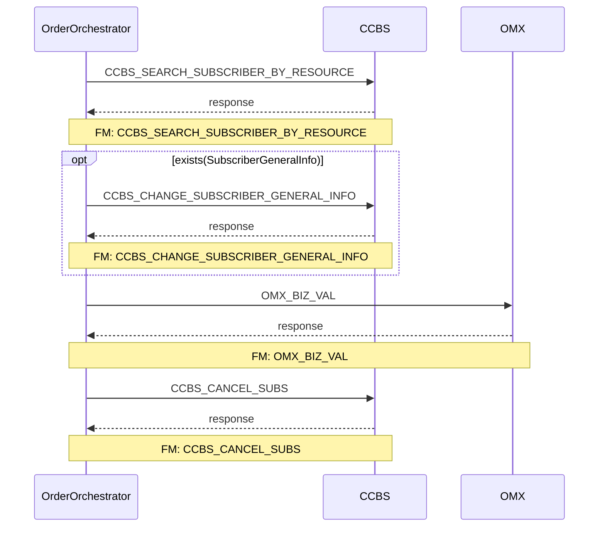

# BN_CANCEL_SUB

> Process Configuration for BN_CANCEL_SUB.

**Total steps:** 4 | **Unique FMs:** 4 | **Entry point:** CCBS_SEARCH_SUBSCRIBER_BY_RESOURCE | **Generated:** 2026-09-23

---

## Notable Pattern

BN_CANCEL_SUB is similar to TNP_CANCEL_SUB but simpler — goes straight to `CCBS_CANCEL_SUBS` (no L9 cancel / KEEP_BAN_OPEN branching). `CCBS_CANCEL_SUBS` executes unconditionally after the BIZ_VAL step.

---

## §2 — Order Flow

| Step | Step ID | FM (ActivityID) | Parameter(s) | PreExecCheck | Previous | Next |
|------|---------|-----------------|--------------|--------------|----------|------|
| 1 | CCBS_SEARCH_SUBSCRIBER_BY_RESOURCE | CCBS_SEARCH_SUBSCRIBER_BY_RESOURCE | — | — | START | CCBS_CHANGE_SUBSCRIBER_GENERAL_INFO |
| 2 | CCBS_CHANGE_SUBSCRIBER_GENERAL_INFO | CCBS_CHANGE_SUBSCRIBER_GENERAL_INFO | — | `exists(//ParentOU/Subscriber/SubscriberGeneralInfo)` | CCBS_SEARCH_SUBSCRIBER_BY_RESOURCE | OMX_BIZ_VAL |
| 3 | OMX_BIZ_VAL | OMX_BIZ_VAL | — | — | CCBS_CHANGE_SUBSCRIBER_GENERAL_INFO | CCBS_CANCEL_SUBS |
| 4 | CCBS_CANCEL_SUBS | CCBS_CANCEL_SUBS | — | — | OMX_BIZ_VAL | END |

---

## §3 — PreExecCheck Details

### Step 2 — CCBS_CHANGE_SUBSCRIBER_GENERAL_INFO
**FM:** `CCBS_CHANGE_SUBSCRIBER_GENERAL_INFO`
```xpath
exists(//ParentOU/Subscriber/SubscriberGeneralInfo)
```

---

## §4 — FM Documentation Index

| FM (ActivityID) | Used in Steps | Doc |
|-----------------|---------------|-----|
| CCBS_SEARCH_SUBSCRIBER_BY_RESOURCE | 1 | [Request_CCBS_SEARCH_SUBSCRIBER_BY_RESOURCE.html](../FMlogic/Request_CCBS_SEARCH_SUBSCRIBER_BY_RESOURCE.html) |
| CCBS_CHANGE_SUBSCRIBER_GENERAL_INFO | 2 | [Request_CCBS_CHANGE_SUBSCRIBER_GENERAL_INFO.html](../FMlogic/Request_CCBS_CHANGE_SUBSCRIBER_GENERAL_INFO.html) |
| OMX_BIZ_VAL | 3 | [Request_OMX_BIZ_VAL.html](../FMlogic/Request_OMX_BIZ_VAL.html) |
| CCBS_CANCEL_SUBS | 4 | [Request_CCBS_CANCEL_SUBS.html](../FMlogic/Request_CCBS_CANCEL_SUBS.html) |

---

## §5 — Sequence Diagram



---

*TRUE Corporation OMX · Order Journey Documentation*
