# BN_CHANGE_PACKAGE

> Process Configuration for BN_CHANGE_PACKAGE — B/N package change orchestration across CCBS, OMX internal functions, and BL.

**Total steps:** 29 | **Unique FMs:** 27 | **Entry point:** CCBS_SEARCH_SUBSCRIBER_BY_RESOURCE | **Backends:** CCBS · OMX · BL

---

## §2 — Order Flow

| Step | Step ID | FM (ActivityID) | Parameter(s) | PreExecCheck | Previous | Next |
|------|---------|-----------------|--------------|--------------|----------|------|
| 1 | CCBS_SEARCH_SUBSCRIBER_BY_RESOURCE | CCBS_SEARCH_SUBSCRIBER_BY_RESOURCE | — | `string-length(//Subscriber/MSISDN)>0 and not(exists(//Subscriber/SubscriberId))` | START | CCBS_GET_ACCOUNT_HEADER |
| 2 | CCBS_GET_ACCOUNT_HEADER | CCBS_GET_ACCOUNT_HEADER | — | `string-length(//Account/AccountID)>0` | CCBS_SEARCH_SUBSCRIBER_BY_RESOURCE | CCBS_GET_AGREEMENT_HEADER |
| 3 | CCBS_GET_AGREEMENT_HEADER | CCBS_GET_AGREEMENT_HEADER | — | `exists(//ParentOU/Agreement/AgreementId)` | CCBS_GET_ACCOUNT_HEADER | CCBS_GET_SUBS_INFO |
| 4 | CCBS_GET_SUBS_INFO | CCBS_GET_SUBS_INFO | — | `boolean(//Subscriber/MSISDN and //Subscriber/SubscriberOffers) or boolean(//Subscriber/ResourceRangeInfo)` | CCBS_GET_AGREEMENT_HEADER | CCBS_GET_AGREEMENT_INFO |
| 5 | CCBS_GET_AGREEMENT_INFO | CCBS_GET_AGREEMENT_INFO | — | `exists(//ParentOU/Agreement) and (Action=CHG_PARAM or ADD)` | CCBS_GET_SUBS_INFO | CCBS_RESOLVE_SOC_CODE |
| 6 | CCBS_RESOLVE_SOC_CODE | CCBS_RESOLVE_SOC_CODE | — | `(OfferName length>0 and ServiceType!='79') for Agreement or SubscriberOffers` | CCBS_GET_AGREEMENT_INFO | CCBS_GOD |
| 7 | CCBS_GOD | CCBS_GOD | — | `count(//Offers)>0 or count(//SubscriberOffers)>0 and (!CHG_PARAM and !79)` | CCBS_RESOLVE_SOC_CODE | OMX_CAL_OFFERS_EFF_DATE |
| 8 | OMX_CAL_OFFERS_EFF_DATE | OMX_CAL_OFFERS_EFF_DATE | — | `boolean(//Subscriber/SubscriberOffers[1] and [FE_OR_CCBS='FE' or 'BRMS'])` | CCBS_GOD | OMX_OFFER_INCLUSION |
| 9 | OMX_OFFER_INCLUSION | OMX_OFFER_INCLUSION | — | `count(//Offers or //SubscriberOffers)>0 and !CHG_PARAM` | OMX_CAL_OFFERS_EFF_DATE | GET_SPECIAL_OFFER_INDICATOR |
| 10 | GET_SPECIAL_OFFER_INDICATOR | GET_SPECIAL_OFFER_INDICATOR | — | — | OMX_OFFER_INCLUSION | OMX_BIZ_VAL |
| 11 | OMX_BIZ_VAL | OMX_BIZ_VAL | — | — | GET_SPECIAL_OFFER_INDICATOR | OMX_ADD_FUT_OFFERS |
| 12 | OMX_ADD_FUT_OFFERS | OMX_ADD_FUT_OFFERS | — | `ADD offers, OfferActivityDate=FUT, FE, ServiceType!='80' and !='79'` | OMX_BIZ_VAL | OMX_ADD_FUT_OFFERS_PRICEPLAN |
| 13 | OMX_ADD_FUT_OFFERS_PRICEPLAN | OMX_ADD_FUT_OFFERS | — | `ADD offers, OfferActivityDate=FUT, FE, ServiceType='80'` | OMX_ADD_FUT_OFFERS | OMX_ADD_FUT_OFFERS_PARAM |
| 14 | OMX_ADD_FUT_OFFERS_PARAM | OMX_ADD_FUT_OFFERS_PARAM | — | `CHG_PARAM offers, FE, ParameterInfo OfferParamActivityDate=FUT` | OMX_ADD_FUT_OFFERS_PRICEPLAN | CCBS_CHANGE_ACCOUNTING_MANAGEMENT_INFO |
| 15 | CCBS_CHANGE_ACCOUNTING_MANAGEMENT_INFO | CCBS_CHANGE_ACCOUNTING_MANAGEMENT_INFO | — | `Account ExtendedInfo[LEGACY_BAN or INIT_REASON or PRIORITY] present` | OMX_ADD_FUT_OFFERS_PARAM | CCBS_ADD_PP_OU |
| 16 | CCBS_ADD_PP_OU | CCBS_ADD_PP_OU | — | `Agreement exists, ServiceType='80', FE, Action=ADD` | CCBS_CHANGE_ACCOUNTING_MANAGEMENT_INFO | CCBS_CHANGE_PP_OU |
| 17 | CCBS_CHANGE_PP_OU | CCBS_CHANGE_PP_OU | — | `Agreement exists, ServiceType='80', FE, Action=CHG_PP` | CCBS_ADD_PP_OU | CCBS_REMOVE_AGREEMENT_PRICE_PLAN |
| 18 | CCBS_REMOVE_AGREEMENT_PRICE_PLAN | CCBS_REMOVE_AGREEMENT_PRICE_PLAN | — | `Agreement exists, ServiceType='80', FE, Action=REMOVE` | CCBS_CHANGE_PP_OU | CCBS_UPDATE_AGREEMENT_ON_UNIT |
| 19 | CCBS_UPDATE_AGREEMENT_ON_UNIT | CCBS_UPDATE_AGREEMENT_ON_UNIT | — | `Agreement exists, !80, FE, OfferActivityDate=IM or BD` | CCBS_REMOVE_AGREEMENT_PRICE_PLAN | CCBS_CHANGE_PACKAGE_SUBSCRIBER |
| 20 | CCBS_CHANGE_PACKAGE_SUBSCRIBER | CCBS_CHANGE_PACKAGE_SUBSCRIBER | — | `Subscriber exists, Soc present, FE, !79, (IM or BD or CHG_CHARGE)` | CCBS_UPDATE_AGREEMENT_ON_UNIT | OMX_ADD_FUT_OFFERS_REMOVE |
| 21 | OMX_ADD_FUT_OFFERS_REMOVE | OMX_ADD_FUT_OFFERS | — | `FE offers with ExpirationDate and ((nonFUT→FUT ADD) or (FUT REMOVE))` | CCBS_CHANGE_PACKAGE_SUBSCRIBER | BL_CREATE_CHARGE |
| 22 | BL_CREATE_CHARGE | BL_CREATE_CHARGE | — | `Subscriber exists, FE, ServiceType='79'` | OMX_ADD_FUT_OFFERS_REMOVE | CCBS_ADD_RESOURCE_RANGES |
| 23 | CCBS_ADD_RESOURCE_RANGES | CCBS_ADD_RESOURCE_RANGES | — | `count(//ResourceRangeInfo[Action='ADD'])>0` | BL_CREATE_CHARGE | CCBS_REMOVE_RESOURCE_RANGES |
| 24 | CCBS_REMOVE_RESOURCE_RANGES | CCBS_REMOVE_RESOURCE_RANGES | — | `count(//ResourceRangeInfo[Action='REMOVE'])>0` | CCBS_ADD_RESOURCE_RANGES | CCBS_CHANGE_SUBSCRIBER_GENERAL_INFO |
| 25 | CCBS_CHANGE_SUBSCRIBER_GENERAL_INFO | CCBS_CHANGE_SUBSCRIBER_GENERAL_INFO | — | `Subscriber ExtendedInfo OLD_BAN / PROJECT_CODE / MARKET_CODE / SALE_CHANNEL / PHASE_CODE present` | CCBS_REMOVE_RESOURCE_RANGES | OMX_UPDATE_FUT_OFFER_COP_DATE |
| 26 | OMX_UPDATE_FUT_OFFER_COP_DATE | OMX_UPDATE_FUT_OFFER_COP_DATE | — | `FUT_ORDER_ID or FUT_SOC_ID, FE, Action=FUT_CHG_DATE` | CCBS_CHANGE_SUBSCRIBER_GENERAL_INFO | OMX_REMOVE_FUT_OFFER_COP |
| 27 | OMX_REMOVE_FUT_OFFER_COP | OMX_REMOVE_FUT_OFFER_COP | — | `FUT_ORDER_ID or FUT_SOC_ID, FE, Action=FUT_REMOVE` | OMX_UPDATE_FUT_OFFER_COP_DATE | OMX_SEARCH_FUT_ALL |
| 28 | OMX_SEARCH_FUT_ALL | OMX_SEARCH_FUT_ALL | STATUS=1 \| ORDER_TYPE=128 | — | OMX_REMOVE_FUT_OFFER_COP | OMX_EXP_FUT_REMOVE |
| 29 | OMX_EXP_FUT_REMOVE | OMX_EXP_FUT_REMOVE | — | `Subscriber exists, Soc present, FE, Action=REMOVE, !79` | OMX_SEARCH_FUT_ALL | END |

---

## §3 — PreExecCheck Details

### Step 1 — CCBS_SEARCH_SUBSCRIBER_BY_RESOURCE

**FM:** `CCBS_SEARCH_SUBSCRIBER_BY_RESOURCE`

```xpath
string-length(//Subscriber/MSISDN/text()) > 0 and not(exists(//Subscriber/SubscriberId))
```

---

### Step 2 — CCBS_GET_ACCOUNT_HEADER

**FM:** `CCBS_GET_ACCOUNT_HEADER`

```xpath
string-length(//Account/AccountID/text()) > 0
```

---

### Step 3 — CCBS_GET_AGREEMENT_HEADER

```xpath
exists(//ParentOU/Agreement/AgreementId)
```

---

### Step 4 — CCBS_GET_SUBS_INFO

```xpath
boolean(//Subscriber/MSISDN[./text()] and //Subscriber/SubscriberOffers)
or boolean(//Subscriber/ResourceRangeInfo)
```

---

### Step 5 — CCBS_GET_AGREEMENT_INFO

```xpath
exists(//ParentOU/Agreement) and (//Offers/Action/text() = 'CHG_PARAM' or //Offers/Action/text() = 'ADD')
```

---

### Step 6 — CCBS_RESOLVE_SOC_CODE

```xpath
(string-length(//Agreement/Offers/OfferName/text())>0 and //Agreement/Offers/ServiceType/text() != '79')
or (string-length(//SubscriberOffers/OfferName/text())>0 and //SubscriberOffers/ServiceType/text() != '79')
```

---

### Step 7 — CCBS_GOD

```xpath
count(//Offers) > 0
or count(//SubscriberOffers) > 0
and (//SubscriberOffers/Action/text() != 'CHG_PARAM' and //ServiceType/text() != '79')
```

---

### Step 8 — OMX_CAL_OFFERS_EFF_DATE

```xpath
boolean(//Subscriber/SubscriberOffers[1]
  and //SubscriberOffers[ExtendedInfo[Name='FE_OR_CCBS' and (Value='FE' or Value='BRMS')]])
```

---

### Step 9 — OMX_OFFER_INCLUSION

```xpath
count(//Offers) > 0 or count(//SubscriberOffers) > 0
and (//SubscriberOffers/Action/text() != 'CHG_PARAM' and //Offers/Action/text() != 'CHG_PARAM')
```

---

### Step 12 — OMX_ADD_FUT_OFFERS

```xpath
boolean(
  //Subscriber/SubscriberOffers[Action='ADD']
  and //SubscriberOffers[ExtendedInfo[Name='OfferActivityDate' and Value='FUT']]
                          [ExtendedInfo[Name='FE_OR_CCBS' and Value='FE']]
  and //SubscriberOffers/ServiceType/text() != '80'
  and //SubscriberOffers/ServiceType/text() != '79'
) or boolean(
  //Agreement/Offers[Action='ADD'] and [...FUT][FE] and ServiceType!='80' and !='79'
)
```

---

### Step 19 — CCBS_UPDATE_AGREEMENT_ON_UNIT

```xpath
exists(//ParentOU/Agreement)
and //Offers/ServiceType/text() != '80'
and //Offers/ExtendedInfo[Name='FE_OR_CCBS']/Value/text()='FE'
and (boolean(//Agreement/Offers/ExtendedInfo[Name='OfferActivityDate' and Value='IM'])
     or boolean(//Agreement/Offers/ExtendedInfo[Name='OfferActivityDate' and Value='BD']))
```

---

### Step 23 — CCBS_ADD_RESOURCE_RANGES

```xpath
count(//ResourceRangeInfo[Action='ADD']) > 0
```

---

### Step 24 — CCBS_REMOVE_RESOURCE_RANGES

```xpath
count(//ResourceRangeInfo[Action='REMOVE']) > 0
```

---

### Step 29 — OMX_EXP_FUT_REMOVE

```xpath
exists(//ParentOU/Subscriber)
and string-length(//SubscriberOffers/Soc/text())>0
and //SubscriberOffers/ExtendedInfo[Name='FE_OR_CCBS']/Value/text()='FE'
and //Subscriber/SubscriberOffers/Action/text() = 'REMOVE'
and //SubscriberOffers/ServiceType/text() != '79'
```

---

## §4 — FM Documentation Index

| FM (ActivityID) | Used in Steps | Backend | Doc Link |
|-----------------|---------------|---------|----------|
| CCBS_SEARCH_SUBSCRIBER_BY_RESOURCE | 1 | CCBS | [Request_CCBS_SEARCH_SUBSCRIBER_BY_RESOURCE.html](../FMlogic/Request_CCBS_SEARCH_SUBSCRIBER_BY_RESOURCE.html) |
| CCBS_GET_ACCOUNT_HEADER | 2 | CCBS | [Request_CCBS_GET_ACCOUNT_HEADER.html](../FMlogic/Request_CCBS_GET_ACCOUNT_HEADER.html) |
| CCBS_GET_AGREEMENT_HEADER | 3 | CCBS | [Request_CCBS_GET_AGREEMENT_HEADER.html](../FMlogic/Request_CCBS_GET_AGREEMENT_HEADER.html) |
| CCBS_GET_SUBS_INFO | 4 | CCBS | [Request_CCBS_GET_SUBS_INFO.html](../FMlogic/Request_CCBS_GET_SUBS_INFO.html) |
| CCBS_GET_AGREEMENT_INFO | 5 | CCBS | [Request_CCBS_GET_AGREEMENT_INFO.html](../FMlogic/Request_CCBS_GET_AGREEMENT_INFO.html) |
| CCBS_RESOLVE_SOC_CODE | 6 | CCBS | [Request_CCBS_RESOLVE_SOC_CODE.html](../FMlogic/Request_CCBS_RESOLVE_SOC_CODE.html) |
| CCBS_GOD | 7 | CCBS | [Request_CCBS_GOD.html](../FMlogic/Request_CCBS_GOD.html) |
| OMX_CAL_OFFERS_EFF_DATE | 8 | OMX | [Request_OMX_CAL_OFFERS_EFF_DATE.html](../FMlogic/Request_OMX_CAL_OFFERS_EFF_DATE.html) |
| OMX_OFFER_INCLUSION | 9 | OMX | [Request_OMX_OFFER_INCLUSION.html](../FMlogic/Request_OMX_OFFER_INCLUSION.html) |
| GET_SPECIAL_OFFER_INDICATOR | 10 | OMX | [Request_GET_SPECIAL_OFFER_INDICATOR.html](../FMlogic/Request_GET_SPECIAL_OFFER_INDICATOR.html) |
| OMX_BIZ_VAL | 11 | OMX | [Request_OMX_BIZ_VAL.html](../FMlogic/Request_OMX_BIZ_VAL.html) |
| OMX_ADD_FUT_OFFERS | 12, 13, 21 | OMX | [Request_OMX_ADD_FUT_OFFERS.html](../FMlogic/Request_OMX_ADD_FUT_OFFERS.html) |
| OMX_ADD_FUT_OFFERS_PARAM | 14 | OMX | [Request_OMX_ADD_FUT_OFFERS_PARAM.html](../FMlogic/Request_OMX_ADD_FUT_OFFERS_PARAM.html) |
| CCBS_CHANGE_ACCOUNTING_MANAGEMENT_INFO | 15 | CCBS | [Request_CCBS_CHANGE_ACCOUNTING_MANAGEMENT_INFO.html](../FMlogic/Request_CCBS_CHANGE_ACCOUNTING_MANAGEMENT_INFO.html) |
| CCBS_ADD_PP_OU | 16 | CCBS | [Request_CCBS_ADD_PP_OU.html](../FMlogic/Request_CCBS_ADD_PP_OU.html) |
| CCBS_CHANGE_PP_OU | 17 | CCBS | [Request_CCBS_CHANGE_PP_OU.html](../FMlogic/Request_CCBS_CHANGE_PP_OU.html) |
| CCBS_REMOVE_AGREEMENT_PRICE_PLAN | 18 | CCBS | [Request_CCBS_REMOVE_AGREEMENT_PRICE_PLAN.html](../FMlogic/Request_CCBS_REMOVE_AGREEMENT_PRICE_PLAN.html) |
| CCBS_UPDATE_AGREEMENT_ON_UNIT | 19 | CCBS | [Request_CCBS_UPDATE_AGREEMENT_ON_UNIT.html](../FMlogic/Request_CCBS_UPDATE_AGREEMENT_ON_UNIT.html) |
| CCBS_CHANGE_PACKAGE_SUBSCRIBER | 20 | CCBS | [Request_CCBS_CHANGE_PACKAGE_SUBSCRIBER.html](../FMlogic/Request_CCBS_CHANGE_PACKAGE_SUBSCRIBER.html) |
| BL_CREATE_CHARGE | 22 | BL | [Request_BL_CREATE_CHARGE.html](../FMlogic/Request_BL_CREATE_CHARGE.html) |
| CCBS_ADD_RESOURCE_RANGES | 23 | CCBS | [Request_CCBS_ADD_RESOURCE_RANGES.html](../FMlogic/Request_CCBS_ADD_RESOURCE_RANGES.html) |
| CCBS_REMOVE_RESOURCE_RANGES | 24 | CCBS | [Request_CCBS_REMOVE_RESOURCE_RANGES.html](../FMlogic/Request_CCBS_REMOVE_RESOURCE_RANGES.html) |
| CCBS_CHANGE_SUBSCRIBER_GENERAL_INFO | 25 | CCBS | [Request_CCBS_CHANGE_SUBSCRIBER_GENERAL_INFO.html](../FMlogic/Request_CCBS_CHANGE_SUBSCRIBER_GENERAL_INFO.html) |
| OMX_UPDATE_FUT_OFFER_COP_DATE | 26 | OMX | [Request_OMX_UPDATE_FUT_OFFER_COP_DATE.html](../FMlogic/Request_OMX_UPDATE_FUT_OFFER_COP_DATE.html) |
| OMX_REMOVE_FUT_OFFER_COP | 27 | OMX | [Request_OMX_REMOVE_FUT_OFFER_COP.html](../FMlogic/Request_OMX_REMOVE_FUT_OFFER_COP.html) |
| OMX_SEARCH_FUT_ALL | 28 | OMX | [Request_OMX_SEARCH_FUT_ALL.html](../FMlogic/Request_OMX_SEARCH_FUT_ALL.html) |
| OMX_EXP_FUT_REMOVE | 29 | OMX | [Request_OMX_EXP_FUT_REMOVE.html](../FMlogic/Request_OMX_EXP_FUT_REMOVE.html) |

---

## §5 — Sequence Diagram

```mermaid
sequenceDiagram
    participant O as OrderOrchestrator
    participant CCBS as CCBS
    participant OMX as OMX
    participant BL as BL

    opt MSISDN present but no SubscriberId
        O->>CCBS: CCBS_SEARCH_SUBSCRIBER_BY_RESOURCE
        CCBS-->>O: response
        Note over O,CCBS: FM: CCBS_SEARCH_SUBSCRIBER_BY_RESOURCE
    end
    opt AccountID exists
        O->>CCBS: CCBS_GET_ACCOUNT_HEADER
        CCBS-->>O: response
        Note over O,CCBS: FM: CCBS_GET_ACCOUNT_HEADER
    end
    opt AgreementId exists
        O->>CCBS: CCBS_GET_AGREEMENT_HEADER
        CCBS-->>O: response
        Note over O,CCBS: FM: CCBS_GET_AGREEMENT_HEADER
    end
    opt Subscriber MSISDN+Offers or ResourceRangeInfo
        O->>CCBS: CCBS_GET_SUBS_INFO
        CCBS-->>O: response
        Note over O,CCBS: FM: CCBS_GET_SUBS_INFO
    end
    opt Agreement exists and Action=CHG_PARAM or ADD
        O->>CCBS: CCBS_GET_AGREEMENT_INFO
        CCBS-->>O: response
        Note over O,CCBS: FM: CCBS_GET_AGREEMENT_INFO
    end
    opt OfferName length>0 and ServiceType!=79
        O->>CCBS: CCBS_RESOLVE_SOC_CODE
        CCBS-->>O: response
        Note over O,CCBS: FM: CCBS_RESOLVE_SOC_CODE
    end
    opt count(Offers)>0 or SubscriberOffers not CHG_PARAM/79
        O->>CCBS: CCBS_GOD
        CCBS-->>O: response
        Note over O,CCBS: FM: CCBS_GOD
    end
    opt SubscriberOffers[1] and FE_OR_CCBS=FE or BRMS
        O->>OMX: OMX_CAL_OFFERS_EFF_DATE
        OMX-->>O: response
        Note over O,OMX: FM: OMX_CAL_OFFERS_EFF_DATE
    end
    opt Offers or SubscriberOffers not CHG_PARAM
        O->>OMX: OMX_OFFER_INCLUSION
        OMX-->>O: response
        Note over O,OMX: FM: OMX_OFFER_INCLUSION
    end
    O->>OMX: GET_SPECIAL_OFFER_INDICATOR
    OMX-->>O: response
    Note over O,OMX: FM: GET_SPECIAL_OFFER_INDICATOR
    O->>OMX: OMX_BIZ_VAL
    OMX-->>O: response
    Note over O,OMX: FM: OMX_BIZ_VAL
    opt ADD offers FUT FE !80 !79
        O->>OMX: OMX_ADD_FUT_OFFERS [step 12]
        OMX-->>O: response
        Note over O,OMX: FM: OMX_ADD_FUT_OFFERS
    end
    opt ADD offers FUT FE ServiceType=80
        O->>OMX: OMX_ADD_FUT_OFFERS [step 13 — PricePlan]
        OMX-->>O: response
        Note over O,OMX: FM: OMX_ADD_FUT_OFFERS
    end
    opt CHG_PARAM offers FUT FE
        O->>OMX: OMX_ADD_FUT_OFFERS_PARAM
        OMX-->>O: response
        Note over O,OMX: FM: OMX_ADD_FUT_OFFERS_PARAM
    end
    opt Account LEGACY_BAN/INIT_REASON/PRIORITY present
        O->>CCBS: CCBS_CHANGE_ACCOUNTING_MANAGEMENT_INFO
        CCBS-->>O: response
        Note over O,CCBS: FM: CCBS_CHANGE_ACCOUNTING_MANAGEMENT_INFO
    end
    opt Agreement ServiceType=80 FE Action=ADD
        O->>CCBS: CCBS_ADD_PP_OU
        CCBS-->>O: response
        Note over O,CCBS: FM: CCBS_ADD_PP_OU
    end
    opt Agreement ServiceType=80 FE Action=CHG_PP
        O->>CCBS: CCBS_CHANGE_PP_OU
        CCBS-->>O: response
        Note over O,CCBS: FM: CCBS_CHANGE_PP_OU
    end
    opt Agreement ServiceType=80 FE Action=REMOVE
        O->>CCBS: CCBS_REMOVE_AGREEMENT_PRICE_PLAN
        CCBS-->>O: response
        Note over O,CCBS: FM: CCBS_REMOVE_AGREEMENT_PRICE_PLAN
    end
    opt Agreement FE !80 IM or BD
        O->>CCBS: CCBS_UPDATE_AGREEMENT_ON_UNIT
        CCBS-->>O: response
        Note over O,CCBS: FM: CCBS_UPDATE_AGREEMENT_ON_UNIT
    end
    opt Subscriber FE !79 IM/BD or CHG_CHARGE
        O->>CCBS: CCBS_CHANGE_PACKAGE_SUBSCRIBER
        CCBS-->>O: response
        Note over O,CCBS: FM: CCBS_CHANGE_PACKAGE_SUBSCRIBER
    end
    opt FE offers ExpirationDate FUT REMOVE
        O->>OMX: OMX_ADD_FUT_OFFERS [step 21 — Remove]
        OMX-->>O: response
        Note over O,OMX: FM: OMX_ADD_FUT_OFFERS
    end
    opt Subscriber FE ServiceType=79
        O->>BL: BL_CREATE_CHARGE
        BL-->>O: response
        Note over O,BL: FM: BL_CREATE_CHARGE
    end
    opt ResourceRangeInfo[Action=ADD] count>0
        O->>CCBS: CCBS_ADD_RESOURCE_RANGES
        CCBS-->>O: response
        Note over O,CCBS: FM: CCBS_ADD_RESOURCE_RANGES
    end
    opt ResourceRangeInfo[Action=REMOVE] count>0
        O->>CCBS: CCBS_REMOVE_RESOURCE_RANGES
        CCBS-->>O: response
        Note over O,CCBS: FM: CCBS_REMOVE_RESOURCE_RANGES
    end
    opt Subscriber ExtendedInfo OLD_BAN/PROJECT_CODE etc present
        O->>CCBS: CCBS_CHANGE_SUBSCRIBER_GENERAL_INFO
        CCBS-->>O: response
        Note over O,CCBS: FM: CCBS_CHANGE_SUBSCRIBER_GENERAL_INFO
    end
    opt FUT_ORDER_ID/FUT_SOC_ID FE Action=FUT_CHG_DATE
        O->>OMX: OMX_UPDATE_FUT_OFFER_COP_DATE
        OMX-->>O: response
        Note over O,OMX: FM: OMX_UPDATE_FUT_OFFER_COP_DATE
    end
    opt FUT_ORDER_ID/FUT_SOC_ID FE Action=FUT_REMOVE
        O->>OMX: OMX_REMOVE_FUT_OFFER_COP
        OMX-->>O: response
        Note over O,OMX: FM: OMX_REMOVE_FUT_OFFER_COP
    end
    O->>OMX: OMX_SEARCH_FUT_ALL [STATUS=1, ORDER_TYPE=128]
    OMX-->>O: response
    Note over O,OMX: FM: OMX_SEARCH_FUT_ALL
    opt Subscriber FE REMOVE !79
        O->>OMX: OMX_EXP_FUT_REMOVE
        OMX-->>O: response
        Note over O,OMX: FM: OMX_EXP_FUT_REMOVE
    end
```



> Rendered from ProcessConfig activity chain. Conditional steps wrapped in `opt` blocks.
> Full interactive sequence diagram: see companion HTML at `output/order/BN_CHANGE_PACKAGE.html`

---

*TRUE Corporation OMX · Order Journey Documentation · BN_CHANGE_PACKAGE*
