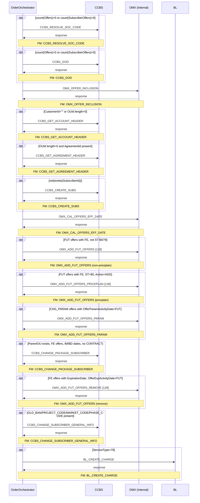

# BN_CREATE_SUB

> Process Configuration for BN_CREATE_SUB.

**Total steps:** 14 | **Unique FMs:** 12 | **Entry point:** CCBS_RESOLVE_SOC_CODE

**Purpose:** Creates a new subscriber within an existing Bundle (BN) account structure. Resolves SOC codes, enriches order data via CCBS GOD, creates the subscriber record, schedules future-dated offer changes, and applies package/charge updates.

---

## §2 — Order Flow

| Step | Step ID | FM (ActivityID) | Parameter(s) | PreExecCheck | Previous | Next |
|------|---------|-----------------|--------------|--------------|----------|------|
| 1 | CCBS_RESOLVE_SOC_CODE | CCBS_RESOLVE_SOC_CODE | — | `count(//Offers) > 0 or count(//SubscriberOffers) > 0` | START | CCBS_GOD |
| 2 | CCBS_GOD | CCBS_GOD | — | `count(//Offers) > 0 or count(//SubscriberOffers) > 0` | CCBS_RESOLVE_SOC_CODE | OMX_OFFER_INCLUSION |
| 3 | OMX_OFFER_INCLUSION | OMX_OFFER_INCLUSION | — | — | CCBS_GOD | CCBS_GET_ACCOUNT_HEADER |
| 4 | CCBS_GET_ACCOUNT_HEADER | CCBS_GET_ACCOUNT_HEADER | — | `CustomerId="" or OUId length=0` | OMX_OFFER_INCLUSION | CCBS_GET_AGREEMENT_HEADER |
| 5 | CCBS_GET_AGREEMENT_HEADER | CCBS_GET_AGREEMENT_HEADER | — | `OUId length=0 and AgreementId length>0` | CCBS_GET_ACCOUNT_HEADER | CCBS_CREATE_SUBS |
| 6 | CCBS_CREATE_SUBS | CCBS_CREATE_SUBS | — | `not(exists(//Subscriber/SubscriberId))` | CCBS_GET_AGREEMENT_HEADER | OMX_CAL_OFFERS_EFF_DATE |
| 7 | OMX_CAL_OFFERS_EFF_DATE | OMX_CAL_OFFERS_EFF_DATE | — | — | CCBS_CREATE_SUBS | OMX_ADD_FUT_OFFERS |
| 8 | OMX_ADD_FUT_OFFERS | OMX_ADD_FUT_OFFERS | 128 | `FUT offers with FE, ServiceType != 80 and != 79` | OMX_CAL_OFFERS_EFF_DATE | OMX_ADD_FUT_OFFERS_PRICEPLAN |
| 9 | OMX_ADD_FUT_OFFERS_PRICEPLAN | OMX_ADD_FUT_OFFERS | 128 | `FUT offers with FE, ServiceType = 80, Action=ADD` | OMX_ADD_FUT_OFFERS | OMX_ADD_FUT_OFFERS_PARAM |
| 10 | OMX_ADD_FUT_OFFERS_PARAM | OMX_ADD_FUT_OFFERS_PARAM | — | `FE offers with CHG_PARAM + OfferParamActivityDate=FUT` | OMX_ADD_FUT_OFFERS_PRICEPLAN | CCBS_CHANGE_PACKAGE_SUBSCRIBER |
| 11 | CCBS_CHANGE_PACKAGE_SUBSCRIBER | CCBS_CHANGE_PACKAGE_SUBSCRIBER | — | `ParentOU exists, FE offers, IM/BD activity dates, no TR_CONTRACT_IND=Y` | OMX_ADD_FUT_OFFERS_PARAM | OMX_ADD_FUT_OFFERS_REMOVE |
| 12 | OMX_ADD_FUT_OFFERS_REMOVE | OMX_ADD_FUT_OFFERS | 128 | `FE offers with ExpirationDate and OfferExpActivityDate=FUT, Action=ADD, not ST 80/79` | CCBS_CHANGE_PACKAGE_SUBSCRIBER | CCBS_CHANGE_SUBSCRIBER_GENERAL_INFO |
| 13 | CCBS_CHANGE_SUBSCRIBER_GENERAL_INFO | CCBS_CHANGE_SUBSCRIBER_GENERAL_INFO | — | `OLD_BAN, OLD_BAN_DATE, PROJECT_CODE, MARKET_CODE, SALE_CHANNEL, or PHASE_CODE present` | OMX_ADD_FUT_OFFERS_REMOVE | BL_CREATE_CHARGE |
| 14 | BL_CREATE_CHARGE | BL_CREATE_CHARGE | — | `//SubscriberOffers/ServiceType/text()=79` | CCBS_CHANGE_SUBSCRIBER_GENERAL_INFO | END |

---

## §3 — PreExecCheck Details

### Step 1 — CCBS_RESOLVE_SOC_CODE
**FM:** `CCBS_RESOLVE_SOC_CODE`
```xpath
count(//Offers) > 0 or count(//SubscriberOffers) > 0
```

### Step 2 — CCBS_GOD
**FM:** `CCBS_GOD`
```xpath
count(//Offers) > 0 or count(//SubscriberOffers) > 0
```

### Step 4 — CCBS_GET_ACCOUNT_HEADER
**FM:** `CCBS_GET_ACCOUNT_HEADER`
```xpath
/ns0:OrderRequest/OrderData/Customer/CustomerId/text()=""
or string-length(//ParentOU/OUId/text())=0
or string-length(//ChildOU/OUId/text())=0
```

### Step 5 — CCBS_GET_AGREEMENT_HEADER
**FM:** `CCBS_GET_AGREEMENT_HEADER`
```xpath
(string-length(//ParentOU/OUId/text())=0 or string-length(//ChildOU/OUId/text())=0)
and (string-length(//ParentOU/Agreement/AgreementId/text()) > 0
  or string-length(//ChildOU/Agreement/AgreementId/text()) > 0)
```

### Step 6 — CCBS_CREATE_SUBS
**FM:** `CCBS_CREATE_SUBS`
```xpath
not(exists(//Subscriber/SubscriberId))
```

### Step 8 — OMX_ADD_FUT_OFFERS
**FM:** `OMX_ADD_FUT_OFFERS`
```xpath
boolean(
  //Subscriber/SubscriberOffers[ExtendedInfo[Name='OfferActivityDate' and Value='FUT']]
                               [ExtendedInfo[Name='FE_OR_CCBS' and Value='FE']]
  and //SubscriberOffers/ServiceType/text() != '80'
  and //SubscriberOffers/ServiceType/text() != '79'
)
or boolean(
  //Agreement/Offers[ExtendedInfo[Name='OfferActivityDate' and Value='FUT']]
                   [ExtendedInfo[Name='FE_OR_CCBS' and Value='FE']]
  and //Agreement/Offers/ServiceType/text() != '80'
  and //Agreement/Offers/ServiceType/text() != '79'
)
```

### Step 9 — OMX_ADD_FUT_OFFERS_PRICEPLAN
**FM:** `OMX_ADD_FUT_OFFERS`
```xpath
boolean(
  //Subscriber/SubscriberOffers[ExtendedInfo[Name='OfferActivityDate' and Value='FUT']]
                               [ExtendedInfo[Name='FE_OR_CCBS' and Value='FE']]
  and count(//Subscriber/SubscriberOffers[Action='ADD']) > 0
  and //SubscriberOffers/ServiceType/text() = '80'
)
```

### Step 10 — OMX_ADD_FUT_OFFERS_PARAM
**FM:** `OMX_ADD_FUT_OFFERS_PARAM`
```xpath
boolean(
  //Subscriber/SubscriberOffers[ExtendedInfo[Name='FE_OR_CCBS' and Value='FE']]
  and //Subscriber/SubscriberOffers[Action='CHG_PARAM']
  and //Subscriber/SubscriberOffers/ParameterInfo[ExtendedInfo[Name='OfferParamActivityDate' and Value='FUT']]
)
or boolean(
  //Agreement/Offers[ExtendedInfo[Name='FE_OR_CCBS' and Value='FE']]
  and //Agreement/Offers[Action='CHG_PARAM']
  and //Agreement/Offers/ParameterInfo[ExtendedInfo[Name='OfferParamActivityDate' and Value='FUT']]
)
```

### Step 11 — CCBS_CHANGE_PACKAGE_SUBSCRIBER
**FM:** `CCBS_CHANGE_PACKAGE_SUBSCRIBER`
```xpath
exists(//ParentOU/Subscriber)
and string-length(//SubscriberOffers/Soc/text()) > 0
and //SubscriberOffers/ExtendedInfo[Name='FE_OR_CCBS']/Value/text()='FE'
and //SubscriberOffers/ServiceType/text() != '79'
and //SubscriberOffers/ServiceType/text() != '80'
and not(//SubscriberOffers[contains(SocProperties,'TR_CONTRACT_IND=Y')])
and (
  boolean(//Subscriber/SubscriberOffers/ExtendedInfo[Name='OfferActivityDate' and Value='IM'])
  or boolean(//Subscriber/SubscriberOffers/ExtendedInfo[Name='OfferActivityDate' and Value='BD'])
  or boolean(//Subscriber/SubscriberOffers/ParameterInfo[ExtendedInfo[Name='OfferParamActivityDate' and Value='IM']])
  or boolean(//Subscriber/SubscriberOffers/ParameterInfo[ExtendedInfo[Name='OfferParamActivityDate' and Value='BD']])
  or boolean(//Subscriber/SubscriberOffers/Action/text() = 'CHG_CHARGE')
)
```

### Step 12 — OMX_ADD_FUT_OFFERS_REMOVE
**FM:** `OMX_ADD_FUT_OFFERS`
```xpath
boolean(
  //Subscriber/SubscriberOffers[ExtendedInfo[Name='FE_OR_CCBS' and Value='FE']]
  and exists(//Subscriber/SubscriberOffers/ExpirationDate)
  and //Subscriber/SubscriberOffers[ExtendedInfo[Name='OfferExpActivityDate' and Value='FUT']]
  and //Subscriber/SubscriberOffers[Action='ADD']
  and //SubscriberOffers[ServiceType != '80'][ServiceType != '79']
)
or boolean(
  //Agreement/Offers[ExtendedInfo[Name='FE_OR_CCBS' and Value='FE']]
  and exists(//Agreement/Offers/ExpirationDate)
  and //Agreement/Offers[ExtendedInfo[Name='OfferExpActivityDate' and Value='FUT']]
  and //Agreement/Offers[Action='ADD']
  and //Agreement/Offers[ServiceType != '80'][ServiceType != '79']
)
```

### Step 13 — CCBS_CHANGE_SUBSCRIBER_GENERAL_INFO
**FM:** `CCBS_CHANGE_SUBSCRIBER_GENERAL_INFO`
```xpath
//Subscriber/ExtendedInfo[Name='OLD_BAN']/Value/text()!=''
or //Subscriber/ExtendedInfo[Name='OLD_BAN_DATE']/Value/text()!=''
or //Subscriber/ExtendedInfo[Name='PROJECT_CODE']/Value/text()!=''
or //Subscriber/ExtendedInfo[Name='MARKET_CODE']/Value/text()!=''
or //Subscriber/ExtendedInfo[Name='SALE_CHANNEL']/Value/text()!=''
or //Subscriber/ExtendedInfo[Name='PHASE_CODE']/Value/text()!=''
```

### Step 14 — BL_CREATE_CHARGE
**FM:** `BL_CREATE_CHARGE`
```xpath
//SubscriberOffers/ServiceType/text()=79
```

---

## §4 — FM Documentation Index

| FM (ActivityID) | Used in Steps | Status | Doc Link |
|-----------------|---------------|--------|----------|
| CCBS_RESOLVE_SOC_CODE | 1 | ✓ | [Request_CCBS_RESOLVE_SOC_CODE.html](../FMlogic/Request_CCBS_RESOLVE_SOC_CODE.html) |
| CCBS_GOD | 2 | ✓ | [Request_CCBS_GOD.html](../FMlogic/Request_CCBS_GOD.html) |
| OMX_OFFER_INCLUSION | 3 | ✓ | [Request_OMX_OFFER_INCLUSION.html](../FMlogic/Request_OMX_OFFER_INCLUSION.html) |
| CCBS_GET_ACCOUNT_HEADER | 4 | ✓ | [Request_CCBS_GET_ACCOUNT_HEADER.html](../FMlogic/Request_CCBS_GET_ACCOUNT_HEADER.html) |
| CCBS_GET_AGREEMENT_HEADER | 5 | ✓ | [Request_CCBS_GET_AGREEMENT_HEADER.html](../FMlogic/Request_CCBS_GET_AGREEMENT_HEADER.html) |
| CCBS_CREATE_SUBS | 6 | ✓ | [Request_CCBS_CREATE_SUBS.html](../FMlogic/Request_CCBS_CREATE_SUBS.html) |
| OMX_CAL_OFFERS_EFF_DATE | 7 | ✓ | [Request_OMX_CAL_OFFERS_EFF_DATE.html](../FMlogic/Request_OMX_CAL_OFFERS_EFF_DATE.html) |
| OMX_ADD_FUT_OFFERS | 8, 9, 12 | ✓ | [Request_OMX_ADD_FUT_OFFERS.html](../FMlogic/Request_OMX_ADD_FUT_OFFERS.html) |
| OMX_ADD_FUT_OFFERS_PARAM | 10 | ✓ | [Request_OMX_ADD_FUT_OFFERS_PARAM.html](../FMlogic/Request_OMX_ADD_FUT_OFFERS_PARAM.html) |
| CCBS_CHANGE_PACKAGE_SUBSCRIBER | 11 | ✓ | [Request_CCBS_CHANGE_PACKAGE_SUBSCRIBER.html](../FMlogic/Request_CCBS_CHANGE_PACKAGE_SUBSCRIBER.html) |
| CCBS_CHANGE_SUBSCRIBER_GENERAL_INFO | 13 | ✓ | [Request_CCBS_CHANGE_SUBSCRIBER_GENERAL_INFO.html](../FMlogic/Request_CCBS_CHANGE_SUBSCRIBER_GENERAL_INFO.html) |
| BL_CREATE_CHARGE | 14 | ✓ | [Request_BL_CREATE_CHARGE.html](../FMlogic/Request_BL_CREATE_CHARGE.html) |

---

## §5 — Sequence Diagram



---

## §6 — Flow Diagram

```mermaid
flowchart TD
    START([START]) --> S1
    S1{CCBS_RESOLVE_SOC_CODE\ncount Offers > 0} -->|PreExecCheck| S2
    S1 -->|skip| S2
    S2{CCBS_GOD\ncount Offers > 0} -->|PreExecCheck| S3
    S2 -->|skip| S3
    S3[OMX_OFFER_INCLUSION] --> S4
    S4{CCBS_GET_ACCOUNT_HEADER\nCustomerId empty or OUId=0} -->|PreExecCheck| S5
    S4 -->|skip| S5
    S5{CCBS_GET_AGREEMENT_HEADER\nOUId=0 and AgreementId present} -->|PreExecCheck| S6
    S5 -->|skip| S6
    S6{CCBS_CREATE_SUBS\nnot SubscriberId exists} -->|PreExecCheck| S7
    S6 -->|skip| S7
    S7[OMX_CAL_OFFERS_EFF_DATE] --> S8
    S8{OMX_ADD_FUT_OFFERS\nFUT+FE, not ST 80/79} -->|PreExecCheck| S9
    S8 -->|skip| S9
    S9{OMX_ADD_FUT_OFFERS_PRICEPLAN\nFUT+FE, ST=80} -->|PreExecCheck| S10
    S9 -->|skip| S10
    S10{OMX_ADD_FUT_OFFERS_PARAM\nCHG_PARAM+FUT} -->|PreExecCheck| S11
    S10 -->|skip| S11
    S11{CCBS_CHANGE_PACKAGE_SUBSCRIBER\nFE+IM/BD dates} -->|PreExecCheck| S12
    S11 -->|skip| S12
    S12{OMX_ADD_FUT_OFFERS_REMOVE\nFE+ExpDate+FUT} -->|PreExecCheck| S13
    S12 -->|skip| S13
    S13{CCBS_CHANGE_SUBSCRIBER_GENERAL_INFO\nOLD_BAN etc present} -->|PreExecCheck| S14
    S13 -->|skip| S14
    S14{BL_CREATE_CHARGE\nServiceType=79} -->|PreExecCheck| END
    S14 -->|skip| END([END])
```



---

## §7 — Migration Notes

### Key Patterns
- **OMX_ADD_FUT_OFFERS** used 3 times with different PreExecChecks (steps 8, 9, 12):
  - Step 8: Non-priceplan FUT offers (ST ≠ 80/79)
  - Step 9: Priceplan FUT offers (ST = 80)
  - Step 12: FUT expiry/remove offers
- **FE_OR_CCBS='FE'** gates the future-dated offer scheduling path
- **OfferActivityDate=FUT/IM/BD** controls timing: FUT=future, IM=immediate, BD=bill date
- **TR_CONTRACT_IND=Y** offers excluded from CCBS_CHANGE_PACKAGE_SUBSCRIBER

### Risk Items
- **R1:** CCBS_CREATE_SUBS (step 6) gated on `not(exists(SubscriberId))` — ensure idempotency in retry scenarios
- **R2:** Three separate `OMX_ADD_FUT_OFFERS` calls with `128` parameter — distinct ServiceType routing logic must be preserved
- **R3:** BL_CREATE_CHARGE gated on ServiceType=79 only — verify charge type mapping in target system

---

*TRUE Corporation OMX · Order Journey Documentation*
