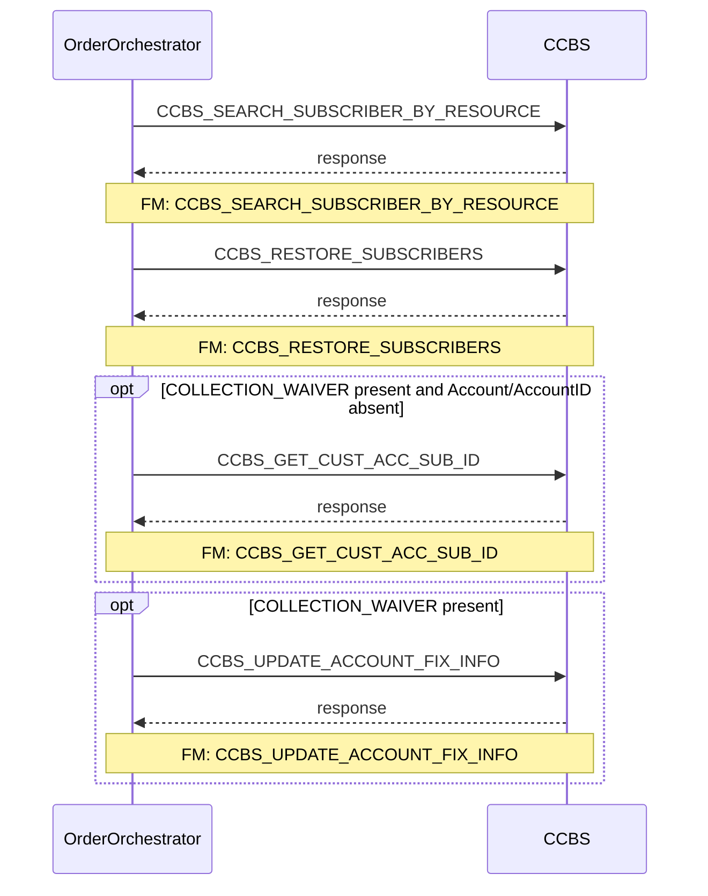

# BN_RESTORE_SUB

> Process Configuration for BN_RESTORE_SUB — Restores suspended subscribers in CCBS, retrieves customer/account IDs, and updates account collection fix info when COLLECTION_WAIVER is present.

**Total steps:** 4 | **Unique FMs:** 4 | **Entry point:** CCBS_SEARCH_SUBSCRIBER_BY_RESOURCE | **Generated:** 2026-09-22

---

## §2 — Order Flow

| Step | Step ID | FM (ActivityID) | Parameter(s) | PreExecCheck | Previous | Next |
|------|---------|-----------------|--------------|--------------|----------|------|
| 1 | CCBS_SEARCH_SUBSCRIBER_BY_RESOURCE | CCBS_SEARCH_SUBSCRIBER_BY_RESOURCE | — | — | START | CCBS_RESTORE_SUBSCRIBERS |
| 2 | CCBS_RESTORE_SUBSCRIBERS | CCBS_RESTORE_SUBSCRIBERS | — | — | CCBS_SEARCH_SUBSCRIBER_BY_RESOURCE | CCBS_GET_CUST_ACC_SUB_ID |
| 3 | CCBS_GET_CUST_ACC_SUB_ID | CCBS_GET_CUST_ACC_SUB_ID | — | `COLLECTION_WAIVER present and Account/AccountID absent` | CCBS_RESTORE_SUBSCRIBERS | CCBS_UPDATE_ACCOUNT_FIX_INFO |
| 4 | CCBS_UPDATE_ACCOUNT_FIX_INFO | CCBS_UPDATE_ACCOUNT_FIX_INFO | — | `COLLECTION_WAIVER present` | CCBS_GET_CUST_ACC_SUB_ID | END |

---

## §3 — PreExecCheck Details

### Step 3 — CCBS_GET_CUST_ACC_SUB_ID

**FM:** `CCBS_GET_CUST_ACC_SUB_ID`

Execute only when at least one subscriber has `COLLECTION_WAIVER` (Y or N) AND the `Account/AccountID` is not yet populated. Ensures the account lookup runs only when needed for collection processing.

```xpath
boolean(//Subscriber[ExtendedInfo[Name='COLLECTION_WAIVER' and (Value='N' or Value='Y')]])
and not(exists(//Account/AccountID))
```

### Step 4 — CCBS_UPDATE_ACCOUNT_FIX_INFO

**FM:** `CCBS_UPDATE_ACCOUNT_FIX_INFO`

Execute whenever at least one subscriber has `COLLECTION_WAIVER` (Y or N). No AccountID guard — update runs regardless of whether step 3 executed, as long as COLLECTION_WAIVER is set.

```xpath
boolean(//Subscriber[ExtendedInfo[Name='COLLECTION_WAIVER' and (Value='N' or Value='Y')]])
```

---

## §4 — FM Documentation Index

| FM (ActivityID) | Used in Steps | Doc Link |
|-----------------|---------------|----------|
| CCBS_SEARCH_SUBSCRIBER_BY_RESOURCE | 1 | [Request_CCBS_SEARCH_SUBSCRIBER_BY_RESOURCE.html](../FMlogic/Request_CCBS_SEARCH_SUBSCRIBER_BY_RESOURCE.html) |
| CCBS_RESTORE_SUBSCRIBERS | 2 | [Request_CCBS_RESTORE_SUBSCRIBERS.html](../FMlogic/Request_CCBS_RESTORE_SUBSCRIBERS.html) |
| CCBS_GET_CUST_ACC_SUB_ID | 3 | [Request_CCBS_GET_CUST_ACC_SUB_ID.html](../FMlogic/Request_CCBS_GET_CUST_ACC_SUB_ID.html) |
| CCBS_UPDATE_ACCOUNT_FIX_INFO | 4 | [Request_CCBS_UPDATE_ACCOUNT_FIX_INFO.html](../FMlogic/Request_CCBS_UPDATE_ACCOUNT_FIX_INFO.html) |

---

## §5 — Sequence Diagram



> Rendered from ProcessConfig activity chain. Conditional steps wrapped in `opt` blocks.
> Full interactive page: `output/order/BN_RESTORE_SUB.html`

---

*TRUE Corporation OMX · Order Journey Documentation*
