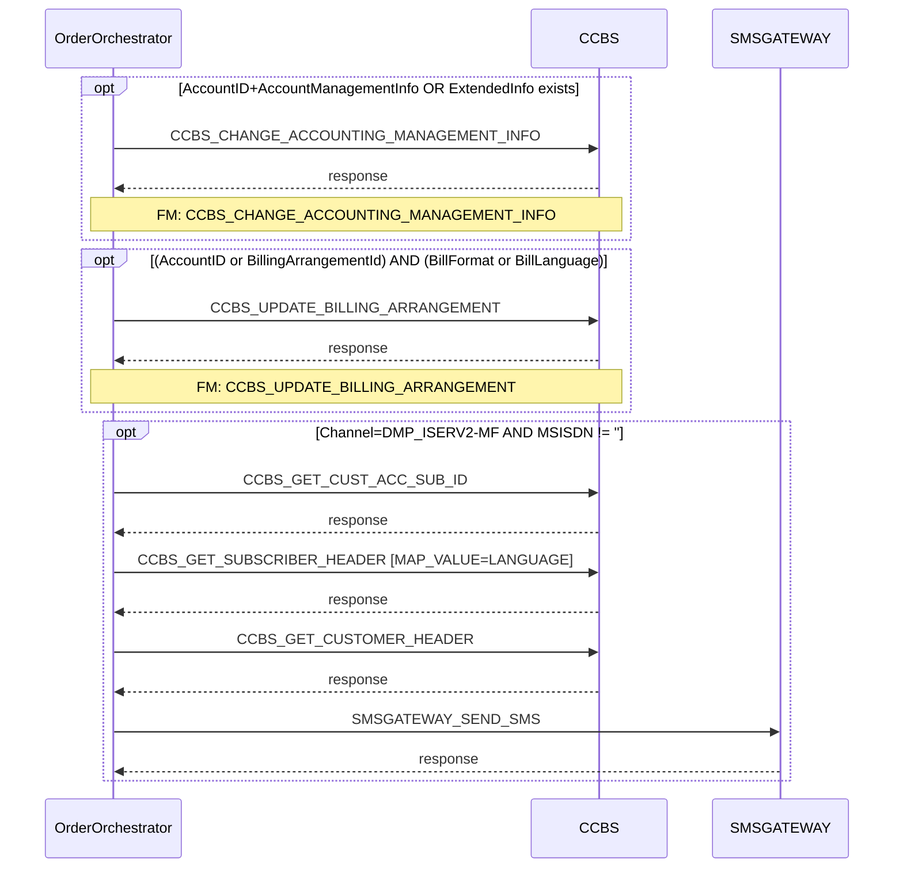

# CHANGE_ACCOUNT_BILLING_INFO

> Process Configuration for CHANGE_ACCOUNT_BILLING_INFO — updates account billing arrangement (bill format, language, L9 split parameter). Steps 3–6 execute only for DMP_ISERV2-MF channel orders with a valid MSISDN.

**Total steps:** 6 | **Unique FMs:** 6 | **Entry point:** CCBS_CHANGE_ACCOUNTING_MANAGEMENT_INFO | **Generated:** 2026-09-23

---

## §2 — Order Flow

| Step | Step ID | FM (ActivityID) | Parameter(s) | PreExecCheck | Previous | Next |
|------|---------|-----------------|--------------|-------------|---------|------|
| 1 | CCBS_CHANGE_ACCOUNTING_MANAGEMENT_INFO | CCBS_CHANGE_ACCOUNTING_MANAGEMENT_INFO | — | Yes | START | CCBS_UPDATE_BILLING_ARRANGEMENT |
| 2 | CCBS_UPDATE_BILLING_ARRANGEMENT | CCBS_UPDATE_BILLING_ARRANGEMENT | — | Yes | 1 | CCBS_GET_CUST_ACC_SUB_ID |
| 3 | CCBS_GET_CUST_ACC_SUB_ID | CCBS_GET_CUST_ACC_SUB_ID | — | Yes | 2 | CCBS_GET_SUBSCRIBER_HEADER |
| 4 | CCBS_GET_SUBSCRIBER_HEADER | CCBS_GET_SUBSCRIBER_HEADER | MAP_VALUE=LANGUAGE | Yes | 3 | CCBS_GET_CUSTOMER_HEADER |
| 5 | CCBS_GET_CUSTOMER_HEADER | CCBS_GET_CUSTOMER_HEADER | — | Yes | 4 | SMSGATEWAY_SEND_SMS |
| 6 | SMSGATEWAY_SEND_SMS | SMSGATEWAY_SEND_SMS | — | Yes | 5 | END |

All 6 steps are conditional. Steps 3–6 share the same DMP_ISERV2-MF + MSISDN guard.

---

## §3 — PreExecCheck Details

### Step 1 — CCBS_CHANGE_ACCOUNTING_MANAGEMENT_INFO

**FM:** `CCBS_CHANGE_ACCOUNTING_MANAGEMENT_INFO`

```xpath
(//Account/AccountID/text()!="" and (count(//Account/AccountManagementInfo)>0))
or (count(//Account/ExtendedInfo)>0)
```

Execute if account has AccountID + AccountManagementInfo, OR has any ExtendedInfo entries.

### Step 2 — CCBS_UPDATE_BILLING_ARRANGEMENT

**FM:** `CCBS_UPDATE_BILLING_ARRANGEMENT`

```xpath
( //Account/AccountID/text()!="" or //Account/BillingArrangementId/text()!="" )
and
( //Account/BillingArrangementBillInfo/BillFormat/text()!=""
  or //Account/BillingArrangementBillInfo/BillLanguage/text()!="" )
```

Execute if account has an ID (AccountID or BillingArrangementId) AND has billing format or language data.

### Steps 3–6 — DMP_ISERV2-MF SMS Sub-flow

**FMs:** CCBS_GET_CUST_ACC_SUB_ID / CCBS_GET_SUBSCRIBER_HEADER / CCBS_GET_CUSTOMER_HEADER / SMSGATEWAY_SEND_SMS

```xpath
/ns0:OrderRequest/OrderData/Channel/text()="DMP_ISERV2-MF"
and //Subscriber/MSISDN/text()!=""
```

Identical guard on all four steps. They form a subscriber lookup and SMS notification sub-flow that only executes for DMP_ISERV2-MF channel.

---

## §4 — FM Documentation Index

| FM (ActivityID) | Steps | Status | Doc |
|-----------------|-------|--------|-----|
| CCBS_UPDATE_BILLING_ARRANGEMENT | 2 | [New Doc] | [Request_CCBS_UPDATE_BILLING_ARRANGEMENT.html](../FMlogic/Request_CCBS_UPDATE_BILLING_ARRANGEMENT.html) |
| CCBS_CHANGE_ACCOUNTING_MANAGEMENT_INFO | 1 | [Generated] | [Request_CCBS_CHANGE_ACCOUNTING_MANAGEMENT_INFO.html](../FMlogic/Request_CCBS_CHANGE_ACCOUNTING_MANAGEMENT_INFO.html) |
| CCBS_GET_CUST_ACC_SUB_ID | 3 | [Generated] | [Request_CCBS_GET_CUST_ACC_SUB_ID.html](../FMlogic/Request_CCBS_GET_CUST_ACC_SUB_ID.html) |
| CCBS_GET_SUBSCRIBER_HEADER | 4 | [Generated] | [Request_CCBS_GET_SUBSCRIBER_HEADER.html](../FMlogic/Request_CCBS_GET_SUBSCRIBER_HEADER.html) |
| CCBS_GET_CUSTOMER_HEADER | 5 | [Generated] | [Request_CCBS_GET_CUSTOMER_HEADER.html](../FMlogic/Request_CCBS_GET_CUSTOMER_HEADER.html) |
| SMSGATEWAY_SEND_SMS | 6 | [Generated] | [Request_SMSGATEWAY_SEND_SMS.html](../FMlogic/Request_SMSGATEWAY_SEND_SMS.html) |

---

## §5 — Sequence Diagram



> Steps 3–6 execute only for DMP_ISERV2-MF channel with a non-empty MSISDN.
> Full interactive diagram: see `output/order/CHANGE_ACCOUNT_BILLING_INFO.html`

---

## Key Notes

### CCBS_UPDATE_BILLING_ARRANGEMENT (Step 2) — L9SplitParam Logic

Three-way branching:
- **Non-L9Resume** (OrderType ≠ 11): `CANCEL_TYPE=endbill` → "FFGB"; else → "SIFN"
- **L9SPLITPARAM** activity parameter: overrides if set
- **L9Resume** (OrderType = 11): reads from `$account/ExtendedInfo[Name="L9SplitParam"]/Value`; if='SIFN' → 'CLEAR'

### CCBS_UPDATE_BILLING_ARRANGEMENT — L3BillFormat

`FINAL_BILL=N` in OrderData ExtendedInfo forces `L3BillFormat="PS"` (paper statement) regardless of account BillFormat data.

---

*TRUE Corporation OMX · Order Journey Documentation*
