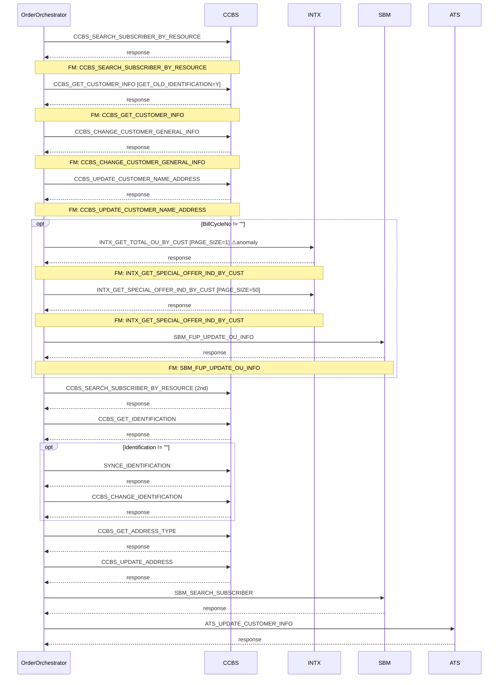

# CHANGE_CUSTOMER_GENERAL_INFO

> Update customer general information including name, address, identification, and billing cycle data.

**Total steps:** 15 | **Unique FMs:** 14 | **Entry point:** CCBS_SEARCH_SUBSCRIBER_BY_RESOURCE

---

## §2 — Order Flow

| Step | Step ID | FM (ActivityID) | Parameter(s) | PreExecCheck | Previous | Next |
|------|---------|-----------------|--------------|--------------|----------|------|
| 1 | CCBS_SEARCH_SUBSCRIBER_BY_RESOURCE | CCBS_SEARCH_SUBSCRIBER_BY_RESOURCE | — | — | START | CCBS_GET_CUSTOMER_INFO |
| 2 | CCBS_GET_CUSTOMER_INFO | CCBS_GET_CUSTOMER_INFO | GET_OLD_IDENTIFICATION=Y \| GET_CUST_GENERAL_INFO=Y | — | Step 1 | CCBS_CHANGE_CUSTOMER_GENERAL_INFO |
| 3 | CCBS_CHANGE_CUSTOMER_GENERAL_INFO | CCBS_CHANGE_CUSTOMER_GENERAL_INFO | — | — | Step 2 | CCBS_UPDATE_CUSTOMER_NAME_ADDRESS |
| 4 | CCBS_UPDATE_CUSTOMER_NAME_ADDRESS | CCBS_UPDATE_CUSTOMER_NAME_ADDRESS | — | — | Step 3 | INTX_GET_TOTAL_OU_BY_CUST |
| 5 | INTX_GET_TOTAL_OU_BY_CUST ⚠ | INTX_GET_SPECIAL_OFFER_IND_BY_CUST | SPECIAL_OFFER_IND=FSH,FPL \| PAGE_SIZE=1 | `//BillCycleNo/text()!= ""` | Step 4 | INTX_GET_SPECIAL_OFFER_IND_BY_CUST |
| 6 | INTX_GET_SPECIAL_OFFER_IND_BY_CUST | INTX_GET_SPECIAL_OFFER_IND_BY_CUST | SPECIAL_OFFER_IND=FSH,FPL \| PAGE_SIZE=50 | `//BillCycleNo/text()!= ""` | Step 5 | SBM_FUP_UPDATE_OU_INFO |
| 7 | SBM_FUP_UPDATE_OU_INFO | SBM_FUP_UPDATE_OU_INFO | — | `//BillCycleNo/text()!= ""` | Step 6 | CCBS_SEARCH_SUBSCRIBER_BY_RESOURCE_2 |
| 8 | CCBS_SEARCH_SUBSCRIBER_BY_RESOURCE_2 | CCBS_SEARCH_SUBSCRIBER_BY_RESOURCE | — | — | Step 7 | CCBS_GET_IDENTIFICATION |
| 9 | CCBS_GET_IDENTIFICATION | CCBS_GET_IDENTIFICATION | — | — | Step 8 | SYNCE_IDENTIFICATION |
| 10 | SYNCE_IDENTIFICATION | SYNCE_IDENTIFICATION | — | `//Identification/text()!= ""` | Step 9 | CCBS_CHANGE_IDENTIFICATION |
| 11 | CCBS_CHANGE_IDENTIFICATION | CCBS_CHANGE_IDENTIFICATION | — | `//Identification/text()!= ""` | Step 10 | CCBS_GET_ADDRESS_TYPE |
| 12 | CCBS_GET_ADDRESS_TYPE | CCBS_GET_ADDRESS_TYPE | — | — | Step 11 | CCBS_UPDATE_ADDRESS |
| 13 | CCBS_UPDATE_ADDRESS | CCBS_UPDATE_ADDRESS | — | — | Step 12 | SBM_SEARCH_SUBSCRIBER |
| 14 | SBM_SEARCH_SUBSCRIBER | SBM_SEARCH_SUBSCRIBER | — | — | Step 13 | ATS_UPDATE_CUSTOMER_INFO |
| 15 | ATS_UPDATE_CUSTOMER_INFO | ATS_UPDATE_CUSTOMER_INFO | — | — | Step 14 | END |

> ⚠ **Step 5 anomaly:** extId=`INTX_GET_TOTAL_OU_BY_CUST` but ActivityID=`INTX_GET_SPECIAL_OFFER_IND_BY_CUST`. The same FM is called twice (steps 5+6) with PAGE_SIZE=1 (count probe) then PAGE_SIZE=50 (full fetch).

---

## §3 — PreExecCheck Details

### Step 5 — INTX_GET_TOTAL_OU_BY_CUST (probe)

**FM:** `INTX_GET_SPECIAL_OFFER_IND_BY_CUST`

```xpath
//BillCycleNo/text()!= ""
```

Steps 5, 6, and 7 are all gated on BillCycleNo being present. This forms the billing-cycle update sub-flow.

### Step 10 — SYNCE_IDENTIFICATION

**FM:** `SYNCE_IDENTIFICATION`

```xpath
//Identification/text()!= ""
```

### Step 11 — CCBS_CHANGE_IDENTIFICATION

**FM:** `CCBS_CHANGE_IDENTIFICATION`

```xpath
//Identification/text()!= ""
```

Steps 10–11 form the CHANGE_IDENTIFICATION sub-flow for customers with an Identification value.

---

## §4 — FM Documentation Index

| FM (ActivityID) | Used in Steps | Doc |
|-----------------|--------------|-----|
| CCBS_SEARCH_SUBSCRIBER_BY_RESOURCE | 1, 8 | [Request_CCBS_SEARCH_SUBSCRIBER_BY_RESOURCE.html](../FMlogic/Request_CCBS_SEARCH_SUBSCRIBER_BY_RESOURCE.html) |
| CCBS_GET_CUSTOMER_INFO | 2 | [Request_CCBS_GET_CUSTOMER_INFO.html](../FMlogic/Request_CCBS_GET_CUSTOMER_INFO.html) |
| CCBS_CHANGE_CUSTOMER_GENERAL_INFO | 3 | [Request_CCBS_CHANGE_CUSTOMER_GENERAL_INFO.html](../FMlogic/Request_CCBS_CHANGE_CUSTOMER_GENERAL_INFO.html) |
| CCBS_UPDATE_CUSTOMER_NAME_ADDRESS | 4 | [Request_CCBS_UPDATE_CUSTOMER_NAME_ADDRESS.html](../FMlogic/Request_CCBS_UPDATE_CUSTOMER_NAME_ADDRESS.html) |
| INTX_GET_SPECIAL_OFFER_IND_BY_CUST | 5, 6 | [Request_INTX_GET_SPECIAL_OFFER_IND_BY_CUST.html](../FMlogic/Request_INTX_GET_SPECIAL_OFFER_IND_BY_CUST.html) |
| SBM_FUP_UPDATE_OU_INFO | 7 | [Request_SBM_FUP_UPDATE_OU_INFO.html](../FMlogic/Request_SBM_FUP_UPDATE_OU_INFO.html) |
| CCBS_GET_IDENTIFICATION | 9 | [Request_CCBS_GET_IDENTIFICATION.html](../FMlogic/Request_CCBS_GET_IDENTIFICATION.html) |
| SYNCE_IDENTIFICATION | 10 | [Request_SYNCE_IDENTIFICATION.html](../FMlogic/Request_SYNCE_IDENTIFICATION.html) |
| CCBS_CHANGE_IDENTIFICATION | 11 | [Request_CCBS_CHANGE_IDENTIFICATION.html](../FMlogic/Request_CCBS_CHANGE_IDENTIFICATION.html) |
| CCBS_GET_ADDRESS_TYPE | 12 | [Request_CCBS_GET_ADDRESS_TYPE.html](../FMlogic/Request_CCBS_GET_ADDRESS_TYPE.html) |
| CCBS_UPDATE_ADDRESS | 13 | [Request_CCBS_UPDATE_ADDRESS.html](../FMlogic/Request_CCBS_UPDATE_ADDRESS.html) |
| SBM_SEARCH_SUBSCRIBER | 14 | [Request_SBM_SEARCH_SUBSCRIBER.html](../FMlogic/Request_SBM_SEARCH_SUBSCRIBER.html) |
| ATS_UPDATE_CUSTOMER_INFO | 15 | [Request_ATS_UPDATE_CUSTOMER_INFO.html](../FMlogic/Request_ATS_UPDATE_CUSTOMER_INFO.html) |

---

## §5 — Sequence Diagram



---

## §6 — Anomalies & Warnings

| Step | Anomaly | Details |
|------|---------|---------|
| 5 | extId/ActivityID mismatch | extId=`INTX_GET_TOTAL_OU_BY_CUST` but ActivityID=`INTX_GET_SPECIAL_OFFER_IND_BY_CUST` |
| 5+6 | Same FM called twice | INTX_GET_SPECIAL_OFFER_IND_BY_CUST with PAGE_SIZE=1 (probe) then PAGE_SIZE=50 (fetch) |
| 2 | Event naming anomaly | CCBS_GET_CUSTOMER_INFO dispatches CCBS_GET_CUSTOMER_HEADER event |
| 3 | Dead code risk | CCBS_CHANGE_CUSTOMER_GENERAL_INFO ActionResponseEvent commented out in response handler |

---

*TRUE Corporation OMX · Order Journey Documentation*
