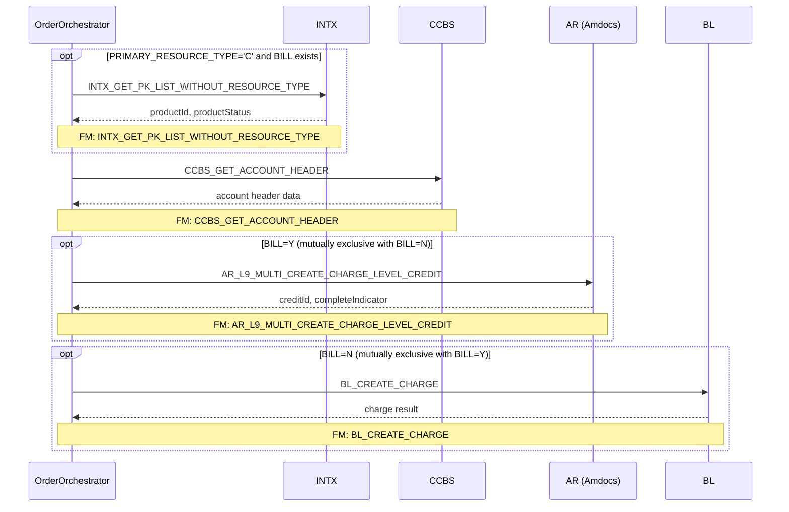
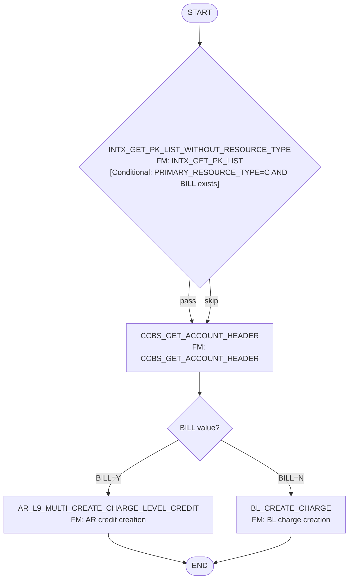

# CREATE_BILL_ADJUSTMENT

> Process Configuration for CREATE_BILL_ADJUSTMENT.

**Total steps:** 4 | **Unique FMs:** 4 | **Entry point:** `CREATE_BILL_ADJUSTMENT:INTX_GET_PK_LIST_WITHOUT_RESOURCE_TYPE`

> **Routing note:** Steps 3 and 4 are **mutually exclusive** — `BILL=Y` routes to AR credit (step 3), `BILL=N` routes to BL charge (step 4). Only one path executes per order.

---

## §2 — Order Flow

| Step | Step ID | FM (ActivityID) | Parameter(s) | PreExecCheck | Previous | Next |
|------|---------|-----------------|--------------|--------------|----------|------|
| 1 | INTX_GET_PK_LIST_WITHOUT_RESOURCE_TYPE | [INTX_GET_PK_LIST_WITHOUT_RESOURCE_TYPE](../FMlogic/Request_INTX_GET_PK_LIST_WITHOUT_RESOURCE_TYPE.html) ✦NEW | — | `boolean(//Subscriber[ExtendedInfo[Name='PRIMARY_RESOURCE_TYPE' and Value='C']]) and exists(//SubscriberOffers/ExtendedInfo[Name='BILL'])` | START | CCBS_GET_ACCOUNT_HEADER |
| 2 | CCBS_GET_ACCOUNT_HEADER | [CCBS_GET_ACCOUNT_HEADER](../FMlogic/Request_CCBS_GET_ACCOUNT_HEADER.html) | — | — | INTX_GET_PK_LIST_WITHOUT_RESOURCE_TYPE | AR_L9_MULTI_CREATE_CHARGE_LEVEL_CREDIT / BL_CREATE_CHARGE |
| 3 | AR_L9_MULTI_CREATE_CHARGE_LEVEL_CREDIT | [AR_L9_MULTI_CREATE_CHARGE_LEVEL_CREDIT](../FMlogic/Request_AR_L9_MULTI_CREATE_CHARGE_LEVEL_CREDIT.html) ✦NEW | — | `boolean(//SubscriberOffers[ExtendedInfo[Name='BILL' and Value='Y']])` | CCBS_GET_ACCOUNT_HEADER | END |
| 4 | BL_CREATE_CHARGE | [BL_CREATE_CHARGE](../FMlogic/Request_BL_CREATE_CHARGE.html) | — | `boolean(//SubscriberOffers[ExtendedInfo[Name='BILL' and Value='N']])` | CCBS_GET_ACCOUNT_HEADER | END |

✦NEW = FM doc generated this run

---

## §3 — PreExecCheck Details

### Step 1 — INTX_GET_PK_LIST_WITHOUT_RESOURCE_TYPE

**FM:** `INTX_GET_PK_LIST_WITHOUT_RESOURCE_TYPE`

```xpath
boolean(//Subscriber[ExtendedInfo[Name='PRIMARY_RESOURCE_TYPE' and Value='C']])
and exists(//SubscriberOffers/ExtendedInfo[Name='BILL'])
```

Gates on two conditions: subscriber must be type C (mobile/cellular), and at least one SubscriberOffer must have a BILL ExtendedInfo key. If either fails, the entire activity is skipped.

---

### Step 3 — AR_L9_MULTI_CREATE_CHARGE_LEVEL_CREDIT (BILL=Y path)

**FM:** `AR_L9_MULTI_CREATE_CHARGE_LEVEL_CREDIT`

```xpath
boolean(//SubscriberOffers[ExtendedInfo[Name='BILL' and Value='Y']])
```

Routes to AR charge-level credit when BILL=Y. Mutually exclusive with step 4.

---

### Step 4 — BL_CREATE_CHARGE (BILL=N path)

**FM:** `BL_CREATE_CHARGE`

```xpath
boolean(//SubscriberOffers[ExtendedInfo[Name='BILL' and Value='N']])
```

Routes to BL charge creation when BILL=N. Mutually exclusive with step 3.

---

## §4 — FM Documentation Index

| FM (ActivityID) | Used in Steps | Doc Link | Status |
|-----------------|---------------|----------|--------|
| INTX_GET_PK_LIST_WITHOUT_RESOURCE_TYPE | 1 | [Request_INTX_GET_PK_LIST_WITHOUT_RESOURCE_TYPE.html](../FMlogic/Request_INTX_GET_PK_LIST_WITHOUT_RESOURCE_TYPE.html) | ✦ NEW |
| CCBS_GET_ACCOUNT_HEADER | 2 | [Request_CCBS_GET_ACCOUNT_HEADER.html](../FMlogic/Request_CCBS_GET_ACCOUNT_HEADER.html) | Pre-existing |
| AR_L9_MULTI_CREATE_CHARGE_LEVEL_CREDIT | 3 | [Request_AR_L9_MULTI_CREATE_CHARGE_LEVEL_CREDIT.html](../FMlogic/Request_AR_L9_MULTI_CREATE_CHARGE_LEVEL_CREDIT.html) | ✦ NEW |
| BL_CREATE_CHARGE | 4 | [Request_BL_CREATE_CHARGE.html](../FMlogic/Request_BL_CREATE_CHARGE.html) | Pre-existing |

---

## §5 — Sequence Diagram



> Steps 3 and 4 are mutually exclusive — only one executes based on the `BILL` ExtendedInfo value on SubscriberOffers.

---

## §6 — Flow Diagram



---

## §7 — Migration Notes

| Risk | Severity | Details |
|------|----------|---------|
| BILL=Y / BILL=N routing is implicit via PreExecCheck — no explicit branch node in ProcessConfig | [HIGH] | Both steps 3 and 4 are in the same linear activity list; mutual exclusion relies entirely on PreExecCheck XPath. Modernized system should model this as an explicit branch/gateway. |
| CES path in AR_L9_MULTI_CREATE_CHARGE_LEVEL_CREDIT is commented out | [HIGH] | Dead code for CES routing — confirm with AR team whether this is intentionally disabled. |
| Response audit suppressed on AR error (chkError=true) | [HIGH] | Failed AR credits produce no audit trail — fix in modernized system. |
| INTX uses `primaryKeyInfoArray[1]` — first item only | [MEDIUM] | Verify single-SIM assumption; multi-SIM subscribers may need iteration. |

---

*TRUE Corporation OMX · Order Journey Documentation*
