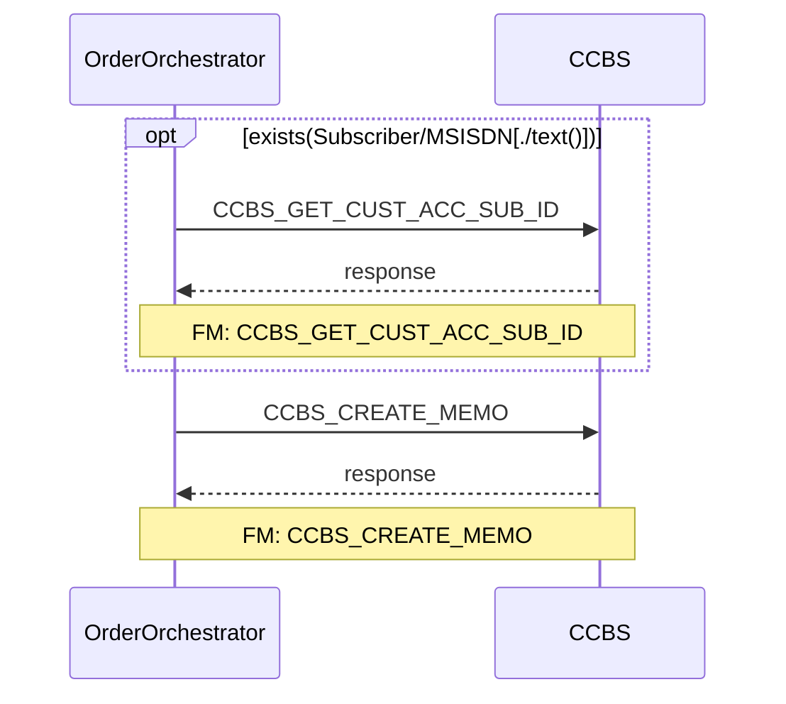
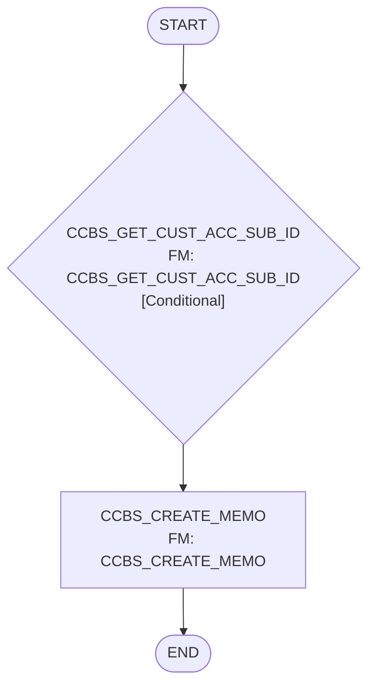

# CREATE_MEMO

> Process Configuration for CREATE_MEMO.

**Total steps:** 2 | **Unique FMs:** 2 | **Generated:** 2 | **Not Found:** 0 | **Entry point:** CCBS_GET_CUST_ACC_SUB_ID | **Generated:** 2026-09-15

---

## §2 — Order Flow

| Step | Step ID | FM (ActivityID) | Parameter(s) | PreExecCheck | Previous | Next |
|------|---------|-----------------|--------------|--------------|----------|------|
| 1 | CCBS_GET_CUST_ACC_SUB_ID | [CCBS_GET_CUST_ACC_SUB_ID](../FMlogic/Request_CCBS_GET_CUST_ACC_SUB_ID.html) | — | `exists(//Subscriber/MSISDN[./text()])` | START | CCBS_CREATE_MEMO |
| 2 | CCBS_CREATE_MEMO | [CCBS_CREATE_MEMO](../FMlogic/Request_CCBS_CREATE_MEMO.html) | — | — | CCBS_GET_CUST_ACC_SUB_ID | END |

---

## §3 — PreExecCheck Details

### Step 1 — CCBS_GET_CUST_ACC_SUB_ID

**FM:** `CCBS_GET_CUST_ACC_SUB_ID`

```xpath
exists(//Subscriber/MSISDN[./text()])
```

---

## §4 — FM Documentation Index

| FM (ActivityID) | Used in Steps | Doc Link | Status |
|-----------------|---------------|----------|--------|
| CCBS_GET_CUST_ACC_SUB_ID | 1 | [Request_CCBS_GET_CUST_ACC_SUB_ID.html](../FMlogic/Request_CCBS_GET_CUST_ACC_SUB_ID.html) | ✓ Generated |
| CCBS_CREATE_MEMO | 2 | [Request_CCBS_CREATE_MEMO.html](../FMlogic/Request_CCBS_CREATE_MEMO.html) | ✓ Generated |

---

## §5 — Sequence Diagram



> Conditional steps wrapped in `opt` blocks. Full interactive view: `output/order/CREATE_MEMO.html`

---

## §6 — Flow Diagram



---

*TRUE Corporation OMX · Order Journey Documentation · CREATE_MEMO*
