# CREATE_SECOND_PCN

> Process Configuration for CREATE_SECOND_PCN.

**Total steps:** 28 | **Unique FMs:** 24 | **Entry point:** CCBS_RESOLVE_SOC_CODE

> ℹ️ Note: Step 1's PreviousActivity is `OMX_RESOLVE_SOC_DATA` — this FM is invoked by a parent/calling process prior to this flow.

---

## §1 — Process Overview

| Phase | Steps | Description | Key Systems |
|-------|-------|-------------|-------------|
| 1 — Offer & SOC Resolution | 1–4 | Resolve SOC codes, GOD offer lookup, get agreement info, special offer indicator | CCBS, OMX |
| 2 — Group & Account Validation | 5–6 | Get CUG group info, validate account status on root OU | CCBS |
| 3 — Business Validation & Future Offers | 7–12 | BIZ_VAL, calculate effective dates, offer inclusion, populate future offers (3 variants) | OMX |
| 4 — Customer & OU Creation | 13–18 | Create customer with bill cycle, get customer header, create parent/child OU, agreement, account | CCBS |
| 5 — Agreement Offer & FUP Groups | 19–23 | Add agreement offer, update agreement on unit, create/change FUP group members | CCBS, SBM |
| 6 — Credit Limit & Profile Status | 24–25 | Update new account credit limit, status update to creating profile | CCBS, OMX |
| 7 — Itemize Offer Provisioning | 26–28 | Inject itemize0 offer (ITMBLS02), calc effective date, update agreement on unit | OMX, CCBS |

---

## §2 — Order Flow

| Step | Step ID | FM (ActivityID) | Parameter(s) | PreExecCheck | Previous | Next |
|------|---------|-----------------|--------------|--------------|----------|------|
| 1 | CCBS_RESOLVE_SOC_CODE | CCBS_RESOLVE_SOC_CODE | — | `((string-length(//SubscriberOffers/Soc/text())>0 and string-length(//SubscriberOffers/RelatedOffersArray/Soc/text())=0) or (string-length(//SubscriberOffers/Soc/text())=0)) or ((string-length(//Offers/Soc/text())>0 and string-length(//Offers/RelatedOffersArray/Soc/text())=0) or (string-length(//Offers/Soc/text())=0))` | OMX_RESOLVE_SOC_DATA | CCBS_GOD |
| 2 | CCBS_GOD | CCBS_GOD | — | `count(//Offers) > 0 or count(//SubscriberOffers) > 0` | CCBS_RESOLVE_SOC_CODE | CCBS_GET_AGREEMENT_INFO |
| 3 | CCBS_GET_AGREEMENT_INFO | CCBS_GET_AGREEMENT_INFO | — | `string-length(//OUId/text())>0` | CCBS_GOD | GET_SPECIAL_OFFER_INDICATOR |
| 4 | GET_SPECIAL_OFFER_INDICATOR | GET_SPECIAL_OFFER_INDICATOR | — | `count(//Offers) > 0 or count(//SubscriberOffers) > 0` | CCBS_GET_AGREEMENT_INFO | CCBS_GET_GROUP_INFO |
| 5 | CCBS_GET_GROUP_INFO | CCBS_GET_GROUP_INFO | — | `count(/ns0:offers/offerParameterInfo[./paramName='CUG ID'])>0` | GET_SPECIAL_OFFER_INDICATOR | CCBS_VALIDATE_ACCT_STATUS_ROOT_OU |
| 6 | CCBS_VALIDATE_ACCT_STATUS_ROOT_OU | CCBS_VALIDATE_ACCT_STATUS_ROOT_OU | — | `string-length(//RawOUId/text())>0` | CCBS_GET_GROUP_INFO | OMX_BIZ_VAL |
| 7 | OMX_BIZ_VAL | OMX_BIZ_VAL | — | — | CCBS_VALIDATE_ACCT_STATUS_ROOT_OU | OMX_CAL_OFFERS_EFF_DATE |
| 8 | OMX_CAL_OFFERS_EFF_DATE | OMX_CAL_OFFERS_EFF_DATE | — | — | OMX_BIZ_VAL | OMX_OFFER_INCLUSION |
| 9 | OMX_OFFER_INCLUSION | OMX_OFFER_INCLUSION | — | `count(//Offers) > 0 or count(//SubscriberOffers) > 0 and (//SubscriberOffers/Action/text() != 'CHG_PARAM' and //Offers/Action/text() != 'CHG_PARAM')` | OMX_CAL_OFFERS_EFF_DATE | OMX_ADD_FUT_OFFERS |
| 10 | OMX_ADD_FUT_OFFERS | OMX_ADD_FUT_OFFERS | 128 | FUT FE non-80/79 on subscriber or agreement | OMX_OFFER_INCLUSION | OMX_ADD_FUT_OFFERS_REMOVE |
| 11 | OMX_ADD_FUT_OFFERS_REMOVE | OMX_ADD_FUT_OFFERS | 128 | FE offers with ExpirationDate, no EffectiveDate, Action=ADD, non-80/79 | OMX_ADD_FUT_OFFERS | OMX_ADD_FUT_OFFERS_PRICEPLAN |
| 12 | OMX_ADD_FUT_OFFERS_PRICEPLAN | OMX_ADD_FUT_OFFERS | — | FUT FE ServiceType=80 subscriber offers, Action=ADD | OMX_ADD_FUT_OFFERS_REMOVE | CCBS_CREATE_CUST_WITH_CYCLE |
| 13 | CCBS_CREATE_CUST_WITH_CYCLE | CCBS_CREATE_CUST_WITH_CYCLE | — | `not(exists(//RawCustomerId))` | OMX_ADD_FUT_OFFERS_PRICEPLAN | CCBS_GET_CUSTOMER_HEADER |
| 14 | CCBS_GET_CUSTOMER_HEADER | CCBS_GET_CUSTOMER_HEADER | — | `boolean(//Customer[not(BillCycleNo[./text()])])` | CCBS_CREATE_CUST_WITH_CYCLE | CCBS_CREATE_PARENT_OU |
| 15 | CCBS_CREATE_PARENT_OU | CCBS_CREATE_PARENT_OU | — | `not(exists(//OUId)) or string-length(//OUId/text())=0` | CCBS_GET_CUSTOMER_HEADER | CCBS_CREATE_CHILD_OU |
| 16 | CCBS_CREATE_CHILD_OU | CCBS_CREATE_CHILD_OU | — | `(not(exists(//ParentOU/RawOUId)) or string-length(//ParentOU/RawOUId/text())=0) or (not(exists(//ChildOU/RawOUId)) or string-length(//ChildOU/RawOUId/text())=0)` | CCBS_CREATE_PARENT_OU | CCBS_CREATE_AGREE |
| 17 | CCBS_CREATE_AGREE | CCBS_CREATE_AGREE | — | `not(exists(//RawOUId))` | CCBS_CREATE_CHILD_OU | CCBS_CREATE_ACCT |
| 18 | CCBS_CREATE_ACCT | CCBS_CREATE_ACCT | — | `not(exists(//RawAccountID)) or string-length(//RawAccountID/text())=0` | CCBS_CREATE_AGREE | CCBS_ADD_AGREEOFFER |
| 19 | CCBS_ADD_AGREEOFFER | CCBS_ADD_AGREEOFFER | — | `count(//Offers)>0 and boolean(//Agreement[1] and //Offers[ServiceType='80' and ExtendedInfo[Name='FE_OR_CCBS' and Value='FE']])` | CCBS_CREATE_ACCT | CCBS_UPDATE_AGREEMENT_ON_UNIT |
| 20 | CCBS_UPDATE_AGREEMENT_ON_UNIT | CCBS_UPDATE_AGREEMENT_ON_UNIT | ADD | `count(//Offers)>0 and boolean(//Agreement[1] and //Offers[ServiceType!='80' and ExtendedInfo[Name='FE_OR_CCBS' and Value='FE']])` | CCBS_ADD_AGREEOFFER | SBM_FUP_CREATE_GROUP |
| 21 | SBM_FUP_CREATE_GROUP | SBM_FUP_CREATE_GROUP | — | FSH/FPL FE offers > 0 AND CCBS FSH/FPL = 0 | CCBS_UPDATE_AGREEMENT_ON_UNIT | SBM_FUP_CHANGE_TOPPING |
| 22 | SBM_FUP_CHANGE_TOPPING | SBM_FUP_CHANGE_TOPPING | ADD | FSH FE non-FUT > 0 AND CCBS FSH/FPL > 0 | SBM_FUP_CREATE_GROUP | SBM_FUP_CHANGE_VARIABLE |
| 23 | SBM_FUP_CHANGE_VARIABLE | SBM_FUP_CHANGE_VARIABLE | ADD | FPL FE non-FUT > 0 AND CCBS FSH/FPL > 0 | SBM_FUP_CHANGE_TOPPING | CCBS_UPDATE_NEW_ACCT_CREDIT_LIMIT |
| 24 | CCBS_UPDATE_NEW_ACCT_CREDIT_LIMIT | CCBS_UPDATE_NEW_ACCT_CREDIT_LIMIT | — | `Type!=73 and not(exists(//RawAccountID))` | SBM_FUP_CHANGE_VARIABLE | STATUS_UPDATE_CREATING_PROFILE |
| 25 | STATUS_UPDATE_CREATING_PROFILE | STATUS_UPDATE_CREATING_PROFILE | — | — | CCBS_UPDATE_NEW_ACCT_CREDIT_LIMIT | OMX_INJECT_OFFER_ADD_ITEMIZE0 |
| 26 | OMX_INJECT_OFFER_ADD_ITEMIZE0 | OMX_INJECT_OFFER | soc=13102425,serviceType=85,action=ADD,offerName=ITMBLS02,level=OU,checkDup=1 | `BillFormat=E or S AND SHOW_USAGE_DETAIL=Y` | STATUS_UPDATE_CREATING_PROFILE | OMX_CAL_OFFERS_EFF_DATE_ITEMIZE |
| 27 | OMX_CAL_OFFERS_EFF_DATE_ITEMIZE | OMX_CAL_OFFERS_EFF_DATE | — | `boolean(//Agreement/Offers[1] and //Agreement/Offers[ExtendedInfo[Name='FE_OR_CCBS' and (Value='FE' or Value='INJECT_OFFER')]])` | OMX_INJECT_OFFER_ADD_ITEMIZE0 | CCBS_UPDATE_AGREEMENT_ON_UNIT_ITEMIZE_OFFER |
| 28 | CCBS_UPDATE_AGREEMENT_ON_UNIT_ITEMIZE_OFFER | CCBS_UPDATE_AGREEMENT_ON_UNIT | — | `exists(//ParentOU/Agreement) and //Offers/ServiceType/text()!='80' and //Offers/ExtendedInfo[Name='FE_OR_CCBS']/Value/text()='INJECT_OFFER'` | OMX_CAL_OFFERS_EFF_DATE_ITEMIZE | END |

---

## §3 — PreExecCheck Details

### Step 1 — CCBS_RESOLVE_SOC_CODE
**FM:** `CCBS_RESOLVE_SOC_CODE`
```xpath
((string-length(//SubscriberOffers/Soc/text())>0 and string-length(//SubscriberOffers/RelatedOffersArray/Soc/text())=0)
 or (string-length(//SubscriberOffers/Soc/text())=0))
or ((string-length(//Offers/Soc/text())>0 and string-length(//Offers/RelatedOffersArray/Soc/text())=0)
 or (string-length(//Offers/Soc/text())=0))
```
---
### Step 2 — CCBS_GOD
**FM:** `CCBS_GOD`
```xpath
count(//Offers) > 0 or count(//SubscriberOffers) > 0
```
---
### Step 3 — CCBS_GET_AGREEMENT_INFO
**FM:** `CCBS_GET_AGREEMENT_INFO`
```xpath
string-length(//OUId/text())>0
```
---
### Step 4 — GET_SPECIAL_OFFER_INDICATOR
**FM:** `GET_SPECIAL_OFFER_INDICATOR`
```xpath
count(//Offers) > 0 or count(//SubscriberOffers) > 0
```
---
### Step 5 — CCBS_GET_GROUP_INFO
**FM:** `CCBS_GET_GROUP_INFO`
```xpath
count(/ns0:offers/offerParameterInfo[./paramName='CUG ID'])>0
```
---
### Step 6 — CCBS_VALIDATE_ACCT_STATUS_ROOT_OU
**FM:** `CCBS_VALIDATE_ACCT_STATUS_ROOT_OU`
```xpath
string-length(//RawOUId/text())>0
```
---
### Step 9 — OMX_OFFER_INCLUSION
**FM:** `OMX_OFFER_INCLUSION`
```xpath
count(//Offers) > 0 or count(//SubscriberOffers) > 0
and (//SubscriberOffers/Action/text() != 'CHG_PARAM' and //Offers/Action/text() != 'CHG_PARAM')
```
---
### Step 10 — OMX_ADD_FUT_OFFERS
**FM:** `OMX_ADD_FUT_OFFERS` | **Param:** `128`
```xpath
boolean(
  //Subscriber/SubscriberOffers[ExtendedInfo[Name[.='OfferActivityDate'] and Value[.='FUT']]]
    [ExtendedInfo[Name[.='FE_OR_CCBS'] and Value[.='FE']]]
  and //SubscriberOffers/ServiceType/text() != '80'
  and //SubscriberOffers/ServiceType/text() != '79'
)
or boolean(
  //Agreement/Offers[ExtendedInfo[Name[.='OfferActivityDate'] and Value[.='FUT']]]
    [ExtendedInfo[Name[.='FE_OR_CCBS'] and Value[.='FE']]]
  and //Agreement/Offers/ServiceType/text() != '80'
  and //Agreement/Offers/ServiceType/text() != '79'
)
```
---
### Step 11 — OMX_ADD_FUT_OFFERS_REMOVE
**FM:** `OMX_ADD_FUT_OFFERS` | **Param:** `128`
```xpath
boolean(
  //Subscriber/SubscriberOffers[ExtendedInfo[Name[.='FE_OR_CCBS'] and Value[.='FE']]]
  and exists(//Subscriber/SubscriberOffers/ExpirationDate)
  and not(exists(//Subscriber/SubscriberOffers/EffectiveDate))
  and count(//Subscriber/SubscriberOffers[Action='ADD']) > 0
  and //SubscriberOffers/ServiceType/text() != '80'
  and //SubscriberOffers/ServiceType/text() != '79'
)
or boolean(
  //Agreement/Offers[ExtendedInfo[Name[.='FE_OR_CCBS'] and Value[.='FE']]]
  and exists(//Agreement/Offers/ExpirationDate)
  and not(exists(//Agreement/Offers/EffectiveDate))
  and count(//Agreement/Offers[Action='ADD']) > 0
  and //Agreement/Offers/ServiceType/text() != '80'
  and //Agreement/Offers/ServiceType/text() != '79'
)
```
---
### Step 12 — OMX_ADD_FUT_OFFERS_PRICEPLAN
**FM:** `OMX_ADD_FUT_OFFERS`
```xpath
boolean(
  //Subscriber/SubscriberOffers[ExtendedInfo[Name[.='OfferActivityDate'] and Value[.='FUT']]]
    [ExtendedInfo[Name[.='FE_OR_CCBS'] and Value[.='FE']]]
  and count(//Subscriber/SubscriberOffers[Action='ADD']) > 0
  and //SubscriberOffers/ServiceType/text() = '80'
)
```
---
### Step 13 — CCBS_CREATE_CUST_WITH_CYCLE
**FM:** `CCBS_CREATE_CUST_WITH_CYCLE`
```xpath
not(exists(//RawCustomerId))
```
---
### Step 14 — CCBS_GET_CUSTOMER_HEADER
**FM:** `CCBS_GET_CUSTOMER_HEADER`
```xpath
boolean(//Customer[not(BillCycleNo[./text()])])
```
---
### Step 15 — CCBS_CREATE_PARENT_OU
**FM:** `CCBS_CREATE_PARENT_OU`
```xpath
not(exists(//OUId)) or string-length(//OUId/text())=0
```
---
### Step 16 — CCBS_CREATE_CHILD_OU
**FM:** `CCBS_CREATE_CHILD_OU`
```xpath
(not(exists(//ParentOU/RawOUId)) or string-length(//ParentOU/RawOUId/text())=0)
or (not(exists(//ChildOU/RawOUId)) or string-length(//ChildOU/RawOUId/text())=0)
```
---
### Step 17 — CCBS_CREATE_AGREE
**FM:** `CCBS_CREATE_AGREE`
```xpath
not(exists(//RawOUId))
```
---
### Step 18 — CCBS_CREATE_ACCT
**FM:** `CCBS_CREATE_ACCT`
```xpath
not(exists(//RawAccountID)) or string-length(//RawAccountID/text())=0
```
---
### Step 19 — CCBS_ADD_AGREEOFFER
**FM:** `CCBS_ADD_AGREEOFFER`
```xpath
count(//Offers)>0 and boolean(//Agreement[1] and //Offers[ServiceType='80' and ExtendedInfo[Name='FE_OR_CCBS' and Value='FE']])
```
---
### Step 20 — CCBS_UPDATE_AGREEMENT_ON_UNIT
**FM:** `CCBS_UPDATE_AGREEMENT_ON_UNIT` | **Param:** `ADD`
```xpath
count(//Offers)>0 and boolean(//Agreement[1] and //Offers[ServiceType!='80' and ExtendedInfo[Name='FE_OR_CCBS' and Value='FE']])
```
---
### Step 21 — SBM_FUP_CREATE_GROUP
**FM:** `SBM_FUP_CREATE_GROUP`
```xpath
count(//Offers[ExtendedInfo[Name='SPECIAL_OFFER_INDICATOR' and (Value='FSH' or Value='FPL')]]
  [ExtendedInfo[Name='FE_OR_CCBS' and Value='FE']]) > 0
and count(//Offers[ExtendedInfo[Name='SPECIAL_OFFER_INDICATOR' and (Value='FSH' or Value='FPL')]]
  [ExtendedInfo[Name='FE_OR_CCBS' and Value='CCBS']]) = 0
```
---
### Step 22 — SBM_FUP_CHANGE_TOPPING
**FM:** `SBM_FUP_CHANGE_TOPPING` | **Param:** `ADD`
```xpath
count(//Offers[ExtendedInfo[Name='FE_OR_CCBS' and Value!='CCBS']]
  [ExtendedInfo[Name='SPECIAL_OFFER_INDICATOR' and Value='FSH']]
  [ExtendedInfo[Name[.='EFF_TYPE'] and Value[.!='FUT']]]) > 0
and count(//Offers[ExtendedInfo[Name='FE_OR_CCBS' and Value='CCBS']]
  [ExtendedInfo[Name='SPECIAL_OFFER_INDICATOR' and (Value='FSH' or Value='FPL')]]) > 0
```
---
### Step 23 — SBM_FUP_CHANGE_VARIABLE
**FM:** `SBM_FUP_CHANGE_VARIABLE` | **Param:** `ADD`
```xpath
count(//Offers[ExtendedInfo[Name='FE_OR_CCBS' and Value!='CCBS']]
  [ExtendedInfo[Name='SPECIAL_OFFER_INDICATOR' and Value='FPL']]
  [ExtendedInfo[Name[.='EFF_TYPE'] and Value[.!='FUT']]]) > 0
and count(//Offers[ExtendedInfo[Name='FE_OR_CCBS' and Value='CCBS']]
  [ExtendedInfo[Name='SPECIAL_OFFER_INDICATOR' and (Value='FSH' or Value='FPL')]]) > 0
```
---
### Step 24 — CCBS_UPDATE_NEW_ACCT_CREDIT_LIMIT
**FM:** `CCBS_UPDATE_NEW_ACCT_CREDIT_LIMIT`
```xpath
/ns0:OrderRequest/OrderData/Customer/CustomerTypeInfo/Type/text()!=73 and not(exists(//RawAccountID))
```
---
### Step 26 — OMX_INJECT_OFFER_ADD_ITEMIZE0
**FM:** `OMX_INJECT_OFFER` | **Param:** `soc=13102425,serviceType=85,action=ADD,offerName=ITMBLS02,level=OU,checkDup=1`
```xpath
boolean(//Account/BillingArrangementBillInfo/BillFormat/text()="E"
  or //Account/BillingArrangementBillInfo/BillFormat/text()="S")
and boolean(//Account/ExtendedInfo[Name='SHOW_USAGE_DETAIL' and Value='Y'])
```
---
### Step 27 — OMX_CAL_OFFERS_EFF_DATE_ITEMIZE
**FM:** `OMX_CAL_OFFERS_EFF_DATE`
```xpath
boolean(//Agreement/Offers[1]
  and //Agreement/Offers[ExtendedInfo[Name='FE_OR_CCBS' and (Value='FE' or Value='INJECT_OFFER')]])
```
---
### Step 28 — CCBS_UPDATE_AGREEMENT_ON_UNIT_ITEMIZE_OFFER
**FM:** `CCBS_UPDATE_AGREEMENT_ON_UNIT`
```xpath
exists(//ParentOU/Agreement)
and //Offers/ServiceType/text() != '80'
and //Offers/ExtendedInfo[Name='FE_OR_CCBS']/Value/text()='INJECT_OFFER'
```

---

## §4 — FM Documentation Index

| FM (ActivityID) | Used in Steps | Doc Link |
|-----------------|---------------|----------|
| CCBS_RESOLVE_SOC_CODE | 1 | [Request_CCBS_RESOLVE_SOC_CODE.html](../FMlogic/Request_CCBS_RESOLVE_SOC_CODE.html) |
| CCBS_GOD | 2 | [Request_CCBS_GOD.html](../FMlogic/Request_CCBS_GOD.html) |
| CCBS_GET_AGREEMENT_INFO | 3 | [Request_CCBS_GET_AGREEMENT_INFO.html](../FMlogic/Request_CCBS_GET_AGREEMENT_INFO.html) |
| GET_SPECIAL_OFFER_INDICATOR | 4 | [Request_GET_SPECIAL_OFFER_INDICATOR.html](../FMlogic/Request_GET_SPECIAL_OFFER_INDICATOR.html) |
| CCBS_GET_GROUP_INFO | 5 | [Request_CCBS_GET_GROUP_INFO.html](../FMlogic/Request_CCBS_GET_GROUP_INFO.html) |
| CCBS_VALIDATE_ACCT_STATUS_ROOT_OU | 6 | [Request_CCBS_VALIDATE_ACCT_STATUS_ROOT_OU.html](../FMlogic/Request_CCBS_VALIDATE_ACCT_STATUS_ROOT_OU.html) |
| OMX_BIZ_VAL | 7 | [Request_OMX_BIZ_VAL.html](../FMlogic/Request_OMX_BIZ_VAL.html) |
| OMX_CAL_OFFERS_EFF_DATE | 8, 27 | [Request_OMX_CAL_OFFERS_EFF_DATE.html](../FMlogic/Request_OMX_CAL_OFFERS_EFF_DATE.html) |
| OMX_OFFER_INCLUSION | 9 | [Request_OMX_OFFER_INCLUSION.html](../FMlogic/Request_OMX_OFFER_INCLUSION.html) |
| OMX_ADD_FUT_OFFERS | 10, 11, 12 | [Request_OMX_ADD_FUT_OFFERS.html](../FMlogic/Request_OMX_ADD_FUT_OFFERS.html) |
| CCBS_CREATE_CUST_WITH_CYCLE | 13 | [Request_CCBS_CREATE_CUST_WITH_CYCLE.html](../FMlogic/Request_CCBS_CREATE_CUST_WITH_CYCLE.html) |
| CCBS_GET_CUSTOMER_HEADER | 14 | [Request_CCBS_GET_CUSTOMER_HEADER.html](../FMlogic/Request_CCBS_GET_CUSTOMER_HEADER.html) |
| CCBS_CREATE_PARENT_OU | 15 | [Request_CCBS_CREATE_PARENT_OU.html](../FMlogic/Request_CCBS_CREATE_PARENT_OU.html) |
| CCBS_CREATE_CHILD_OU | 16 | [Request_CCBS_CREATE_CHILD_OU.html](../FMlogic/Request_CCBS_CREATE_CHILD_OU.html) |
| CCBS_CREATE_AGREE | 17 | [Request_CCBS_CREATE_AGREE.html](../FMlogic/Request_CCBS_CREATE_AGREE.html) |
| CCBS_CREATE_ACCT | 18 | [Request_CCBS_CREATE_ACCT.html](../FMlogic/Request_CCBS_CREATE_ACCT.html) |
| CCBS_ADD_AGREEOFFER | 19 | [Request_CCBS_ADD_AGREEOFFER.html](../FMlogic/Request_CCBS_ADD_AGREEOFFER.html) |
| CCBS_UPDATE_AGREEMENT_ON_UNIT | 20, 28 | [Request_CCBS_UPDATE_AGREEMENT_ON_UNIT.html](../FMlogic/Request_CCBS_UPDATE_AGREEMENT_ON_UNIT.html) |
| SBM_FUP_CREATE_GROUP | 21 | [Request_SBM_FUP_CREATE_GROUP.html](../FMlogic/Request_SBM_FUP_CREATE_GROUP.html) |
| SBM_FUP_CHANGE_TOPPING | 22 | [Request_SBM_FUP_CHANGE_TOPPING.html](../FMlogic/Request_SBM_FUP_CHANGE_TOPPING.html) |
| SBM_FUP_CHANGE_VARIABLE | 23 | [Request_SBM_FUP_CHANGE_VARIABLE.html](../FMlogic/Request_SBM_FUP_CHANGE_VARIABLE.html) |
| CCBS_UPDATE_NEW_ACCT_CREDIT_LIMIT | 24 | [Request_CCBS_UPDATE_NEW_ACCT_CREDIT_LIMIT.html](../FMlogic/Request_CCBS_UPDATE_NEW_ACCT_CREDIT_LIMIT.html) |
| STATUS_UPDATE_CREATING_PROFILE | 25 | [Request_STATUS_UPDATE_CREATING_PROFILE.html](../FMlogic/Request_STATUS_UPDATE_CREATING_PROFILE.html) |
| OMX_INJECT_OFFER | 26 | [Request_OMX_INJECT_OFFER.html](../FMlogic/Request_OMX_INJECT_OFFER.html) |

---

## §5 — Sequence Diagram

```mermaid
sequenceDiagram
    participant O as OrderOrchestrator
    participant CCBS as CCBS
    participant OMX as OMX
    participant SBM as SBM

    opt SOC not yet resolved
        O->>CCBS: CCBS_RESOLVE_SOC_CODE
        CCBS-->>O: response
        Note over O,CCBS: FM: CCBS_RESOLVE_SOC_CODE
    end
    opt Offers or SubscriberOffers exist
        O->>CCBS: CCBS_GOD
        CCBS-->>O: response
        Note over O,CCBS: FM: CCBS_GOD
    end
    opt OUId present
        O->>CCBS: CCBS_GET_AGREEMENT_INFO
        CCBS-->>O: response
        Note over O,CCBS: FM: CCBS_GET_AGREEMENT_INFO
    end
    opt Offers or SubscriberOffers exist
        O->>OMX: GET_SPECIAL_OFFER_INDICATOR
        OMX-->>O: response
        Note over O,OMX: FM: GET_SPECIAL_OFFER_INDICATOR
    end
    opt CUG ID offer parameter present
        O->>CCBS: CCBS_GET_GROUP_INFO
        CCBS-->>O: response
        Note over O,CCBS: FM: CCBS_GET_GROUP_INFO
    end
    opt RawOUId present
        O->>CCBS: CCBS_VALIDATE_ACCT_STATUS_ROOT_OU
        CCBS-->>O: response
        Note over O,CCBS: FM: CCBS_VALIDATE_ACCT_STATUS_ROOT_OU
    end
    O->>OMX: OMX_BIZ_VAL
    OMX-->>O: response
    Note over O,OMX: FM: OMX_BIZ_VAL
    O->>OMX: OMX_CAL_OFFERS_EFF_DATE
    OMX-->>O: response
    Note over O,OMX: FM: OMX_CAL_OFFERS_EFF_DATE
    opt Offers with Action!=CHG_PARAM
        O->>OMX: OMX_OFFER_INCLUSION
        OMX-->>O: response
        Note over O,OMX: FM: OMX_OFFER_INCLUSION
    end
    opt FUT FE non-80/79 subscriber or agreement offers
        O->>OMX: OMX_ADD_FUT_OFFERS [128]
        OMX-->>O: response
        Note over O,OMX: FM: OMX_ADD_FUT_OFFERS
    end
    opt FE offers with ExpirationDate no EffectiveDate ADD
        O->>OMX: OMX_ADD_FUT_OFFERS_REMOVE [128]
        OMX-->>O: response
        Note over O,OMX: FM: OMX_ADD_FUT_OFFERS
    end
    opt FUT FE ServiceType=80 ADD offers
        O->>OMX: OMX_ADD_FUT_OFFERS_PRICEPLAN
        OMX-->>O: response
        Note over O,OMX: FM: OMX_ADD_FUT_OFFERS
    end
    opt No RawCustomerId
        O->>CCBS: CCBS_CREATE_CUST_WITH_CYCLE
        CCBS-->>O: response
        Note over O,CCBS: FM: CCBS_CREATE_CUST_WITH_CYCLE
    end
    opt Customer missing BillCycleNo
        O->>CCBS: CCBS_GET_CUSTOMER_HEADER
        CCBS-->>O: response
        Note over O,CCBS: FM: CCBS_GET_CUSTOMER_HEADER
    end
    opt No OUId
        O->>CCBS: CCBS_CREATE_PARENT_OU
        CCBS-->>O: response
        Note over O,CCBS: FM: CCBS_CREATE_PARENT_OU
    end
    opt ParentOU or ChildOU missing RawOUId
        O->>CCBS: CCBS_CREATE_CHILD_OU
        CCBS-->>O: response
        Note over O,CCBS: FM: CCBS_CREATE_CHILD_OU
    end
    opt No RawOUId
        O->>CCBS: CCBS_CREATE_AGREE
        CCBS-->>O: response
        Note over O,CCBS: FM: CCBS_CREATE_AGREE
    end
    opt No RawAccountID
        O->>CCBS: CCBS_CREATE_ACCT
        CCBS-->>O: response
        Note over O,CCBS: FM: CCBS_CREATE_ACCT
    end
    opt ServiceType=80 FE agreement offers
        O->>CCBS: CCBS_ADD_AGREEOFFER
        CCBS-->>O: response
        Note over O,CCBS: FM: CCBS_ADD_AGREEOFFER
    end
    opt ServiceType!=80 FE agreement offers
        O->>CCBS: CCBS_UPDATE_AGREEMENT_ON_UNIT [ADD]
        CCBS-->>O: response
        Note over O,CCBS: FM: CCBS_UPDATE_AGREEMENT_ON_UNIT
    end
    opt FSH/FPL FE only, no CCBS
        O->>SBM: SBM_FUP_CREATE_GROUP
        SBM-->>O: response
        Note over O,SBM: FM: SBM_FUP_CREATE_GROUP
    end
    opt FSH FE non-FUT and CCBS FSH/FPL present
        O->>SBM: SBM_FUP_CHANGE_TOPPING [ADD]
        SBM-->>O: response
        Note over O,SBM: FM: SBM_FUP_CHANGE_TOPPING
    end
    opt FPL FE non-FUT and CCBS FSH/FPL present
        O->>SBM: SBM_FUP_CHANGE_VARIABLE [ADD]
        SBM-->>O: response
        Note over O,SBM: FM: SBM_FUP_CHANGE_VARIABLE
    end
    opt Type!=73 new account
        O->>CCBS: CCBS_UPDATE_NEW_ACCT_CREDIT_LIMIT
        CCBS-->>O: response
        Note over O,CCBS: FM: CCBS_UPDATE_NEW_ACCT_CREDIT_LIMIT
    end
    O->>OMX: STATUS_UPDATE_CREATING_PROFILE
    OMX-->>O: response
    Note over O,OMX: FM: STATUS_UPDATE_CREATING_PROFILE
    opt BillFormat=E/S and SHOW_USAGE_DETAIL=Y
        O->>OMX: OMX_INJECT_OFFER_ADD_ITEMIZE0 [soc=13102425]
        OMX-->>O: response
        Note over O,OMX: FM: OMX_INJECT_OFFER
    end
    opt Agreement FE or INJECT_OFFER offers
        O->>OMX: OMX_CAL_OFFERS_EFF_DATE_ITEMIZE
        OMX-->>O: response
        Note over O,OMX: FM: OMX_CAL_OFFERS_EFF_DATE
    end
    opt ParentOU/Agreement non-80 INJECT_OFFER
        O->>CCBS: CCBS_UPDATE_AGREEMENT_ON_UNIT_ITEMIZE_OFFER
        CCBS-->>O: response
        Note over O,CCBS: FM: CCBS_UPDATE_AGREEMENT_ON_UNIT
    end
```



> Rendered from ProcessConfig activity chain. Conditional steps wrapped in `opt` blocks.

---

*TRUE Corporation OMX · Order Journey Documentation*
