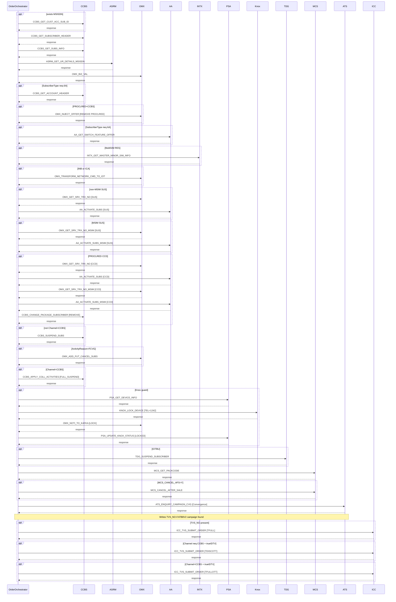

# FULL_SUSPEND

> Order Journey — Full Subscriber Suspension with CCBS, Knox, TDG, ATS, ICC integration

**Total steps:** 33 | **Unique FMs:** 27 | **Entry point:** CCBS_GET_CUST_ACC_SUB_ID

---

## §2 — Order Flow

| Step | Step ID | FM (ActivityID) | Parameter(s) | PreExecCheck | FM Doc |
|------|---------|-----------------|--------------|--------------|--------|
| 1 | CCBS_GET_CUST_ACC_SUB_ID | CCBS_GET_CUST_ACC_SUB_ID | — | `exists(//Subscriber/MSISDN[./text()])` | Existing |
| 2 | CCBS_GET_SUBSCRIBER_HEADER | CCBS_GET_SUBSCRIBER_HEADER | — | — | Existing |
| 3 | CCBS_GET_SUBS_INFO | CCBS_GET_SUBS_INFO | — | — | Existing |
| 4 | ASRM_GET_UR_DETAILS_MSISDN | ASRM_GET_UR_DETAILS_MSISDN | — | — | Existing |
| 5 | OMX_BIZ_VAL | OMX_BIZ_VAL | — | — | Existing |
| 6 | CCBS_GET_ACCOUNT_HEADER | CCBS_GET_ACCOUNT_HEADER | — | `SubscriberType!="6A"` | Existing |
| 7 | OMX_INJECT_OFFER | OMX_INJECT_OFFER | soc=25707129 \| serviceType=85 \| action=REMOVE \| offerName=PROCLRED \| level=SUB | `boolean(//Subscriber/SubscriberOffers[OfferName="PROCLRED" and ExtendedInfo[Name='FE_OR_CCBS' and Value='CCBS']])` | ⚠ Not Found |
| 8 | AA_GET_SWITCH_FEATURE_OFFER | AA_GET_SWITCH_FEATURE_OFFER | — | `SubscriberType!="6A"` | Existing |
| 9 | INTX_GET_MASTER_MINOR_SIM_INFO | INTX_GET_MASTER_MINOR_SIM_INFO | — | `count(//SubscriberOffers[FE_OR_CCBS=CCBS and TR_MULTISIM_IND=RES])>0` | Existing |
| 10 | OMX_TRANSFORM_NETWORK_CMD_TO_IOT | OMX_TRANSFORM_NETWORK_CMD_TO_IOT | — | `boolean(//Subscriber[SubscriberType="INB" or SubscriberType="ICA"])` | Existing |
| 11 | OMX_GET_SRV_TRX_NO | OMX_GET_SRV_TRX_NO | SUS \| TARGET | `not(MultiSIMInfo) and SubscriberType!="6A" and Status!="83"` | Existing |
| 12 | AA_ACTIVATE_SUBS | AA_ACTIVATE_SUBS | SUS | same as 11 | Existing |
| 13 | OMX_GET_SRV_TRX_NO_MSIM | OMX_GET_SRV_TRX_NO_MSIM | SUS | `MultiSIMInfo Master/Minor PREV_MSIM and SubscriberType!="6A" and Status!="83"` | Existing |
| 14 | AA_ACTIVATE_SUBS_MSIM | AA_ACTIVATE_SUBS_MSIM | SUS \| UPDATE | same as 13 | Existing |
| 15 | OMX_GET_SRV_TRX_NO_CCD | OMX_GET_SRV_TRX_NO | CCD | `not(MultiSIMInfo) and PROCLRED+INJECT_OFFER` | Existing |
| 16 | AA_ACTIVATE_SUBS_CCD | AA_ACTIVATE_SUBS | CCD | same as 15 | Existing |
| 17 | OMX_GET_SRV_TRX_NO_MSIM_CCD | OMX_GET_SRV_TRX_NO_MSIM | CCD | `MultiSIMInfo PREV_MSIM and PROCLRED+INJECT_OFFER` | Existing |
| 18 | AA_ACTIVATE_SUBS_MSIM_CCD | AA_ACTIVATE_SUBS_MSIM | CCD \| UPDATE | same as 17 | Existing |
| 19 | CCBS_CHANGE_PACKAGE_SUBSCRIBER_REMOVE | CCBS_CHANGE_PACKAGE_SUBSCRIBER | REMOVE \| ACTIVITY_REASON=SYSREQ | `PROCLRED+INJECT_OFFER` | Existing |
| 20 | CCBS_SUSPEND_SUBS | CCBS_SUSPEND_SUBS | — | `not(Channel="CCBS")` | [Generated](../FMlogic/Request_CCBS_SUSPEND_SUBS.html) |
| 21 | OMX_ADD_FUT_CANCEL_SUBS | OMX_ADD_FUT_CANCEL_SUBS | — | `ActivityReason="FCVG"` | [Generated](../FMlogic/Request_OMX_ADD_FUT_CANCEL_SUBS.html) |
| 22 | CCBS_APPLY_COLL_ACTIVITIES | CCBS_APPLY_COLL_ACTIVITIES | FULL_SUSPEND | `Channel="CCBS"` | [Generated](../FMlogic/Request_CCBS_APPLY_COLL_ACTIVITIES.html) |
| 23 | PSA_GET_DEVICE_INFO | PSA_GET_DEVICE_INFO | — | Knox reasons + IMEI_KNOX present | Existing |
| 24 | KNOX_LOCK_DEVICE | KNOX_LOCK_DEVICE | TEL=1242 | same Knox guard | [Generated](../FMlogic/Request_KNOX_LOCK_DEVICE.html) |
| 25 | OMX_NOTIFY_KNOX_EVENT_LOCK | OMX_NOTI_TO_KAFKA | knoxEvent=LOCK | same Knox guard | Existing |
| 26 | PSA_UPDATE_KNOX_STATUS | PSA_UPDATE_KNOX_STATUS | KNOX_STATUS=LOCKED | same Knox guard | Existing |
| 27 | TDG_SUSPEND_SUBSCRIBER | TDG_SUSPEND_SUBSCRIBER | — | `TR_SPECIAL_OFFER_IND=IOTBU` | [Generated](../FMlogic/Request_TDG_SUSPEND_SUBSCRIBER.html) |
| 28 | MCS_GET_PACKCODE | MCS_GET_PACKCODE | — | — | Existing |
| 29 | MCS_CANCEL_AFTER_SALE | MCS_CANCEL_AFTER_SALE | — | `MCS_CANCEL_AFS=Y` | Existing |
| 30 | ATS_ENQUIRY_CAMPAIGN_CVG | ATS_ENQUIRY_CAMPAIGN_CVG | FUNCTION=Convergence | — | [Generated](../FMlogic/Request_ATS_ENQUIRY_CAMPAIGN_CVG.html) |
| 31 | ICC_TVS_SUBMIT_ORDER_CVG | ICC_TVS_SUBMIT_ORDER | ORDER_TYPE=collection \| ACTION_CODE=S \| REASON=TFULL | `TVS_NO present` | [Generated](../FMlogic/Request_ICC_TVS_SUBMIT_ORDER.html) |
| 32 | ICC_TVS_SUBMIT_ORDER_BY_REQ | ICC_TVS_SUBMIT_ORDER | ORDER_TYPE=collection \| ACTION_CODE=S \| REASON=TDISCOTT | `Channel!="CCBS" and trueIDTV ParameterInfo non-empty` | [Generated](../FMlogic/Request_ICC_TVS_SUBMIT_ORDER.html) |
| 33 | ICC_TVS_SUBMIT_ORDER_BY_COLLECTION | ICC_TVS_SUBMIT_ORDER | ORDER_TYPE=collection \| ACTION_CODE=S \| REASON=TFULLOTT | `Channel="CCBS" and trueIDTV ParameterInfo non-empty` | [Generated](../FMlogic/Request_ICC_TVS_SUBMIT_ORDER.html) |

---

## §3 — PreExecCheck Details

### Step 7 — OMX_INJECT_OFFER (PROCLRED removal gate)

**FM:** `OMX_INJECT_OFFER` ⚠ Not Found

```xpath
boolean(//Subscriber/SubscriberOffers[OfferName="PROCLRED" and ExtendedInfo[Name='FE_OR_CCBS' and Value='CCBS']])
```

Fires only when subscriber has PROCLRED offer with FE_OR_CCBS=CCBS. Triggers CCD path (steps 15-19).

### Step 20 — CCBS_SUSPEND_SUBS

```xpath
not(Channel="CCBS")
```

Non-CCBS channel path. CCBS channel uses step 22 instead. Fan-in via IntraActivitySequencing.

### Step 21 — OMX_ADD_FUT_CANCEL_SUBS

```xpath
ActivityReason="FCVG"
```

Schedules automatic cancellation N days after full suspension (`GV/FullToCancelDay`). Single subscriber, always returns "true".

### Step 22 — CCBS_APPLY_COLL_ACTIVITIES

```xpath
Channel="CCBS"
```

`FULL_SUSPEND` serviceType: collectionAct=83, removes SOC 50412. Fan-in via IntraActivitySequencing.

### Steps 23-26 — Knox Block

```xpath
ActivityReason in (SUNOU, FSWC, AUTSU, PASUS, MANSU, COLL, AFRSU, CSUSR)
AND IMEI_KNOX ExtendedInfo non-empty
```

Four-step Knox locking sequence: PSA_GET_DEVICE_INFO → KNOX_LOCK_DEVICE (per-offer loop) → OMX_NOTI_TO_KAFKA → PSA_UPDATE_KNOX_STATUS.

### Step 27 — TDG_SUSPEND_SUBSCRIBER

```xpath
TR_SPECIAL_OFFER_IND=IOTBU
```

IoT Business Unit only. Loops per MaterialInfo.Material (not per subscriber).

### Steps 31-33 — ICC TVS variants

Three instances of same FM with different REASON:
- Step 31: `TVS_NO present` → REASON=TFULL (tvs_customer_id = TVS_NO from ATS step 30)
- Step 32: `Channel!="CCBS" and trueIDTV ParameterInfo non-empty` → REASON=TDISCOTT
- Step 33: `Channel="CCBS" and trueIDTV ParameterInfo non-empty` → REASON=TFULLOTT

---

## §4 — FM Documentation Index

| FM (ActivityID) | Steps | Status | Doc Link |
|-----------------|-------|--------|----------|
| CCBS_SUSPEND_SUBS | 20 | Generated | [Request_CCBS_SUSPEND_SUBS.html](../FMlogic/Request_CCBS_SUSPEND_SUBS.html) |
| OMX_ADD_FUT_CANCEL_SUBS | 21 | Generated | [Request_OMX_ADD_FUT_CANCEL_SUBS.html](../FMlogic/Request_OMX_ADD_FUT_CANCEL_SUBS.html) |
| CCBS_APPLY_COLL_ACTIVITIES | 22 | Generated | [Request_CCBS_APPLY_COLL_ACTIVITIES.html](../FMlogic/Request_CCBS_APPLY_COLL_ACTIVITIES.html) |
| KNOX_LOCK_DEVICE | 24 | Generated | [Request_KNOX_LOCK_DEVICE.html](../FMlogic/Request_KNOX_LOCK_DEVICE.html) |
| TDG_SUSPEND_SUBSCRIBER | 27 | Generated | [Request_TDG_SUSPEND_SUBSCRIBER.html](../FMlogic/Request_TDG_SUSPEND_SUBSCRIBER.html) |
| ATS_ENQUIRY_CAMPAIGN_CVG | 30 | Generated | [Request_ATS_ENQUIRY_CAMPAIGN_CVG.html](../FMlogic/Request_ATS_ENQUIRY_CAMPAIGN_CVG.html) |
| ICC_TVS_SUBMIT_ORDER | 31, 32, 33 | Generated | [Request_ICC_TVS_SUBMIT_ORDER.html](../FMlogic/Request_ICC_TVS_SUBMIT_ORDER.html) |
| OMX_INJECT_OFFER | 7 | ⚠ Not Found | — |

---

## §5 — Sequence Diagram



> Conditional steps wrapped in `opt` blocks. Full HTML with flowchart: `output/order/FULL_SUSPEND.html`

---

## Warnings

- **OMX_INJECT_OFFER** (step 7): Rule file not found — likely an internal OMX function. FM documentation cannot be generated.

---

*TRUE Corporation OMX · Order Journey Documentation · FULL_SUSPEND*
