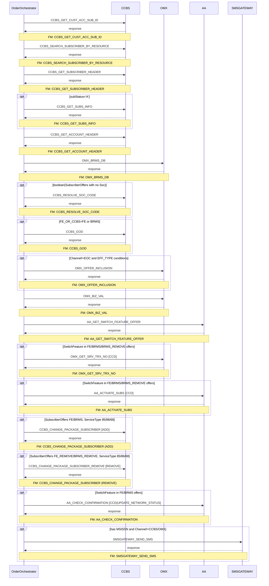

# GPRS_ENABLE

> Process Configuration for GPRS_ENABLE.

**Total steps:** 17 | **Unique FMs:** 16 | **Entry point:** CCBS_GET_CUST_ACC_SUB_ID | **Generated:** 2026-09-23

---

## Notable Patterns

- **Multi-call FM**: `CCBS_CHANGE_PACKAGE_SUBSCRIBER` called twice — step 14 (ADD) and step 15 (REMOVE), each with distinct PreExecCheck gating on `FE_OR_CCBS` value (`FE`/`BRMS` vs `FE_REMOVE`/`BRMS_REMOVE`)
- **FE_OR_CCBS routing**: Steps 7–16 are all gated on whether offers have `FE_OR_CCBS` flag set to `FE`, `BRMS`, `BRMS_REMOVE`, or `FE_REMOVE` — the BRMS-driven routing pattern
- **Subscriber active check**: Step 4 (`CCBS_GET_SUBS_INFO`) only runs if subscriber status = 'A'

---

## §2 — Order Flow

| Step | Step ID | FM (ActivityID) | Parameter(s) | PreExecCheck | Previous | Next |
|------|---------|-----------------|--------------|--------------|----------|------|
| 1 | CCBS_GET_CUST_ACC_SUB_ID | CCBS_GET_CUST_ACC_SUB_ID | — | — | START | CCBS_SEARCH_SUBSCRIBER_BY_RESOURCE |
| 2 | CCBS_SEARCH_SUBSCRIBER_BY_RESOURCE | CCBS_SEARCH_SUBSCRIBER_BY_RESOURCE | — | — | CCBS_GET_CUST_ACC_SUB_ID | CCBS_GET_SUBSCRIBER_HEADER |
| 3 | CCBS_GET_SUBSCRIBER_HEADER | CCBS_GET_SUBSCRIBER_HEADER | — | — | CCBS_SEARCH_SUBSCRIBER_BY_RESOURCE | CCBS_GET_SUBS_INFO |
| 4 | CCBS_GET_SUBS_INFO | CCBS_GET_SUBS_INFO | — | `//Subscriber/ExtendedInfo[Name/text()='subStatus']/Value/text()='A'` | CCBS_GET_SUBSCRIBER_HEADER | CCBS_GET_ACCOUNT_HEADER |
| 5 | CCBS_GET_ACCOUNT_HEADER | CCBS_GET_ACCOUNT_HEADER | — | — | CCBS_GET_SUBS_INFO | OMX_BRMS_DB |
| 6 | OMX_BRMS_DB | OMX_BRMS_DB | — | — | CCBS_GET_ACCOUNT_HEADER | CCBS_RESOLVE_SOC_CODE |
| 7 | CCBS_RESOLVE_SOC_CODE | CCBS_RESOLVE_SOC_CODE | — | `boolean(//SubscriberOffers[not(Soc/text())])` | OMX_BRMS_DB | CCBS_GOD |
| 8 | CCBS_GOD | CCBS_GOD | — | `boolean(//SubscriberOffers[ExtendedInfo[Name='FE_OR_CCBS' and (Value='FE' or Value='BRMS')]])` | CCBS_RESOLVE_SOC_CODE | OMX_OFFER_INCLUSION |
| 9 | OMX_OFFER_INCLUSION | OMX_OFFER_INCLUSION | — | `Channel!='EOC' and (no EFF_TYPE, or non-FUT EFF_TYPE, or LOGICALDATE_PROV)` | CCBS_GOD | OMX_BIZ_VAL |
| 10 | OMX_BIZ_VAL | OMX_BIZ_VAL | — | — | OMX_OFFER_INCLUSION | AA_GET_SWITCH_FEATURE_OFFER |
| 11 | AA_GET_SWITCH_FEATURE_OFFER | AA_GET_SWITCH_FEATURE_OFFER | — | — | OMX_BIZ_VAL | OMX_GET_SRV_TRX_NO |
| 12 | OMX_GET_SRV_TRX_NO | OMX_GET_SRV_TRX_NO | CCD | `boolean(SwitchFeature in FE/BRMS/BRMS_REMOVE offers)` | AA_GET_SWITCH_FEATURE_OFFER | AA_ACTIVATE_SUBS |
| 13 | AA_ACTIVATE_SUBS | AA_ACTIVATE_SUBS | CCD | `boolean(SwitchFeature in FE/BRMS/BRMS_REMOVE offers)` | OMX_GET_SRV_TRX_NO | CCBS_CHANGE_PACKAGE_SUBSCRIBER |
| 14 | CCBS_CHANGE_PACKAGE_SUBSCRIBER | CCBS_CHANGE_PACKAGE_SUBSCRIBER | ADD | `boolean(SubscriberOffers[FE/BRMS, ServiceType 85/86/68])` | AA_ACTIVATE_SUBS | CCBS_CHANGE_PACKAGE_SUBSCRIBER_REMOVE |
| 15 | CCBS_CHANGE_PACKAGE_SUBSCRIBER_REMOVE | CCBS_CHANGE_PACKAGE_SUBSCRIBER | REMOVE | `boolean(SubscriberOffers[FE_REMOVE/BRMS_REMOVE, ServiceType 85/86/68])` | CCBS_CHANGE_PACKAGE_SUBSCRIBER | AA_CHECK_CONFIRMATION |
| 16 | AA_CHECK_CONFIRMATION | AA_CHECK_CONFIRMATION | CCD \| UPDATE_NETWORK_STATUS | `boolean(SwitchFeature in FE/BRMS offers)` | CCBS_CHANGE_PACKAGE_SUBSCRIBER_REMOVE | SMSGATEWAY_SEND_SMS |
| 17 | SMSGATEWAY_SEND_SMS | SMSGATEWAY_SEND_SMS | — | `has MSISDN AND Channel!='CCBS' AND Channel!='OMX'` | AA_CHECK_CONFIRMATION | END |

---

## §3 — PreExecCheck Details

### Step 4 — CCBS_GET_SUBS_INFO
**FM:** `CCBS_GET_SUBS_INFO`
```xpath
//Subscriber/ExtendedInfo[Name/text()='subStatus']/Value/text()='A'
```

### Step 7 — CCBS_RESOLVE_SOC_CODE
**FM:** `CCBS_RESOLVE_SOC_CODE`
```xpath
boolean(//SubscriberOffers[not(Soc/text())])
```

### Step 8 — CCBS_GOD
**FM:** `CCBS_GOD`
```xpath
boolean(//SubscriberOffers[ExtendedInfo[Name='FE_OR_CCBS' and (Value='FE' or Value='BRMS')]])
```

### Step 9 — OMX_OFFER_INCLUSION
**FM:** `OMX_OFFER_INCLUSION`
```xpath
/ns0:OrderRequest/OrderData/Channel/text()!="EOC"
and ((not(boolean(//SubscriberOffers[ExtendedInfo[Name='EFF_TYPE']])) or boolean(//SubscriberOffers[ExtendedInfo[Name='EFF_TYPE' and Value!='FUT']])) or boolean(//SubscriberOffers[ExtendedInfo[Name='LOGICALDATE_PROV']]))
```

### Step 12 — OMX_GET_SRV_TRX_NO
**FM:** `OMX_GET_SRV_TRX_NO`
```xpath
boolean(//SubscriberOffers[ExtendedInfo[Name='FE_OR_CCBS' and (Value='FE' or Value='BRMS' or Value='BRMS_REMOVE')]]/SwitchFeature[1])
or boolean(//SubscriberOffers[ExtendedInfo[Name='FE_OR_CCBS' and (Value='FE' or Value='BRMS' or Value='BRMS_REMOVE')]]/RelatedOffersArray/SwitchFeature[1])
```

### Step 13 — AA_ACTIVATE_SUBS
**FM:** `AA_ACTIVATE_SUBS`
```xpath
boolean(//SubscriberOffers[ExtendedInfo[Name='FE_OR_CCBS' and (Value='FE' or Value='BRMS' or Value='BRMS_REMOVE')]]/SwitchFeature[1])
or boolean(//SubscriberOffers[ExtendedInfo[Name='FE_OR_CCBS' and (Value='FE' or Value='BRMS' or Value='BRMS_REMOVE')]]/RelatedOffersArray/SwitchFeature[1])
```

### Step 14 — CCBS_CHANGE_PACKAGE_SUBSCRIBER (ADD)
**FM:** `CCBS_CHANGE_PACKAGE_SUBSCRIBER`
```xpath
boolean(//Subscriber/SubscriberOffers[1] and //SubscriberOffers[ExtendedInfo[Name='FE_OR_CCBS' and (Value='FE' or Value='BRMS')] and (ServiceType='85' or ServiceType='86' or ServiceType='68')])
```

### Step 15 — CCBS_CHANGE_PACKAGE_SUBSCRIBER_REMOVE (REMOVE)
**FM:** `CCBS_CHANGE_PACKAGE_SUBSCRIBER`
```xpath
boolean(//Subscriber/SubscriberOffers[1] and //SubscriberOffers[ExtendedInfo[Name='FE_OR_CCBS' and (Value='FE_REMOVE' or Value='BRMS_REMOVE')] and (ServiceType='85' or ServiceType='86' or ServiceType='68')])
```

### Step 16 — AA_CHECK_CONFIRMATION
**FM:** `AA_CHECK_CONFIRMATION`
```xpath
boolean(//SubscriberOffers[ExtendedInfo[Name='FE_OR_CCBS' and (Value='FE' or Value='BRMS')]]/SwitchFeature[1])
or boolean(//SubscriberOffers[ExtendedInfo[Name='FE_OR_CCBS' and (Value='FE' or Value='BRMS')]]/RelatedOffersArray/SwitchFeature[1])
```

### Step 17 — SMSGATEWAY_SEND_SMS
**FM:** `SMSGATEWAY_SEND_SMS`
```xpath
boolean(//Subscriber[MSISDN/text()][1] and /ns0:OrderRequest/OrderData/Channel/text()!="CCBS" and /ns0:OrderRequest/OrderData/Channel/text()!="OMX")
```

---

## §4 — FM Documentation Index

| FM (ActivityID) | Used in Steps | Doc |
|-----------------|---------------|-----|
| CCBS_GET_CUST_ACC_SUB_ID | 1 | [Request_CCBS_GET_CUST_ACC_SUB_ID.html](../FMlogic/Request_CCBS_GET_CUST_ACC_SUB_ID.html) |
| CCBS_SEARCH_SUBSCRIBER_BY_RESOURCE | 2 | [Request_CCBS_SEARCH_SUBSCRIBER_BY_RESOURCE.html](../FMlogic/Request_CCBS_SEARCH_SUBSCRIBER_BY_RESOURCE.html) |
| CCBS_GET_SUBSCRIBER_HEADER | 3 | [Request_CCBS_GET_SUBSCRIBER_HEADER.html](../FMlogic/Request_CCBS_GET_SUBSCRIBER_HEADER.html) |
| CCBS_GET_SUBS_INFO | 4 | [Request_CCBS_GET_SUBS_INFO.html](../FMlogic/Request_CCBS_GET_SUBS_INFO.html) |
| CCBS_GET_ACCOUNT_HEADER | 5 | [Request_CCBS_GET_ACCOUNT_HEADER.html](../FMlogic/Request_CCBS_GET_ACCOUNT_HEADER.html) |
| OMX_BRMS_DB | 6 | [Request_OMX_BRMS_DB.html](../FMlogic/Request_OMX_BRMS_DB.html) |
| CCBS_RESOLVE_SOC_CODE | 7 | [Request_CCBS_RESOLVE_SOC_CODE.html](../FMlogic/Request_CCBS_RESOLVE_SOC_CODE.html) |
| CCBS_GOD | 8 | [Request_CCBS_GOD.html](../FMlogic/Request_CCBS_GOD.html) |
| OMX_OFFER_INCLUSION | 9 | [Request_OMX_OFFER_INCLUSION.html](../FMlogic/Request_OMX_OFFER_INCLUSION.html) |
| OMX_BIZ_VAL | 10 | [Request_OMX_BIZ_VAL.html](../FMlogic/Request_OMX_BIZ_VAL.html) |
| AA_GET_SWITCH_FEATURE_OFFER | 11 | [Request_AA_GET_SWITCH_FEATURE_OFFER.html](../FMlogic/Request_AA_GET_SWITCH_FEATURE_OFFER.html) |
| OMX_GET_SRV_TRX_NO | 12 | [Request_OMX_GET_SRV_TRX_NO.html](../FMlogic/Request_OMX_GET_SRV_TRX_NO.html) |
| AA_ACTIVATE_SUBS | 13 | [Request_AA_ACTIVATE_SUBS.html](../FMlogic/Request_AA_ACTIVATE_SUBS.html) |
| CCBS_CHANGE_PACKAGE_SUBSCRIBER | 14, 15 | [Request_CCBS_CHANGE_PACKAGE_SUBSCRIBER.html](../FMlogic/Request_CCBS_CHANGE_PACKAGE_SUBSCRIBER.html) |
| AA_CHECK_CONFIRMATION | 16 | [Request_AA_CHECK_CONFIRMATION.html](../FMlogic/Request_AA_CHECK_CONFIRMATION.html) |
| SMSGATEWAY_SEND_SMS | 17 | [Request_SMSGATEWAY_SEND_SMS.html](../FMlogic/Request_SMSGATEWAY_SEND_SMS.html) |

---

## §5 — Sequence Diagram



> Steps 7–17 are all conditional. Only steps 1–3, 5–6, 10–11 are unconditional.

---

*TRUE Corporation OMX · Order Journey Documentation*
