# MOVE_SUBSCRIBER_NO_PROVISIONING

> Change Owner to Indy — moves a subscriber from a SOURCE account/OU to a new or existing TARGET account/OU without network provisioning changes.

**Total steps:** 57 | **Unique FMs:** 47 | **Entry point:** OMX_CREATE_SOURCE_STRUCTURE | **Generated:** 2026-09-23

---

## §2 — Order Flow

| Step | Step ID | FM (ActivityID) | Parameter(s) | PreExecCheck | Previous | Next |
|------|---------|-----------------|--------------|-------------|---------|------|
| 1 | OMX_CREATE_SOURCE_STRUCTURE | OMX_CREATE_SOURCE_STRUCTURE *(internal)* | — | — | START | CCBS_GET_CUST_ACC_SUB_ID_SOURCE |
| 2 | CCBS_GET_CUST_ACC_SUB_ID_SOURCE | CCBS_GET_CUST_ACC_SUB_ID | SOURCE | Yes | 1 | 3 |
| 3 | CCBS_GET_CUSTOMER_HEADER_SOURCE | CCBS_GET_CUSTOMER_HEADER | SOURCE | Yes | 2 | 4 |
| 4 | CCBS_GET_ACCOUNT_HEADER_SOURCE | CCBS_GET_ACCOUNT_HEADER | SOURCE | Yes | 3 | 5 |
| 5 | CCBS_GET_SUBSCRIBER_HEADER_SOURCE | CCBS_GET_SUBSCRIBER_HEADER | SOURCE | Yes | 4 | 6 |
| 6 | CCBS_GET_SUBS_INFO_SOURCE | CCBS_GET_SUBS_INFO | SOURCE | Yes | 5 | 7 |
| 7 | CCBS_GET_CUSTOMER_HEADER_TARGET | CCBS_GET_CUSTOMER_HEADER | — | Yes | 6 | 8 |
| 8 | CCBS_GET_ACCOUNT_HEADER_TARGET | CCBS_GET_ACCOUNT_HEADER | — | Yes | 7 | 9 |
| 9 | CCBS_GET_AGREEMENT_INFO_TARGET | CCBS_GET_AGREEMENT_INFO | — | Yes | 8 | 10 |
| 10 | CCBS_RESOLVE_SOC_CODE_GOD | CCBS_RESOLVE_SOC_CODE | — | — | 9 | 11 |
| 11 | CCBS_GOD | CCBS_GOD | — | Yes | 10 | 12 |
| 12 | OMX_OFFER_INCLUSION | OMX_OFFER_INCLUSION | — | — | 11 | 13 |
| 13 | GET_SPECIAL_OFFER_INDICATOR_SOURCE | GET_SPECIAL_OFFER_INDICATOR | SOURCE | Yes | 12 | 14 |
| 14 | CCBS_OFFER_POOLING_POOLED | CCBS_OFFER_POOLING_POOLED | — | Yes | 13 | 15 |
| 15 | INTX_GET_PRODUCT_PREFERENCE_LIST | INTX_GET_PRODUCT_PREFERENCE_LIST | SUBSTATUS=ACTIVEORSUSPEND \| BUSINESSLINE=MOBILE \| COMPANYCODE=ALL \| CUSTOMERSEGMENT=INDIVIDUAL | Yes | 14 | 16 |
| 16 | CVSS_GET_MAX_ALLOW_ONLY_SUB | CVSS_GET_MAX_ALLOW_ONLY_SUB | — | Yes | 15 | 17 |
| 17 | CVSS_GET_VALIDATE_APPROVE_CODE | CVSS_GET_VALIDATE_APPROVE_CODE | — | Yes | 16 | 18 |
| 18 | OMX_BIZ_VAL | OMX_BIZ_VAL | — | — | 17 | 19 |
| 19 | OMX_CAL_ORDER | OMX_CAL_ORDER *(internal)* | — | — | 18 | 20 |
| 20 | OMX_ADD_FUT_ORDER | OMX_ADD_FUT_ORDER | FINALLY=Y | Yes | 19 | 21 |
| 21 | INTX_GET_SUBSCRIBER_INFO_SOURCE | INTX_GET_SUBSCRIBER_INFO | SOURCE | Yes | 20 | 22 |
| 22 | OMX_POPULATE_TARGET_STRUCTURE_SOURCE | OMX_POPULATE_TARGET_STRUCTURE *(internal)* | SOURCE | — | 21 | 23 |
| 23 | CCBS_GET_AGREEMENT_HEADER_SOURCE | CCBS_GET_AGREEMENT_HEADER | — | Yes | 22 | 24 |
| 24 | GET_SPECIAL_OFFER_INDICATOR_TARGET | GET_SPECIAL_OFFER_INDICATOR | TARGET | Yes | 23 | 25 |
| 25 | SBM_FUP_CHANGE_MEMBER_REMOVE | SBM_FUP_CHANGE_MEMBER | REMOVE | Yes | 24 | 26 |
| 26 | CVSS_GET_EXISTING_PRODUCT_SOURCE | CVSS_GET_EXISTING_PRODUCT | SOURCE | Yes | 25 | 27 |
| 27 | CVSS_CANCEL_SUBS_SOURCE | CVSS_CANCEL_SUBS | SOURCE | Yes | 26 | 28 |
| 28 | CCBS_CREATE_CUST_WITH_CYCLE | CCBS_CREATE_CUST_WITH_CYCLE | — | Yes | 27 | 29 |
| 29 | CCBS_CREATE_PARENT_OU | CCBS_CREATE_PARENT_OU | — | Yes | 28 | 30 |
| 30 | CCBS_CREATE_AGREE | CCBS_CREATE_AGREE | — | Yes | 29 | 31 |
| 31 | CCBS_CREATE_ACCT | CCBS_CREATE_ACCT | — | Yes | 30 | 32 |
| 32 | CCBS_REMOVE_OFFER_SUBSCRIBER_POST | CCBS_REMOVE_OFFER_SUBSCRIBER_POST | — | Yes | 31 | 33 |
| 33 | CCBS_MOVE_SUB | CCBS_MOVE_SUB | — | Yes | 32 | 34 |
| 34 | OMX_UPDATE_SUBID_FUTORDER | OMX_UPDATE_SUBID_FUTORDER | — | — | 33 | 35 |
| 35 | CCBS_GET_CUSTOMER_HEADER | CCBS_GET_CUSTOMER_HEADER | — | Yes | 34 | 36 |
| 36 | OMX_BRMS | OMX_BRMS *(internal)* | — | — | 35 | 37 |
| 37 | CCBS_RESOLVE_SOC_CODE | CCBS_RESOLVE_SOC_CODE | — | — | 36 | 38 |
| 38 | CCBS_CHANGE_PACKAGE_SUBSCRIBER | CCBS_CHANGE_PACKAGE_SUBSCRIBER | ADD | Yes | 37 | 39 |
| 39 | CCBS_GET_SUBS_INFO | CCBS_GET_SUBS_INFO | TARGET | Yes | 38 | 40 |
| 40 | SBM_FUP_CREATE_GROUP | SBM_FUP_CREATE_GROUP | — | Yes | 39 | 41 |
| 41 | SBM_FUP_CHANGE_TOPPING | SBM_FUP_CHANGE_TOPPING | ADD | Yes | 40 | 42 |
| 42 | SBM_FUP_CHANGE_VARIABLE | SBM_FUP_CHANGE_VARIABLE | ADD | Yes | 41 | 43 |
| 43 | SBM_FUP_CHANGE_MEMBER | SBM_FUP_CHANGE_MEMBER | ADD | Yes | 42 | 44 |
| 44 | STATUS_UPDATE_CREATING_PROFILE | STATUS_UPDATE_CREATING_PROFILE | — | — | 43 | 45 |
| 45 | CVSS_GET_AUTO_APPROVE_CODE | CVSS_GET_AUTO_APPROVE_CODE | requestType=MV | Yes | 44 | 46 |
| 46 | CVSS_CREDIT_CHECK_NEW | CVSS_CREDIT_CHECK | — | Yes | 45 | 47 |
| 47 | ODS_GET_CREDIT_CLASS_CREDIT_LIMIT | ODS_GET_CREDIT_CLASS_CREDIT_LIMIT | — | Yes | 46 | 48 |
| 48 | CCBS_UPD_CREDIT_CLASS_NEW | CCBS_UPD_CREDIT_CLASS | — | Yes | 47 | 49 |
| 49 | CCBS_UPDATE_NEW_ACCT_CREDIT_LIMIT_FOR_ODS | CCBS_UPDATE_NEW_ACCT_CREDIT_LIMIT | — | Yes | 48 | 50 |
| 50 | CVSS_GET_EXISTING_PRODUCT | CVSS_GET_EXISTING_PRODUCT | — | Yes | 49 | 51 |
| 51 | CVSS_CREDIT_CHECK_EXIST | CVSS_CREDIT_CHECK | — | Yes | 50 | 52 |
| 52 | CCBS_UPD_CREDIT_CLASS_EXIST | CCBS_UPD_CREDIT_CLASS | — | Yes | 51 | 53 |
| 53 | CVSS_UPDATE_SUBSCRIBER_COUNT | CVSS_UPDATE_SUBSCRIBER_COUNT | — | Yes | 52 | 54 |
| 54 | OMX_INJECT_OFFER_ADD_ITEMIZE0 | OMX_INJECT_OFFER | soc=13102425 \| serviceType=85 \| action=ADD \| offerName=ITMBLS02 \| level=OU \| checkDup=1 | Yes | 53 | 55 |
| 55 | CCBS_UPDATE_AGREEMENT_ON_UNIT | CCBS_UPDATE_AGREEMENT_ON_UNIT | — | Yes | 54 | 56 |
| 56 | MCS_GET_PACKCODE | MCS_GET_PACKCODE | — | — | 55 | 57 |
| 57 | MCS_CANCEL_AFTER_SALE | MCS_CANCEL_AFTER_SALE | MAP_OLD_SUB=SOURCE_SUB | Yes | 56 | END |

> *(internal)* = OMX internal function with no external rule file (no FM doc generated).

---

## §3 — PreExecCheck Details

43 of 57 steps have a `<ns0:PreExecCheck>` guard condition. Full XPath expressions are in the source ProcessConfig XML at `SupportingFiles/Configs/ProcessConfig/MOVE_SUBSCRIBER_NO_PROVISIONING.xml`.

Key PreExecCheck patterns:

### SOURCE/TARGET Routing (Steps 2–6, 21, 35)
```text
[SOURCE_OR_TARGET discriminator]
Steps 2–6: Execute only for SOURCE-tagged subscribers/OUs
Step 21: INTX_GET_SUBSCRIBER_INFO — SOURCE_OR_TARGET=SOURCE filter
```

### TARGET Account Existence (Steps 7–9, 23)
```text
Execute only if TARGET account/OU already exists in working memory
```

### Offer Pooling (Step 14)
```text
CCBS_OFFER_POOLING_POOLED — GoldenDB + poolable SOC availability check
Note: GoldenDB=Y routes to CES_OFFER_POOLING_POOLED instead
```

### Future Order (Step 20)
```text
OMX_ADD_FUT_ORDER [FINALLY=Y] — future order eligibility + order type check
POU subscribers only (not ChildOU)
```

### TARGET Account Creation (Steps 28–31)
```text
CCBS_CREATE_CUST_WITH_CYCLE / CCBS_CREATE_PARENT_OU / CCBS_CREATE_AGREE / CCBS_CREATE_ACCT
Execute only when creating a NEW TARGET account (not existing)
```

### Subscriber Move (Steps 32–33)
```text
CCBS_REMOVE_OFFER_SUBSCRIBER_POST — SOURCE subscriber has offers to remove
CCBS_MOVE_SUB — move eligibility (4 OrderType variants: 36, 11001, 11002+countNewPou, default)
```

### Credit Profile (Steps 45–53)
```text
Steps 46–49: New account credit profile path
Steps 50–52: Existing account credit profile path
Step 53: Subscriber count update
```

### SBM FUP (Steps 25, 40–43)
```text
SBM_FUP_CHANGE_MEMBER_REMOVE [REMOVE]: Remove from source FUP group
SBM_FUP_CREATE_GROUP / CHANGE_TOPPING / CHANGE_VARIABLE / CHANGE_MEMBER [ADD]: TARGET FUP setup
```

---

## §4 — FM Documentation Index

| FM (ActivityID) | Steps | Status | Doc |
|-----------------|-------|--------|-----|
| CCBS_OFFER_POOLING_POOLED | 14 | [New Doc] | [Request_CCBS_OFFER_POOLING_POOLED.html](../FMlogic/Request_CCBS_OFFER_POOLING_POOLED.html) |
| OMX_ADD_FUT_ORDER | 20 | [New Doc] | [Request_OMX_ADD_FUT_ORDER.html](../FMlogic/Request_OMX_ADD_FUT_ORDER.html) |
| INTX_GET_SUBSCRIBER_INFO | 21 | [New Doc] | [Request_INTX_GET_SUBSCRIBER_INFO.html](../FMlogic/Request_INTX_GET_SUBSCRIBER_INFO.html) |
| CVSS_CANCEL_SUBS | 27 | [New Doc] | [Request_CVSS_CANCEL_SUBS.html](../FMlogic/Request_CVSS_CANCEL_SUBS.html) |
| CCBS_REMOVE_OFFER_SUBSCRIBER_POST | 32 | [New Doc] | [Request_CCBS_REMOVE_OFFER_SUBSCRIBER_POST.html](../FMlogic/Request_CCBS_REMOVE_OFFER_SUBSCRIBER_POST.html) |
| CCBS_MOVE_SUB | 33 | [New Doc] | [Request_CCBS_MOVE_SUB.html](../FMlogic/Request_CCBS_MOVE_SUB.html) |
| OMX_UPDATE_SUBID_FUTORDER | 34 | [New Doc] | [Request_OMX_UPDATE_SUBID_FUTORDER.html](../FMlogic/Request_OMX_UPDATE_SUBID_FUTORDER.html) |
| CCBS_GET_CUST_ACC_SUB_ID | 2 | [Generated] | [Request_CCBS_GET_CUST_ACC_SUB_ID.html](../FMlogic/Request_CCBS_GET_CUST_ACC_SUB_ID.html) |
| CCBS_GET_CUSTOMER_HEADER | 3, 7, 35 | [Generated] | [Request_CCBS_GET_CUSTOMER_HEADER.html](../FMlogic/Request_CCBS_GET_CUSTOMER_HEADER.html) |
| CCBS_GET_ACCOUNT_HEADER | 4, 8 | [Generated] | [Request_CCBS_GET_ACCOUNT_HEADER.html](../FMlogic/Request_CCBS_GET_ACCOUNT_HEADER.html) |
| CCBS_GET_SUBSCRIBER_HEADER | 5 | [Generated] | [Request_CCBS_GET_SUBSCRIBER_HEADER.html](../FMlogic/Request_CCBS_GET_SUBSCRIBER_HEADER.html) |
| CCBS_GET_SUBS_INFO | 6, 39 | [Generated] | [Request_CCBS_GET_SUBS_INFO.html](../FMlogic/Request_CCBS_GET_SUBS_INFO.html) |
| CCBS_GET_AGREEMENT_INFO | 9 | [Generated] | [Request_CCBS_GET_AGREEMENT_INFO.html](../FMlogic/Request_CCBS_GET_AGREEMENT_INFO.html) |
| CCBS_RESOLVE_SOC_CODE | 10, 37 | [Generated] | [Request_CCBS_RESOLVE_SOC_CODE.html](../FMlogic/Request_CCBS_RESOLVE_SOC_CODE.html) |
| CCBS_GOD | 11 | [Generated] | [Request_CCBS_GOD.html](../FMlogic/Request_CCBS_GOD.html) |
| OMX_OFFER_INCLUSION | 12 | [Generated] | [Request_OMX_OFFER_INCLUSION.html](../FMlogic/Request_OMX_OFFER_INCLUSION.html) |
| GET_SPECIAL_OFFER_INDICATOR | 13, 24 | [Generated] | [Request_GET_SPECIAL_OFFER_INDICATOR.html](../FMlogic/Request_GET_SPECIAL_OFFER_INDICATOR.html) |
| INTX_GET_PRODUCT_PREFERENCE_LIST | 15 | [Generated] | [Request_INTX_GET_PRODUCT_PREFERENCE_LIST.html](../FMlogic/Request_INTX_GET_PRODUCT_PREFERENCE_LIST.html) |
| CVSS_GET_MAX_ALLOW_ONLY_SUB | 16 | [Generated] | [Request_CVSS_GET_MAX_ALLOW_ONLY_SUB.html](../FMlogic/Request_CVSS_GET_MAX_ALLOW_ONLY_SUB.html) |
| CVSS_GET_VALIDATE_APPROVE_CODE | 17 | [Generated] | [Request_CVSS_GET_VALIDATE_APPROVE_CODE.html](../FMlogic/Request_CVSS_GET_VALIDATE_APPROVE_CODE.html) |
| OMX_BIZ_VAL | 18 | [Generated] | [Request_OMX_BIZ_VAL.html](../FMlogic/Request_OMX_BIZ_VAL.html) |
| CCBS_GET_AGREEMENT_HEADER | 23 | [Generated] | [Request_CCBS_GET_AGREEMENT_HEADER.html](../FMlogic/Request_CCBS_GET_AGREEMENT_HEADER.html) |
| SBM_FUP_CHANGE_MEMBER | 25, 43 | [Generated] | [Request_SBM_FUP_CHANGE_MEMBER.html](../FMlogic/Request_SBM_FUP_CHANGE_MEMBER.html) |
| CVSS_GET_EXISTING_PRODUCT | 26, 50 | [Generated] | [Request_CVSS_GET_EXISTING_PRODUCT.html](../FMlogic/Request_CVSS_GET_EXISTING_PRODUCT.html) |
| CCBS_CREATE_CUST_WITH_CYCLE | 28 | [Generated] | [Request_CCBS_CREATE_CUST_WITH_CYCLE.html](../FMlogic/Request_CCBS_CREATE_CUST_WITH_CYCLE.html) |
| CCBS_CREATE_PARENT_OU | 29 | [Generated] | [Request_CCBS_CREATE_PARENT_OU.html](../FMlogic/Request_CCBS_CREATE_PARENT_OU.html) |
| CCBS_CREATE_AGREE | 30 | [Generated] | [Request_CCBS_CREATE_AGREE.html](../FMlogic/Request_CCBS_CREATE_AGREE.html) |
| CCBS_CREATE_ACCT | 31 | [Generated] | [Request_CCBS_CREATE_ACCT.html](../FMlogic/Request_CCBS_CREATE_ACCT.html) |
| CCBS_CHANGE_PACKAGE_SUBSCRIBER | 38 | [Generated] | [Request_CCBS_CHANGE_PACKAGE_SUBSCRIBER.html](../FMlogic/Request_CCBS_CHANGE_PACKAGE_SUBSCRIBER.html) |
| SBM_FUP_CREATE_GROUP | 40 | [Generated] | [Request_SBM_FUP_CREATE_GROUP.html](../FMlogic/Request_SBM_FUP_CREATE_GROUP.html) |
| SBM_FUP_CHANGE_TOPPING | 41 | [Generated] | [Request_SBM_FUP_CHANGE_TOPPING.html](../FMlogic/Request_SBM_FUP_CHANGE_TOPPING.html) |
| SBM_FUP_CHANGE_VARIABLE | 42 | [Generated] | [Request_SBM_FUP_CHANGE_VARIABLE.html](../FMlogic/Request_SBM_FUP_CHANGE_VARIABLE.html) |
| STATUS_UPDATE_CREATING_PROFILE | 44 | [Generated] | [Request_STATUS_UPDATE_CREATING_PROFILE.html](../FMlogic/Request_STATUS_UPDATE_CREATING_PROFILE.html) |
| CVSS_GET_AUTO_APPROVE_CODE | 45 | [Generated] | [Request_CVSS_GET_AUTO_APPROVE_CODE.html](../FMlogic/Request_CVSS_GET_AUTO_APPROVE_CODE.html) |
| CVSS_CREDIT_CHECK | 46, 51 | [Generated] | [Request_CVSS_CREDIT_CHECK.html](../FMlogic/Request_CVSS_CREDIT_CHECK.html) |
| ODS_GET_CREDIT_CLASS_CREDIT_LIMIT | 47 | [Generated] | [Request_ODS_GET_CREDIT_CLASS_CREDIT_LIMIT.html](../FMlogic/Request_ODS_GET_CREDIT_CLASS_CREDIT_LIMIT.html) |
| CCBS_UPD_CREDIT_CLASS | 48, 52 | [Generated] | [Request_CCBS_UPD_CREDIT_CLASS.html](../FMlogic/Request_CCBS_UPD_CREDIT_CLASS.html) |
| CCBS_UPDATE_NEW_ACCT_CREDIT_LIMIT | 49 | [Generated] | [Request_CCBS_UPDATE_NEW_ACCT_CREDIT_LIMIT.html](../FMlogic/Request_CCBS_UPDATE_NEW_ACCT_CREDIT_LIMIT.html) |
| CVSS_UPDATE_SUBSCRIBER_COUNT | 53 | [Generated] | [Request_CVSS_UPDATE_SUBSCRIBER_COUNT.html](../FMlogic/Request_CVSS_UPDATE_SUBSCRIBER_COUNT.html) |
| OMX_INJECT_OFFER | 54 | [Generated] | [Request_OMX_INJECT_OFFER.html](../FMlogic/Request_OMX_INJECT_OFFER.html) |
| CCBS_UPDATE_AGREEMENT_ON_UNIT | 55 | [Generated] | [Request_CCBS_UPDATE_AGREEMENT_ON_UNIT.html](../FMlogic/Request_CCBS_UPDATE_AGREEMENT_ON_UNIT.html) |
| MCS_GET_PACKCODE | 56 | [Generated] | [Request_MCS_GET_PACKCODE.html](../FMlogic/Request_MCS_GET_PACKCODE.html) |
| MCS_CANCEL_AFTER_SALE | 57 | [Generated] | [Request_MCS_CANCEL_AFTER_SALE.html](../FMlogic/Request_MCS_CANCEL_AFTER_SALE.html) |
| OMX_CREATE_SOURCE_STRUCTURE | 1 | [Internal] | — |
| OMX_CAL_ORDER | 19 | [Internal] | — |
| OMX_POPULATE_TARGET_STRUCTURE | 22 | [Internal] | — |
| OMX_BRMS | 36 | [Internal] | — |

---

## §5 — Sequence Diagram

```mermaid
sequenceDiagram
    participant O as OrderOrchestrator
    participant CCBS as CCBS
    participant OMX as OMX_Internal
    participant INTX as INTX
    participant CVSS as CVSS
    participant SBM as SBM
    participant ODS as ODS
    participant MCS as MCS

    O->>OMX: OMX_CREATE_SOURCE_STRUCTURE
    OMX-->>O: response
    opt SOURCE exists
        O->>CCBS: CCBS_GET_CUST_ACC_SUB_ID_SOURCE [SOURCE]
        CCBS-->>O: response
        O->>CCBS: CCBS_GET_CUSTOMER_HEADER_SOURCE [SOURCE]
        CCBS-->>O: response
        O->>CCBS: CCBS_GET_ACCOUNT_HEADER_SOURCE [SOURCE]
        CCBS-->>O: response
        O->>CCBS: CCBS_GET_SUBSCRIBER_HEADER_SOURCE [SOURCE]
        CCBS-->>O: response
        O->>CCBS: CCBS_GET_SUBS_INFO_SOURCE [SOURCE]
        CCBS-->>O: response
    end
    opt TARGET exists
        O->>CCBS: CCBS_GET_CUSTOMER_HEADER_TARGET
        CCBS-->>O: response
        O->>CCBS: CCBS_GET_ACCOUNT_HEADER_TARGET
        CCBS-->>O: response
        O->>CCBS: CCBS_GET_AGREEMENT_INFO_TARGET
        CCBS-->>O: response
    end
    O->>CCBS: CCBS_RESOLVE_SOC_CODE_GOD
    CCBS-->>O: response
    opt CCBS_GOD condition
        O->>CCBS: CCBS_GOD
        CCBS-->>O: response
    end
    O->>OMX: OMX_OFFER_INCLUSION
    OMX-->>O: response
    opt SOURCE offer indicators
        O->>CCBS: GET_SPECIAL_OFFER_INDICATOR_SOURCE [SOURCE]
        CCBS-->>O: response
    end
    opt poolable SOCs exist (GoldenDB=Y routes to CES)
        O->>CCBS: CCBS_OFFER_POOLING_POOLED
        CCBS-->>O: pooling response
    end
    opt INTX product pref
        O->>INTX: INTX_GET_PRODUCT_PREFERENCE_LIST
        INTX-->>O: response
    end
    opt CVSS validation
        O->>CVSS: CVSS_GET_MAX_ALLOW_ONLY_SUB
        CVSS-->>O: response
        O->>CVSS: CVSS_GET_VALIDATE_APPROVE_CODE
        CVSS-->>O: response
    end
    O->>OMX: OMX_BIZ_VAL
    OMX-->>O: response
    O->>OMX: OMX_CAL_ORDER
    OMX-->>O: response
    opt future order eligible (FINALLY=Y)
        O->>OMX: OMX_ADD_FUT_ORDER [FINALLY=Y]
        OMX-->>O: response
    end
    opt SOURCE subscriber info
        O->>INTX: INTX_GET_SUBSCRIBER_INFO [SOURCE]
        INTX-->>O: response
    end
    O->>OMX: OMX_POPULATE_TARGET_STRUCTURE [SOURCE]
    OMX-->>O: response
    opt agreement header
        O->>CCBS: CCBS_GET_AGREEMENT_HEADER_SOURCE
        CCBS-->>O: response
    end
    opt TARGET offer indicators
        O->>CCBS: GET_SPECIAL_OFFER_INDICATOR_TARGET [TARGET]
        CCBS-->>O: response
    end
    opt SBM FUP REMOVE
        O->>SBM: SBM_FUP_CHANGE_MEMBER_REMOVE [REMOVE]
        SBM-->>O: response
    end
    opt CVSS cancel SOURCE
        O->>CVSS: CVSS_GET_EXISTING_PRODUCT_SOURCE [SOURCE]
        CVSS-->>O: response
        O->>CVSS: CVSS_CANCEL_SUBS_SOURCE [SOURCE]
        CVSS-->>O: response
    end
    opt TARGET account creation (new)
        O->>CCBS: CCBS_CREATE_CUST_WITH_CYCLE
        CCBS-->>O: response
        O->>CCBS: CCBS_CREATE_PARENT_OU
        CCBS-->>O: response
        O->>CCBS: CCBS_CREATE_AGREE
        CCBS-->>O: response
        O->>CCBS: CCBS_CREATE_ACCT
        CCBS-->>O: response
    end
    opt remove SOURCE offers
        O->>CCBS: CCBS_REMOVE_OFFER_SUBSCRIBER_POST
        CCBS-->>O: response
    end
    opt move subscriber
        O->>CCBS: CCBS_MOVE_SUB
        CCBS-->>O: response
    end
    O->>OMX: OMX_UPDATE_SUBID_FUTORDER
    OMX-->>O: response
    opt post-move profile
        O->>CCBS: CCBS_GET_CUSTOMER_HEADER
        CCBS-->>O: response
    end
    O->>OMX: OMX_BRMS
    OMX-->>O: response
    O->>CCBS: CCBS_RESOLVE_SOC_CODE
    CCBS-->>O: response
    opt change package
        O->>CCBS: CCBS_CHANGE_PACKAGE_SUBSCRIBER [ADD]
        CCBS-->>O: response
    end
    opt TARGET subs info
        O->>CCBS: CCBS_GET_SUBS_INFO [TARGET]
        CCBS-->>O: response
    end
    opt SBM FUP setup
        O->>SBM: SBM_FUP_CREATE_GROUP
        SBM-->>O: response
        O->>SBM: SBM_FUP_CHANGE_TOPPING [ADD]
        SBM-->>O: response
        O->>SBM: SBM_FUP_CHANGE_VARIABLE [ADD]
        SBM-->>O: response
        O->>SBM: SBM_FUP_CHANGE_MEMBER [ADD]
        SBM-->>O: response
    end
    O->>OMX: STATUS_UPDATE_CREATING_PROFILE
    OMX-->>O: response
    opt credit profile (new account)
        O->>CVSS: CVSS_GET_AUTO_APPROVE_CODE [requestType=MV]
        CVSS-->>O: response
        O->>CVSS: CVSS_CREDIT_CHECK_NEW
        CVSS-->>O: response
        O->>ODS: ODS_GET_CREDIT_CLASS_CREDIT_LIMIT
        ODS-->>O: response
        O->>CCBS: CCBS_UPD_CREDIT_CLASS_NEW
        CCBS-->>O: response
        O->>CCBS: CCBS_UPDATE_NEW_ACCT_CREDIT_LIMIT_FOR_ODS
        CCBS-->>O: response
    end
    opt credit profile (existing account)
        O->>CVSS: CVSS_GET_EXISTING_PRODUCT
        CVSS-->>O: response
        O->>CVSS: CVSS_CREDIT_CHECK_EXIST
        CVSS-->>O: response
        O->>CCBS: CCBS_UPD_CREDIT_CLASS_EXIST
        CCBS-->>O: response
        O->>CVSS: CVSS_UPDATE_SUBSCRIBER_COUNT
        CVSS-->>O: response
    end
    opt offer injection
        O->>OMX: OMX_INJECT_OFFER_ADD_ITEMIZE0
        OMX-->>O: response
        O->>CCBS: CCBS_UPDATE_AGREEMENT_ON_UNIT
        CCBS-->>O: response
    end
    O->>MCS: MCS_GET_PACKCODE
    MCS-->>O: response
    opt MCS cancel
        O->>MCS: MCS_CANCEL_AFTER_SALE [MAP_OLD_SUB=SOURCE_SUB]
        MCS-->>O: response
    end
```



> Conditional steps wrapped in `opt` blocks. Full interactive diagram: see `output/order/MOVE_SUBSCRIBER_NO_PROVISIONING.html`

---

## Key Notes

### Critical Bug — CCBS_MOVE_SUB (Step 33)
ChildOU audit logger `OPERATION_NAME="CCBS_MOVE_SUBS"` (extra 'S') vs POU logger `"CCBS_MOVE_SUB"` — inconsistent audit trail. Fix in migration target.

### Dead Code — CCBS_REMOVE_OFFER_SUBSCRIBER_POST (Step 32)
- `logicalDateRes`/`logicalDateVal` loaded but not passed to XSLT
- `ChargeDistributionDetailsInfo` block with `1=0` condition never executes

### Subscriber ID Writeback — CCBS_MOVE_SUB (Step 33)
Response handler updates `subscriber.SubscriberId` from `SubscriberIdsInfo/SubscriberId/SubscrNumber` for all matching POU and ChildOU subscribers.

### Event.sendEvent Pattern — OMX_UPDATE_SUBID_FUTORDER (Step 34)
Uses `Event.sendEvent` (not `sendEventImmediate`) — rare OMX internal pattern. Must preserve engine routing semantics in migration.

### GoldenDB Dual Routing — CCBS_OFFER_POOLING_POOLED (Step 14)
If `OrderData.GoldenDB=Y` → routes to `CES_OFFER_POOLING_POOLED` event instead of `CCBS_OFFER_POOLING_POOLED`.

---

*TRUE Corporation OMX · Order Journey Documentation*
