# POSTPAID_BUY_IR_DATA_PACK

> Process Configuration for POSTPAID_BUY_IR_DATA_PACK.

**Total steps:** 41 | **Unique FMs:** 37 | **Entry point:** CCBS_GET_CUST_ACC_SUB_ID | **New FMs:** OMX_INJECT_OFFER, OMX_CAL_NO_OF_IDD_AND_IR

---

## §2 — Order Flow

| Step | Step ID | FM (ActivityID) | Parameter(s) | PreExecCheck | Previous | Next |
|------|---------|-----------------|--------------|--------------|----------|------|
| 1 | CCBS_GET_CUST_ACC_SUB_ID | CCBS_GET_CUST_ACC_SUB_ID | — | — | START | CCBS_GET_CUSTOMER_HEADER |
| 2 | CCBS_GET_CUSTOMER_HEADER | CCBS_GET_CUSTOMER_HEADER | — | — | CCBS_GET_CUST_ACC_SUB_ID | BLACKLIST_CHECK_BLACKLIST |
| 3 | BLACKLIST_CHECK_BLACKLIST | BLACKLIST_CHECK_BLACKLIST | — | `CustomerTypeInfo/Type != "70"` | CCBS_GET_CUSTOMER_HEADER | BLACKLIST_CHECK_COLL_BY_ID_NUM |
| 4 | BLACKLIST_CHECK_COLL_BY_ID_NUM | BLACKLIST_CHECK_COLL_BY_ID_NUM | — | `CustomerTypeInfo/Type != "70"` | BLACKLIST_CHECK_BLACKLIST | BLACKLIST_CHECK_FRAUD |
| 5 | BLACKLIST_CHECK_FRAUD | BLACKLIST_CHECK_FRAUD | — | `CustomerTypeInfo/Type != "70"` | BLACKLIST_CHECK_COLL_BY_ID_NUM | CCBS_GET_ACCOUNT_HEADER |
| 6 | CCBS_GET_ACCOUNT_HEADER | CCBS_GET_ACCOUNT_HEADER | — | — | BLACKLIST_CHECK_FRAUD | CCBS_GET_AGREEMENT_HEADER |
| 7 | CCBS_GET_AGREEMENT_HEADER | CCBS_GET_AGREEMENT_HEADER | — | — | CCBS_GET_ACCOUNT_HEADER | CCBS_GET_SUBS_INFO |
| 8 | CCBS_GET_SUBS_INFO | CCBS_GET_SUBS_INFO | — | `boolean(//Subscriber[Status!=67 and Status!=76 and Status!=84])` | CCBS_GET_AGREEMENT_HEADER | OMX_INJECT_OFFER_IR |
| 9 | OMX_INJECT_OFFER_IR ★ | OMX_INJECT_OFFER | `soc=105645,serviceType=85,action=ADD,offerName=PROROAM2S,level=SUB,source=BRMS` | `not(TR_IR_FLAG=Y in CCBS) and not(OFFER_TYPE=IDD in FE)` | CCBS_GET_SUBS_INFO | OMX_INJECT_OFFER_IDD |
| 10 | OMX_INJECT_OFFER_IDD ★ | OMX_INJECT_OFFER | `soc=41581,serviceType=85,action=ADD,offerName=PROINTL1,level=SUB,source=BRMS` | `not(TR_IDD_FLAG=Y in CCBS)` | OMX_INJECT_OFFER_IR | OMX_CAL_NO_OF_IDD_AND_IR |
| 11 | OMX_CAL_NO_OF_IDD_AND_IR ★ | OMX_CAL_NO_OF_IDD_AND_IR | — | `not(CCBS IR_FLAG) and not(FE IDD) or not(CCBS IDD_FLAG)` | OMX_INJECT_OFFER_IDD | CCBS_RESOLVE_SOC_CODE |
| 12 | CCBS_RESOLVE_SOC_CODE | CCBS_RESOLVE_SOC_CODE | — | `boolean(//SubscriberOffers[not(Soc/text())])` | OMX_CAL_NO_OF_IDD_AND_IR | CCBS_GOD |
| 13 | CCBS_GOD | CCBS_GOD | — | `FE_OR_CCBS=FE or BRMS` | CCBS_RESOLVE_SOC_CODE | OMX_BRMS_DB |
| 14 | OMX_BRMS_DB | OMX_BRMS_DB | — | `SubscriberOffers[1] and FE_OR_CCBS=FE` | CCBS_GOD | CCBS_RESOLVE_SOC_CODE_BRMS |
| 15 | CCBS_RESOLVE_SOC_CODE_BRMS | CCBS_RESOLVE_SOC_CODE | — | `FE_OR_CCBS=BRMS or BRMS_REMOVE` | OMX_BRMS_DB | CCBS_GOD_BRMS |
| 16 | CCBS_GOD_BRMS | CCBS_GOD | — | `FE_OR_CCBS=BRMS or BRMS_REMOVE` | CCBS_RESOLVE_SOC_CODE_BRMS | OMX_RESOLVE_SOC_DATA |
| 17 | OMX_RESOLVE_SOC_DATA | OMX_RESOLVE_SOC_DATA | — | — | CCBS_GOD_BRMS | OMX_GET_FUT_INFO_BY_SUB |
| 18 | OMX_GET_FUT_INFO_BY_SUB | OMX_GET_FUT_INFO_BY_SUB | — | — | OMX_RESOLVE_SOC_DATA | OMX_CAL_OFFER_FUT_DATE |
| 19 | OMX_CAL_OFFER_FUT_DATE | OMX_CAL_OFFER_FUT_DATE | `CAL_PARAM_EXP=Y` | `SubscriberOffers[1] and FE/BRMS/BRMS_REMOVE` | OMX_GET_FUT_INFO_BY_SUB | OMX_OFFER_INCLUSION |
| 20 | OMX_OFFER_INCLUSION | OMX_OFFER_INCLUSION | — | `Channel!="EOC" and EFF_TYPE!=FUT or LOGICALDATE_PROV` | OMX_CAL_OFFER_FUT_DATE | CCBS_OFFER_EXCLUSION |
| 21 | CCBS_OFFER_EXCLUSION | CCBS_OFFER_EXCLUSION | — | `EFF_TYPE!=FUT or LOGICALDATE_PROV` | OMX_OFFER_INCLUSION | OMX_GET_OFFER_RATE |
| 22 | OMX_GET_OFFER_RATE | OMX_GET_OFFER_RATE | — | `FE/BRMS ServiceType=85 or 68` | CCBS_OFFER_EXCLUSION | BL_LIST_UNINVOICED_CHARGES |
| 23 | BL_LIST_UNINVOICED_CHARGES | BL_LIST_UNINVOICED_CHARGES | — | `FE/BRMS ServiceType=85/86/87, OfferRate>0, EFF_TYPE!=FUT` | OMX_GET_OFFER_RATE | INTX_GET_TOTAL_OBLIGATION_INFO |
| 24 | INTX_GET_TOTAL_OBLIGATION_INFO | INTX_GET_TOTAL_OBLIGATION_INFO | — | `Channel excl. + Subscriber status + sum(OfferRate)>0` | BL_LIST_UNINVOICED_CHARGES | AA_GET_SWITCH_FEATURE_OFFER |
| 25 | AA_GET_SWITCH_FEATURE_OFFER | AA_GET_SWITCH_FEATURE_OFFER | — | `EFF_TYPE!=FUT or LOGICALDATE_PROV` | INTX_GET_TOTAL_OBLIGATION_INFO | GET_SPECIAL_OFFER_INDICATOR |
| 26 | GET_SPECIAL_OFFER_INDICATOR | GET_SPECIAL_OFFER_INDICATOR | `ADD_PROP=TR_MULTISIM_IND` | `EFF_TYPE!=FUT or LOGICALDATE_PROV` | AA_GET_SWITCH_FEATURE_OFFER | OMX_SEARCH_FUT |
| 27 | OMX_SEARCH_FUT | OMX_SEARCH_FUT | `STATUS=1 \| ORDER_TYPE=12` | `FE/BRMS ServiceType=85/86/87, OfferRate>0` | GET_SPECIAL_OFFER_INDICATOR | OMX_BIZ_VAL |
| 28 | OMX_BIZ_VAL | OMX_BIZ_VAL | — | — | OMX_SEARCH_FUT | OMX_GET_SRV_TRX_NO |
| 29 | OMX_GET_SRV_TRX_NO | OMX_GET_SRV_TRX_NO | `CCD` | `not(MultiSIM Minor FE) and not(PREV_MSIM) and PROVISIONING!=N and SwitchFeature and EFF_TYPE!=FUT` | OMX_BIZ_VAL | AA_ACTIVATE_SUBS |
| 30 | AA_ACTIVATE_SUBS | AA_ACTIVATE_SUBS | `CCD` | `similar MultiSIM + PROVISIONING!=N + SwitchFeature` | OMX_GET_SRV_TRX_NO | OMX_CAL_CREDIT_LIMIT_FOR_IR |
| 31 | OMX_CAL_CREDIT_LIMIT_FOR_IR | OMX_CAL_CREDIT_LIMIT_FOR_IR | — | `CAL_CR_FLG=Y and Type=73 and CreditLimitWaiverInd!='U'` | AA_ACTIVATE_SUBS | CCBS_CHANGE_ACCOUNTING_MANAGEMENT_INFO |
| 32 | CCBS_CHANGE_ACCOUNTING_MANAGEMENT_INFO | CCBS_CHANGE_ACCOUNTING_MANAGEMENT_INFO | — | `CAL_CR_FLG=Y and IS_CHANGE_CREDIT_LIMIT=Y and PersonalCreditLimit>0` | OMX_CAL_CREDIT_LIMIT_FOR_IR | SBM_BUY_DATA_PACK |
| 33 | SBM_BUY_DATA_PACK | SBM_BUY_DATA_PACK | — | `SBM_PROVISIONING!=N and FE/BRMS ServiceType=86 EFF_TYPE!=FUT or ServiceType=87` | CCBS_CHANGE_ACCOUNTING_MANAGEMENT_INFO | OMX_ADD_FUT_OFFER |
| 34 | OMX_ADD_FUT_OFFER | OMX_ADD_FUT_OFFER | — | `SubscriberOffers[1] and FE/BRMS EFF_TYPE=FUT and not(RELATED_OFFER)` | SBM_BUY_DATA_PACK | CCBS_CHANGE_PACKAGE_SUBSCRIBER_REMOVE |
| 35 | CCBS_CHANGE_PACKAGE_SUBSCRIBER_REMOVE | CCBS_CHANGE_PACKAGE_SUBSCRIBER | `REMOVE` | `not(EFF_ORD_DT) and BRMS_REMOVE ServiceType=85/86/87/68 and not(LOGICALDATE_PROV)` | OMX_ADD_FUT_OFFER | CCBS_CHANGE_PACKAGE_SUBSCRIBER |
| 36 | CCBS_CHANGE_PACKAGE_SUBSCRIBER | CCBS_CHANGE_PACKAGE_SUBSCRIBER | `ADD` | `not(EFF_ORD_DT) and FE/BRMS ServiceType=85/86/87/68 and not(LOGICALDATE_PROV)` | CCBS_CHANGE_PACKAGE_SUBSCRIBER_REMOVE | STATUS_UPDATE_CREATING_PROFILE |
| 37 | STATUS_UPDATE_CREATING_PROFILE | STATUS_UPDATE_CREATING_PROFILE | — | `EFF_TYPE!=FUT or LOGICALDATE_PROV` | CCBS_CHANGE_PACKAGE_SUBSCRIBER | OMX_EXP_FUT_OFFER |
| 38 | OMX_EXP_FUT_OFFER | OMX_EXP_FUT_OFFER | — | `FE/BRMS EFF_TYPE!=FUT and EXP_TYPE=FUT` | STATUS_UPDATE_CREATING_PROFILE | AA_CHECK_CONFIRMATION |
| 39 | AA_CHECK_CONFIRMATION | AA_CHECK_CONFIRMATION | `CCD \| UPDATE_NETWORK_STATUS` | `MultiSIMInfo or PROVISIONING!=N + SwitchFeature + EFF_TYPE!=FUT` | OMX_EXP_FUT_OFFER | SMSGATEWAY_SEND_SMS |
| 40 | SMSGATEWAY_SEND_SMS | SMSGATEWAY_SEND_SMS | — | `MSISDN exists and (Channel not CCBS/OMX or SFF+ServiceType=68/85)` | AA_CHECK_CONFIRMATION | CVSS_UPDATE_SUBSCRIBER_COUNT |
| 41 | CVSS_UPDATE_SUBSCRIBER_COUNT | CVSS_UPDATE_SUBSCRIBER_COUNT | — | `EVAL_CREDIT_FLG=Y and EFF_TYPE!=FUT` | SMSGATEWAY_SEND_SMS | END |

★ = New FM documented in this session

---

## §3 — PreExecCheck Details

### Steps 3–5 — BLACKLIST_CHECK_* (CustomerType guard)

**FMs:** BLACKLIST_CHECK_BLACKLIST, BLACKLIST_CHECK_COLL_BY_ID_NUM, BLACKLIST_CHECK_FRAUD

```xpath
CustomerTypeInfo/Type != "70"
```

Skip all three blacklist checks if the customer is a corporate type (Type=70).

---

### Step 8 — CCBS_GET_SUBS_INFO (active subscriber guard)

**FM:** `CCBS_GET_SUBS_INFO`

```xpath
boolean(//Subscriber[Status!=67 and Status!=76 and Status!=84])
```

Fetch subscriber info only if at least one subscriber is active (not terminated=67, suspended=76, or inactive=84).

---

### Step 9 — OMX_INJECT_OFFER_IR

**FM:** `OMX_INJECT_OFFER` | **Injects:** soc=105645 (PROROAM2S)

```xpath
not(boolean(SubscriberOffers[FE_OR_CCBS='CCBS' and contains(SocProperties,'TR_IR_FLAG=Y')]))
and not(boolean(SubscriberOffers[FE_OR_CCBS='FE' and OFFER_TYPE='IDD']))
```

---

### Step 10 — OMX_INJECT_OFFER_IDD

**FM:** `OMX_INJECT_OFFER` | **Injects:** soc=41581 (PROINTL1)

```xpath
not(boolean(SubscriberOffers[FE_OR_CCBS='CCBS' and contains(SocProperties,'TR_IDD_FLAG=Y')]))
```

---

### Step 11 — OMX_CAL_NO_OF_IDD_AND_IR

**FM:** `OMX_CAL_NO_OF_IDD_AND_IR`

```xpath
not(CCBS IR_FLAG=Y) and not(FE OFFER_TYPE=IDD) or not(CCBS IDD_FLAG=Y)
```

---

### Step 12 — CCBS_RESOLVE_SOC_CODE

```xpath
boolean(//SubscriberOffers[not(Soc/text())])
```

---

### Steps 13, 16 — CCBS_GOD (FE/BRMS guard)

Step 13: `FE_OR_CCBS=FE or BRMS`
Step 16: `FE_OR_CCBS=BRMS or BRMS_REMOVE`

---

### Step 14 — OMX_BRMS_DB

```xpath
SubscriberOffers[1] and FE_OR_CCBS='FE'
```

---

### Step 15 — CCBS_RESOLVE_SOC_CODE_BRMS

```xpath
FE_OR_CCBS='BRMS' or FE_OR_CCBS='BRMS_REMOVE'
```

---

### Step 19 — OMX_CAL_OFFER_FUT_DATE

**Parameter:** `CAL_PARAM_EXP=Y`

```xpath
SubscriberOffers[1] and FE_OR_CCBS in ('FE','BRMS','BRMS_REMOVE')
```

---

### Steps 20, 21, 25, 26, 37 — EFF_TYPE!=FUT pattern

Common guard across offer manipulation steps:

```xpath
EFF_TYPE != 'FUT' or LOGICALDATE_PROV = 'Y'
```

---

### Step 22 — OMX_GET_OFFER_RATE

```xpath
SubscriberOffers[FE_OR_CCBS in ('FE','BRMS')][ServiceType='85' or ServiceType='68']
```

---

### Step 23 — BL_LIST_UNINVOICED_CHARGES

```xpath
FE/BRMS ServiceType in (85,86,87) and OfferRate > 0 and EFF_TYPE != 'FUT'
```

---

### Step 24 — INTX_GET_TOTAL_OBLIGATION_INFO

```xpath
Channel not in (CCBS,OMX,...) and Subscriber.Status=active and sum(OfferRate) > 0
```

---

### Step 27 — OMX_SEARCH_FUT

**Parameter:** `STATUS=1 | ORDER_TYPE=12`

```xpath
FE/BRMS ServiceType in (85,86,87) and OfferRate > 0
```

---

### Steps 29–30 — OMX_GET_SRV_TRX_NO / AA_ACTIVATE_SUBS

```xpath
not(MultiSIM Minor FE) and not(PREV_MSIM=Y) and PROVISIONING != 'N'
and SwitchFeature exists and EFF_TYPE != 'FUT'
```

---

### Step 31 — OMX_CAL_CREDIT_LIMIT_FOR_IR

```xpath
CAL_CR_FLG = 'Y' and CustomerType/Type = '73' and CreditLimitWaiverInd != 'U'
```

---

### Step 32 — CCBS_CHANGE_ACCOUNTING_MANAGEMENT_INFO

```xpath
CAL_CR_FLG = 'Y' and IS_CHANGE_CREDIT_LIMIT = 'Y' and PersonalCreditLimit > 0
```

---

### Step 33 — SBM_BUY_DATA_PACK

```xpath
SBM_PROVISIONING != 'N'
and ((FE/BRMS ServiceType = '86' and EFF_TYPE != 'FUT') or ServiceType = '87')
```

---

### Step 34 — OMX_ADD_FUT_OFFER

```xpath
SubscriberOffers[1] and FE_OR_CCBS in ('FE','BRMS')
and EFF_TYPE = 'FUT' and not(RELATED_OFFER)
```

---

### Steps 35–36 — CCBS_CHANGE_PACKAGE_SUBSCRIBER REMOVE / ADD

Step 35: `not(EFF_ORD_DT) and BRMS_REMOVE ServiceType in (85,86,87,68) and not(LOGICALDATE_PROV)`
Step 36: `not(EFF_ORD_DT) and FE/BRMS ServiceType in (85,86,87,68) and not(LOGICALDATE_PROV)`

---

### Step 38 — OMX_EXP_FUT_OFFER

```xpath
FE/BRMS EFF_TYPE != 'FUT' and EXP_TYPE = 'FUT'
```

---

### Step 39 — AA_CHECK_CONFIRMATION

**Parameter:** `CCD | UPDATE_NETWORK_STATUS`

```xpath
MultiSIMInfo exists or (PROVISIONING != 'N' and SwitchFeature exists and EFF_TYPE != 'FUT')
```

---

### Step 40 — SMSGATEWAY_SEND_SMS

```xpath
MSISDN exists and (Channel not in (CCBS,OMX) or (SFF=Y and ServiceType in (68,85)))
```

---

### Step 41 — CVSS_UPDATE_SUBSCRIBER_COUNT

```xpath
EVAL_CREDIT_FLG = 'Y' and EFF_TYPE != 'FUT'
```

---

## §4 — FM Documentation Index

| FM (ActivityID) | Used in Steps | Type | Doc Link |
|-----------------|---------------|------|----------|
| CCBS_GET_CUST_ACC_SUB_ID | 1 | CCBS | [Request_CCBS_GET_CUST_ACC_SUB_ID.html](../FMlogic/Request_CCBS_GET_CUST_ACC_SUB_ID.html) |
| CCBS_GET_CUSTOMER_HEADER | 2 | CCBS | [Request_CCBS_GET_CUSTOMER_HEADER.html](../FMlogic/Request_CCBS_GET_CUSTOMER_HEADER.html) |
| BLACKLIST_CHECK_BLACKLIST | 3 | BLACKLIST | [Request_BLACKLIST_CHECK_BLACKLIST.html](../FMlogic/Request_BLACKLIST_CHECK_BLACKLIST.html) |
| BLACKLIST_CHECK_COLL_BY_ID_NUM | 4 | BLACKLIST | [Request_BLACKLIST_CHECK_COLL_BY_ID_NUM.html](../FMlogic/Request_BLACKLIST_CHECK_COLL_BY_ID_NUM.html) |
| BLACKLIST_CHECK_FRAUD | 5 | BLACKLIST | [Request_BLACKLIST_CHECK_FRAUD.html](../FMlogic/Request_BLACKLIST_CHECK_FRAUD.html) |
| CCBS_GET_ACCOUNT_HEADER | 6 | CCBS | [Request_CCBS_GET_ACCOUNT_HEADER.html](../FMlogic/Request_CCBS_GET_ACCOUNT_HEADER.html) |
| CCBS_GET_AGREEMENT_HEADER | 7 | CCBS | [Request_CCBS_GET_AGREEMENT_HEADER.html](../FMlogic/Request_CCBS_GET_AGREEMENT_HEADER.html) |
| CCBS_GET_SUBS_INFO | 8 | CCBS | [Request_CCBS_GET_SUBS_INFO.html](../FMlogic/Request_CCBS_GET_SUBS_INFO.html) |
| OMX_INJECT_OFFER ★ | 9, 10 | OMX (in-memory) | [Request_OMX_INJECT_OFFER.html](../FMlogic/Request_OMX_INJECT_OFFER.html) |
| OMX_CAL_NO_OF_IDD_AND_IR ★ | 11 | OMX (in-memory) | [Request_OMX_CAL_NO_OF_IDD_AND_IR.html](../FMlogic/Request_OMX_CAL_NO_OF_IDD_AND_IR.html) |
| CCBS_RESOLVE_SOC_CODE | 12, 15 | CCBS | [Request_CCBS_RESOLVE_SOC_CODE.html](../FMlogic/Request_CCBS_RESOLVE_SOC_CODE.html) |
| CCBS_GOD | 13, 16 | CCBS | [Request_CCBS_GOD.html](../FMlogic/Request_CCBS_GOD.html) |
| OMX_BRMS_DB | 14 | OMX/BRMS | [Request_OMX_BRMS_DB.html](../FMlogic/Request_OMX_BRMS_DB.html) |
| OMX_RESOLVE_SOC_DATA | 17 | OMX | [Request_OMX_RESOLVE_SOC_DATA.html](../FMlogic/Request_OMX_RESOLVE_SOC_DATA.html) |
| OMX_GET_FUT_INFO_BY_SUB | 18 | OMX | [Request_OMX_GET_FUT_INFO_BY_SUB.html](../FMlogic/Request_OMX_GET_FUT_INFO_BY_SUB.html) |
| OMX_CAL_OFFER_FUT_DATE | 19 | OMX | [Request_OMX_CAL_OFFER_FUT_DATE.html](../FMlogic/Request_OMX_CAL_OFFER_FUT_DATE.html) |
| OMX_OFFER_INCLUSION | 20 | OMX | [Request_OMX_OFFER_INCLUSION.html](../FMlogic/Request_OMX_OFFER_INCLUSION.html) |
| CCBS_OFFER_EXCLUSION | 21 | CCBS | [Request_CCBS_OFFER_EXCLUSION.html](../FMlogic/Request_CCBS_OFFER_EXCLUSION.html) |
| OMX_GET_OFFER_RATE | 22 | OMX | [Request_OMX_GET_OFFER_RATE.html](../FMlogic/Request_OMX_GET_OFFER_RATE.html) |
| BL_LIST_UNINVOICED_CHARGES | 23 | BL | [Request_BL_LIST_UNINVOICED_CHARGES.html](../FMlogic/Request_BL_LIST_UNINVOICED_CHARGES.html) |
| INTX_GET_TOTAL_OBLIGATION_INFO | 24 | INTX | [Request_INTX_GET_TOTAL_OBLIGATION_INFO.html](../FMlogic/Request_INTX_GET_TOTAL_OBLIGATION_INFO.html) |
| AA_GET_SWITCH_FEATURE_OFFER | 25 | AA | [Request_AA_GET_SWITCH_FEATURE_OFFER.html](../FMlogic/Request_AA_GET_SWITCH_FEATURE_OFFER.html) |
| GET_SPECIAL_OFFER_INDICATOR | 26 | GET | [Request_GET_SPECIAL_OFFER_INDICATOR.html](../FMlogic/Request_GET_SPECIAL_OFFER_INDICATOR.html) |
| OMX_SEARCH_FUT | 27 | OMX | [Request_OMX_SEARCH_FUT.html](../FMlogic/Request_OMX_SEARCH_FUT.html) |
| OMX_BIZ_VAL | 28 | OMX | [Request_OMX_BIZ_VAL.html](../FMlogic/Request_OMX_BIZ_VAL.html) |
| OMX_GET_SRV_TRX_NO | 29 | OMX | [Request_OMX_GET_SRV_TRX_NO.html](../FMlogic/Request_OMX_GET_SRV_TRX_NO.html) |
| AA_ACTIVATE_SUBS | 30 | AA | [Request_AA_ACTIVATE_SUBS.html](../FMlogic/Request_AA_ACTIVATE_SUBS.html) |
| OMX_CAL_CREDIT_LIMIT_FOR_IR | 31 | OMX | [Request_OMX_CAL_CREDIT_LIMIT_FOR_IR.html](../FMlogic/Request_OMX_CAL_CREDIT_LIMIT_FOR_IR.html) |
| CCBS_CHANGE_ACCOUNTING_MANAGEMENT_INFO | 32 | CCBS | [Request_CCBS_CHANGE_ACCOUNTING_MANAGEMENT_INFO.html](../FMlogic/Request_CCBS_CHANGE_ACCOUNTING_MANAGEMENT_INFO.html) |
| SBM_BUY_DATA_PACK | 33 | SBM | [Request_SBM_BUY_DATA_PACK.html](../FMlogic/Request_SBM_BUY_DATA_PACK.html) |
| OMX_ADD_FUT_OFFER | 34 | OMX | [Request_OMX_ADD_FUT_OFFER.html](../FMlogic/Request_OMX_ADD_FUT_OFFER.html) |
| CCBS_CHANGE_PACKAGE_SUBSCRIBER | 35, 36 | CCBS | [Request_CCBS_CHANGE_PACKAGE_SUBSCRIBER.html](../FMlogic/Request_CCBS_CHANGE_PACKAGE_SUBSCRIBER.html) |
| STATUS_UPDATE_CREATING_PROFILE | 37 | STATUS | [Request_STATUS_UPDATE_CREATING_PROFILE.html](../FMlogic/Request_STATUS_UPDATE_CREATING_PROFILE.html) |
| OMX_EXP_FUT_OFFER | 38 | OMX | [Request_OMX_EXP_FUT_OFFER.html](../FMlogic/Request_OMX_EXP_FUT_OFFER.html) |
| AA_CHECK_CONFIRMATION | 39 | AA | [Request_AA_CHECK_CONFIRMATION.html](../FMlogic/Request_AA_CHECK_CONFIRMATION.html) |
| SMSGATEWAY_SEND_SMS | 40 | SMSGATEWAY | [Request_SMSGATEWAY_SEND_SMS.html](../FMlogic/Request_SMSGATEWAY_SEND_SMS.html) |
| CVSS_UPDATE_SUBSCRIBER_COUNT | 41 | CVSS | [Request_CVSS_UPDATE_SUBSCRIBER_COUNT.html](../FMlogic/Request_CVSS_UPDATE_SUBSCRIBER_COUNT.html) |

---

## §5 — Sequence Diagram

```mermaid
sequenceDiagram
    participant O as OrderOrchestrator
    participant CCBS as CCBS
    participant BL as BLACKLIST
    participant OMX as OMX(internal)
    participant AA as AA
    participant BLX as BL
    participant INTX as INTX
    participant GET as GET
    participant SBM as SBM
    participant STATUS as STATUS
    participant SMS as SMSGATEWAY
    participant CVSS as CVSS

    O->>CCBS: CCBS_GET_CUST_ACC_SUB_ID
    CCBS-->>O: response
    Note over O,CCBS: FM: CCBS_GET_CUST_ACC_SUB_ID

    O->>CCBS: CCBS_GET_CUSTOMER_HEADER
    CCBS-->>O: response
    Note over O,CCBS: FM: CCBS_GET_CUSTOMER_HEADER

    opt CustomerTypeInfo/Type != "70"
        O->>BL: BLACKLIST_CHECK_BLACKLIST
        BL-->>O: response
    end

    opt CustomerTypeInfo/Type != "70"
        O->>BL: BLACKLIST_CHECK_COLL_BY_ID_NUM
        BL-->>O: response
    end

    opt CustomerTypeInfo/Type != "70"
        O->>BL: BLACKLIST_CHECK_FRAUD
        BL-->>O: response
    end

    O->>CCBS: CCBS_GET_ACCOUNT_HEADER
    CCBS-->>O: response

    O->>CCBS: CCBS_GET_AGREEMENT_HEADER
    CCBS-->>O: response

    opt Subscriber Status not in (67,76,84)
        O->>CCBS: CCBS_GET_SUBS_INFO
        CCBS-->>O: response
    end

    opt not(TR_IR_FLAG=Y) and not(FE OFFER_TYPE=IDD)
        O->>OMX: OMX_INJECT_OFFER_IR [soc=105645,PROROAM2S]
        OMX-->>O: (in-memory)
        Note over O,OMX: FM: OMX_INJECT_OFFER (IR)
    end

    opt not(TR_IDD_FLAG=Y in CCBS)
        O->>OMX: OMX_INJECT_OFFER_IDD [soc=41581,PROINTL1]
        OMX-->>O: (in-memory)
        Note over O,OMX: FM: OMX_INJECT_OFFER (IDD)
    end

    opt not(IR_FLAG) or not(IDD_FLAG)
        O->>OMX: OMX_CAL_NO_OF_IDD_AND_IR
        OMX-->>O: (in-memory)
        Note over O,OMX: FM: OMX_CAL_NO_OF_IDD_AND_IR
    end

    opt SubscriberOffers missing Soc
        O->>CCBS: CCBS_RESOLVE_SOC_CODE
        CCBS-->>O: response
    end

    opt FE_OR_CCBS=FE or BRMS
        O->>CCBS: CCBS_GOD
        CCBS-->>O: response
    end

    opt SubscriberOffers[1] and FE_OR_CCBS=FE
        O->>OMX: OMX_BRMS_DB
        OMX-->>O: response
    end

    opt FE_OR_CCBS=BRMS or BRMS_REMOVE
        O->>CCBS: CCBS_RESOLVE_SOC_CODE_BRMS
        CCBS-->>O: response
    end

    opt FE_OR_CCBS=BRMS or BRMS_REMOVE
        O->>CCBS: CCBS_GOD_BRMS
        CCBS-->>O: response
    end

    O->>OMX: OMX_RESOLVE_SOC_DATA
    OMX-->>O: response

    O->>OMX: OMX_GET_FUT_INFO_BY_SUB
    OMX-->>O: response

    opt SubscriberOffers[1] and FE/BRMS present
        O->>OMX: OMX_CAL_OFFER_FUT_DATE [CAL_PARAM_EXP=Y]
        OMX-->>O: response
    end

    opt Channel!="EOC" and EFF_TYPE!=FUT or LOGICALDATE_PROV
        O->>OMX: OMX_OFFER_INCLUSION
        OMX-->>O: response
    end

    opt EFF_TYPE!=FUT or LOGICALDATE_PROV
        O->>CCBS: CCBS_OFFER_EXCLUSION
        CCBS-->>O: response
    end

    opt FE/BRMS ServiceType=85 or 68
        O->>OMX: OMX_GET_OFFER_RATE
        OMX-->>O: response
    end

    opt FE/BRMS ST=85/86/87, OfferRate>0, EFF_TYPE!=FUT
        O->>BLX: BL_LIST_UNINVOICED_CHARGES
        BLX-->>O: response
    end

    opt Channel excl + Status active + sum(OfferRate)>0
        O->>INTX: INTX_GET_TOTAL_OBLIGATION_INFO
        INTX-->>O: response
    end

    opt EFF_TYPE!=FUT or LOGICALDATE_PROV
        O->>AA: AA_GET_SWITCH_FEATURE_OFFER
        AA-->>O: response
    end

    opt EFF_TYPE!=FUT or LOGICALDATE_PROV
        O->>GET: GET_SPECIAL_OFFER_INDICATOR [ADD_PROP=TR_MULTISIM_IND]
        GET-->>O: response
    end

    opt FE/BRMS ST=85/86/87, OfferRate>0
        O->>OMX: OMX_SEARCH_FUT [STATUS=1 | ORDER_TYPE=12]
        OMX-->>O: response
    end

    O->>OMX: OMX_BIZ_VAL
    OMX-->>O: response

    opt not(MultiSIM) and PROVISIONING!=N and SwitchFeature and EFF_TYPE!=FUT
        O->>OMX: OMX_GET_SRV_TRX_NO [CCD]
        OMX-->>O: response
    end

    opt PROVISIONING!=N and SwitchFeature
        O->>AA: AA_ACTIVATE_SUBS [CCD]
        AA-->>O: response
    end

    opt CAL_CR_FLG=Y and Type=73 and CreditLimitWaiverInd!='U'
        O->>OMX: OMX_CAL_CREDIT_LIMIT_FOR_IR
        OMX-->>O: response
    end

    opt CAL_CR_FLG=Y and IS_CHANGE_CREDIT_LIMIT=Y
        O->>CCBS: CCBS_CHANGE_ACCOUNTING_MANAGEMENT_INFO
        CCBS-->>O: response
    end

    opt SBM_PROVISIONING!=N and FE/BRMS ST=86/87
        O->>SBM: SBM_BUY_DATA_PACK
        SBM-->>O: response
    end

    opt SubscriberOffers[1] and FE/BRMS EFF_TYPE=FUT
        O->>OMX: OMX_ADD_FUT_OFFER
        OMX-->>O: response
    end

    opt BRMS_REMOVE ST=85/86/87/68 and not(LOGICALDATE_PROV)
        O->>CCBS: CCBS_CHANGE_PACKAGE_SUBSCRIBER_REMOVE [REMOVE]
        CCBS-->>O: response
    end

    opt FE/BRMS ST=85/86/87/68 and not(LOGICALDATE_PROV)
        O->>CCBS: CCBS_CHANGE_PACKAGE_SUBSCRIBER [ADD]
        CCBS-->>O: response
    end

    opt EFF_TYPE!=FUT or LOGICALDATE_PROV
        O->>STATUS: STATUS_UPDATE_CREATING_PROFILE
        STATUS-->>O: response
    end

    opt FE/BRMS EFF_TYPE!=FUT and EXP_TYPE=FUT
        O->>OMX: OMX_EXP_FUT_OFFER
        OMX-->>O: response
    end

    opt MultiSIMInfo or PROVISIONING!=N and SwitchFeature
        O->>AA: AA_CHECK_CONFIRMATION [CCD | UPDATE_NETWORK_STATUS]
        AA-->>O: response
    end

    opt MSISDN exists and Channel check
        O->>SMS: SMSGATEWAY_SEND_SMS
        SMS-->>O: response
    end

    opt EVAL_CREDIT_FLG=Y and EFF_TYPE!=FUT
        O->>CVSS: CVSS_UPDATE_SUBSCRIBER_COUNT
        CVSS-->>O: response
    end
```



> Rendered from ProcessConfig activity chain. Conditional steps wrapped in `opt` blocks.
> Full sequence diagram: see the companion HTML at [output/order/POSTPAID_BUY_IR_DATA_PACK.html](../order/POSTPAID_BUY_IR_DATA_PACK.html)
> Flowchart diagram omitted — 41 steps exceeds 40-step flowchart readability limit.

---

## §6 — Key Business Logic Notes

### IR/IDD Injection Sub-flow (Steps 9–11)

POSTPAID_BUY_IR_DATA_PACK auto-injects IR and IDD offers if the subscriber lacks them:

| Step | Action | Guard | Effect |
|------|--------|-------|--------|
| 9 OMX_INJECT_OFFER_IR | Inject PROROAM2S (soc=105645) | No TR_IR_FLAG=Y (CCBS) and no FE IDD offer | SubscriberOffers += PROROAM2S at SUB level, source=BRMS |
| 10 OMX_INJECT_OFFER_IDD | Inject PROINTL1 (soc=41581) | No TR_IDD_FLAG=Y (CCBS) | SubscriberOffers += PROINTL1 at SUB level, source=BRMS |
| 11 OMX_CAL_NO_OF_IDD_AND_IR | Count subscribers needing IDD/IR | Any subscriber still lacks coverage | POU.NumberOfIDD and POU.NumberOfIR written to working memory |

Injected offers carry `FE_OR_CCBS=BRMS` → flow enters the CCBS_RESOLVE_SOC_CODE_BRMS / CCBS_GOD_BRMS path (steps 15–16).

### Credit Limit Adjustment for IR (Steps 31–32)

For qualifying postpaid IR customers (CustomerType=73, CAL_CR_FLG=Y), the flow calculates and applies a new personal credit limit via CCBS before SBM provisioning. Both steps are gated: step 31 calculates, step 32 applies only if `IS_CHANGE_CREDIT_LIMIT=Y` and the new limit is positive.

### Future-dated Offer Handling (Steps 19, 34, 38)

Three dedicated steps manage future-dated offers in sequence:
1. **Step 19** `OMX_CAL_OFFER_FUT_DATE` — calculate effective dates for future offers
2. **Step 34** `OMX_ADD_FUT_OFFER` — store future offers via FUT mechanism
3. **Step 38** `OMX_EXP_FUT_OFFER` — expire superseded future offers

CCBS provisioning steps 35–36 guard against `not(EFF_ORD_DT)` — future-dated offers skip CCBS package change.

### SBM Provisioning (Step 33)

SBM_BUY_DATA_PACK handles data pack provisioning for ServiceType=86 (immediate) and ServiceType=87. Conditional on `SBM_PROVISIONING!=N` — can be disabled by channel configuration.

---

*TRUE Corporation OMX · Order Journey Documentation*
