# POSTPAID_UPDATE_PARAMETER

> Process Configuration for POSTPAID_UPDATE_PARAMETER.

**Total steps:** 37 | **Unique FMs:** 34 | **Entry point:** CCBS_GET_CUST_ACC_SUB_ID | **Generated:** 2026-08-20

---

## §2 — Order Flow

| Step | Step ID | FM (ActivityID) | System | Parameter(s) | PreExecCheck | Previous | Next |
|------|---------|-----------------|--------|--------------|--------------|----------|------|
| 1 | CCBS_GET_CUST_ACC_SUB_ID | [CCBS_GET_CUST_ACC_SUB_ID](../../output/FMlogic/Request_CCBS_GET_CUST_ACC_SUB_ID.html) | CCBS | — | `boolean(//MSISDN/text())` | START | CCBS_GET_CUSTOMER_HEADER |
| 2 | CCBS_GET_CUSTOMER_HEADER | [CCBS_GET_CUSTOMER_HEADER](../../output/FMlogic/Request_CCBS_GET_CUSTOMER_HEADER.html) | CCBS | — | `exists(//Customer/CustomerId)` | CCBS_GET_CUST_ACC_SUB_ID | CCBS_GET_SUBS_INFO |
| 3 | CCBS_GET_SUBS_INFO | [CCBS_GET_SUBS_INFO](../../output/FMlogic/Request_CCBS_GET_SUBS_INFO.html) | CCBS | — | `boolean(//Subscriber/SubscriberId)` | CCBS_GET_CUSTOMER_HEADER | CCBS_RESOLVE_SOC_CODE |
| 4 | CCBS_RESOLVE_SOC_CODE | [CCBS_RESOLVE_SOC_CODE](../../output/FMlogic/Request_CCBS_RESOLVE_SOC_CODE.html) | CCBS | — | `boolean(//SubscriberOffers[not(Soc/text())])` | CCBS_GET_SUBS_INFO | OMX_BIZ_VAL |
| 5 | OMX_BIZ_VAL | OMX_BIZ_VAL ⚠ | OMX | — | — | CCBS_RESOLVE_SOC_CODE | OMX_CHECK_UPDATE_KNOX_IMEI |
| 6 | OMX_CHECK_UPDATE_KNOX_IMEI | [OMX_CHECK_UPDATE_KNOX_IMEI](../../output/FMlogic/Request_OMX_CHECK_UPDATE_KNOX_IMEI.html) | OMX | — | `boolean(//Subscriber/SubscriberOffers[ExtendedInfo[Name='FE_OR_CCBS' and Value='FE'] and ExtendedInfo[Name='IMEI_KNOX' and Value!='']])` | OMX_BIZ_VAL | OMX_SEARCH_FUT_ALL |
| 7 | OMX_SEARCH_FUT_ALL | [OMX_SEARCH_FUT_ALL](../../output/FMlogic/Request_OMX_SEARCH_FUT_ALL.html) | OMX | STATUS=1 \| ORDER_TYPE=4 \| GET_FUT_ORDER_ID=Y | `boolean(//Subscriber/SubscriberOffers[ExtendedInfo[Name='FE_OR_CCBS' and Value='FE'] and ParameterInfo[ParamName='TR_ORIG_CONTRACT_EXPIRE_DATE' and ValuesArray!='']])` | OMX_CHECK_UPDATE_KNOX_IMEI | OMX_CAL_OFFER_FUT_DATE |
| 8 | OMX_CAL_OFFER_FUT_DATE | [OMX_CAL_OFFER_FUT_DATE](../../output/FMlogic/Request_OMX_CAL_OFFER_FUT_DATE.html) | OMX | CAL_PARAM_EXP=Y \| EXCLUDE_OFFER=RMVX00000000001 | `boolean(//Subscriber/SubscriberOffers[1] and //SubscriberOffers[ExtendedInfo[Name='FE_OR_CCBS' and (Value='FE' or Value='BRMS')]])` | OMX_SEARCH_FUT_ALL | AA_GET_SWITCH_FEATURE_OFFER |
| 9 | AA_GET_SWITCH_FEATURE_OFFER | [AA_GET_SWITCH_FEATURE_OFFER](../../output/FMlogic/Request_AA_GET_SWITCH_FEATURE_OFFER.html) | AA | — | — | OMX_CAL_OFFER_FUT_DATE | OMX_GET_SRV_TRX_NO |
| 10 | OMX_GET_SRV_TRX_NO | [OMX_GET_SRV_TRX_NO](../../output/FMlogic/Request_OMX_GET_SRV_TRX_NO.html) | OMX | CCD | `boolean(…SwitchFeature[1]) or boolean(…RelatedOffersArray/SwitchFeature[1]) or (…ParameterInfo[ParamName='CFW_NO_PARAM'…])` | AA_GET_SWITCH_FEATURE_OFFER | AA_ACTIVATE_SUBS |
| 11 | AA_ACTIVATE_SUBS | [AA_ACTIVATE_SUBS](../../output/FMlogic/Request_AA_ACTIVATE_SUBS.html) | AA | CCD | Same as step 10 | OMX_GET_SRV_TRX_NO | CCBS_GOD |
| 12 | CCBS_GOD | [CCBS_GOD](../../output/FMlogic/Request_CCBS_GOD.html) | CCBS | — | `exists(//SubscriberOffers)` | AA_ACTIVATE_SUBS | OMX_SET_OFFER_CALL_FORWARD |
| 13 | OMX_SET_OFFER_CALL_FORWARD | [OMX_SET_OFFER_CALL_FORWARD](../../output/FMlogic/Request_OMX_SET_OFFER_CALL_FORWARD.html) | OMX | ,CFW_NO_PARAM,CFNRC_NO_PARAM,CFNRY_NO_PARAM,CFU_NO_PARAM | — (commented out) | CCBS_GOD | CCBS_CHANGE_PACKAGE_SUBSCRIBER_REMOVE |
| 14 | CCBS_CHANGE_PACKAGE_SUBSCRIBER_REMOVE | [CCBS_CHANGE_PACKAGE_SUBSCRIBER](../../output/FMlogic/Request_CCBS_CHANGE_PACKAGE_SUBSCRIBER.html) | CCBS | REMOVE | `boolean(//SubscriberOffers[ExtendedInfo[Name='FE_OR_CCBS' and Value='FE'] and ExtendedInfo[Name='IMEI_KNOX' and Value='NONE']])` | OMX_SET_OFFER_CALL_FORWARD | OMX_REMOVE_FUT_OFFER_COP |
| 15 | OMX_REMOVE_FUT_OFFER_COP | [OMX_REMOVE_FUT_OFFER_COP](../../output/FMlogic/Request_OMX_REMOVE_FUT_OFFER_COP.html) | OMX | — | `boolean(//SubscriberOffers[…FE…FUT_ORDER_ID…IMEI_KNOX=NONE])` | CCBS_CHANGE_PACKAGE_SUBSCRIBER_REMOVE | CCBS_CHANGE_PACKAGE_SUBSCRIBER_ADD |
| 16 | CCBS_CHANGE_PACKAGE_SUBSCRIBER_ADD | [CCBS_CHANGE_PACKAGE_SUBSCRIBER](../../output/FMlogic/Request_CCBS_CHANGE_PACKAGE_SUBSCRIBER.html) | CCBS | ADD \| REPLACE_NEW_INSTANCE_ID=Y | `boolean(//SubscriberOffers[…FE…IMEI_KNOX=NONE])` | OMX_REMOVE_FUT_OFFER_COP | OMX_EXP_FUT_OFFER |
| 17 | OMX_EXP_FUT_OFFER | [OMX_EXP_FUT_OFFER](../../output/FMlogic/Request_OMX_EXP_FUT_OFFER.html) | OMX | — | `boolean(//SubscriberOffers[…FE…EXP_TYPE=FUT…(no FUT_ORDER_ID or IMEI_KNOX=NONE)])` | CCBS_CHANGE_PACKAGE_SUBSCRIBER_ADD | PSA_GET_DEVICE_INFO |
| 18 | PSA_GET_DEVICE_INFO | [PSA_GET_DEVICE_INFO](../../output/FMlogic/Request_PSA_GET_DEVICE_INFO.html) | PSA | — | `boolean(//SubscriberOffers[…FE…IMEI_KNOX!=NONE])` | OMX_EXP_FUT_OFFER | OMX_NOTIFY_KNOX_EVENT_COMPLETED_OLD_IMEI |
| 19 | OMX_NOTIFY_KNOX_EVENT_COMPLETED_OLD_IMEI | [OMX_NOTI_TO_KAFKA](../../output/FMlogic/Request_OMX_NOTI_TO_KAFKA.html) | OMX | knoxEvent=COMPLETED_OLD_IMEI | `boolean(//Subscriber/ExtendedInfo[UPDATE_KNOX_IMEI=Y] and //SubscriberOffers[CCBS, IMEI_KNOX!=''])` | PSA_GET_DEVICE_INFO | PSA_UPDATE_KNOX_STATUS_COMPLETE |
| 20 | PSA_UPDATE_KNOX_STATUS_COMPLETE | [PSA_UPDATE_KNOX_STATUS](../../output/FMlogic/Request_PSA_UPDATE_KNOX_STATUS.html) | PSA | KNOX_STATUS=COMPLETE | Same as step 19 | OMX_NOTIFY_KNOX_EVENT_COMPLETED_OLD_IMEI | OMX_ADD_FUT_OFFERS_PARAM |
| 21 | OMX_ADD_FUT_OFFERS_PARAM | [OMX_ADD_FUT_OFFERS_PARAM](../../output/FMlogic/Request_OMX_ADD_FUT_OFFERS_PARAM.html) | OMX | FINALLY=Y | `boolean(//SubscriberOffers[FE/BRMS, EFF_TYPE=FUT, no IMEI_KNOX])` | PSA_UPDATE_KNOX_STATUS_COMPLETE | OMX_SEARCH_FUT_PP |
| 22 | OMX_SEARCH_FUT_PP | [OMX_SEARCH_FUT_PP](../../output/FMlogic/Request_OMX_SEARCH_FUT_PP.html) | OMX | — | `boolean(//SubscriberOffers[FE, RMVX, TR_ORIG_CONTRACT_EXPIRE_DATE!=''])` | OMX_ADD_FUT_OFFERS_PARAM | OMX_EXP_FUT_PP |
| 23 | OMX_EXP_FUT_PP | [OMX_EXP_FUT_PP](../../output/FMlogic/Request_OMX_EXP_FUT_PP.html) | OMX | — | Same as step 22 | OMX_SEARCH_FUT_PP | CCBS_UPDATE_PARAMETER_SUBSCRIBER_POST |
| 24 | CCBS_UPDATE_PARAMETER_SUBSCRIBER_POST | [CCBS_UPDATE_PARAMETER_SUBSCRIBER_POST](../../output/FMlogic/Request_CCBS_UPDATE_PARAMETER_SUBSCRIBER_POST.html) | CCBS | MAP_EFF_EXP=Y | Complex: FE offers, IMEI_KNOX conditions, EFF_TYPE!=FUT | OMX_EXP_FUT_PP | OMX_UPDATE_FUT_OFFER_COP_DATE |
| 25 | OMX_UPDATE_FUT_OFFER_COP_DATE | [OMX_UPDATE_FUT_OFFER_COP_DATE](../../output/FMlogic/Request_OMX_UPDATE_FUT_OFFER_COP_DATE.html) | OMX | UPDATE_EXP_DATE=Y | `boolean(//SubscriberOffers[FE, EXP_TYPE=FUT, FUT_ORDER_ID!='', (no IMEI_KNOX or IMEI_KNOX!=NONE)])` | CCBS_UPDATE_PARAMETER_SUBSCRIBER_POST | KNOX_SAVE_DEVICE |
| 26 | KNOX_SAVE_DEVICE | [KNOX_SAVE_DEVICE](../../output/FMlogic/Request_KNOX_SAVE_DEVICE.html) | KNOX | — | `boolean(//SubscriberOffers[FE, IMEI_KNOX!=NONE])` | OMX_UPDATE_FUT_OFFER_COP_DATE | OMX_NOTIFY_KNOX_EVENT_ADD_NEW_IMEI |
| 27 | OMX_NOTIFY_KNOX_EVENT_ADD_NEW_IMEI | [OMX_NOTI_TO_KAFKA](../../output/FMlogic/Request_OMX_NOTI_TO_KAFKA.html) | OMX | knoxEvent=ADD_NEW_IMEI | `boolean(//SubscriberOffers[FE, IMEI_KNOX!=NONE])` | KNOX_SAVE_DEVICE | PSA_UPDATE_KNOX_STATUS_ACTIVE |
| 28 | PSA_UPDATE_KNOX_STATUS_ACTIVE | [PSA_UPDATE_KNOX_STATUS](../../output/FMlogic/Request_PSA_UPDATE_KNOX_STATUS.html) | PSA | KNOX_STATUS=ACTIVE | Same as step 27 | OMX_NOTIFY_KNOX_EVENT_ADD_NEW_IMEI | PSA_UPDATE_DEVICE |
| 29 | PSA_UPDATE_DEVICE | [PSA_UPDATE_DEVICE](../../output/FMlogic/Request_PSA_UPDATE_DEVICE.html) | PSA | deviceStatus=COMPLETE | `Channel="MVP_SCB" and SubscriberOffers[contains(SocProperties,'TR_SPECIAL_OFFER_IND=TPC')]` | PSA_UPDATE_KNOX_STATUS_ACTIVE | MCS_UPDATE_SUBSCRIPTION |
| 30 | MCS_UPDATE_SUBSCRIPTION | [MCS_UPDATE_SUBSCRIPTION](../../output/FMlogic/Request_MCS_UPDATE_SUBSCRIPTION.html) | MCS | — | `Channel="PSA" and count(//Subscriber/ExtendedInfo[PARTNER=TPC-ASURION]) > 0` | PSA_UPDATE_DEVICE | STATUS_UPDATE_CREATING_PROFILE |
| 31 | STATUS_UPDATE_CREATING_PROFILE | STATUS_UPDATE_CREATING_PROFILE ⚠ | OMX | — | — | MCS_UPDATE_SUBSCRIPTION | AA_CHECK_CONFIRMATION |
| 32 | AA_CHECK_CONFIRMATION | [AA_CHECK_CONFIRMATION](../../output/FMlogic/Request_AA_CHECK_CONFIRMATION.html) | AA | CCD \| UPDATE_NETWORK_STATUS | `boolean(…SwitchFeature[1] or …RelatedOffersArray/SwitchFeature[1] or ParameterInfo[CFW_NO_PARAM…])` | STATUS_UPDATE_CREATING_PROFILE | MCS_GET_PACKCODE |
| 33 | MCS_GET_PACKCODE | [MCS_GET_PACKCODE](../../output/FMlogic/Request_MCS_GET_PACKCODE.html) | MCS | — | `boolean(//Subscriber/SubscriberOffers[FE, RMVX, TR_ORIG_CONTRACT_EXPIRE_DATE!=''])` | AA_CHECK_CONFIRMATION | MCS_CANCEL_AFTER_SALE |
| 34 | MCS_CANCEL_AFTER_SALE | [MCS_CANCEL_AFTER_SALE](../../output/FMlogic/Request_MCS_CANCEL_AFTER_SALE.html) | MCS | MAP_PP_EXPIRE=Y | `boolean(//Subscriber[ExtendedInfo[MCS_CANCEL_AFS=Y]])` | MCS_GET_PACKCODE | SMSGATEWAY_SEND_SMS |
| 35 | SMSGATEWAY_SEND_SMS | [SMSGATEWAY_SEND_SMS](../../output/FMlogic/Request_SMSGATEWAY_SEND_SMS.html) | SMSGATEWAY | SMS_IND_UPDATE=CREDIT_LIMIT_UPDATE \| SMS_IND_UNBAR=CREDIT_LIMIT_UNBAR | `boolean(//Subscriber[MSISDN][1] and Channel!="CCBS" and Channel!="OMX") and boolean(//SubscriberOffers[SMS_IND!=''])` | MCS_CANCEL_AFTER_SALE | INTX_GET_OFFER_DETAIL |
| 36 | INTX_GET_OFFER_DETAIL | [INTX_GET_OFFER_DETAIL](../../output/FMlogic/Request_INTX_GET_OFFER_DETAIL.html) | INTX | — | `boolean(Channel!="CCBS" and Channel!="OMX") and boolean(//SubscriberOffers[ServiceType='80' and FE_OR_CCBS='CCBS'])` | SMSGATEWAY_SEND_SMS | SMSGATEWAY_SEND_SMS_UPDATE_EXPIRE |
| 37 | SMSGATEWAY_SEND_SMS_UPDATE_EXPIRE | [SMSGATEWAY_SEND_SMS_UPDATE_EXPIRE](../../output/FMlogic/Request_SMSGATEWAY_SEND_SMS_UPDATE_EXPIRE.html) | SMSGATEWAY | GET_EFF_EXP_FROM_RMVX=Y \| SMS_IND=UPDATE_EXPIRE_DATE | `boolean(//Subscriber[MSISDN][1] and Channel!="CCBS" and Channel!="OMX") and boolean(//SubscriberOffers[FE, RMVX, TR_ORIG_CONTRACT_EXPIRE_DATE!=''])` | INTX_GET_OFFER_DETAIL | END |

> ⚠ = Rule file not found (internal OMX function or not in source scope)

---

## §3 — PreExecCheck Details

### Step 1 — CCBS_GET_CUST_ACC_SUB_ID

**FM:** `CCBS_GET_CUST_ACC_SUB_ID`

```xpath
boolean(//MSISDN/text())
```

---

### Step 2 — CCBS_GET_CUSTOMER_HEADER

**FM:** `CCBS_GET_CUSTOMER_HEADER`

```xpath
exists(//Customer/CustomerId)
```

---

### Step 3 — CCBS_GET_SUBS_INFO

**FM:** `CCBS_GET_SUBS_INFO`

```xpath
boolean(//Subscriber/SubscriberId)
```

---

### Step 4 — CCBS_RESOLVE_SOC_CODE

**FM:** `CCBS_RESOLVE_SOC_CODE`

```xpath
boolean(//SubscriberOffers[not(Soc/text())])
```

Skip if all SubscriberOffers already have a Soc code.

---

### Step 6 — OMX_CHECK_UPDATE_KNOX_IMEI

**FM:** `OMX_CHECK_UPDATE_KNOX_IMEI`

```xpath
boolean(//Subscriber/SubscriberOffers[ExtendedInfo[Name='FE_OR_CCBS' and Value='FE']
  and ExtendedInfo[Name='IMEI_KNOX' and Value!='']])
```

Only run if FE offer has non-empty IMEI_KNOX.

---

### Step 7 — OMX_SEARCH_FUT_ALL

**FM:** `OMX_SEARCH_FUT_ALL`

```xpath
boolean(//Subscriber/SubscriberOffers[ExtendedInfo[Name='FE_OR_CCBS' and Value='FE']
  and ParameterInfo[ParamName='TR_ORIG_CONTRACT_EXPIRE_DATE' and ValuesArray!='']])
```

---

### Step 8 — OMX_CAL_OFFER_FUT_DATE

**FM:** `OMX_CAL_OFFER_FUT_DATE`

```xpath
boolean(//Subscriber/SubscriberOffers[1]
  and //SubscriberOffers[ExtendedInfo[Name='FE_OR_CCBS' and (Value='FE' or Value='BRMS')]])
```

---

### Steps 10 & 11 — OMX_GET_SRV_TRX_NO / AA_ACTIVATE_SUBS

**FM:** `OMX_GET_SRV_TRX_NO` / `AA_ACTIVATE_SUBS`

```xpath
boolean(//SubscriberOffers[ExtendedInfo[Name/text()='FE_OR_CCBS' and Value/text()='FE']]/SwitchFeature[1])
or boolean(//SubscriberOffers[ExtendedInfo[Name/text()='FE_OR_CCBS' and Value/text()='FE']]/RelatedOffersArray/SwitchFeature[1])
or (//SubscriberOffers/ParameterInfo[ParamName='CFW_NO_PARAM' or ParamName='CFNRC_NO_PARAM'
  or ParamName='CFNRY_NO_PARAM' or ParamName='CFU_NO_PARAM'])
```

---

### Step 12 — CCBS_GOD

**FM:** `CCBS_GOD`

```xpath
exists(//SubscriberOffers)
```

---

### Steps 14, 16 — CCBS_CHANGE_PACKAGE_SUBSCRIBER (REMOVE / ADD)

**FM:** `CCBS_CHANGE_PACKAGE_SUBSCRIBER`

```xpath
boolean(//SubscriberOffers[ExtendedInfo[Name='FE_OR_CCBS' and Value='FE']
  and ExtendedInfo[Name='IMEI_KNOX' and Value='NONE']])
```

---

### Step 15 — OMX_REMOVE_FUT_OFFER_COP

**FM:** `OMX_REMOVE_FUT_OFFER_COP`

```xpath
boolean(//SubscriberOffers[ExtendedInfo[Name='FE_OR_CCBS' and Value='FE']
  and ExtendedInfo[Name='FUT_ORDER_ID' and Value!='']
  and ExtendedInfo[Name='IMEI_KNOX' and Value='NONE']])
```

---

### Step 17 — OMX_EXP_FUT_OFFER

**FM:** `OMX_EXP_FUT_OFFER`

```xpath
boolean(//SubscriberOffers[ExtendedInfo[Name='FE_OR_CCBS' and Value='FE']
  and ExtendedInfo[Name='EXP_TYPE' and Value='FUT']
  and (not(ExtendedInfo[Name='FUT_ORDER_ID'])
    or ExtendedInfo[Name='IMEI_KNOX' and Value='NONE'])])
```

---

### Steps 18, 26–28 — PSA_GET_DEVICE_INFO / KNOX_SAVE_DEVICE / PSA_UPDATE_KNOX_STATUS (ACTIVE)

```xpath
boolean(//SubscriberOffers[ExtendedInfo[Name='FE_OR_CCBS' and Value='FE']
  and ExtendedInfo[Name='IMEI_KNOX' and Value!='NONE']])
```

---

### Steps 19, 20 — OMX_NOTI_TO_KAFKA (COMPLETED_OLD_IMEI) / PSA_UPDATE_KNOX_STATUS (COMPLETE)

```xpath
boolean(//Subscriber/ExtendedInfo[Name='UPDATE_KNOX_IMEI' and Value='Y']
  and //Subscriber/SubscriberOffers[ExtendedInfo[Name='FE_OR_CCBS' and Value='CCBS']
  and ExtendedInfo[Name='IMEI_KNOX' and Value!='']])
```

---

### Step 21 — OMX_ADD_FUT_OFFERS_PARAM

**FM:** `OMX_ADD_FUT_OFFERS_PARAM`

```xpath
boolean(//Subscriber/SubscriberOffers[1]
  and //SubscriberOffers[ExtendedInfo[Name='FE_OR_CCBS' and (Value='FE' or Value='BRMS')]
  and ExtendedInfo[Name='EFF_TYPE' and Value='FUT']
  and not(ExtendedInfo[Name='IMEI_KNOX'])])
```

---

### Steps 22, 23, 33 — OMX_SEARCH_FUT_PP / OMX_EXP_FUT_PP / MCS_GET_PACKCODE

```xpath
boolean(//Subscriber/SubscriberOffers[ExtendedInfo[Name='FE_OR_CCBS' and Value='FE']
  and OfferName='RMVX00000000001'
  and ParameterInfo[ParamName='TR_ORIG_CONTRACT_EXPIRE_DATE' and ValuesArray!='']])
```

---

### Step 24 — CCBS_UPDATE_PARAMETER_SUBSCRIBER_POST

**FM:** `CCBS_UPDATE_PARAMETER_SUBSCRIBER_POST`

```xpath
boolean(//Subscriber/SubscriberOffers[1])
and boolean(//SubscriberOffers[(ExtendedInfo[Name='FE_OR_CCBS' and Value='FE'] and ServiceType!='86') or OfferName='DUMMY'])
and boolean(not(boolean(//SubscriberOffers[ExtendedInfo[Name='IMEI_KNOX']]))
  or //SubscriberOffers[ExtendedInfo[Name='IMEI_KNOX' and Value!='NONE']])
and boolean(//SubscriberOffers[ExtendedInfo[Name='EFF_TYPE' and Value!='FUT']])
```

---

### Step 25 — OMX_UPDATE_FUT_OFFER_COP_DATE

**FM:** `OMX_UPDATE_FUT_OFFER_COP_DATE`

```xpath
boolean(//SubscriberOffers[ExtendedInfo[Name='FE_OR_CCBS' and Value='FE']
  and ExtendedInfo[Name='EXP_TYPE' and Value='FUT']
  and ExtendedInfo[Name='FUT_ORDER_ID' and Value!='']
  and (not(ExtendedInfo[Name='IMEI_KNOX']) or ExtendedInfo[Name='IMEI_KNOX' and Value!='NONE'])])
```

---

### Step 29 — PSA_UPDATE_DEVICE

**FM:** `PSA_UPDATE_DEVICE`

```xpath
/ns0:OrderRequest/OrderData/Channel/text()="MVP_SCB"
  and //SubscriberOffers[contains(SocProperties,'TR_SPECIAL_OFFER_IND=TPC')]
```

---

### Step 30 — MCS_UPDATE_SUBSCRIPTION

**FM:** `MCS_UPDATE_SUBSCRIPTION`

```xpath
/ns0:OrderRequest/OrderData/Channel/text()="PSA"
  and count(//Subscriber/ExtendedInfo[Name='PARTNER' and Value='TPC-ASURION']) > 0
```

---

### Step 32 — AA_CHECK_CONFIRMATION

**FM:** `AA_CHECK_CONFIRMATION`

```xpath
boolean(//SubscriberOffers[ExtendedInfo[Name/text()='FE_OR_CCBS' and Value/text()='FE']]/SwitchFeature[1])
or boolean(//SubscriberOffers[...]/RelatedOffersArray/SwitchFeature[1])
or (//SubscriberOffers/ParameterInfo[ParamName='CFW_NO_PARAM' or ParamName='CFNRC_NO_PARAM'
  or ParamName='CFNRY_NO_PARAM' or ParamName='CFU_NO_PARAM'])
```

---

### Step 34 — MCS_CANCEL_AFTER_SALE

**FM:** `MCS_CANCEL_AFTER_SALE`

```xpath
boolean(//Subscriber[ExtendedInfo[Name='MCS_CANCEL_AFS' and Value='Y']])
```

---

### Step 35 — SMSGATEWAY_SEND_SMS

**FM:** `SMSGATEWAY_SEND_SMS`

```xpath
boolean(//Subscriber[MSISDN/text()][1]
  and /ns0:OrderRequest/OrderData/Channel/text()!="CCBS"
  and /ns0:OrderRequest/OrderData/Channel/text()!="OMX")
  and boolean(//Subscriber/SubscriberOffers[ExtendedInfo[Name="SMS_IND" and Value!=""]])
```

---

### Step 36 — INTX_GET_OFFER_DETAIL

**FM:** `INTX_GET_OFFER_DETAIL`

```xpath
boolean(/ns0:OrderRequest/OrderData/Channel/text()!="CCBS"
  and /ns0:OrderRequest/OrderData/Channel/text()!="OMX")
  and boolean(//Subscriber/SubscriberOffers[ServiceType='80'
  and ExtendedInfo[Name='FE_OR_CCBS' and Value='CCBS']])
```

---

### Step 37 — SMSGATEWAY_SEND_SMS_UPDATE_EXPIRE

**FM:** `SMSGATEWAY_SEND_SMS_UPDATE_EXPIRE`

```xpath
boolean(//Subscriber[MSISDN/text()][1]
  and /ns0:OrderRequest/OrderData/Channel/text()!="CCBS"
  and /ns0:OrderRequest/OrderData/Channel/text()!="OMX")
  and boolean(//Subscriber/SubscriberOffers[ExtendedInfo[Name='FE_OR_CCBS' and Value='FE']
  and OfferName='RMVX00000000001'
  and ParameterInfo[ParamName='TR_ORIG_CONTRACT_EXPIRE_DATE' and ValuesArray!='']])
```

---

## §4 — FM Documentation Index

| FM (ActivityID) | Used in Steps | System | Doc Link |
|-----------------|---------------|--------|----------|
| CCBS_GET_CUST_ACC_SUB_ID | 1 | CCBS | [Request_CCBS_GET_CUST_ACC_SUB_ID.html](../../output/FMlogic/Request_CCBS_GET_CUST_ACC_SUB_ID.html) |
| CCBS_GET_CUSTOMER_HEADER | 2 | CCBS | [Request_CCBS_GET_CUSTOMER_HEADER.html](../../output/FMlogic/Request_CCBS_GET_CUSTOMER_HEADER.html) |
| CCBS_GET_SUBS_INFO | 3 | CCBS | [Request_CCBS_GET_SUBS_INFO.html](../../output/FMlogic/Request_CCBS_GET_SUBS_INFO.html) |
| CCBS_RESOLVE_SOC_CODE | 4 | CCBS | [Request_CCBS_RESOLVE_SOC_CODE.html](../../output/FMlogic/Request_CCBS_RESOLVE_SOC_CODE.html) |
| OMX_BIZ_VAL | 5 | OMX | ⚠ Not Found |
| OMX_CHECK_UPDATE_KNOX_IMEI | 6 | OMX | [Request_OMX_CHECK_UPDATE_KNOX_IMEI.html](../../output/FMlogic/Request_OMX_CHECK_UPDATE_KNOX_IMEI.html) |
| OMX_SEARCH_FUT_ALL | 7 | OMX | [Request_OMX_SEARCH_FUT_ALL.html](../../output/FMlogic/Request_OMX_SEARCH_FUT_ALL.html) |
| OMX_CAL_OFFER_FUT_DATE | 8 | OMX | [Request_OMX_CAL_OFFER_FUT_DATE.html](../../output/FMlogic/Request_OMX_CAL_OFFER_FUT_DATE.html) |
| AA_GET_SWITCH_FEATURE_OFFER | 9 | AA | [Request_AA_GET_SWITCH_FEATURE_OFFER.html](../../output/FMlogic/Request_AA_GET_SWITCH_FEATURE_OFFER.html) |
| OMX_GET_SRV_TRX_NO | 10 | OMX | [Request_OMX_GET_SRV_TRX_NO.html](../../output/FMlogic/Request_OMX_GET_SRV_TRX_NO.html) |
| AA_ACTIVATE_SUBS | 11 | AA | [Request_AA_ACTIVATE_SUBS.html](../../output/FMlogic/Request_AA_ACTIVATE_SUBS.html) |
| CCBS_GOD | 12 | CCBS | [Request_CCBS_GOD.html](../../output/FMlogic/Request_CCBS_GOD.html) |
| OMX_SET_OFFER_CALL_FORWARD | 13 | OMX | [Request_OMX_SET_OFFER_CALL_FORWARD.html](../../output/FMlogic/Request_OMX_SET_OFFER_CALL_FORWARD.html) |
| CCBS_CHANGE_PACKAGE_SUBSCRIBER | 14, 16 | CCBS | [Request_CCBS_CHANGE_PACKAGE_SUBSCRIBER.html](../../output/FMlogic/Request_CCBS_CHANGE_PACKAGE_SUBSCRIBER.html) |
| OMX_REMOVE_FUT_OFFER_COP | 15 | OMX | [Request_OMX_REMOVE_FUT_OFFER_COP.html](../../output/FMlogic/Request_OMX_REMOVE_FUT_OFFER_COP.html) |
| OMX_EXP_FUT_OFFER | 17 | OMX | [Request_OMX_EXP_FUT_OFFER.html](../../output/FMlogic/Request_OMX_EXP_FUT_OFFER.html) |
| PSA_GET_DEVICE_INFO | 18 | PSA | [Request_PSA_GET_DEVICE_INFO.html](../../output/FMlogic/Request_PSA_GET_DEVICE_INFO.html) |
| OMX_NOTI_TO_KAFKA | 19, 27 | OMX | [Request_OMX_NOTI_TO_KAFKA.html](../../output/FMlogic/Request_OMX_NOTI_TO_KAFKA.html) |
| PSA_UPDATE_KNOX_STATUS | 20, 28 | PSA | [Request_PSA_UPDATE_KNOX_STATUS.html](../../output/FMlogic/Request_PSA_UPDATE_KNOX_STATUS.html) |
| OMX_ADD_FUT_OFFERS_PARAM | 21 | OMX | [Request_OMX_ADD_FUT_OFFERS_PARAM.html](../../output/FMlogic/Request_OMX_ADD_FUT_OFFERS_PARAM.html) |
| OMX_SEARCH_FUT_PP | 22 | OMX | [Request_OMX_SEARCH_FUT_PP.html](../../output/FMlogic/Request_OMX_SEARCH_FUT_PP.html) |
| OMX_EXP_FUT_PP | 23 | OMX | [Request_OMX_EXP_FUT_PP.html](../../output/FMlogic/Request_OMX_EXP_FUT_PP.html) |
| CCBS_UPDATE_PARAMETER_SUBSCRIBER_POST | 24 | CCBS | [Request_CCBS_UPDATE_PARAMETER_SUBSCRIBER_POST.html](../../output/FMlogic/Request_CCBS_UPDATE_PARAMETER_SUBSCRIBER_POST.html) |
| OMX_UPDATE_FUT_OFFER_COP_DATE | 25 | OMX | [Request_OMX_UPDATE_FUT_OFFER_COP_DATE.html](../../output/FMlogic/Request_OMX_UPDATE_FUT_OFFER_COP_DATE.html) |
| KNOX_SAVE_DEVICE | 26 | KNOX | [Request_KNOX_SAVE_DEVICE.html](../../output/FMlogic/Request_KNOX_SAVE_DEVICE.html) |
| PSA_UPDATE_DEVICE | 29 | PSA | [Request_PSA_UPDATE_DEVICE.html](../../output/FMlogic/Request_PSA_UPDATE_DEVICE.html) |
| MCS_UPDATE_SUBSCRIPTION | 30 | MCS | [Request_MCS_UPDATE_SUBSCRIPTION.html](../../output/FMlogic/Request_MCS_UPDATE_SUBSCRIPTION.html) |
| STATUS_UPDATE_CREATING_PROFILE | 31 | OMX | ⚠ Not Found |
| AA_CHECK_CONFIRMATION | 32 | AA | [Request_AA_CHECK_CONFIRMATION.html](../../output/FMlogic/Request_AA_CHECK_CONFIRMATION.html) |
| MCS_GET_PACKCODE | 33 | MCS | [Request_MCS_GET_PACKCODE.html](../../output/FMlogic/Request_MCS_GET_PACKCODE.html) |
| MCS_CANCEL_AFTER_SALE | 34 | MCS | [Request_MCS_CANCEL_AFTER_SALE.html](../../output/FMlogic/Request_MCS_CANCEL_AFTER_SALE.html) |
| SMSGATEWAY_SEND_SMS | 35 | SMSGATEWAY | [Request_SMSGATEWAY_SEND_SMS.html](../../output/FMlogic/Request_SMSGATEWAY_SEND_SMS.html) |
| INTX_GET_OFFER_DETAIL | 36 | INTX | [Request_INTX_GET_OFFER_DETAIL.html](../../output/FMlogic/Request_INTX_GET_OFFER_DETAIL.html) |
| SMSGATEWAY_SEND_SMS_UPDATE_EXPIRE | 37 | SMSGATEWAY | [Request_SMSGATEWAY_SEND_SMS_UPDATE_EXPIRE.html](../../output/FMlogic/Request_SMSGATEWAY_SEND_SMS_UPDATE_EXPIRE.html) |

---

## §5 — Sequence Diagram

```mermaid
sequenceDiagram
    participant O as OrderOrchestrator
    participant CCBS as CCBS
    participant OMX as OMX(Internal)
    participant AA as AA
    participant PSA as PSA
    participant MCS as MCS
    participant SMSGATEWAY as SMSGATEWAY
    participant INTX as INTX
    participant KNOX as KNOX

    opt boolean(//MSISDN/text())
        O->>CCBS: CCBS_GET_CUST_ACC_SUB_ID
        CCBS-->>O: response
        Note over O,CCBS: FM: CCBS_GET_CUST_ACC_SUB_ID
    end
    opt exists(//Customer/CustomerId)
        O->>CCBS: CCBS_GET_CUSTOMER_HEADER
        CCBS-->>O: response
        Note over O,CCBS: FM: CCBS_GET_CUSTOMER_HEADER
    end
    opt boolean(//Subscriber/SubscriberId)
        O->>CCBS: CCBS_GET_SUBS_INFO
        CCBS-->>O: response
        Note over O,CCBS: FM: CCBS_GET_SUBS_INFO
    end
    opt boolean(//SubscriberOffers[not(Soc/text())])
        O->>CCBS: CCBS_RESOLVE_SOC_CODE
        CCBS-->>O: response
        Note over O,CCBS: FM: CCBS_RESOLVE_SOC_CODE
    end
    O->>OMX: OMX_BIZ_VAL
    OMX-->>O: response
    Note over O,OMX: FM: OMX_BIZ_VAL [Not Found]
    opt FE offer with non-empty IMEI_KNOX
        O->>OMX: OMX_CHECK_UPDATE_KNOX_IMEI
        OMX-->>O: response
        Note over O,OMX: FM: OMX_CHECK_UPDATE_KNOX_IMEI
    end
    opt FE offer with TR_ORIG_CONTRACT_EXPIRE_DATE
        O->>OMX: OMX_SEARCH_FUT_ALL [STATUS=1|ORDER_TYPE=4|GET_FUT_ORDER_ID=Y]
        OMX-->>O: response
        Note over O,OMX: FM: OMX_SEARCH_FUT_ALL
    end
    opt SubscriberOffers FE/BRMS exist
        O->>OMX: OMX_CAL_OFFER_FUT_DATE [CAL_PARAM_EXP=Y|EXCLUDE_OFFER=RMVX...]
        OMX-->>O: response
        Note over O,OMX: FM: OMX_CAL_OFFER_FUT_DATE
    end
    O->>AA: AA_GET_SWITCH_FEATURE_OFFER
    AA-->>O: response
    Note over O,AA: FM: AA_GET_SWITCH_FEATURE_OFFER
    opt SwitchFeature or CFW params present
        O->>OMX: OMX_GET_SRV_TRX_NO [CCD]
        OMX-->>O: response
        Note over O,OMX: FM: OMX_GET_SRV_TRX_NO
    end
    opt SwitchFeature or CFW params present
        O->>AA: AA_ACTIVATE_SUBS [CCD]
        AA-->>O: response
        Note over O,AA: FM: AA_ACTIVATE_SUBS
    end
    opt SubscriberOffers exist
        O->>CCBS: CCBS_GOD
        CCBS-->>O: response
        Note over O,CCBS: FM: CCBS_GOD
    end
    O->>OMX: OMX_SET_OFFER_CALL_FORWARD [CFW params]
    OMX-->>O: response
    Note over O,OMX: FM: OMX_SET_OFFER_CALL_FORWARD
    opt FE offer IMEI_KNOX=NONE
        O->>CCBS: CCBS_CHANGE_PACKAGE_SUBSCRIBER_REMOVE [REMOVE]
        CCBS-->>O: response
        Note over O,CCBS: FM: CCBS_CHANGE_PACKAGE_SUBSCRIBER
    end
    opt FE offer FUT_ORDER_ID + IMEI_KNOX=NONE
        O->>OMX: OMX_REMOVE_FUT_OFFER_COP
        OMX-->>O: response
        Note over O,OMX: FM: OMX_REMOVE_FUT_OFFER_COP
    end
    opt FE offer IMEI_KNOX=NONE
        O->>CCBS: CCBS_CHANGE_PACKAGE_SUBSCRIBER_ADD [ADD|REPLACE_NEW_INSTANCE_ID=Y]
        CCBS-->>O: response
        Note over O,CCBS: FM: CCBS_CHANGE_PACKAGE_SUBSCRIBER
    end
    opt EXP_TYPE=FUT without FUT_ORDER_ID or IMEI_KNOX=NONE
        O->>OMX: OMX_EXP_FUT_OFFER
        OMX-->>O: response
        Note over O,OMX: FM: OMX_EXP_FUT_OFFER
    end
    opt FE offer IMEI_KNOX!=NONE
        O->>PSA: PSA_GET_DEVICE_INFO
        PSA-->>O: response
        Note over O,PSA: FM: PSA_GET_DEVICE_INFO
    end
    opt UPDATE_KNOX_IMEI=Y + CCBS IMEI_KNOX
        O->>OMX: OMX_NOTI_TO_KAFKA [knoxEvent=COMPLETED_OLD_IMEI]
        OMX-->>O: response
        Note over O,OMX: FM: OMX_NOTI_TO_KAFKA
    end
    opt UPDATE_KNOX_IMEI=Y + CCBS IMEI_KNOX
        O->>PSA: PSA_UPDATE_KNOX_STATUS [KNOX_STATUS=COMPLETE]
        PSA-->>O: response
        Note over O,PSA: FM: PSA_UPDATE_KNOX_STATUS
    end
    opt EFF_TYPE=FUT offers without IMEI_KNOX
        O->>OMX: OMX_ADD_FUT_OFFERS_PARAM [FINALLY=Y]
        OMX-->>O: response
        Note over O,OMX: FM: OMX_ADD_FUT_OFFERS_PARAM
    end
    opt RMVX + TR_ORIG_CONTRACT_EXPIRE_DATE
        O->>OMX: OMX_SEARCH_FUT_PP
        OMX-->>O: response
        Note over O,OMX: FM: OMX_SEARCH_FUT_PP
    end
    opt RMVX + TR_ORIG_CONTRACT_EXPIRE_DATE
        O->>OMX: OMX_EXP_FUT_PP
        OMX-->>O: response
        Note over O,OMX: FM: OMX_EXP_FUT_PP
    end
    opt Complex FE offers + IMEI conditions
        O->>CCBS: CCBS_UPDATE_PARAMETER_SUBSCRIBER_POST [MAP_EFF_EXP=Y]
        CCBS-->>O: response
        Note over O,CCBS: FM: CCBS_UPDATE_PARAMETER_SUBSCRIBER_POST
    end
    opt EXP_TYPE=FUT with FUT_ORDER_ID
        O->>OMX: OMX_UPDATE_FUT_OFFER_COP_DATE [UPDATE_EXP_DATE=Y]
        OMX-->>O: response
        Note over O,OMX: FM: OMX_UPDATE_FUT_OFFER_COP_DATE
    end
    opt FE offer IMEI_KNOX!=NONE
        O->>KNOX: KNOX_SAVE_DEVICE
        KNOX-->>O: response
        Note over O,KNOX: FM: KNOX_SAVE_DEVICE
    end
    opt FE offer IMEI_KNOX!=NONE
        O->>OMX: OMX_NOTI_TO_KAFKA [knoxEvent=ADD_NEW_IMEI]
        OMX-->>O: response
        Note over O,OMX: FM: OMX_NOTI_TO_KAFKA
    end
    opt FE offer IMEI_KNOX!=NONE
        O->>PSA: PSA_UPDATE_KNOX_STATUS [KNOX_STATUS=ACTIVE]
        PSA-->>O: response
        Note over O,PSA: FM: PSA_UPDATE_KNOX_STATUS
    end
    opt Channel=MVP_SCB + TR_SPECIAL_OFFER_IND=TPC
        O->>PSA: PSA_UPDATE_DEVICE [deviceStatus=COMPLETE]
        PSA-->>O: response
        Note over O,PSA: FM: PSA_UPDATE_DEVICE
    end
    opt Channel=PSA + PARTNER=TPC-ASURION
        O->>MCS: MCS_UPDATE_SUBSCRIPTION
        MCS-->>O: response
        Note over O,MCS: FM: MCS_UPDATE_SUBSCRIPTION
    end
    O->>OMX: STATUS_UPDATE_CREATING_PROFILE
    OMX-->>O: response
    Note over O,OMX: FM: STATUS_UPDATE_CREATING_PROFILE [Not Found]
    opt SwitchFeature or CFW params
        O->>AA: AA_CHECK_CONFIRMATION [CCD|UPDATE_NETWORK_STATUS]
        AA-->>O: response
        Note over O,AA: FM: AA_CHECK_CONFIRMATION
    end
    opt RMVX + contract expire date
        O->>MCS: MCS_GET_PACKCODE
        MCS-->>O: response
        Note over O,MCS: FM: MCS_GET_PACKCODE
    end
    opt MCS_CANCEL_AFS=Y
        O->>MCS: MCS_CANCEL_AFTER_SALE [MAP_PP_EXPIRE=Y]
        MCS-->>O: response
        Note over O,MCS: FM: MCS_CANCEL_AFTER_SALE
    end
    opt Channel!=CCBS/OMX + SMS_IND not empty
        O->>SMSGATEWAY: SMSGATEWAY_SEND_SMS [SMS_IND_UPDATE|SMS_IND_UNBAR]
        SMSGATEWAY-->>O: response
        Note over O,SMSGATEWAY: FM: SMSGATEWAY_SEND_SMS
    end
    opt Channel!=CCBS/OMX + CCBS price plan
        O->>INTX: INTX_GET_OFFER_DETAIL
        INTX-->>O: response
        Note over O,INTX: FM: INTX_GET_OFFER_DETAIL
    end
    opt Channel!=CCBS/OMX + RMVX expire date
        O->>SMSGATEWAY: SMSGATEWAY_SEND_SMS_UPDATE_EXPIRE [GET_EFF_EXP_FROM_RMVX=Y|SMS_IND=UPDATE_EXPIRE_DATE]
        SMSGATEWAY-->>O: response
        Note over O,SMSGATEWAY: FM: SMSGATEWAY_SEND_SMS_UPDATE_EXPIRE
    end
```



> Rendered from ProcessConfig activity chain. Conditional steps wrapped in `opt` blocks.
> Full page with flowchart: see `output/order/POSTPAID_UPDATE_PARAMETER.html`

---

*TRUE Corporation OMX · Order Journey Documentation*
