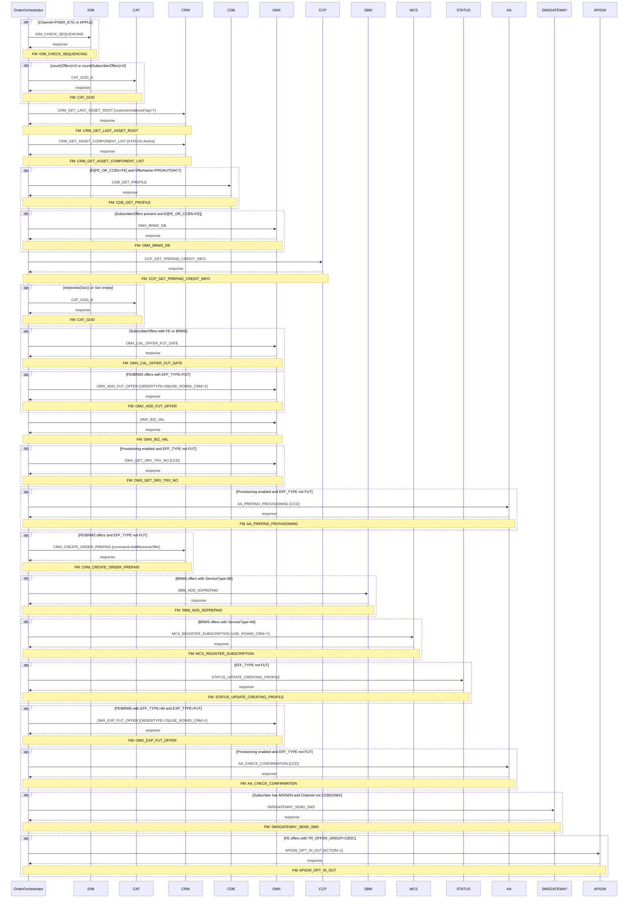

# PREPAID_ADD_OFFER

> Process Configuration for PREPAID_ADD_OFFER

**Total steps:** 21 | **Unique FMs:** 20 | **FM docs generated:** 6 | **Entry point:** IOM_CHECK_SEQUENCING | **Generated:** 2026-09-09

---

## §2 — Order Flow

| Step | Step ID | FM (ActivityID) | Parameter(s) | PreExecCheck | Previous | Next |
|------|---------|-----------------|--------------|--------------|----------|------|
| 1 | IOM_CHECK_SEQUENCING | IOM_CHECK_SEQUENCING | — | `Channel="POMX_ETG" or Channel="APPLE"` | START | CAT_GOD_A |
| 2 | CAT_GOD_A | CAT_GOD | — | `count(//Offers)>0 or count(//SubscriberOffers)>0` | IOM_CHECK_SEQUENCING | CRM_GET_LAST_ASSET_ROOT |
| 3 | CRM_GET_LAST_ASSET_ROOT | CRM_GET_LAST_ASSET_ROOT | `customerAddressFlag=Y` | — | CAT_GOD_A | CRM_GET_ASSET_COMPONENT_LIST |
| 4 | CRM_GET_ASSET_COMPONENT_LIST | CRM_GET_ASSET_COMPONENT_LIST | `STATUS=Active` | — | CRM_GET_LAST_ASSET_ROOT | CDB_GET_PROFILE |
| 5 | CDB_GET_PROFILE | CDB_GET_PROFILE | — | `boolean(//SubscriberOffers[EI[FE_OR_CCBS=FE] and OfferName='PROAUTOACT'])` | CRM_GET_ASSET_COMPONENT_LIST | OMX_BRMS_DB |
| 6 | OMX_BRMS_DB | OMX_BRMS_DB | — | `boolean(//Subscriber/SubscriberOffers[1] and //SubscriberOffers[EI[FE_OR_CCBS=FE]])` | CDB_GET_PROFILE | CCP_GET_PREPAID_CREDIT_INFO |
| 7 | CCP_GET_PREPAID_CREDIT_INFO | CCP_GET_PREPAID_CREDIT_INFO | — | — | OMX_BRMS_DB | CAT_GOD_B |
| 8 | CAT_GOD_B | CAT_GOD | — | `not(exists(//Soc)) or string-length(//Soc/text())=0` | CCP_GET_PREPAID_CREDIT_INFO | OMX_CAL_OFFER_FUT_DATE |
| 9 | OMX_CAL_OFFER_FUT_DATE | OMX_CAL_OFFER_FUT_DATE | — | `boolean(//Subscriber/SubscriberOffers[1] and //SubscriberOffers[EI[FE_OR_CCBS=FE or BRMS]])` | CAT_GOD_B | OMX_ADD_FUT_OFFER |
| 10 | OMX_ADD_FUT_OFFER | OMX_ADD_FUT_OFFER | `ORDERTYPE=69 \| USE_ROWID_CRM=Y` | `boolean(//SubscriberOffers[EI[FE_OR_CCBS=FE or BRMS] and EI[EFF_TYPE=FUT]])` | OMX_CAL_OFFER_FUT_DATE | OMX_BIZ_VAL |
| 11 | OMX_BIZ_VAL | OMX_BIZ_VAL | — | — | OMX_ADD_FUT_OFFER | OMX_GET_SRV_TRX_NO |
| 12 | OMX_GET_SRV_TRX_NO | OMX_GET_SRV_TRX_NO | `CCD` | `(PROVISIONING absent or ≠N) and (EFF_TYPE absent or ≠FUT)` | OMX_BIZ_VAL | AA_PREPAID_PROVISIONING |
| 13 | AA_PREPAID_PROVISIONING | AA_PREPAID_PROVISIONING | `CCD` | `(PROVISIONING absent or ≠N) and (EFF_TYPE absent or ≠FUT)` | OMX_GET_SRV_TRX_NO | CRM_CREATE_ORDER_PREPAID |
| 14 | CRM_CREATE_ORDER_PREPAID | CRM_CREATE_ORDER_PREPAID | `command=AddRemoveOffer \| orderType=A \| listOfRootLineItemAction=Update \| listOfLineItemAction=Add \| listOfLineItemStatus=Active \| USE_ROWID_CRM=N` | `(EI[FE_OR_CCBS=FE or BRMS]) and (EFF_TYPE absent or ≠FUT)` | AA_PREPAID_PROVISIONING | SBM_ADD_3GPREPAID |
| 15 | SBM_ADD_3GPREPAID | SBM_ADD_3GPREPAID | — | `boolean(//SubscriberOffers[EI[FE_OR_CCBS=BRMS] and ServiceType='88'])` | CRM_CREATE_ORDER_PREPAID | MCS_REGISTER_SUBSCRIPTION |
| 16 | MCS_REGISTER_SUBSCRIPTION | MCS_REGISTER_SUBSCRIPTION | `USE_ROWID_CRM=Y` | `boolean(//Subscriber/SubscriberOffers[EI[FE_OR_CCBS=BRMS] and ServiceType='69'])` | SBM_ADD_3GPREPAID | STATUS_UPDATE_CREATING_PROFILE |
| 17 | STATUS_UPDATE_CREATING_PROFILE | STATUS_UPDATE_CREATING_PROFILE | — | `(EFF_TYPE absent or ≠FUT)` | MCS_REGISTER_SUBSCRIPTION | OMX_EXP_FUT_OFFER |
| 18 | OMX_EXP_FUT_OFFER | OMX_EXP_FUT_OFFER | `ORDERTYPE=70 \| USE_ROWID_CRM=Y` | `boolean(//SubscriberOffers[EI[FE_OR_CCBS=FE or BRMS] and EI[EFF_TYPE≠FUT] and EI[EXP_TYPE=FUT]]) and (EFF_TYPE≠FUT or LOGICALDATE_PROV present)` | STATUS_UPDATE_CREATING_PROFILE | AA_CHECK_CONFIRMATION |
| 19 | AA_CHECK_CONFIRMATION | AA_CHECK_CONFIRMATION | `CCD` | `(PROVISIONING absent or ≠N) and (EFF_TYPE absent or ≠FUT)` | OMX_EXP_FUT_OFFER | SMSGATEWAY_SEND_SMS |
| 20 | SMSGATEWAY_SEND_SMS | SMSGATEWAY_SEND_SMS | — | `boolean(//Subscriber[MSISDN][1]) and Channel≠"CCBS" and Channel≠"OMX" and (EFF_TYPE absent or ≠FUT)` | AA_CHECK_CONFIRMATION | APIGW_OPT_IN_OUT |
| 21 | APIGW_OPT_IN_OUT | APIGW_OPT_IN_OUT | `ACTION=1` | `boolean(//SubscriberOffers[EI[FE_OR_CCBS=FE] and contains(SocProperties,'TR_OFFER_GROUP=CBSC')])` | SMSGATEWAY_SEND_SMS | END |

---

## §3 — PreExecCheck Details

### Step 1 — IOM_CHECK_SEQUENCING

**FM:** `IOM_CHECK_SEQUENCING`

```xpath
/ns0:OrderRequest/OrderData/Channel/text()="POMX_ETG" or
/ns0:OrderRequest/OrderData/Channel/text()="APPLE"
```

---

### Step 2 — CAT_GOD_A

**FM:** `CAT_GOD`

```xpath
count(//Offers) > 0 or count(//SubscriberOffers) > 0
```

---

### Step 5 — CDB_GET_PROFILE

**FM:** `CDB_GET_PROFILE` · Has PROAUTOACT offer with FE_OR_CCBS=FE

```xpath
boolean(//SubscriberOffers[ExtendedInfo[Name='FE_OR_CCBS' and Value='FE'] and OfferName='PROAUTOACT'])
```

---

### Step 6 — OMX_BRMS_DB

**FM:** `OMX_BRMS_DB` · Has subscriber offers AND FE_OR_CCBS=FE

```xpath
boolean(//Subscriber/SubscriberOffers[1] and //SubscriberOffers[ExtendedInfo[Name='FE_OR_CCBS' and Value='FE']])
```

---

### Step 8 — CAT_GOD_B

**FM:** `CAT_GOD` · No Soc element or Soc is empty

```xpath
not(exists(//Soc)) or string-length(//Soc/text())=0
```

---

### Step 9 — OMX_CAL_OFFER_FUT_DATE

**FM:** `OMX_CAL_OFFER_FUT_DATE` · Has offers with FE or BRMS

```xpath
boolean(//Subscriber/SubscriberOffers[1] and //SubscriberOffers[ExtendedInfo[Name='FE_OR_CCBS' and (Value='FE' or Value='BRMS')]])
```

---

### Step 10 — OMX_ADD_FUT_OFFER

**FM:** `OMX_ADD_FUT_OFFER` · Has FE/BRMS offers with EFF_TYPE=FUT

```xpath
boolean(//Subscriber/SubscriberOffers[1] and //SubscriberOffers[ExtendedInfo[Name='FE_OR_CCBS' and (Value='FE' or Value='BRMS')] and ExtendedInfo[Name='EFF_TYPE' and Value='FUT']])
```

---

### Step 12 — OMX_GET_SRV_TRX_NO

**FM:** `OMX_GET_SRV_TRX_NO` · Provisioning enabled AND no future-only offers

```xpath
(not(boolean(/ns0:OrderRequest/OrderData[ExtendedInfo[Name='PROVISIONING']])) or boolean(/ns0:OrderRequest/OrderData[ExtendedInfo[Name='PROVISIONING' and Value!='N']]))
and (not(boolean(//SubscriberOffers[ExtendedInfo[Name='EFF_TYPE']])) or boolean(//SubscriberOffers[ExtendedInfo[Name='EFF_TYPE' and Value!='FUT']]))
```

---

### Step 13 — AA_PREPAID_PROVISIONING

**FM:** `AA_PREPAID_PROVISIONING` · Same provisioning + EFF_TYPE guard as step 12

```xpath
(not(boolean(/ns0:OrderRequest/OrderData[ExtendedInfo[Name='PROVISIONING']])) or boolean(/ns0:OrderRequest/OrderData[ExtendedInfo[Name='PROVISIONING' and Value!='N']]))
and (not(boolean(//Subscriber/SubscriberOffers[ExtendedInfo[Name='EFF_TYPE']])) or boolean(//Subscriber/SubscriberOffers[ExtendedInfo[Name='EFF_TYPE' and Value!='FUT']]))
```

---

### Step 14 — CRM_CREATE_ORDER_PREPAID

**FM:** `CRM_CREATE_ORDER_PREPAID` · Has FE/BRMS offers AND not future-only

```xpath
(//SubscriberOffers[ExtendedInfo[Name='FE_OR_CCBS' and (Value='FE' or Value='BRMS')]])
and (not(boolean(//SubscriberOffers[ExtendedInfo[Name='EFF_TYPE']])) or boolean(//SubscriberOffers[ExtendedInfo[Name='EFF_TYPE' and Value!='FUT']]))
```

---

### Step 15 — SBM_ADD_3GPREPAID

**FM:** `SBM_ADD_3GPREPAID` · Has BRMS offer with ServiceType=88 (3G prepaid)

```xpath
boolean(//SubscriberOffers[ExtendedInfo[Name='FE_OR_CCBS' and Value='BRMS'] and (ServiceType='88')])
```

---

### Step 16 — MCS_REGISTER_SUBSCRIPTION

**FM:** `MCS_REGISTER_SUBSCRIPTION` · Has BRMS offer with ServiceType=69

```xpath
boolean(//Subscriber/SubscriberOffers[ExtendedInfo[Name='FE_OR_CCBS' and Value='BRMS'] and ServiceType='69'])
```

---

### Step 17 — STATUS_UPDATE_CREATING_PROFILE

**FM:** `STATUS_UPDATE_CREATING_PROFILE` · No future-only offers

```xpath
(not(boolean(//SubscriberOffers[ExtendedInfo[Name='EFF_TYPE']])) or boolean(//SubscriberOffers[ExtendedInfo[Name='EFF_TYPE' and Value!='FUT']]))
```

---

### Step 18 — OMX_EXP_FUT_OFFER

**FM:** `OMX_EXP_FUT_OFFER` · Has FE/BRMS with immediate EFF + future EXP; plus LOGICALDATE_PROV guard

```xpath
boolean(//Subscriber/SubscriberOffers[1] and //SubscriberOffers[ExtendedInfo[Name='FE_OR_CCBS' and (Value='FE' or Value='BRMS')] and ExtendedInfo[Name='EFF_TYPE' and Value!='FUT'] and ExtendedInfo[Name='EXP_TYPE' and Value='FUT']])
and ((not(boolean(//SubscriberOffers[ExtendedInfo[Name='EFF_TYPE']])) or boolean(//SubscriberOffers[ExtendedInfo[Name='EFF_TYPE' and Value!='FUT']])) or boolean(//SubscriberOffers[ExtendedInfo[Name='LOGICALDATE_PROV']]))
```

---

### Step 19 — AA_CHECK_CONFIRMATION

**FM:** `AA_CHECK_CONFIRMATION` · Same provisioning + EFF_TYPE guard as steps 12/13

```xpath
(not(boolean(/ns0:OrderRequest/OrderData[ExtendedInfo[Name='PROVISIONING']])) or boolean(/ns0:OrderRequest/OrderData[ExtendedInfo[Name='PROVISIONING' and Value!='N']]))
and (not(boolean(//SubscriberOffers[ExtendedInfo[Name='EFF_TYPE']])) or boolean(//SubscriberOffers[ExtendedInfo[Name='EFF_TYPE' and Value!='FUT']]))
```

---

### Step 20 — SMSGATEWAY_SEND_SMS

**FM:** `SMSGATEWAY_SEND_SMS` · Subscriber has MSISDN, channel not CCBS/OMX, not future-only

```xpath
boolean(//Subscriber[MSISDN/text()][1] and /ns0:OrderRequest/OrderData/Channel/text()!="CCBS" and /ns0:OrderRequest/OrderData/Channel/text()!="OMX")
and (not(boolean(//SubscriberOffers[ExtendedInfo[Name='EFF_TYPE']])) or boolean(//SubscriberOffers[ExtendedInfo[Name='EFF_TYPE' and Value!='FUT']]))
```

---

### Step 21 — APIGW_OPT_IN_OUT

**FM:** `APIGW_OPT_IN_OUT` · Has FE offer with TR_OFFER_GROUP=CBSC

```xpath
boolean(//SubscriberOffers[ExtendedInfo[Name='FE_OR_CCBS' and Value='FE'] and contains(SocProperties,'TR_OFFER_GROUP=CBSC')])
```

---

## §4 — FM Documentation Index

| FM (ActivityID) | Used in Steps | Doc Link | Status |
|-----------------|---------------|----------|--------|
| IOM_CHECK_SEQUENCING | 1 | — | [NOT FOUND] |
| CAT_GOD | 2, 8 | — | [NOT FOUND] |
| CRM_GET_LAST_ASSET_ROOT | 3 | — | [NOT FOUND] |
| CRM_GET_ASSET_COMPONENT_LIST | 4 | — | [NOT FOUND] |
| CDB_GET_PROFILE | 5 | — | [NOT FOUND] |
| OMX_BRMS_DB | 6 | — | [NOT FOUND] |
| CCP_GET_PREPAID_CREDIT_INFO | 7 | — | [NOT FOUND] |
| OMX_CAL_OFFER_FUT_DATE | 9 | [Request_OMX_CAL_OFFER_FUT_DATE.html](../FMlogic/Request_OMX_CAL_OFFER_FUT_DATE.html) | [GENERATED] |
| OMX_ADD_FUT_OFFER | 10 | [Request_OMX_ADD_FUT_OFFER.html](../FMlogic/Request_OMX_ADD_FUT_OFFER.html) | [GENERATED] |
| OMX_BIZ_VAL | 11 | — | [NOT FOUND] |
| OMX_GET_SRV_TRX_NO | 12 | — | [NOT FOUND] |
| AA_PREPAID_PROVISIONING | 13 | — | [NOT FOUND] |
| CRM_CREATE_ORDER_PREPAID | 14 | — | [NOT FOUND] |
| SBM_ADD_3GPREPAID | 15 | [Request_SBM_ADD_3GPREPAID.html](../FMlogic/Request_SBM_ADD_3GPREPAID.html) | [GENERATED] |
| MCS_REGISTER_SUBSCRIPTION | 16 | [Request_MCS_REGISTER_SUBSCRIPTION.html](../FMlogic/Request_MCS_REGISTER_SUBSCRIPTION.html) | [GENERATED] |
| STATUS_UPDATE_CREATING_PROFILE | 17 | — | [NOT FOUND] |
| OMX_EXP_FUT_OFFER | 18 | [Request_OMX_EXP_FUT_OFFER.html](../FMlogic/Request_OMX_EXP_FUT_OFFER.html) | [GENERATED] |
| AA_CHECK_CONFIRMATION | 19 | — | [NOT FOUND] |
| SMSGATEWAY_SEND_SMS | 20 | [Request_SMSGATEWAY_SEND_SMS.html](../FMlogic/Request_SMSGATEWAY_SEND_SMS.html) | [GENERATED] |
| APIGW_OPT_IN_OUT | 21 | — | [NOT FOUND] |

---

## §5 — Sequence Diagram



> Rendered from ProcessConfig activity chain. Conditional steps wrapped in `opt` blocks.
> Full sequence diagram and flow chart: see companion HTML at `output/order/PREPAID_ADD_OFFER.html`

---

*TRUE Corporation OMX · Order Journey Documentation*
