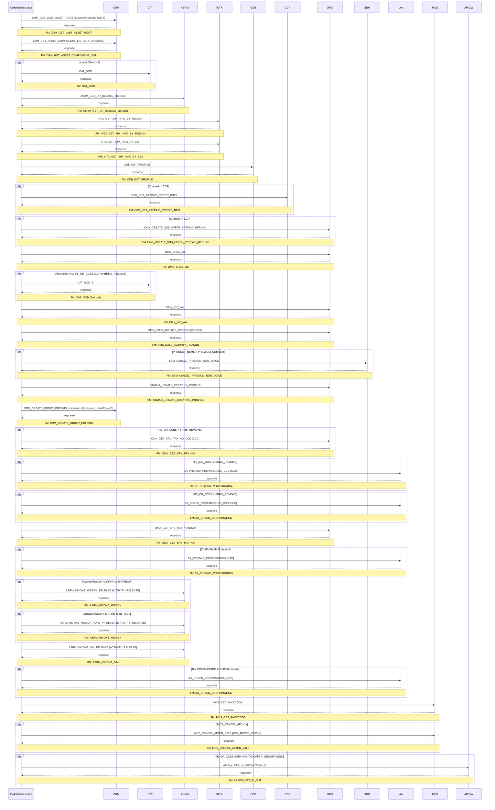

# PREPAID_CANCEL

> Process Configuration for PREPAID CANCEL.

**Total steps:** 28 | **Unique FMs:** 23 (14 documented) | **Entry point:** `CRM_GET_LAST_ASSET_ROOT`

The flow gathers subscriber/account data (CRM, ASRM, INTX, CDB, CCP), computes refund offers, validates business rules, creates the CRM disconnect order, then conditionally provisions AA with a GeneralUpdate (CCD) for BRMS-flagged subscriptions and a Deactivate (DSD) for the main cancellation. Finally, releases MSISDN/SIM resources and confirms with AA.

---

## §2 — Order Flow

| Step | Step ID | FM (ActivityID) | Parameter(s) | PreExecCheck | Previous | Next |
|------|---------|-----------------|--------------|--------------|----------|------|
| 1 | CRM_GET_LAST_ASSET_ROOT | CRM_GET_LAST_ASSET_ROOT | `customerAddressFlag=Y` | — | START | CRM_GET_ASSET_COMPONENT_LIST |
| 2 | CRM_GET_ASSET_COMPONENT_LIST | CRM_GET_ASSET_COMPONENT_LIST | `STATUS=Active` | — | CRM_GET_LAST_ASSET_ROOT | CAT_GOD |
| 3 | CAT_GOD | CAT_GOD | — | `count(//Offers) > 0 or count(//SubscriberOffers) > 0` | CRM_GET_ASSET_COMPONENT_LIST | ASRM_GET_UR_DETAILS_MSISDN |
| 4 | ASRM_GET_UR_DETAILS_MSISDN | ASRM_GET_UR_DETAILS_MSISDN | — | — | CAT_GOD | INTX_GET_SIM_INFO_BY_MSISDN |
| 5 | INTX_GET_SIM_INFO_BY_MSISDN | INTX_GET_SIM_INFO_BY_MSISDN | — | — | ASRM_GET_UR_DETAILS_MSISDN | INTX_GET_SIM_INFO_BY_SIM |
| 6 | INTX_GET_SIM_INFO_BY_SIM | INTX_GET_SIM_INFO_BY_SIM | — | — | INTX_GET_SIM_INFO_BY_MSISDN | CDB_GET_PROFILE |
| 7 | CDB_GET_PROFILE | CDB_GET_PROFILE | — | — | INTX_GET_SIM_INFO_BY_SIM | CCP_GET_PREPAID_CREDIT_INFO |
| 8 | CCP_GET_PREPAID_CREDIT_INFO | CCP_GET_PREPAID_CREDIT_INFO | — | `/ns0:OrderRequest/OrderData/Channel/text()!="CCP"` | CDB_GET_PROFILE | OMX_CREATE_SUB_OFFER_PREPAID_REFUND |
| 9 | OMX_CREATE_SUB_OFFER_PREPAID_REFUND | OMX_CREATE_SUB_OFFER_PREPAID_REFUND | — | `/ns0:OrderRequest/OrderData/Channel/text()!="CCP"` | CCP_GET_PREPAID_CREDIT_INFO | OMX_BRMS_DB |
| 10 | OMX_BRMS_DB | OMX_BRMS_DB | — | — | OMX_CREATE_SUB_OFFER_PREPAID_REFUND | CAT_GOD_B |
| 11 | CAT_GOD_B | CAT_GOD | — | `(count(//Offers) > 0 or count(//SubscriberOffers) > 0) and //SubscriberOffers/ExtendedInfo[Name='FE_OR_CCBS' and (Value='CCP' or Value='BRMS_REMOVE')]` | OMX_BRMS_DB | OMX_BIZ_VAL |
| 12 | OMX_BIZ_VAL | OMX_BIZ_VAL | — | — | CAT_GOD_B | OMX_CALC_ACTIVITY_REASON |
| 13 | OMX_CALC_ACTIVITY_REASON | OMX_CALC_ACTIVITY_REASON | `CANCEL` | — | OMX_BIZ_VAL | SBM_CANCEL_PREMIUM_NON_VOICE |
| 14 | SBM_CANCEL_PREMIUM_NON_VOICE | SBM_CANCEL_PREMIUM_NON_VOICE | — | `boolean(//OrderData/ExtendedInfo[Name='PROJECT_NAME' and Value='PREMIUM_NUMBER'])` | OMX_CALC_ACTIVITY_REASON | STATUS_UPDATE_CREATING_PROFILE |
| 15 | STATUS_UPDATE_CREATING_PROFILE | STATUS_UPDATE_CREATING_PROFILE | — | — | SBM_CANCEL_PREMIUM_NON_VOICE | CRM_CREATE_ORDER_PREPAID |
| 16 | CRM_CREATE_ORDER_PREPAID | CRM_CREATE_ORDER_PREPAID | `command=Disconnect` \| `orderType=D` \| `listOfRootLineItemAction=Delete` \| `listOfRootLineItemStatus=Inactive` \| `USE_ROWID_CRM=N` | — | STATUS_UPDATE_CREATING_PROFILE | OMX_GET_SRV_TRX_NO_CCD |
| 17 | OMX_GET_SRV_TRX_NO_CCD | OMX_GET_SRV_TRX_NO | `CCD` | `boolean(//SubscriberOffers/ExtendedInfo[Name='FE_OR_CCBS' and Value='BRMS_REMOVE'])` | CRM_CREATE_ORDER_PREPAID | AA_PREPAID_PROVISIONING_CCD |
| 18 | AA_PREPAID_PROVISIONING_CCD | AA_PREPAID_PROVISIONING | `CCD` | `boolean(//SubscriberOffers/ExtendedInfo[Name='FE_OR_CCBS' and Value='BRMS_REMOVE'])` | OMX_GET_SRV_TRX_NO_CCD | AA_CHECK_CONFIRMATION_CCD |
| 19 | AA_CHECK_CONFIRMATION_CCD | AA_CHECK_CONFIRMATION | `CCD` \| `UPDATE_NETWORK_STATUS` | `boolean(//SubscriberOffers/ExtendedInfo[Name='FE_OR_CCBS' and Value='BRMS_REMOVE'])` | AA_PREPAID_PROVISIONING_CCD | OMX_GET_SRV_TRX_NO |
| 20 | OMX_GET_SRV_TRX_NO | OMX_GET_SRV_TRX_NO | `DSD` | — | AA_CHECK_CONFIRMATION_CCD | AA_PREPAID_PROVISIONING |
| 21 | AA_PREPAID_PROVISIONING | AA_PREPAID_PROVISIONING | `DSD` | `count(//Subscriber/CdbProfile)>0 and count(//Subscriber/CdbProfile/IMSI)>0 and //Subscriber/CdbProfile/IMSI/text()!=""` | OMX_GET_SRV_TRX_NO | ASRM_INVOKE_MSISDN_RELEASE |
| 22 | ASRM_INVOKE_MSISDN_RELEASE | ASRM_INVOKE_MSISDN | `ACTIVITY=RELEASE` | `(//SubscriberActivityInfo/ActivityReason/text()!="MNPHR" and //SubscriberActivityInfo/ActivityReason/text()!="RFREOT")` | AA_PREPAID_PROVISIONING | ASRM_INVOKE_MSISDN_PORT_IN_REVERSE |
| 23 | ASRM_INVOKE_MSISDN_PORT_IN_REVERSE | ASRM_INVOKE_MSISDN | `ACTIVITY=PORT IN REVERSE` | `(//SubscriberActivityInfo/ActivityReason/text()="MNPHR" or //SubscriberActivityInfo/ActivityReason/text()="RFREOT")` | ASRM_INVOKE_MSISDN_RELEASE | ASRM_INVOKE_SIM_RELEASE |
| 24 | ASRM_INVOKE_SIM_RELEASE | ASRM_INVOKE_SIM | `ACTIVITY=RELEASE` | — | ASRM_INVOKE_MSISDN_PORT_IN_REVERSE | AA_CHECK_CONFIRMATION |
| 25 | AA_CHECK_CONFIRMATION | AA_CHECK_CONFIRMATION | `DSD` \| `UPDATE_NETWORK_STATUS` | `not(Channel="CCP" or Channel="RM" or Channel="ASRM") and count(//Subscriber/CdbProfile)>0 and count(//Subscriber/CdbProfile/IMSI)>0 and //Subscriber/CdbProfile/IMSI/text()!=""` | ASRM_INVOKE_SIM_RELEASE | MCS_GET_PACKCODE |
| 26 | MCS_GET_PACKCODE | MCS_GET_PACKCODE | — | — | AA_CHECK_CONFIRMATION | MCS_CANCEL_AFTER_SALE |
| 27 | MCS_CANCEL_AFTER_SALE | MCS_CANCEL_AFTER_SALE | `USE_ROWID_CRM=Y` | `boolean(//Subscriber[ExtendedInfo[Name='MCS_CANCEL_AFS' and Value='Y']])` | MCS_GET_PACKCODE | APIGW_OPT_IN_OUT |
| 28 | APIGW_OPT_IN_OUT | APIGW_OPT_IN_OUT | `ACTION=0` | `boolean(//SubscriberOffers[ExtendedInfo[Name='FE_OR_CCBS' and Value='CRM'] and contains(SocProperties,'TR_OFFER_GROUP=CBSC')])` | MCS_CANCEL_AFTER_SALE | END |

---

## §3 — PreExecCheck Details

### Step 3 — CAT_GOD

**FM:** `CAT_GOD`

```xpath
count(//Offers) > 0 or count(//SubscriberOffers) > 0
```

Calls CAT (Catalogue) to resolve GOD-tier offer details. Skipped if subscriber has no active offers.

---

### Step 8 — CCP_GET_PREPAID_CREDIT_INFO

**FM:** `CCP_GET_PREPAID_CREDIT_INFO`

```xpath
/ns0:OrderRequest/OrderData/Channel/text()!="CCP"
```

CCP channel already has credit info — skip the CCP lookup call.

---

### Step 9 — OMX_CREATE_SUB_OFFER_PREPAID_REFUND

**FM:** `OMX_CREATE_SUB_OFFER_PREPAID_REFUND`

```xpath
/ns0:OrderRequest/OrderData/Channel/text()!="CCP"
```

Refund offer computation skipped when channel is CCP (no refund applicable).

---

### Step 11 — CAT_GOD_B

**FM:** `CAT_GOD` (2nd call)

```xpath
(count(//Offers) > 0 or count(//SubscriberOffers) > 0) and
//SubscriberOffers/ExtendedInfo[Name='FE_OR_CCBS' and (Value='CCP' or Value='BRMS_REMOVE')]
```

Second CAT_GOD call for BRMS-flagged or CCP subscriptions that require an updated offer catalogue view after BRMS processing.

---

### Step 14 — SBM_CANCEL_PREMIUM_NON_VOICE

**FM:** `SBM_CANCEL_PREMIUM_NON_VOICE`

```xpath
boolean(//OrderData/ExtendedInfo[Name='PROJECT_NAME' and Value='PREMIUM_NUMBER'])
```

Cancels SBM premium non-voice services only when the order is for a Premium Number project.

---

### Step 17 — OMX_GET_SRV_TRX_NO_CCD

**FM:** `OMX_GET_SRV_TRX_NO`

```xpath
boolean(//SubscriberOffers/ExtendedInfo[Name='FE_OR_CCBS' and Value='BRMS_REMOVE'])
```

Gets a service transaction number for the CCD (GeneralUpdate) AA provisioning call. Only needed for BRMS_REMOVE offer type.

---

### Step 18 — AA_PREPAID_PROVISIONING_CCD

**FM:** [`AA_PREPAID_PROVISIONING`](../../output/FMlogic/Request_AA_PREPAID_PROVISIONING.html)

```xpath
boolean(//SubscriberOffers/ExtendedInfo[Name='FE_OR_CCBS' and Value='BRMS_REMOVE'])
```

Sends GeneralUpdate (CCD) to AA provisioning before the full deactivation. Only triggered for BRMS_REMOVE subscriptions.

---

### Step 19 — AA_CHECK_CONFIRMATION_CCD

**FM:** `AA_CHECK_CONFIRMATION`

```xpath
boolean(//SubscriberOffers/ExtendedInfo[Name='FE_OR_CCBS' and Value='BRMS_REMOVE'])
```

Waits for AA to confirm the CCD provisioning. Same gate as steps 17 and 18.

---

### Step 21 — AA_PREPAID_PROVISIONING

**FM:** [`AA_PREPAID_PROVISIONING`](../../output/FMlogic/Request_AA_PREPAID_PROVISIONING.html)

```xpath
count(//Subscriber/CdbProfile)>0
and count(//Subscriber/CdbProfile/IMSI)>0
and //Subscriber/CdbProfile/IMSI/text()!=""
```

Main AA deactivation (DSD). Requires an active CDB profile with a non-empty IMSI — confirms subscriber has a physical SIM registered in CDB.

---

### Step 22 — ASRM_INVOKE_MSISDN_RELEASE

**FM:** `ASRM_INVOKE_MSISDN`

```xpath
(//SubscriberActivityInfo/ActivityReason/text()!="MNPHR"
 and //SubscriberActivityInfo/ActivityReason/text()!="RFREOT")
```

Releases the MSISDN back to the pool for regular cancellations. Skipped for MNP handoff reversals.

---

### Step 23 — ASRM_INVOKE_MSISDN_PORT_IN_REVERSE

**FM:** `ASRM_INVOKE_MSISDN`

```xpath
(//SubscriberActivityInfo/ActivityReason/text()="MNPHR"
 or //SubscriberActivityInfo/ActivityReason/text()="RFREOT")
```

Reverses the MNP port-in. Mutually exclusive with step 22.

---

### Step 25 — AA_CHECK_CONFIRMATION

**FM:** `AA_CHECK_CONFIRMATION`

```xpath
not(/ns0:OrderRequest/OrderData/Channel/text() ="CCP"
    or /ns0:OrderRequest/OrderData/Channel/text() ="RM"
    or /ns0:OrderRequest/OrderData/Channel/text() ="ASRM")
and count(//Subscriber/CdbProfile)>0
and count(//Subscriber/CdbProfile/IMSI)>0
and //Subscriber/CdbProfile/IMSI/text()!=""
```

Waits for AA DSD confirmation. Excluded for CCP, RM, and ASRM channels. Mirrors step 21's IMSI check.

---

### Step 27 — MCS_CANCEL_AFTER_SALE

**FM:** `MCS_CANCEL_AFTER_SALE`

```xpath
boolean(//Subscriber[ExtendedInfo[Name='MCS_CANCEL_AFS' and Value='Y']])
```

Cancels the MCS after-sale package. Only triggered when subscriber carries the `MCS_CANCEL_AFS='Y'` extended info flag.

---

### Step 28 — APIGW_OPT_IN_OUT

**FM:** `APIGW_OPT_IN_OUT`

```xpath
boolean(//SubscriberOffers[ExtendedInfo[Name='FE_OR_CCBS' and Value='CRM']
        and contains(SocProperties,'TR_OFFER_GROUP=CBSC')])
```

Opts out via API Gateway for subscribers with a CRM-managed CBSC offer group. `ACTION=0` = opt-out.

---

## §4 — FM Documentation Index

| FM (ActivityID) | Used in Steps | Doc Link |
|-----------------|---------------|----------|
| CRM_GET_LAST_ASSET_ROOT | 1 | [Request_CRM_GET_LAST_ASSET_ROOT.html](../../output/FMlogic/Request_CRM_GET_LAST_ASSET_ROOT.html) |
| CRM_GET_ASSET_COMPONENT_LIST | 2 | [Request_CRM_GET_ASSET_COMPONENT_LIST.html](../../output/FMlogic/Request_CRM_GET_ASSET_COMPONENT_LIST.html) |
| CAT_GOD | 3, 11 | [Request_CAT_GOD.html](../../output/FMlogic/Request_CAT_GOD.html) |
| ASRM_GET_UR_DETAILS_MSISDN | 4 | [Request_ASRM_GET_UR_DETAILS_MSISDN.html](../../output/FMlogic/Request_ASRM_GET_UR_DETAILS_MSISDN.html) |
| INTX_GET_SIM_INFO_BY_MSISDN | 5 | [Request_INTX_GET_SIM_INFO_BY_MSISDN.html](../../output/FMlogic/Request_INTX_GET_SIM_INFO_BY_MSISDN.html) |
| INTX_GET_SIM_INFO_BY_SIM | 6 | ⚠ Not Found |
| CDB_GET_PROFILE | 7 | [Request_CDB_GET_PROFILE.html](../../output/FMlogic/Request_CDB_GET_PROFILE.html) |
| CCP_GET_PREPAID_CREDIT_INFO | 8 | [Request_CCP_GET_PREPAID_CREDIT_INFO.html](../../output/FMlogic/Request_CCP_GET_PREPAID_CREDIT_INFO.html) |
| OMX_CREATE_SUB_OFFER_PREPAID_REFUND | 9 | [Request_OMX_CREATE_SUB_OFFER_PREPAID_REFUND.html](../../output/FMlogic/Request_OMX_CREATE_SUB_OFFER_PREPAID_REFUND.html) |
| OMX_BRMS_DB | 10 | ⚠ Not Found |
| OMX_BIZ_VAL | 12 | [Request_OMX_BIZ_VAL.html](../../output/FMlogic/Request_OMX_BIZ_VAL.html) |
| OMX_CALC_ACTIVITY_REASON | 13 | [Request_OMX_CALC_ACTIVITY_REASON.html](../../output/FMlogic/Request_OMX_CALC_ACTIVITY_REASON.html) |
| SBM_CANCEL_PREMIUM_NON_VOICE | 14 | [Request_SBM_CANCEL_PREMIUM_NON_VOICE.html](../../output/FMlogic/Request_SBM_CANCEL_PREMIUM_NON_VOICE.html) |
| STATUS_UPDATE_CREATING_PROFILE | 15 | [Request_STATUS_UPDATE_CREATING_PROFILE.html](../../output/FMlogic/Request_STATUS_UPDATE_CREATING_PROFILE.html) |
| CRM_CREATE_ORDER_PREPAID | 16 | [Request_CRM_CREATE_ORDER_PREPAID.html](../../output/FMlogic/Request_CRM_CREATE_ORDER_PREPAID.html) |
| OMX_GET_SRV_TRX_NO | 17, 20 | ⚠ Not Found |
| AA_PREPAID_PROVISIONING | 18 (CCD), 21 (DSD) | [Request_AA_PREPAID_PROVISIONING.html](../../output/FMlogic/Request_AA_PREPAID_PROVISIONING.html) |
| AA_CHECK_CONFIRMATION | 19, 25 | ⚠ Not Found |
| ASRM_INVOKE_MSISDN | 22, 23 | ⚠ Not Found |
| ASRM_INVOKE_SIM | 24 | ⚠ Not Found |
| MCS_GET_PACKCODE | 26 | ⚠ Not Found |
| MCS_CANCEL_AFTER_SALE | 27 | ⚠ Not Found |
| APIGW_OPT_IN_OUT | 28 | ⚠ Not Found |

---

## §5 — Sequence Diagram



> Rendered from ProcessConfig activity chain. Conditional steps wrapped in `opt` blocks.
> Full interactive HTML: see `output/order/PREPAID_CANCEL.html`

---

*TRUE Corporation OMX · Order Journey Documentation*
