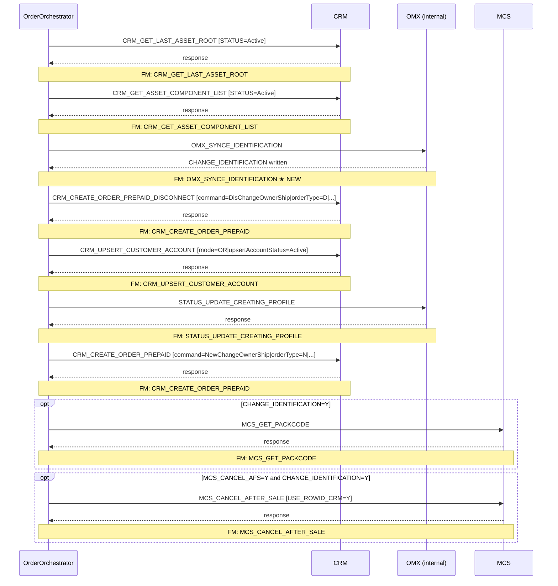

# PREPAID_CHANGE_OWNER

> Process Configuration for PREPAID_CHANGE_OWNER.

**Total steps:** 9 | **Unique FMs:** 8 | **Entry point:** CRM_GET_LAST_ASSET_ROOT | **Generated:** 2026-09-23

---

## §2 — Order Flow

| Step | Step ID | FM (ActivityID) | Parameter(s) | PreExecCheck | Previous | Next |
|------|---------|-----------------|--------------|--------------|----------|------|
| 1 | CRM_GET_LAST_ASSET_ROOT | CRM_GET_LAST_ASSET_ROOT | STATUS=Active | — | START | CRM_GET_ASSET_COMPONENT_LIST |
| 2 | CRM_GET_ASSET_COMPONENT_LIST | CRM_GET_ASSET_COMPONENT_LIST | STATUS=Active | — | CRM_GET_LAST_ASSET_ROOT | OMX_SYNCE_IDENTIFICATION |
| 3 | OMX_SYNCE_IDENTIFICATION | OMX_SYNCE_IDENTIFICATION ★ | — | — | CRM_GET_ASSET_COMPONENT_LIST | CRM_CREATE_ORDER_PREPAID_DISCONNECT |
| 4 | CRM_CREATE_ORDER_PREPAID_DISCONNECT | CRM_CREATE_ORDER_PREPAID | command=DisChangeOwnerShip \| orderType=D \| listOfRootLineItemAction=Delete \| listOfRootLineItemStatus=Inactive \| ignoreAssetRowId=Y \| USE_ROWID_CRM=N | — | OMX_SYNCE_IDENTIFICATION | CRM_UPSERT_CUSTOMER_ACCOUNT |
| 5 | CRM_UPSERT_CUSTOMER_ACCOUNT | CRM_UPSERT_CUSTOMER_ACCOUNT | mode=OR \| upsertAccountStatus=Active | — | CRM_CREATE_ORDER_PREPAID_DISCONNECT | STATUS_UPDATE_CREATING_PROFILE |
| 6 | STATUS_UPDATE_CREATING_PROFILE | STATUS_UPDATE_CREATING_PROFILE | — | — | CRM_UPSERT_CUSTOMER_ACCOUNT | CRM_CREATE_ORDER_PREPAID |
| 7 | CRM_CREATE_ORDER_PREPAID | CRM_CREATE_ORDER_PREPAID | command=NewChangeOwnerShip \| orderType=N \| listOfRootLineItemAction=Add \| listOfRootLineItemStatus=Active \| USE_ROWID_CRM=N | — | STATUS_UPDATE_CREATING_PROFILE | MCS_GET_PACKCODE |
| 8 | MCS_GET_PACKCODE | MCS_GET_PACKCODE | — | `boolean(//Customer/ExtendedInfo[Name='CHANGE_IDENTIFICATION' and Value='Y'])` | CRM_CREATE_ORDER_PREPAID | MCS_CANCEL_AFTER_SALE |
| 9 | MCS_CANCEL_AFTER_SALE | MCS_CANCEL_AFTER_SALE | USE_ROWID_CRM=Y | `boolean(//Subscriber[ExtendedInfo[Name='MCS_CANCEL_AFS' and Value='Y']]) and boolean(//Customer/ExtendedInfo[Name='CHANGE_IDENTIFICATION' and Value='Y'])` | MCS_GET_PACKCODE | END |

> ★ = newly generated FM doc

---

## §3 — PreExecCheck Details

### Step 8 — MCS_GET_PACKCODE
**FM:** `MCS_GET_PACKCODE`
```xpath
boolean(//Customer/ExtendedInfo[Name='CHANGE_IDENTIFICATION' and Value='Y'])
```
Only retrieves the pack code from MCS when the customer's identification has changed (CHANGE_IDENTIFICATION=Y written by step 3).

### Step 9 — MCS_CANCEL_AFTER_SALE
**FM:** `MCS_CANCEL_AFTER_SALE` | **Parameter:** USE_ROWID_CRM=Y
```xpath
boolean(//Subscriber[ExtendedInfo[Name='MCS_CANCEL_AFS' and Value='Y']])
and boolean(//Customer/ExtendedInfo[Name='CHANGE_IDENTIFICATION' and Value='Y'])
```
Cancels after-sale packages in MCS only when both conditions hold: subscriber has MCS_CANCEL_AFS=Y flag AND identification has changed.

---

## §4 — FM Documentation Index

| FM (ActivityID) | Used in Steps | Doc | Status |
|-----------------|---------------|-----|--------|
| CRM_GET_LAST_ASSET_ROOT | 1 | [Request_CRM_GET_LAST_ASSET_ROOT.html](../FMlogic/Request_CRM_GET_LAST_ASSET_ROOT.html) | ✓ |
| CRM_GET_ASSET_COMPONENT_LIST | 2 | [Request_CRM_GET_ASSET_COMPONENT_LIST.html](../FMlogic/Request_CRM_GET_ASSET_COMPONENT_LIST.html) | ✓ |
| OMX_SYNCE_IDENTIFICATION | 3 | [Request_OMX_SYNCE_IDENTIFICATION.html](../FMlogic/Request_OMX_SYNCE_IDENTIFICATION.html) | ★ NEW |
| CRM_CREATE_ORDER_PREPAID | 4, 7 | [Request_CRM_CREATE_ORDER_PREPAID.html](../FMlogic/Request_CRM_CREATE_ORDER_PREPAID.html) | ✓ |
| CRM_UPSERT_CUSTOMER_ACCOUNT | 5 | [Request_CRM_UPSERT_CUSTOMER_ACCOUNT.html](../FMlogic/Request_CRM_UPSERT_CUSTOMER_ACCOUNT.html) | ✓ |
| STATUS_UPDATE_CREATING_PROFILE | 6 | [Request_STATUS_UPDATE_CREATING_PROFILE.html](../FMlogic/Request_STATUS_UPDATE_CREATING_PROFILE.html) | ✓ |
| MCS_GET_PACKCODE | 8 | [Request_MCS_GET_PACKCODE.html](../FMlogic/Request_MCS_GET_PACKCODE.html) | ✓ |
| MCS_CANCEL_AFTER_SALE | 9 | [Request_MCS_CANCEL_AFTER_SALE.html](../FMlogic/Request_MCS_CANCEL_AFTER_SALE.html) | ✓ |

---

## §5 — Sequence Diagram



> Rendered from ProcessConfig activity chain. Conditional steps wrapped in `opt` blocks.
> Full HTML page: `output/order/PREPAID_CHANGE_OWNER.html`

---

*TRUE Corporation OMX · Order Journey Documentation*
