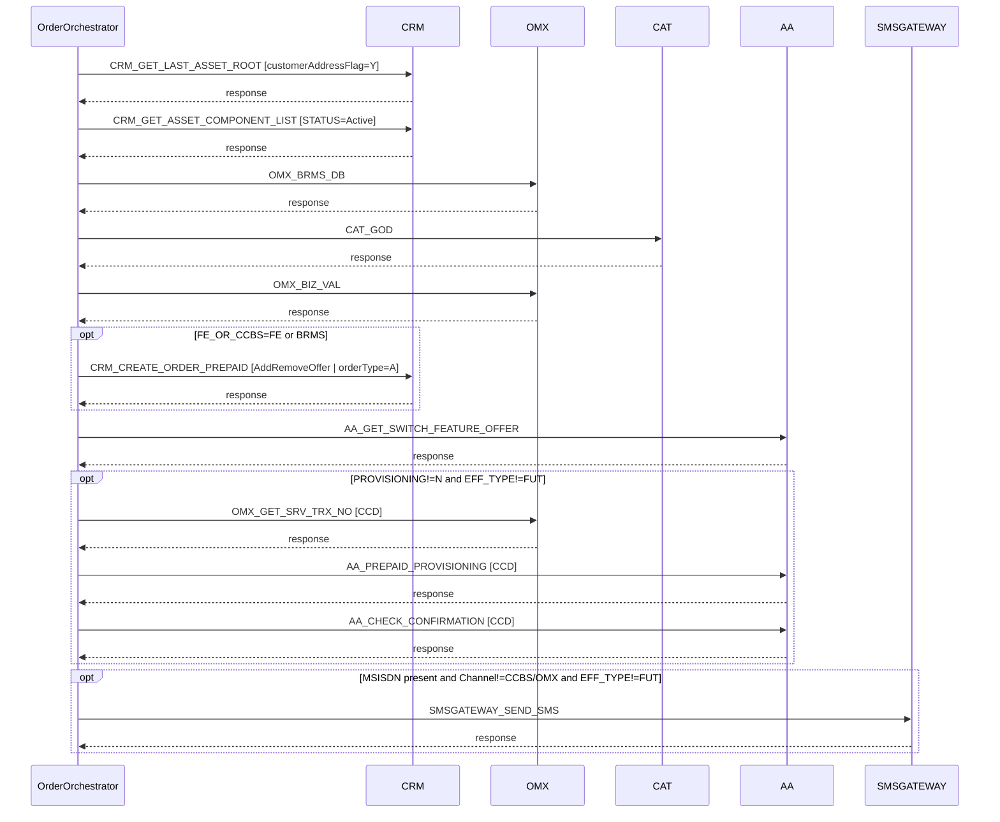

# PREPAID_GPRS_DISABLE

> Process Configuration for PREPAID_GPRS_DISABLE.

**Total steps:** 11 | **Unique FMs:** 11 | **Entry point:** CRM_GET_LAST_ASSET_ROOT

---

## §2 — Order Flow

| Step | Step ID | FM (ActivityID) | Parameter(s) | PreExecCheck | Previous | Next | FM Doc |
|------|---------|-----------------|--------------|--------------|----------|------|--------|
| 1 | CRM_GET_LAST_ASSET_ROOT | CRM_GET_LAST_ASSET_ROOT | customerAddressFlag=Y | — | START | CRM_GET_ASSET_COMPONENT_LIST | Existing |
| 2 | CRM_GET_ASSET_COMPONENT_LIST | CRM_GET_ASSET_COMPONENT_LIST | STATUS=Active | — | CRM_GET_LAST_ASSET_ROOT | OMX_BRMS_DB | Existing |
| 3 | OMX_BRMS_DB | OMX_BRMS_DB | — | — | CRM_GET_ASSET_COMPONENT_LIST | CAT_GOD | Existing |
| 4 | CAT_GOD | CAT_GOD | — | — | OMX_BRMS_DB | OMX_BIZ_VAL | Existing |
| 5 | OMX_BIZ_VAL | OMX_BIZ_VAL | — | — | CAT_GOD | CRM_CREATE_ORDER_PREPAID | Existing |
| 6 | CRM_CREATE_ORDER_PREPAID | CRM_CREATE_ORDER_PREPAID | command=AddRemoveOffer \| orderType=A \| listOfRootLineItemAction=Update \| listOfLineItemAction=Add \| listOfLineItemStatus=Active \| USE_ROWID_CRM=N | `boolean(//SubscriberOffers[ExtendedInfo[Name='FE_OR_CCBS' and (Value='FE' or Value='BRMS')]])` | OMX_BIZ_VAL | AA_GET_SWITCH_FEATURE_OFFER | Existing |
| 7 | AA_GET_SWITCH_FEATURE_OFFER | AA_GET_SWITCH_FEATURE_OFFER | — | — | CRM_CREATE_ORDER_PREPAID | OMX_GET_SRV_TRX_NO | Existing |
| 8 | OMX_GET_SRV_TRX_NO | OMX_GET_SRV_TRX_NO | CCD | `(not(PROVISIONING) or PROVISIONING!='N') and (not(EFF_TYPE) or EFF_TYPE!='FUT')` | AA_GET_SWITCH_FEATURE_OFFER | AA_PREPAID_PROVISIONING | Existing |
| 9 | AA_PREPAID_PROVISIONING | AA_PREPAID_PROVISIONING | CCD | same as step 8 | OMX_GET_SRV_TRX_NO | AA_CHECK_CONFIRMATION | Existing |
| 10 | AA_CHECK_CONFIRMATION | AA_CHECK_CONFIRMATION | CCD | same as step 8 | AA_PREPAID_PROVISIONING | SMSGATEWAY_SEND_SMS | Existing |
| 11 | SMSGATEWAY_SEND_SMS | SMSGATEWAY_SEND_SMS | — | `MSISDN present and Channel!="CCBS" and Channel!="OMX" and EFF_TYPE!='FUT'` | AA_CHECK_CONFIRMATION | END | Existing |

---

## §3 — PreExecCheck Details

### Step 6 — CRM_CREATE_ORDER_PREPAID

**FM:** `CRM_CREATE_ORDER_PREPAID`

```xpath
boolean(//SubscriberOffers[ExtendedInfo[Name='FE_OR_CCBS' and (Value='FE' or Value='BRMS')]])
```

Fires only when the subscriber has at least one offer with `FE_OR_CCBS` ExtendedInfo set to `'FE'` or `'BRMS'`. Gates CRM order creation to FrontEnd/BRMS-provisioned prepaid subscribers only.

### Steps 8–10 — OMX_GET_SRV_TRX_NO / AA_PREPAID_PROVISIONING / AA_CHECK_CONFIRMATION

**FMs:** `OMX_GET_SRV_TRX_NO` · `AA_PREPAID_PROVISIONING` · `AA_CHECK_CONFIRMATION`

```xpath
(not(boolean(/ns0:OrderRequest/OrderData[ExtendedInfo[Name='PROVISIONING']]))
 or boolean(/ns0:OrderRequest/OrderData[ExtendedInfo[Name='PROVISIONING' and Value!='N']]))
and
(not(boolean(//SubscriberOffers[ExtendedInfo[Name='EFF_TYPE']]))
 or boolean(//SubscriberOffers[ExtendedInfo[Name='EFF_TYPE' and Value!='FUT']]))
```

Two-part gate shared by all three steps:
1. **Provisioning enabled:** PROVISIONING absent (default allow) OR value ≠ `'N'`
2. **Not future-effective:** EFF_TYPE absent (default allow) OR value ≠ `'FUT'`

If provisioning is disabled or the offer is future-dated, steps 8–10 are all skipped.

### Step 11 — SMSGATEWAY_SEND_SMS

**FM:** `SMSGATEWAY_SEND_SMS`

```xpath
boolean(//Subscriber[MSISDN/text()][1]
  and /ns0:OrderRequest/OrderData/Channel/text()!="CCBS"
  and /ns0:OrderRequest/OrderData/Channel/text()!="OMX")
and
(not(boolean(//SubscriberOffers[ExtendedInfo[Name='EFF_TYPE']]))
 or boolean(//SubscriberOffers[ExtendedInfo[Name='EFF_TYPE' and Value!='FUT']]))
```

Sends SMS confirmation only when: subscriber has an MSISDN, channel is neither `CCBS` nor `OMX`, and the offer is not future-effective.

---

## §4 — FM Documentation Index

| FM (ActivityID) | Used in Steps | Status | Doc Link |
|-----------------|---------------|--------|----------|
| CRM_GET_LAST_ASSET_ROOT | 1 | Existing | [Request_CRM_GET_LAST_ASSET_ROOT.html](../FMlogic/Request_CRM_GET_LAST_ASSET_ROOT.html) |
| CRM_GET_ASSET_COMPONENT_LIST | 2 | Existing | [Request_CRM_GET_ASSET_COMPONENT_LIST.html](../FMlogic/Request_CRM_GET_ASSET_COMPONENT_LIST.html) |
| OMX_BRMS_DB | 3 | Existing | [Request_OMX_BRMS_DB.html](../FMlogic/Request_OMX_BRMS_DB.html) |
| CAT_GOD | 4 | Existing | [Request_CAT_GOD.html](../FMlogic/Request_CAT_GOD.html) |
| OMX_BIZ_VAL | 5 | Existing | [Request_OMX_BIZ_VAL.html](../FMlogic/Request_OMX_BIZ_VAL.html) |
| CRM_CREATE_ORDER_PREPAID | 6 | Existing | [Request_CRM_CREATE_ORDER_PREPAID.html](../FMlogic/Request_CRM_CREATE_ORDER_PREPAID.html) |
| AA_GET_SWITCH_FEATURE_OFFER | 7 | Existing | [Request_AA_GET_SWITCH_FEATURE_OFFER.html](../FMlogic/Request_AA_GET_SWITCH_FEATURE_OFFER.html) |
| OMX_GET_SRV_TRX_NO | 8 | Existing | [Request_OMX_GET_SRV_TRX_NO.html](../FMlogic/Request_OMX_GET_SRV_TRX_NO.html) |
| AA_PREPAID_PROVISIONING | 9 | Existing | [Request_AA_PREPAID_PROVISIONING.html](../FMlogic/Request_AA_PREPAID_PROVISIONING.html) |
| AA_CHECK_CONFIRMATION | 10 | Existing | [Request_AA_CHECK_CONFIRMATION.html](../FMlogic/Request_AA_CHECK_CONFIRMATION.html) |
| SMSGATEWAY_SEND_SMS | 11 | Existing | [Request_SMSGATEWAY_SEND_SMS.html](../FMlogic/Request_SMSGATEWAY_SEND_SMS.html) |

---

## §5 — Sequence Diagram



> Conditional steps wrapped in `opt` blocks. Full HTML with flowchart: `output/order/PREPAID_GPRS_DISABLE.html`

---

*TRUE Corporation OMX · Order Journey Documentation · PREPAID_GPRS_DISABLE*
