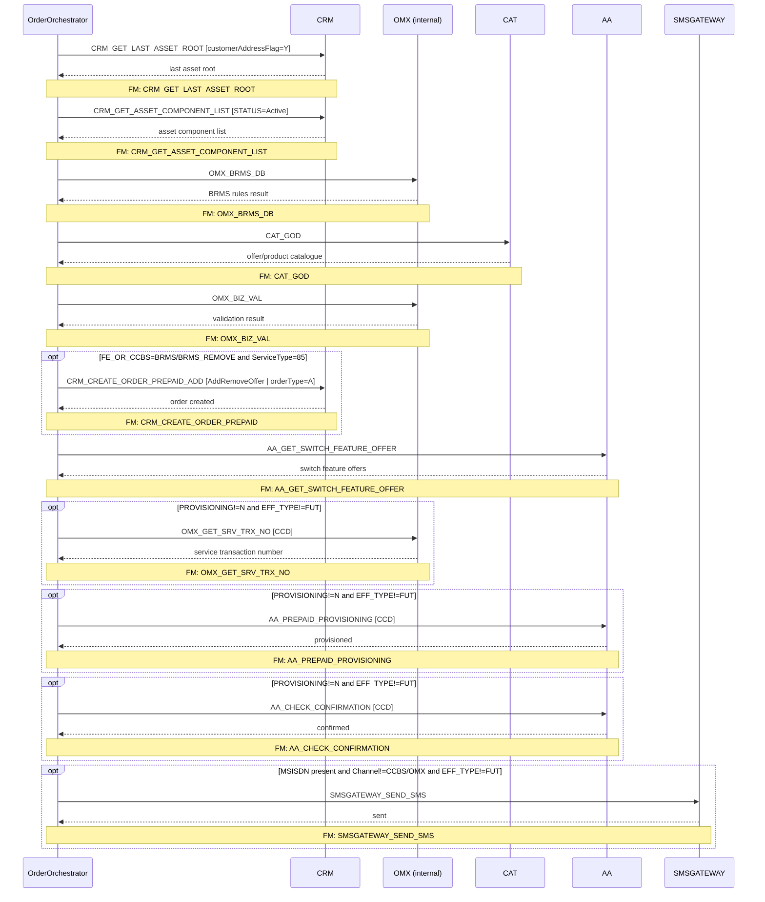

# PREPAID_GPRS_ENABLE

> Process Configuration for PREPAID_GPRS_ENABLE — Prepaid GPRS data service enablement: asset lookup, BRMS validation, CRM order creation, AA provisioning, and SMS notification.

**Total steps:** 11 | **Unique FMs:** 11 | **Entry point:** `CRM_GET_LAST_ASSET_ROOT`

---

## §2 — Order Flow

| Step | Step ID | FM (ActivityID) | Parameter(s) | PreExecCheck | Previous | Next |
|------|---------|-----------------|--------------|--------------|----------|------|
| 1 | CRM_GET_LAST_ASSET_ROOT | CRM_GET_LAST_ASSET_ROOT | `customerAddressFlag=Y` | — | START | CRM_GET_ASSET_COMPONENT_LIST |
| 2 | CRM_GET_ASSET_COMPONENT_LIST | CRM_GET_ASSET_COMPONENT_LIST | `STATUS=Active` | — | CRM_GET_LAST_ASSET_ROOT | OMX_BRMS_DB |
| 3 | OMX_BRMS_DB | OMX_BRMS_DB | — | — | CRM_GET_ASSET_COMPONENT_LIST | CAT_GOD |
| 4 | CAT_GOD | CAT_GOD | — | — | OMX_BRMS_DB | OMX_BIZ_VAL |
| 5 | OMX_BIZ_VAL | OMX_BIZ_VAL | — | — | CAT_GOD | CRM_CREATE_ORDER_PREPAID_ADD |
| 6 | CRM_CREATE_ORDER_PREPAID_ADD | CRM_CREATE_ORDER_PREPAID | `command=AddRemoveOffer \| orderType=A \| listOfRootLineItemAction=Update \| listOfLineItemAction=Add \| listOfLineItemStatus=Active \| USE_ROWID_CRM=N` | `boolean(//SubscriberOffers[ExtendedInfo[Name='FE_OR_CCBS' and (Value='BRMS' or Value='BRMS_REMOVE')] and ServiceType='85'])` | OMX_BIZ_VAL | AA_GET_SWITCH_FEATURE_OFFER |
| 7 | AA_GET_SWITCH_FEATURE_OFFER | AA_GET_SWITCH_FEATURE_OFFER | — | — | CRM_CREATE_ORDER_PREPAID_ADD | OMX_GET_SRV_TRX_NO |
| 8 | OMX_GET_SRV_TRX_NO | OMX_GET_SRV_TRX_NO | `CCD` | `(not(PROVISIONING) or PROVISIONING!='N') and (not(EFF_TYPE) or EFF_TYPE!='FUT')` | AA_GET_SWITCH_FEATURE_OFFER | AA_PREPAID_PROVISIONING |
| 9 | AA_PREPAID_PROVISIONING | AA_PREPAID_PROVISIONING | `CCD` | `(not(PROVISIONING) or PROVISIONING!='N') and (not(EFF_TYPE) or EFF_TYPE!='FUT')` | OMX_GET_SRV_TRX_NO | AA_CHECK_CONFIRMATION |
| 10 | AA_CHECK_CONFIRMATION | AA_CHECK_CONFIRMATION | `CCD` | `(not(PROVISIONING) or PROVISIONING!='N') and (not(EFF_TYPE) or EFF_TYPE!='FUT')` | AA_PREPAID_PROVISIONING | SMSGATEWAY_SEND_SMS |
| 11 | SMSGATEWAY_SEND_SMS | SMSGATEWAY_SEND_SMS | — | `boolean(//Subscriber[MSISDN][1] and Channel!="CCBS" and Channel!="OMX") and (not(EFF_TYPE) or EFF_TYPE!='FUT')` | AA_CHECK_CONFIRMATION | END |

---

## §3 — PreExecCheck Details

### Step 6 — CRM_CREATE_ORDER_PREPAID_ADD

**FM:** `CRM_CREATE_ORDER_PREPAID`

```xpath
boolean(//SubscriberOffers[ExtendedInfo[Name='FE_OR_CCBS' and (Value='BRMS' or Value='BRMS_REMOVE')]
  and ServiceType='85'])
```

Only creates the CRM order (AddRemoveOffer) if at least one SubscriberOffer has `FE_OR_CCBS=BRMS` or `BRMS_REMOVE` **and** `ServiceType=85` (GPRS/Data). Gates the CRM write to relevant data-service offers from the BRMS engine.

---

### Steps 8–10 — Provisioning gate (shared by OMX_GET_SRV_TRX_NO, AA_PREPAID_PROVISIONING, AA_CHECK_CONFIRMATION)

**FMs:** `OMX_GET_SRV_TRX_NO`, `AA_PREPAID_PROVISIONING`, `AA_CHECK_CONFIRMATION`

```xpath
(not(boolean(/ns0:OrderRequest/OrderData[ExtendedInfo[Name='PROVISIONING']]))
  or boolean(/ns0:OrderRequest/OrderData[ExtendedInfo[Name='PROVISIONING' and Value!='N']]))
and (not(boolean(//SubscriberOffers[ExtendedInfo[Name='EFF_TYPE']]))
  or boolean(//SubscriberOffers[ExtendedInfo[Name='EFF_TYPE' and Value!='FUT']]))
```

The entire AA provisioning chain is gated by two conditions:
- **PROVISIONING flag:** If the order carries `ExtendedInfo[PROVISIONING]`, its Value must not be `'N'`. Allows suppression of provisioning by upstream callers.
- **FUT offer gate:** If any SubscriberOffer has `EFF_TYPE`, at least one must not be `'FUT'`. Skips provisioning for fully future-dated updates.

---

### Step 11 — SMSGATEWAY_SEND_SMS

**FM:** `SMSGATEWAY_SEND_SMS`

```xpath
boolean(//Subscriber[MSISDN/text()][1]
  and /ns0:OrderRequest/OrderData/Channel/text()!="CCBS"
  and /ns0:OrderRequest/OrderData/Channel/text()!="OMX")
and (not(boolean(//SubscriberOffers[ExtendedInfo[Name='EFF_TYPE']]))
  or boolean(//SubscriberOffers[ExtendedInfo[Name='EFF_TYPE' and Value!='FUT']]))
```

Sends SMS confirmation only if: MSISDN is present, Channel is not CCBS or OMX (suppresses internal/back-office flows), and the offer is not purely future-dated.

---

## §4 — FM Documentation Index

| FM (ActivityID) | Used in Steps | Doc Link |
|-----------------|---------------|----------|
| CRM_GET_LAST_ASSET_ROOT | 1 | [Request_CRM_GET_LAST_ASSET_ROOT.html](../FMlogic/Request_CRM_GET_LAST_ASSET_ROOT.html) |
| CRM_GET_ASSET_COMPONENT_LIST | 2 | [Request_CRM_GET_ASSET_COMPONENT_LIST.html](../FMlogic/Request_CRM_GET_ASSET_COMPONENT_LIST.html) |
| OMX_BRMS_DB | 3 | [Request_OMX_BRMS_DB.html](../FMlogic/Request_OMX_BRMS_DB.html) |
| CAT_GOD | 4 | [Request_CAT_GOD.html](../FMlogic/Request_CAT_GOD.html) |
| OMX_BIZ_VAL | 5 | [Request_OMX_BIZ_VAL.html](../FMlogic/Request_OMX_BIZ_VAL.html) |
| CRM_CREATE_ORDER_PREPAID | 6 | [Request_CRM_CREATE_ORDER_PREPAID.html](../FMlogic/Request_CRM_CREATE_ORDER_PREPAID.html) |
| AA_GET_SWITCH_FEATURE_OFFER | 7 | [Request_AA_GET_SWITCH_FEATURE_OFFER.html](../FMlogic/Request_AA_GET_SWITCH_FEATURE_OFFER.html) |
| OMX_GET_SRV_TRX_NO | 8 | [Request_OMX_GET_SRV_TRX_NO.html](../FMlogic/Request_OMX_GET_SRV_TRX_NO.html) |
| AA_PREPAID_PROVISIONING | 9 | [Request_AA_PREPAID_PROVISIONING.html](../FMlogic/Request_AA_PREPAID_PROVISIONING.html) |
| AA_CHECK_CONFIRMATION | 10 | [Request_AA_CHECK_CONFIRMATION.html](../FMlogic/Request_AA_CHECK_CONFIRMATION.html) |
| SMSGATEWAY_SEND_SMS | 11 | [Request_SMSGATEWAY_SEND_SMS.html](../FMlogic/Request_SMSGATEWAY_SEND_SMS.html) |

---

## §5 — Sequence Diagram



> Rendered from ProcessConfig activity chain. Conditional steps wrapped in `opt` blocks.
> Full sequence diagram with flow chart: see companion HTML at `output/order/PREPAID_GPRS_ENABLE.html`

---

*TRUE Corporation OMX · Order Journey Documentation*
