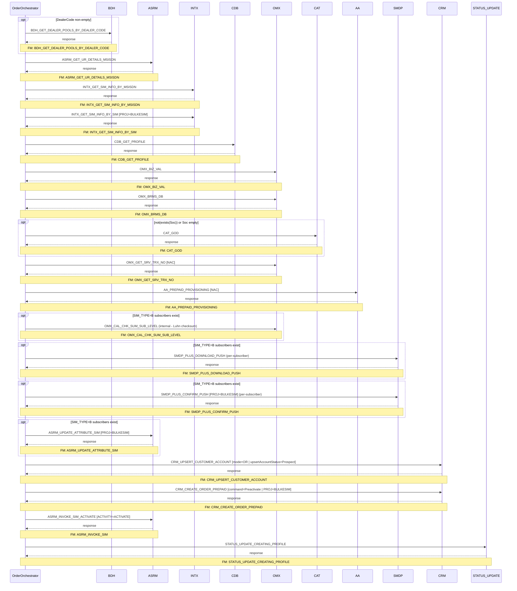

# PREPAID_PREACTIVATION

> Process Configuration for PREPAID PRE-ACTIVATION.

**Total steps:** 18 | **Unique FMs:** 18 | **Entry point:** `BDH_GET_DEALER_POOLS_BY_DEALER_CODE`

---

## §2 — Order Flow

| Step | Step ID | FM (ActivityID) | Parameter(s) | PreExecCheck | Previous | Next |
|------|---------|-----------------|--------------|--------------|----------|------|
| 1 | BDH_GET_DEALER_POOLS_BY_DEALER_CODE | BDH_GET_DEALER_POOLS_BY_DEALER_CODE | — | `string-length(/ns0:OrderRequest/OrderData/DealerCode/text())!=0` | START | ASRM_GET_UR_DETAILS_MSISDN |
| 2 | ASRM_GET_UR_DETAILS_MSISDN | ASRM_GET_UR_DETAILS_MSISDN | — | — | BDH_GET_DEALER_POOLS_BY_DEALER_CODE | INTX_GET_SIM_INFO_BY_MSISDN |
| 3 | INTX_GET_SIM_INFO_BY_MSISDN | INTX_GET_SIM_INFO_BY_MSISDN | — | — | ASRM_GET_UR_DETAILS_MSISDN | INTX_GET_SIM_INFO_BY_SIM |
| 4 | INTX_GET_SIM_INFO_BY_SIM | INTX_GET_SIM_INFO_BY_SIM | PROJ=BULKESIM | — | INTX_GET_SIM_INFO_BY_MSISDN | CDB_GET_PROFILE |
| 5 | CDB_GET_PROFILE | CDB_GET_PROFILE | — | — | INTX_GET_SIM_INFO_BY_SIM | OMX_BIZ_VAL |
| 6 | OMX_BIZ_VAL | OMX_BIZ_VAL | — | — | CDB_GET_PROFILE | OMX_BRMS_DB |
| 7 | OMX_BRMS_DB | OMX_BRMS_DB | — | — | OMX_BIZ_VAL | CAT_GOD |
| 8 | CAT_GOD | CAT_GOD | — | `not(exists(//Soc)) or string-length(//Soc/text())=0` | OMX_BRMS_DB | OMX_GET_SRV_TRX_NO |
| 9 | OMX_GET_SRV_TRX_NO | OMX_GET_SRV_TRX_NO | NAC | — | CAT_GOD | AA_PREPAID_PROVISIONING |
| 10 | AA_PREPAID_PROVISIONING | AA_PREPAID_PROVISIONING | NAC | — | OMX_GET_SRV_TRX_NO | OMX_CAL_CHK_SUM_SUB_LEVEL |
| 11 | OMX_CAL_CHK_SUM_SUB_LEVEL | OMX_CAL_CHK_SUM_SUB_LEVEL | — | `count(//Subscriber/ResourceInfo[ResourceName='SIM_TYPE' and ValuesArray="B"]) > 0` | AA_PREPAID_PROVISIONING | SMDP_PLUS_DOWNLOAD_PUSH |
| 12 | SMDP_PLUS_DOWNLOAD_PUSH | SMDP_PLUS_DOWNLOAD_PUSH | — | `count(//Subscriber/ResourceInfo[ResourceName='SIM_TYPE' and ValuesArray="B"]) > 0` | OMX_CAL_CHK_SUM_SUB_LEVEL | SMDP_PLUS_CONFIRM_PUSH |
| 13 | SMDP_PLUS_CONFIRM_PUSH | SMDP_PLUS_CONFIRM_PUSH | PROJ=BULKESIM | `count(//Subscriber/ResourceInfo[ResourceName='SIM_TYPE' and ValuesArray="B"]) > 0` | SMDP_PLUS_DOWNLOAD_PUSH | ASRM_UPDATE_ATTRIBUTE_SIM |
| 14 | ASRM_UPDATE_ATTRIBUTE_SIM | ASRM_UPDATE_ATTRIBUTE_SIM | PROJ=BULKESIM | `count(//Subscriber/ResourceInfo[ResourceName='SIM_TYPE' and ValuesArray="B"]) > 0` | SMDP_PLUS_CONFIRM_PUSH | CRM_UPSERT_CUSTOMER_ACCOUNT |
| 15 | CRM_UPSERT_CUSTOMER_ACCOUNT | CRM_UPSERT_CUSTOMER_ACCOUNT | mode=OR \| upsertAccountStatus=Prospect | — | ASRM_UPDATE_ATTRIBUTE_SIM | CRM_CREATE_ORDER_PREPAID |
| 16 | CRM_CREATE_ORDER_PREPAID | CRM_CREATE_ORDER_PREPAID | command=Preactivate \| orderType=N \| listOfRootLineItemAction=Add \| listOfRootLineItemStatus=Preactive \| listOfLineItemAction=Add \| listOfLineItemStatus=Active \| USE_ROWID_CRM=N \| PROJ=BULKESIM | — | CRM_UPSERT_CUSTOMER_ACCOUNT | ASRM_INVOKE_SIM_ACTIVATE |
| 17 | ASRM_INVOKE_SIM_ACTIVATE | ASRM_INVOKE_SIM | ACTIVITY=ACTIVATE | — | CRM_CREATE_ORDER_PREPAID | STATUS_UPDATE_CREATING_PROFILE |
| 18 | STATUS_UPDATE_CREATING_PROFILE | STATUS_UPDATE_CREATING_PROFILE | — | — | ASRM_INVOKE_SIM_ACTIVATE | END |

---

## §3 — PreExecCheck Details

### Step 1 — BDH_GET_DEALER_POOLS_BY_DEALER_CODE

**FM:** `BDH_GET_DEALER_POOLS_BY_DEALER_CODE`

```xpath
string-length(/ns0:OrderRequest/OrderData/DealerCode/text())!=0
```

Skips if no DealerCode is present on the order.

---

### Step 8 — CAT_GOD

**FM:** `CAT_GOD`

```xpath
not(exists(//Soc)) or string-length(//Soc/text())=0
```

Only calls GetOfferDetail (CAT) if no SOC (Service Order Code) is already populated.

---

### Steps 11–14 — eSIM Subscriber Gate

**FMs:** `OMX_CAL_CHK_SUM_SUB_LEVEL` (11), `SMDP_PLUS_DOWNLOAD_PUSH` (12), `SMDP_PLUS_CONFIRM_PUSH` (13), `ASRM_UPDATE_ATTRIBUTE_SIM` (14)

```xpath
count(//Subscriber/ResourceInfo[ResourceName='SIM_TYPE' and ValuesArray="B"]) > 0
```

The entire eSIM provisioning chain (Luhn checksum → SM-DP+ Download → SM-DP+ Confirm → ASRM SIM attribute update) is skipped if no eSIM subscribers (SIM_TYPE="B") are present.

---

## §4 — FM Documentation Index

| FM (ActivityID) | Used in Steps | Doc Link |
|-----------------|---------------|----------|
| BDH_GET_DEALER_POOLS_BY_DEALER_CODE | 1 | [Request_BDH_GET_DEALER_POOLS_BY_DEALER_CODE.html](../FMlogic/Request_BDH_GET_DEALER_POOLS_BY_DEALER_CODE.html) |
| ASRM_GET_UR_DETAILS_MSISDN | 2 | [Request_ASRM_GET_UR_DETAILS_MSISDN.html](../FMlogic/Request_ASRM_GET_UR_DETAILS_MSISDN.html) |
| INTX_GET_SIM_INFO_BY_MSISDN | 3 | [Request_INTX_GET_SIM_INFO_BY_MSISDN.html](../FMlogic/Request_INTX_GET_SIM_INFO_BY_MSISDN.html) |
| INTX_GET_SIM_INFO_BY_SIM | 4 | [Request_INTX_GET_SIM_INFO_BY_SIM.html](../FMlogic/Request_INTX_GET_SIM_INFO_BY_SIM.html) |
| CDB_GET_PROFILE | 5 | [Request_CDB_GET_PROFILE.html](../FMlogic/Request_CDB_GET_PROFILE.html) |
| OMX_BIZ_VAL | 6 | [Request_OMX_BIZ_VAL.html](../FMlogic/Request_OMX_BIZ_VAL.html) |
| OMX_BRMS_DB | 7 | [Request_OMX_BRMS_DB.html](../FMlogic/Request_OMX_BRMS_DB.html) |
| CAT_GOD | 8 | [Request_CAT_GOD.html](../FMlogic/Request_CAT_GOD.html) |
| OMX_GET_SRV_TRX_NO | 9 | [Request_OMX_GET_SRV_TRX_NO.html](../FMlogic/Request_OMX_GET_SRV_TRX_NO.html) |
| AA_PREPAID_PROVISIONING | 10 | [Request_AA_PREPAID_PROVISIONING.html](../FMlogic/Request_AA_PREPAID_PROVISIONING.html) |
| OMX_CAL_CHK_SUM_SUB_LEVEL | 11 | [Request_OMX_CAL_CHK_SUM_SUB_LEVEL.html](../FMlogic/Request_OMX_CAL_CHK_SUM_SUB_LEVEL.html) |
| SMDP_PLUS_DOWNLOAD_PUSH | 12 | [Request_SMDP_PLUS_DOWNLOAD_PUSH.html](../FMlogic/Request_SMDP_PLUS_DOWNLOAD_PUSH.html) |
| SMDP_PLUS_CONFIRM_PUSH | 13 | [Request_SMDP_PLUS_CONFIRM_PUSH.html](../FMlogic/Request_SMDP_PLUS_CONFIRM_PUSH.html) |
| ASRM_UPDATE_ATTRIBUTE_SIM | 14 | [Request_ASRM_UPDATE_ATTRIBUTE_SIM.html](../FMlogic/Request_ASRM_UPDATE_ATTRIBUTE_SIM.html) |
| CRM_UPSERT_CUSTOMER_ACCOUNT | 15 | [Request_CRM_UPSERT_CUSTOMER_ACCOUNT.html](../FMlogic/Request_CRM_UPSERT_CUSTOMER_ACCOUNT.html) |
| CRM_CREATE_ORDER_PREPAID | 16 | [Request_CRM_CREATE_ORDER_PREPAID.html](../FMlogic/Request_CRM_CREATE_ORDER_PREPAID.html) |
| ASRM_INVOKE_SIM | 17 (extId: ASRM_INVOKE_SIM_ACTIVATE) | [Request_ASRM_INVOKE_SIM.html](../FMlogic/Request_ASRM_INVOKE_SIM.html) |
| STATUS_UPDATE_CREATING_PROFILE | 18 | [Request_STATUS_UPDATE_CREATING_PROFILE.html](../FMlogic/Request_STATUS_UPDATE_CREATING_PROFILE.html) |

---

## §5 — Sequence Diagram



> Rendered from ProcessConfig activity chain. Conditional steps wrapped in `opt` blocks.
> Full sequence diagram with flow chart: see companion HTML at `output/order/PREPAID_PREACTIVATION.html`

---

*TRUE Corporation OMX · Order Journey Documentation*
