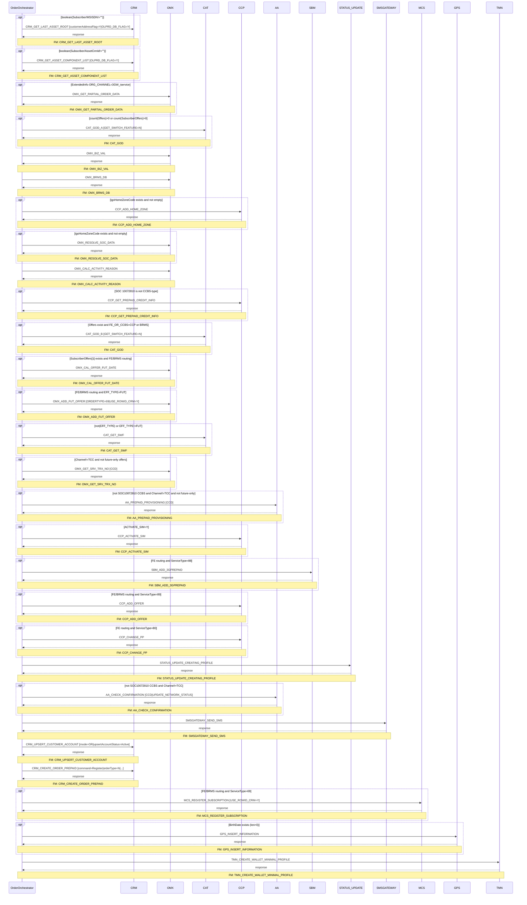

# PREPAID_REGISTRATION

> Process Configuration for PREPAID_REGISTRATION — Prepaid SIM Registration, Wallet Setup, and CRM Record Creation

**Total steps:** 28 | **Unique FMs:** 27 | **Entry point:** CRM_GET_LAST_ASSET_ROOT | **Steps with PreExecCheck:** 21/28

---

## §2 — Order Flow

| Step | Step ID | FM (ActivityID) | Parameter(s) | PreExecCheck | Previous | Next |
|------|---------|-----------------|--------------|--------------|----------|------|
| 1 | CRM_GET_LAST_ASSET_ROOT | [CRM_GET_LAST_ASSET_ROOT](../FMlogic/Request_CRM_GET_LAST_ASSET_ROOT.html) | customerAddressFlag=Y \| OLPRD_DB_FLAG=Y | `boolean(//Subscriber/MSISDN!="")` | START | CRM_GET_ASSET_COMPONENT_LIST |
| 2 | CRM_GET_ASSET_COMPONENT_LIST | [CRM_GET_ASSET_COMPONENT_LIST](../FMlogic/Request_CRM_GET_ASSET_COMPONENT_LIST.html) | OLPRD_DB_FLAG=Y | `boolean(//Subscriber/AssetCrmId!="")` | CRM_GET_LAST_ASSET_ROOT | OMX_GET_PARTIAL_ORDER_DATA |
| 3 | OMX_GET_PARTIAL_ORDER_DATA | [OMX_GET_PARTIAL_ORDER_DATA](../FMlogic/Request_OMX_GET_PARTIAL_ORDER_DATA.html) | — | `//Order/ExtendedInfo[Name='ORG_CHANNEL' and Value='3GW_iservice']` | CRM_GET_ASSET_COMPONENT_LIST | CAT_GOD_A |
| 4 | CAT_GOD_A | [CAT_GOD](../FMlogic/Request_CAT_GOD.html) | GET_SWITCH_FEATURE=N | `count(//Offers) > 0 or count(//SubscriberOffers) > 0` | OMX_GET_PARTIAL_ORDER_DATA | OMX_BIZ_VAL |
| 5 | OMX_BIZ_VAL | [OMX_BIZ_VAL](../FMlogic/Request_OMX_BIZ_VAL.html) | — | — | CAT_GOD_A | OMX_BRMS_DB |
| 6 | OMX_BRMS_DB | [OMX_BRMS_DB](../FMlogic/Request_OMX_BRMS_DB.html) | — | — | OMX_BIZ_VAL | CCP_ADD_HOME_ZONE |
| 7 | CCP_ADD_HOME_ZONE | [CCP_ADD_HOME_ZONE](../FMlogic/Request_CCP_ADD_HOME_ZONE.html) | — | `boolean(//OrderData[ExtendedInfo[Name="igoHomeZoneCode" and Value!=""]])` | OMX_BRMS_DB | OMX_RESOLVE_SOC_DATA |
| 8 | OMX_RESOLVE_SOC_DATA | [OMX_RESOLVE_SOC_DATA](../FMlogic/Request_OMX_RESOLVE_SOC_DATA.html) | — | `boolean(//OrderData[ExtendedInfo[Name="igoHomeZoneCode" and Value!=""]])` | CCP_ADD_HOME_ZONE | OMX_CALC_ACTIVITY_REASON |
| 9 | OMX_CALC_ACTIVITY_REASON | [OMX_CALC_ACTIVITY_REASON](../FMlogic/Request_OMX_CALC_ACTIVITY_REASON.html) | — | — | OMX_RESOLVE_SOC_DATA | CCP_GET_PREPAID_CREDIT_INFO |
| 10 | CCP_GET_PREPAID_CREDIT_INFO | [CCP_GET_PREPAID_CREDIT_INFO](../FMlogic/Request_CCP_GET_PREPAID_CREDIT_INFO.html) | — | `not(//SubscriberOffers/Soc/text()="10072810" and FE_OR_CCBS[../Soc='10072810']='CCBS')` | OMX_CALC_ACTIVITY_REASON | CAT_GOD_B |
| 11 | CAT_GOD_B | [CAT_GOD](../FMlogic/Request_CAT_GOD.html) | GET_SWITCH_FEATURE=N | `(count(//Offers)>0 or count(//SubscriberOffers)>0) and FE_OR_CCBS=CCP or BRMS` | CCP_GET_PREPAID_CREDIT_INFO | OMX_CAL_OFFER_FUT_DATE |
| 12 | OMX_CAL_OFFER_FUT_DATE | [OMX_CAL_OFFER_FUT_DATE](../FMlogic/Request_OMX_CAL_OFFER_FUT_DATE.html) | — | `boolean(//Subscriber/SubscriberOffers[1] and //SubscriberOffers[FE_OR_CCBS=FE or BRMS])` | CAT_GOD_B | OMX_ADD_FUT_OFFER |
| 13 | OMX_ADD_FUT_OFFER | [OMX_ADD_FUT_OFFER](../FMlogic/Request_OMX_ADD_FUT_OFFER.html) | ORDERTYPE=69 \| USE_ROWID_CRM=Y | `boolean(//Subscriber/SubscriberOffers[1] and FE/BRMS routing and EFF_TYPE=FUT)` | OMX_CAL_OFFER_FUT_DATE | CAT_GET_SWF |
| 14 | CAT_GET_SWF | [CAT_GET_SWF](../FMlogic/Request_CAT_GET_SWF.html) | — | `not(EFF_TYPE) or EFF_TYPE!=FUT` | OMX_ADD_FUT_OFFER | OMX_GET_SRV_TRX_NO |
| 15 | OMX_GET_SRV_TRX_NO | [OMX_GET_SRV_TRX_NO](../FMlogic/Request_OMX_GET_SRV_TRX_NO.html) | CCD | `Channel!="TCC" and (not(EFF_TYPE) or EFF_TYPE!=FUT)` | CAT_GET_SWF | AA_PREPAID_PROVISIONING |
| 16 | AA_PREPAID_PROVISIONING | [AA_PREPAID_PROVISIONING](../FMlogic/Request_AA_PREPAID_PROVISIONING.html) | CCD | `not SOC10072810 CCBS and Channel!=TCC and not future-only` | OMX_GET_SRV_TRX_NO | CCP_ACTIVATE_SIM |
| 17 | CCP_ACTIVATE_SIM | [CCP_ACTIVATE_SIM](../FMlogic/Request_CCP_ACTIVATE_SIM.html) | — | `//Order/ExtendedInfo[name='ACTIVATE_SIM' and value='Y']` | AA_PREPAID_PROVISIONING | SBM_ADD_3GPREPAID |
| 18 | SBM_ADD_3GPREPAID | [SBM_ADD_3GPREPAID](../FMlogic/Request_SBM_ADD_3GPREPAID.html) | — | `boolean(//SubscriberOffers[FE_OR_CCBS=FE and ServiceType='88'])` | CCP_ACTIVATE_SIM | CCP_ADD_OFFER |
| 19 | CCP_ADD_OFFER | [CCP_ADD_OFFER](../FMlogic/Request_CCP_ADD_OFFER.html) | — | `boolean(//SubscriberOffers[FE_OR_CCBS=FE/BRMS and ServiceType='89'])` | SBM_ADD_3GPREPAID | CCP_CHANGE_PP |
| 20 | CCP_CHANGE_PP | [CCP_CHANGE_PP](../FMlogic/Request_CCP_CHANGE_PP.html) | — | `boolean(//SubscriberOffers[FE_OR_CCBS=FE and ServiceType='80'])` | CCP_ADD_OFFER | STATUS_UPDATE_CREATING_PROFILE |
| 21 | STATUS_UPDATE_CREATING_PROFILE | [STATUS_UPDATE_CREATING_PROFILE](../FMlogic/Request_STATUS_UPDATE_CREATING_PROFILE.html) | — | — | CCP_CHANGE_PP | SMSGATEWAY_SEND_SMS |
| 22 | AA_CHECK_CONFIRMATION | [AA_CHECK_CONFIRMATION](../FMlogic/Request_AA_CHECK_CONFIRMATION.html) | CCD \| UPDATE_NETWORK_STATUS | `not SOC10072810 CCBS and Channel!=TCC` | STATUS_UPDATE_CREATING_PROFILE | SMSGATEWAY_SEND_SMS |
| 23 | SMSGATEWAY_SEND_SMS | [SMSGATEWAY_SEND_SMS](../FMlogic/Request_SMSGATEWAY_SEND_SMS.html) | — | — | STATUS_UPDATE_CREATING_PROFILE | CRM_UPSERT_CUSTOMER_ACCOUNT |
| 24 | CRM_UPSERT_CUSTOMER_ACCOUNT | [CRM_UPSERT_CUSTOMER_ACCOUNT](../FMlogic/Request_CRM_UPSERT_CUSTOMER_ACCOUNT.html) | mode=OR \| upsertAccountStatus=Active | — | SMSGATEWAY_SEND_SMS | CRM_CREATE_ORDER_PREPAID |
| 25 | CRM_CREATE_ORDER_PREPAID | [CRM_CREATE_ORDER_PREPAID](../FMlogic/Request_CRM_CREATE_ORDER_PREPAID.html) | command=Register \| orderType=N \| listOfRootLineItemAction=Update \| listOfRootLineItemStatus=Active \| listOfLineItemAction=Add \| listOfLineItemStatus=Active \| USE_ROWID_CRM=N | — | CRM_UPSERT_CUSTOMER_ACCOUNT | MCS_REGISTER_SUBSCRIPTION |
| 26 | MCS_REGISTER_SUBSCRIPTION | [MCS_REGISTER_SUBSCRIPTION](../FMlogic/Request_MCS_REGISTER_SUBSCRIPTION.html) | USE_ROWID_CRM=Y | `boolean(//SubscriberOffers[FE_OR_CCBS=BRMS/FE and ServiceType='69'])` | CRM_CREATE_ORDER_PREPAID | GPS_INSERT_INFORMATION |
| 27 | GPS_INSERT_INFORMATION | [GPS_INSERT_INFORMATION](../FMlogic/Request_GPS_INSERT_INFORMATION.html) | — | `string-length(//Customer/CustomerGeneralInfo/BirthDate)>0` | MCS_REGISTER_SUBSCRIPTION | TMN_CREATE_WALLET_MINIMAL_PROFILE |
| 28 | TMN_CREATE_WALLET_MINIMAL_PROFILE | [TMN_CREATE_WALLET_MINIMAL_PROFILE](../FMlogic/Request_TMN_CREATE_WALLET_MINIMAL_PROFILE.html) | — | — | GPS_INSERT_INFORMATION | END |

---

## §3 — PreExecCheck Details

### Step 1 — CRM_GET_LAST_ASSET_ROOT

**FM:** `CRM_GET_LAST_ASSET_ROOT`

```xpath
boolean(//Subscriber/MSISDN!="")
```

Executes only when the subscriber has a non-empty MSISDN. Skips if MSISDN is absent.

---

### Step 2 — CRM_GET_ASSET_COMPONENT_LIST

**FM:** `CRM_GET_ASSET_COMPONENT_LIST`

```xpath
boolean(//Subscriber/AssetCrmId!="")
```

Executes only when an AssetCrmId was returned from step 1.

---

### Step 3 — OMX_GET_PARTIAL_ORDER_DATA

**FM:** `OMX_GET_PARTIAL_ORDER_DATA`

```xpath
//Order/ExtendedInfo[Name='ORG_CHANNEL' and Value='3GW_iservice']
```

Executes only for orders originating from the 3GW iService channel (online self-service).

---

### Step 4 — CAT_GOD_A

**FM:** `CAT_GOD` (GET_SWITCH_FEATURE=N)

```xpath
count(//Offers) > 0 or count(//SubscriberOffers) > 0
```

Executes when there is at least one Offer or SubscriberOffer.

---

### Step 7 — CCP_ADD_HOME_ZONE

**FM:** `CCP_ADD_HOME_ZONE`

```xpath
boolean(//OrderData[ExtendedInfo[Name="igoHomeZoneCode" and Value!=""]])
```

Executes only when the order carries a non-empty igoHomeZoneCode.

---

### Step 8 — OMX_RESOLVE_SOC_DATA

**FM:** `OMX_RESOLVE_SOC_DATA`

```xpath
boolean(//OrderData[ExtendedInfo[Name="igoHomeZoneCode" and Value!=""]])
```

Same gate as step 7 — resolves SOC data for home zone offers.

---

### Step 10 — CCP_GET_PREPAID_CREDIT_INFO

**FM:** `CCP_GET_PREPAID_CREDIT_INFO`

```xpath
not(//SubscriberOffers/Soc/text() ="10072810" and //SubscriberOffers/ExtendedInfo[Name='FE_OR_CCBS' and ../Soc='10072810']/Value/text()='CCBS')
```

Skips when SOC 10072810 is present as a pure CCBS offer.

---

### Step 11 — CAT_GOD_B

**FM:** `CAT_GOD` (GET_SWITCH_FEATURE=N)

```xpath
(count(//Offers) > 0 or count(//SubscriberOffers) > 0) and boolean(//SubscriberOffers/ExtendedInfo[Name='FE_OR_CCBS' and (Value='CCP' or Value='BRMS')])
```

Second CAT_GOD call — executes when offers exist AND the offer routing is CCP or BRMS.

---

### Step 12 — OMX_CAL_OFFER_FUT_DATE

**FM:** `OMX_CAL_OFFER_FUT_DATE`

```xpath
boolean(//Subscriber/SubscriberOffers[1] and //SubscriberOffers[ExtendedInfo[Name='FE_OR_CCBS' and (Value='FE' or Value='BRMS')]])
```

Calculates future effective dates for FE or BRMS-routed offers.

---

### Step 13 — OMX_ADD_FUT_OFFER

**FM:** `OMX_ADD_FUT_OFFER` (ORDERTYPE=69, USE_ROWID_CRM=Y)

```xpath
boolean(//Subscriber/SubscriberOffers[1] and //SubscriberOffers[ExtendedInfo[Name='FE_OR_CCBS' and (Value='FE' or Value='BRMS')] and ExtendedInfo[Name='EFF_TYPE' and Value='FUT']])
```

Adds a future-dated offer (EFF_TYPE=FUT). ORDERTYPE=69 identifies prepaid future offer.

---

### Step 14 — CAT_GET_SWF

**FM:** `CAT_GET_SWF`

```xpath
(not(boolean(//SubscriberOffers[ExtendedInfo[Name='EFF_TYPE']])) or boolean(//SubscriberOffers[ExtendedInfo[Name='EFF_TYPE' and Value!='FUT']]))
```

Gets switch feature for immediately-effective offers. Skips when ALL offers are future-dated.

---

### Step 15 — OMX_GET_SRV_TRX_NO

**FM:** `OMX_GET_SRV_TRX_NO` (CCD)

```xpath
//OrderData/Channel/text()!="TCC" and (not(boolean(//SubscriberOffers[ExtendedInfo[Name='EFF_TYPE']])) or boolean(//SubscriberOffers[ExtendedInfo[Name='EFF_TYPE' and Value!='FUT']]))
```

Gets service transaction number. Skips for TCC channel orders and future-only offer orders.

---

### Step 16 — AA_PREPAID_PROVISIONING

**FM:** `AA_PREPAID_PROVISIONING` (CCD)

```xpath
not(//SubscriberOffers/Soc/text() ="10072810" and //SubscriberOffers/ExtendedInfo[Name='FE_OR_CCBS' and ../Soc='10072810']/Value/text()='CCBS') and (//OrderData/Channel/text()!="TCC") and (not(boolean(//SubscriberOffers[ExtendedInfo[Name='EFF_TYPE']])) or boolean(//SubscriberOffers[ExtendedInfo[Name='EFF_TYPE' and Value!='FUT']]))
```

Network provisioning for prepaid. Excludes CCBS-type SOC 10072810 orders, TCC channel, and future-only orders.

---

### Step 17 — CCP_ACTIVATE_SIM

**FM:** `CCP_ACTIVATE_SIM`

```xpath
//Order/ExtendedInfo[name='ACTIVATE_SIM' and value='Y']
```

SIM activation in CCP. Only triggered when the order explicitly carries ACTIVATE_SIM=Y.

---

### Step 18 — SBM_ADD_3GPREPAID

**FM:** `SBM_ADD_3GPREPAID`

```xpath
boolean(//SubscriberOffers[ExtendedInfo[Name='FE_OR_CCBS' and Value='FE'] and ServiceType='88'])
```

Adds 3G prepaid profile in SBM. Only for FE-routed offers with ServiceType=88.

---

### Step 19 — CCP_ADD_OFFER

**FM:** `CCP_ADD_OFFER`

```xpath
boolean(//SubscriberOffers[ExtendedInfo[Name='FE_OR_CCBS' and (Value='FE' or Value='BRMS')] and ServiceType='89'])
```

Adds tariff plan offer in CCP. ServiceType=89 = prepaid tariff plan. Runs for FE or BRMS-routed offers.

---

### Step 20 — CCP_CHANGE_PP

**FM:** `CCP_CHANGE_PP`

```xpath
boolean(//SubscriberOffers[ExtendedInfo[Name='FE_OR_CCBS' and Value='FE'] and ServiceType='80'])
```

Changes price plan in CCP. ServiceType=80 = price plan. Only for FE-routed offers.

---

### Step 22 — AA_CHECK_CONFIRMATION

**FM:** `AA_CHECK_CONFIRMATION` (CCD, UPDATE_NETWORK_STATUS)

```xpath
not(//SubscriberOffers/Soc/text() ="10072810" and //SubscriberOffers/ExtendedInfo[Name='FE_OR_CCBS' and ../Soc='10072810']/Value/text()='CCBS') and (//OrderData/Channel/text()!="TCC")
```

Network confirmation check after provisioning. Skips for CCBS-type orders and TCC channel.

---

### Step 26 — MCS_REGISTER_SUBSCRIPTION

**FM:** `MCS_REGISTER_SUBSCRIPTION` (USE_ROWID_CRM=Y)

```xpath
boolean(//Subscriber/SubscriberOffers[ExtendedInfo[Name='FE_OR_CCBS' and (Value='BRMS' or Value='FE')] and ServiceType='69'])
```

Registers subscription in MCS. ServiceType=69 = content/VAS subscription.

---

### Step 27 — GPS_INSERT_INFORMATION

**FM:** `GPS_INSERT_INFORMATION`

```xpath
string-length(//Customer/CustomerGeneralInfo/BirthDate)>0
```

Inserts birth date into GPS. Only runs when the customer's birth date is available.

---

## §4 — FM Documentation Index

| FM (ActivityID) | Used in Steps | Doc Link |
|-----------------|---------------|----------|
| CRM_GET_LAST_ASSET_ROOT | 1 | [Request_CRM_GET_LAST_ASSET_ROOT.html](../FMlogic/Request_CRM_GET_LAST_ASSET_ROOT.html) |
| CRM_GET_ASSET_COMPONENT_LIST | 2 | [Request_CRM_GET_ASSET_COMPONENT_LIST.html](../FMlogic/Request_CRM_GET_ASSET_COMPONENT_LIST.html) |
| OMX_GET_PARTIAL_ORDER_DATA | 3 | [Request_OMX_GET_PARTIAL_ORDER_DATA.html](../FMlogic/Request_OMX_GET_PARTIAL_ORDER_DATA.html) |
| CAT_GOD | 4 (CAT_GOD_A), 11 (CAT_GOD_B) | [Request_CAT_GOD.html](../FMlogic/Request_CAT_GOD.html) |
| OMX_BIZ_VAL | 5 | [Request_OMX_BIZ_VAL.html](../FMlogic/Request_OMX_BIZ_VAL.html) |
| OMX_BRMS_DB | 6 | [Request_OMX_BRMS_DB.html](../FMlogic/Request_OMX_BRMS_DB.html) |
| CCP_ADD_HOME_ZONE | 7 | [Request_CCP_ADD_HOME_ZONE.html](../FMlogic/Request_CCP_ADD_HOME_ZONE.html) |
| OMX_RESOLVE_SOC_DATA | 8 | [Request_OMX_RESOLVE_SOC_DATA.html](../FMlogic/Request_OMX_RESOLVE_SOC_DATA.html) |
| OMX_CALC_ACTIVITY_REASON | 9 | [Request_OMX_CALC_ACTIVITY_REASON.html](../FMlogic/Request_OMX_CALC_ACTIVITY_REASON.html) |
| CCP_GET_PREPAID_CREDIT_INFO | 10 | [Request_CCP_GET_PREPAID_CREDIT_INFO.html](../FMlogic/Request_CCP_GET_PREPAID_CREDIT_INFO.html) |
| OMX_CAL_OFFER_FUT_DATE | 12 | [Request_OMX_CAL_OFFER_FUT_DATE.html](../FMlogic/Request_OMX_CAL_OFFER_FUT_DATE.html) |
| OMX_ADD_FUT_OFFER | 13 | [Request_OMX_ADD_FUT_OFFER.html](../FMlogic/Request_OMX_ADD_FUT_OFFER.html) |
| CAT_GET_SWF | 14 | [Request_CAT_GET_SWF.html](../FMlogic/Request_CAT_GET_SWF.html) |
| OMX_GET_SRV_TRX_NO | 15 | [Request_OMX_GET_SRV_TRX_NO.html](../FMlogic/Request_OMX_GET_SRV_TRX_NO.html) |
| AA_PREPAID_PROVISIONING | 16 | [Request_AA_PREPAID_PROVISIONING.html](../FMlogic/Request_AA_PREPAID_PROVISIONING.html) |
| CCP_ACTIVATE_SIM | 17 | [Request_CCP_ACTIVATE_SIM.html](../FMlogic/Request_CCP_ACTIVATE_SIM.html) |
| SBM_ADD_3GPREPAID | 18 | [Request_SBM_ADD_3GPREPAID.html](../FMlogic/Request_SBM_ADD_3GPREPAID.html) |
| CCP_ADD_OFFER | 19 | [Request_CCP_ADD_OFFER.html](../FMlogic/Request_CCP_ADD_OFFER.html) |
| CCP_CHANGE_PP | 20 | [Request_CCP_CHANGE_PP.html](../FMlogic/Request_CCP_CHANGE_PP.html) |
| STATUS_UPDATE_CREATING_PROFILE | 21 | [Request_STATUS_UPDATE_CREATING_PROFILE.html](../FMlogic/Request_STATUS_UPDATE_CREATING_PROFILE.html) |
| AA_CHECK_CONFIRMATION | 22 | [Request_AA_CHECK_CONFIRMATION.html](../FMlogic/Request_AA_CHECK_CONFIRMATION.html) |
| SMSGATEWAY_SEND_SMS | 23 | [Request_SMSGATEWAY_SEND_SMS.html](../FMlogic/Request_SMSGATEWAY_SEND_SMS.html) |
| CRM_UPSERT_CUSTOMER_ACCOUNT | 24 | [Request_CRM_UPSERT_CUSTOMER_ACCOUNT.html](../FMlogic/Request_CRM_UPSERT_CUSTOMER_ACCOUNT.html) |
| CRM_CREATE_ORDER_PREPAID | 25 | [Request_CRM_CREATE_ORDER_PREPAID.html](../FMlogic/Request_CRM_CREATE_ORDER_PREPAID.html) |
| MCS_REGISTER_SUBSCRIPTION | 26 | [Request_MCS_REGISTER_SUBSCRIPTION.html](../FMlogic/Request_MCS_REGISTER_SUBSCRIPTION.html) |
| GPS_INSERT_INFORMATION | 27 | [Request_GPS_INSERT_INFORMATION.html](../FMlogic/Request_GPS_INSERT_INFORMATION.html) |
| TMN_CREATE_WALLET_MINIMAL_PROFILE | 28 | [Request_TMN_CREATE_WALLET_MINIMAL_PROFILE.html](../FMlogic/Request_TMN_CREATE_WALLET_MINIMAL_PROFILE.html) |

---

## §5 — Sequence Diagram



> Rendered from ProcessConfig activity chain. Conditional steps wrapped in `opt` blocks.
> Full sequence diagram with flow chart: see the companion HTML at `output/order/PREPAID_REGISTRATION.html`

---

*TRUE Corporation OMX · Order Journey Documentation · PREPAID_REGISTRATION*
