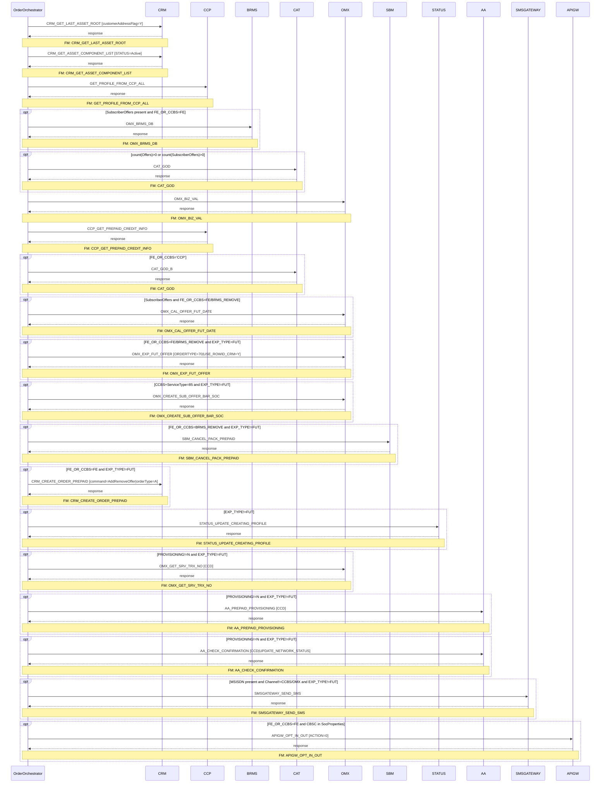

# PREPAID_REMOVE_OFFER

> Process Configuration for PREPAID_REMOVE_OFFER — remove prepaid offers including future-dated and BRMS-driven removals across FE, CCP, CCBS, and BRMS_REMOVE routing paths.

**Total steps:** 19 | **Unique FMs:** 18 | **Entry point:** CRM_GET_LAST_ASSET_ROOT | **Generated:** 2026-09-16

---

## §2 — Order Flow

| Step | Step ID | FM (ActivityID) | Parameter(s) | PreExecCheck | Previous | Next |
|------|---------|-----------------|--------------|--------------|----------|------|
| 1 | CRM_GET_LAST_ASSET_ROOT | CRM_GET_LAST_ASSET_ROOT | customerAddressFlag=Y | — | START | CRM_GET_ASSET_COMPONENT_LIST |
| 2 | CRM_GET_ASSET_COMPONENT_LIST | CRM_GET_ASSET_COMPONENT_LIST | STATUS=Active | — | CRM_GET_LAST_ASSET_ROOT | GET_PROFILE_FROM_CCP_ALL |
| 3 | GET_PROFILE_FROM_CCP_ALL | GET_PROFILE_FROM_CCP_ALL | — | — | CRM_GET_ASSET_COMPONENT_LIST | OMX_BRMS_DB |
| 4 | OMX_BRMS_DB | OMX_BRMS_DB | — | `boolean(SubscriberOffers[1] and FE_OR_CCBS=FE)` | GET_PROFILE_FROM_CCP_ALL | CAT_GOD |
| 5 | CAT_GOD | CAT_GOD | — | `count(//Offers)>0 or count(//SubscriberOffers)>0` | OMX_BRMS_DB | OMX_BIZ_VAL |
| 6 | OMX_BIZ_VAL | OMX_BIZ_VAL | — | — | CAT_GOD | CCP_GET_PREPAID_CREDIT_INFO |
| 7 | CCP_GET_PREPAID_CREDIT_INFO | CCP_GET_PREPAID_CREDIT_INFO | — | — | OMX_BIZ_VAL | CAT_GOD_B |
| 8 | CAT_GOD_B | CAT_GOD | — | `FE_OR_CCBS='CCP'` | CCP_GET_PREPAID_CREDIT_INFO | OMX_CAL_OFFER_FUT_DATE |
| 9 | OMX_CAL_OFFER_FUT_DATE | OMX_CAL_OFFER_FUT_DATE | — | `SubscriberOffers[1] and FE_OR_CCBS=FE or BRMS_REMOVE` | CAT_GOD_B | OMX_EXP_FUT_OFFER |
| 10 | OMX_EXP_FUT_OFFER | OMX_EXP_FUT_OFFER | ORDERTYPE=70 \| USE_ROWID_CRM=Y | `FE_OR_CCBS=FE/BRMS_REMOVE and EXP_TYPE=FUT` | OMX_CAL_OFFER_FUT_DATE | OMX_CREATE_SUB_OFFER_BAR_SOC |
| 11 | OMX_CREATE_SUB_OFFER_BAR_SOC | OMX_CREATE_SUB_OFFER_BAR_SOC | — | `CCBS and ServiceType=85 and EXP_TYPE!=FUT` | OMX_EXP_FUT_OFFER | SBM_CANCEL_PACK_PREPAID |
| 12 | SBM_CANCEL_PACK_PREPAID | SBM_CANCEL_PACK_PREPAID | — | `FE_OR_CCBS=BRMS_REMOVE and EXP_TYPE!=FUT` | OMX_CREATE_SUB_OFFER_BAR_SOC | CRM_CREATE_ORDER_PREPAID |
| 13 | CRM_CREATE_ORDER_PREPAID | CRM_CREATE_ORDER_PREPAID | command=AddRemoveOffer \| orderType=A \| listOfRootLineItemAction=Update \| listOfLineItemAction=Delete \| listOfLineItemStatus=Inactive \| USE_ROWID_CRM=N | `FE_OR_CCBS=FE and EXP_TYPE!=FUT` | SBM_CANCEL_PACK_PREPAID | STATUS_UPDATE_CREATING_PROFILE |
| 14 | STATUS_UPDATE_CREATING_PROFILE | STATUS_UPDATE_CREATING_PROFILE | — | `not(EXP_TYPE) or EXP_TYPE!=FUT` | CRM_CREATE_ORDER_PREPAID | OMX_GET_SRV_TRX_NO |
| 15 | OMX_GET_SRV_TRX_NO | OMX_GET_SRV_TRX_NO | CCD | `PROVISIONING!=N and EXP_TYPE!=FUT` | STATUS_UPDATE_CREATING_PROFILE | AA_PREPAID_PROVISIONING |
| 16 | AA_PREPAID_PROVISIONING | AA_PREPAID_PROVISIONING | CCD | `PROVISIONING!=N and EXP_TYPE!=FUT` | OMX_GET_SRV_TRX_NO | AA_CHECK_CONFIRMATION |
| 17 | AA_CHECK_CONFIRMATION | AA_CHECK_CONFIRMATION | CCD \| UPDATE_NETWORK_STATUS | `PROVISIONING!=N and EXP_TYPE!=FUT` | AA_PREPAID_PROVISIONING | SMSGATEWAY_SEND_SMS |
| 18 | SMSGATEWAY_SEND_SMS | SMSGATEWAY_SEND_SMS | — | `MSISDN present and Channel!=CCBS/OMX and EXP_TYPE!=FUT` | AA_CHECK_CONFIRMATION | APIGW_OPT_IN_OUT |
| 19 | APIGW_OPT_IN_OUT | APIGW_OPT_IN_OUT | ACTION=0 | `FE_OR_CCBS=FE and SocProperties contains CBSC` | SMSGATEWAY_SEND_SMS | END |

---

## §3 — PreExecCheck Details

### Step 4 — OMX_BRMS_DB

**FM:** `OMX_BRMS_DB` | [FM Doc](../FMlogic/Request_OMX_BRMS_DB.html)

BRMS query runs only when offers are present and routing is FE.

```xpath
boolean(//Subscriber/SubscriberOffers[1]
  and //SubscriberOffers[ExtendedInfo[Name='FE_OR_CCBS' and Value='FE']])
```

---

### Step 5 — CAT_GOD (first pass)

**FM:** `CAT_GOD` | [FM Doc](../FMlogic/Request_CAT_GOD.html)

```xpath
count(//Offers) > 0 or count(//SubscriberOffers) > 0
```

---

### Step 8 — CAT_GOD_B (CCP pass)

**FM:** `CAT_GOD` | [FM Doc](../FMlogic/Request_CAT_GOD.html)

```xpath
//SubscriberOffers/ExtendedInfo[Name='FE_OR_CCBS']/Value/text()='CCP'
```

---

### Step 9 — OMX_CAL_OFFER_FUT_DATE

**FM:** `OMX_CAL_OFFER_FUT_DATE` | [FM Doc](../FMlogic/Request_OMX_CAL_OFFER_FUT_DATE.html)

```xpath
boolean(//Subscriber/SubscriberOffers[1]
  and //SubscriberOffers[ExtendedInfo[Name='FE_OR_CCBS'
    and (Value='FE' or Value='BRMS_REMOVE')]])
```

---

### Step 10 — OMX_EXP_FUT_OFFER

**FM:** `OMX_EXP_FUT_OFFER` | [FM Doc](../FMlogic/Request_OMX_EXP_FUT_OFFER.html)

Only for future-dated offers (EXP_TYPE=FUT) on FE or BRMS_REMOVE path.

```xpath
boolean(//Subscriber/SubscriberOffers[1]
  and //SubscriberOffers[ExtendedInfo[Name='FE_OR_CCBS'
    and (Value='FE' or Value='BRMS_REMOVE')]
    and ExtendedInfo[Name='EXP_TYPE' and Value='FUT']])
```

---

### Step 11 — OMX_CREATE_SUB_OFFER_BAR_SOC

**FM:** `OMX_CREATE_SUB_OFFER_BAR_SOC` | [FM Doc](../FMlogic/Request_OMX_CREATE_SUB_OFFER_BAR_SOC.html)

```xpath
boolean(//Subscriber/SubscriberOffers[1]
  and //SubscriberOffers[ExtendedInfo[Name='FE_OR_CCBS' and Value='CCBS']
    and ServiceType='85'])
and (not(boolean(//SubscriberOffers[ExtendedInfo[Name='EXP_TYPE']]))
     or boolean(//SubscriberOffers[ExtendedInfo[Name='EXP_TYPE' and Value!='FUT']]))
```

---

### Step 12 — SBM_CANCEL_PACK_PREPAID

**FM:** `SBM_CANCEL_PACK_PREPAID` | [FM Doc](../FMlogic/Request_SBM_CANCEL_PACK_PREPAID.html)

```xpath
(//SubscriberOffers/ExtendedInfo[Name='FE_OR_CCBS']/Value/text()='BRMS_REMOVE')
and (not(boolean(//SubscriberOffers[ExtendedInfo[Name='EXP_TYPE']]))
     or boolean(//SubscriberOffers[ExtendedInfo[Name='EXP_TYPE' and Value!='FUT']]))
```

---

### Step 13 — CRM_CREATE_ORDER_PREPAID

**FM:** `CRM_CREATE_ORDER_PREPAID` | [FM Doc](../FMlogic/Request_CRM_CREATE_ORDER_PREPAID.html)

```xpath
(//SubscriberOffers/ExtendedInfo[Name='FE_OR_CCBS']/Value/text()='FE')
and (not(boolean(//SubscriberOffers[ExtendedInfo[Name='EXP_TYPE']]))
     or boolean(//SubscriberOffers[ExtendedInfo[Name='EXP_TYPE' and Value!='FUT']]))
```

---

### Step 14 — STATUS_UPDATE_CREATING_PROFILE

**FM:** `STATUS_UPDATE_CREATING_PROFILE` | [FM Doc](../FMlogic/Request_STATUS_UPDATE_CREATING_PROFILE.html)

Skipped for future-dated offers.

```xpath
not(boolean(//SubscriberOffers[ExtendedInfo[Name='EXP_TYPE']]))
or boolean(//SubscriberOffers[ExtendedInfo[Name='EXP_TYPE' and Value!='FUT']])
```

---

### Step 15 — OMX_GET_SRV_TRX_NO

**FM:** `OMX_GET_SRV_TRX_NO` | [FM Doc](../FMlogic/Request_OMX_GET_SRV_TRX_NO.html)

```xpath
(not(boolean(/ns0:OrderRequest/OrderData[ExtendedInfo[Name='PROVISIONING']]))
 or boolean(/ns0:OrderRequest/OrderData[ExtendedInfo[Name='PROVISIONING' and Value!='N']]))
and (not(boolean(//SubscriberOffers[ExtendedInfo[Name='EXP_TYPE']]))
     or boolean(//SubscriberOffers[ExtendedInfo[Name='EXP_TYPE' and Value!='FUT']]))
```

---

### Step 16 — AA_PREPAID_PROVISIONING

**FM:** `AA_PREPAID_PROVISIONING` | [FM Doc](../FMlogic/Request_AA_PREPAID_PROVISIONING.html)

Same gate as step 15.

---

### Step 17 — AA_CHECK_CONFIRMATION

**FM:** `AA_CHECK_CONFIRMATION` | [FM Doc](../FMlogic/Request_AA_CHECK_CONFIRMATION.html)

Same gate as step 15.

---

### Step 18 — SMSGATEWAY_SEND_SMS

**FM:** `SMSGATEWAY_SEND_SMS` | [FM Doc](../FMlogic/Request_SMSGATEWAY_SEND_SMS.html)

```xpath
boolean(//Subscriber[MSISDN/text()][1]
  and /ns0:OrderRequest/OrderData/Channel/text()!="CCBS"
  and /ns0:OrderRequest/OrderData/Channel/text()!="OMX")
and (not(boolean(//SubscriberOffers[ExtendedInfo[Name='EXP_TYPE']]))
     or boolean(//SubscriberOffers[ExtendedInfo[Name='EXP_TYPE' and Value!='FUT']]))
```

---

### Step 19 — APIGW_OPT_IN_OUT

**FM:** `APIGW_OPT_IN_OUT` | [FM Doc](../FMlogic/Request_APIGW_OPT_IN_OUT.html)

API Gateway opt-out only for FE subscribers with CBSC offer group.

```xpath
boolean(//SubscriberOffers[ExtendedInfo[Name='FE_OR_CCBS' and Value='FE']
  and contains(SocProperties,'TR_OFFER_GROUP=CBSC')])
```

---

## §4 — FM Documentation Index

| FM (ActivityID) | Used in Steps | Status | Doc Link |
|-----------------|---------------|--------|----------|
| CRM_GET_LAST_ASSET_ROOT | 1 | Exists | [FM Doc](../FMlogic/Request_CRM_GET_LAST_ASSET_ROOT.html) |
| CRM_GET_ASSET_COMPONENT_LIST | 2 | Exists | [FM Doc](../FMlogic/Request_CRM_GET_ASSET_COMPONENT_LIST.html) |
| GET_PROFILE_FROM_CCP_ALL | 3 | Exists | [FM Doc](../FMlogic/Request_GET_PROFILE_FROM_CCP_ALL.html) |
| OMX_BRMS_DB | 4 | Exists | [FM Doc](../FMlogic/Request_OMX_BRMS_DB.html) |
| CAT_GOD | 5, 8 | Exists | [FM Doc](../FMlogic/Request_CAT_GOD.html) |
| OMX_BIZ_VAL | 6 | Exists | [FM Doc](../FMlogic/Request_OMX_BIZ_VAL.html) |
| CCP_GET_PREPAID_CREDIT_INFO | 7 | Exists | [FM Doc](../FMlogic/Request_CCP_GET_PREPAID_CREDIT_INFO.html) |
| OMX_CAL_OFFER_FUT_DATE | 9 | Exists | [FM Doc](../FMlogic/Request_OMX_CAL_OFFER_FUT_DATE.html) |
| OMX_EXP_FUT_OFFER | 10 | Exists | [FM Doc](../FMlogic/Request_OMX_EXP_FUT_OFFER.html) |
| OMX_CREATE_SUB_OFFER_BAR_SOC | 11 | Exists | [FM Doc](../FMlogic/Request_OMX_CREATE_SUB_OFFER_BAR_SOC.html) |
| SBM_CANCEL_PACK_PREPAID | 12 | Exists | [FM Doc](../FMlogic/Request_SBM_CANCEL_PACK_PREPAID.html) |
| CRM_CREATE_ORDER_PREPAID | 13 | Exists | [FM Doc](../FMlogic/Request_CRM_CREATE_ORDER_PREPAID.html) |
| STATUS_UPDATE_CREATING_PROFILE | 14 | Exists | [FM Doc](../FMlogic/Request_STATUS_UPDATE_CREATING_PROFILE.html) |
| OMX_GET_SRV_TRX_NO | 15 | Exists | [FM Doc](../FMlogic/Request_OMX_GET_SRV_TRX_NO.html) |
| AA_PREPAID_PROVISIONING | 16 | Exists | [FM Doc](../FMlogic/Request_AA_PREPAID_PROVISIONING.html) |
| AA_CHECK_CONFIRMATION | 17 | Exists | [FM Doc](../FMlogic/Request_AA_CHECK_CONFIRMATION.html) |
| SMSGATEWAY_SEND_SMS | 18 | Exists | [FM Doc](../FMlogic/Request_SMSGATEWAY_SEND_SMS.html) |
| APIGW_OPT_IN_OUT | 19 | Exists | [FM Doc](../FMlogic/Request_APIGW_OPT_IN_OUT.html) |

---

## §5 — Sequence Diagram



> Rendered from ProcessConfig activity chain. 15 of 19 steps are conditional.
> Full diagram: see `output/order/PREPAID_REMOVE_OFFER.html`

---

## §6 — Flow Diagram

```mermaid
flowchart TD
    START([START]) --> S1[CRM_GET_LAST_ASSET_ROOT]
    S1 --> S2[CRM_GET_ASSET_COMPONENT_LIST]
    S2 --> S3[GET_PROFILE_FROM_CCP_ALL]
    S3 --> S4{OMX_BRMS_DB\nConditional: FE_OR_CCBS=FE}
    S4 --> S5{CAT_GOD\nConditional: count Offers}
    S5 --> S6[OMX_BIZ_VAL]
    S6 --> S7[CCP_GET_PREPAID_CREDIT_INFO]
    S7 --> S8{CAT_GOD_B\nConditional: FE_OR_CCBS=CCP}
    S8 --> S9{OMX_CAL_OFFER_FUT_DATE\nConditional: FE or BRMS_REMOVE}
    S9 --> S10{OMX_EXP_FUT_OFFER\nConditional: EXP_TYPE=FUT}
    S10 --> S11{OMX_CREATE_SUB_OFFER_BAR_SOC\nConditional: CCBS+ST85+not FUT}
    S11 --> S12{SBM_CANCEL_PACK_PREPAID\nConditional: BRMS_REMOVE+not FUT}
    S12 --> S13{CRM_CREATE_ORDER_PREPAID\nConditional: FE+not FUT}
    S13 --> S14{STATUS_UPDATE_CREATING_PROFILE\nConditional: not FUT}
    S14 --> S15{OMX_GET_SRV_TRX_NO CCD\nConditional: PROVISIONING!=N+not FUT}
    S15 --> S16{AA_PREPAID_PROVISIONING CCD\nConditional: PROVISIONING!=N+not FUT}
    S16 --> S17{AA_CHECK_CONFIRMATION CCD\nConditional: PROVISIONING!=N+not FUT}
    S17 --> S18{SMSGATEWAY_SEND_SMS\nConditional: MSISDN+not CCBS/OMX+not FUT}
    S18 --> S19{APIGW_OPT_IN_OUT ACTION=0\nConditional: FE+CBSC}
    S19 --> END([END])
```



---

*TRUE Corporation OMX · Order Journey Documentation · PREPAID_REMOVE_OFFER*
