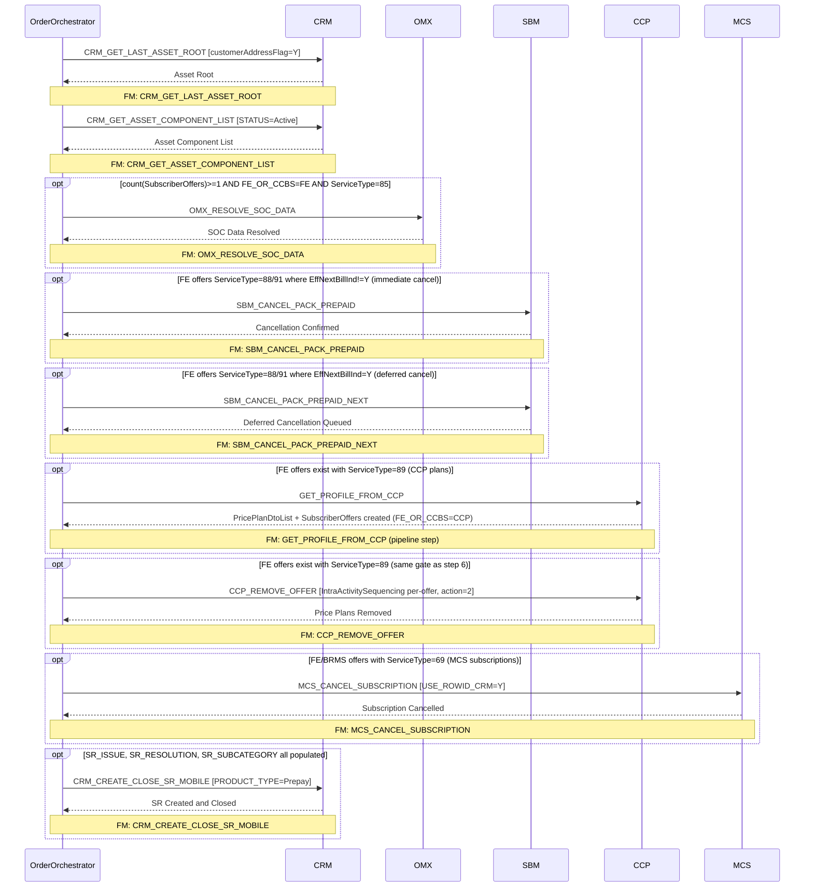

# PREPAID_REMOVE_PACKAGE

> Process Configuration for PREPAID_REMOVE_PACKAGE.

**Total steps:** 9 | **Unique FMs:** 9 | **Entry point:** CRM_GET_LAST_ASSET_ROOT | **Conditional steps:** 7 of 9

---

## §2 — Order Flow

| Step | Step ID | FM (ActivityID) | Parameter(s) | PreExecCheck | Previous | Next |
|------|---------|-----------------|--------------|--------------|----------|------|
| 1 | CRM_GET_LAST_ASSET_ROOT | CRM_GET_LAST_ASSET_ROOT | customerAddressFlag=Y | — | START | CRM_GET_ASSET_COMPONENT_LIST |
| 2 | CRM_GET_ASSET_COMPONENT_LIST | CRM_GET_ASSET_COMPONENT_LIST | STATUS=Active | — | CRM_GET_LAST_ASSET_ROOT | OMX_RESOLVE_SOC_DATA |
| 3 | OMX_RESOLVE_SOC_DATA | OMX_RESOLVE_SOC_DATA | — | `count(//SubscriberOffers) >= 1 and boolean(//SubscriberOffers[ExtendedInfo[Name='FE_OR_CCBS' and Value='FE'] and ServiceType='85'])` | CRM_GET_ASSET_COMPONENT_LIST | SBM_CANCEL_PACK_PREPAID |
| 4 | SBM_CANCEL_PACK_PREPAID | SBM_CANCEL_PACK_PREPAID | — | `boolean(//SubscriberOffers[ExtendedInfo[Name='FE_OR_CCBS' and Value='FE'] and (ServiceType='88' or ServiceType='91') and (not(exists(EffectiveNextBillInd)) or EffectiveNextBillInd = 'N')])` | OMX_RESOLVE_SOC_DATA | SBM_CANCEL_PACK_PREPAID_NEXT |
| 5 | SBM_CANCEL_PACK_PREPAID_NEXT | SBM_CANCEL_PACK_PREPAID_NEXT | — | `(boolean(//SubscriberOffers[ExtendedInfo[Name='FE_OR_CCBS' and Value='FE'] and (ServiceType='88' or ServiceType='91') and EffectiveNextBillInd = 'Y']))` | SBM_CANCEL_PACK_PREPAID | GET_PROFILE_FROM_CCP |
| 6 | GET_PROFILE_FROM_CCP | GET_PROFILE_FROM_CCP | — | `boolean(//SubscriberOffers[ExtendedInfo[Name='FE_OR_CCBS' and Value='FE'] and ServiceType='89'])` | SBM_CANCEL_PACK_PREPAID_NEXT | CCP_REMOVE_OFFER |
| 7 | CCP_REMOVE_OFFER | CCP_REMOVE_OFFER | — | `boolean(//SubscriberOffers[ExtendedInfo[Name='FE_OR_CCBS' and Value='FE'] and ServiceType='89'])` | GET_PROFILE_FROM_CCP | MCS_CANCEL_SUBSCRIPTION |
| 8 | MCS_CANCEL_SUBSCRIPTION | MCS_CANCEL_SUBSCRIPTION | USE_ROWID_CRM=Y | `boolean(//Subscriber/SubscriberOffers[ExtendedInfo[Name='FE_OR_CCBS' and (Value='BRMS' or Value='FE')] and ServiceType='69'])` | CCP_REMOVE_OFFER | CRM_CREATE_CLOSE_SR_MOBILE |
| 9 | CRM_CREATE_CLOSE_SR_MOBILE | CRM_CREATE_CLOSE_SR_MOBILE | PRODUCT_TYPE=Prepay | `exists(//OrderData/ExtendedInfo[Name="SR_ISSUE" and Value!='']) and exists(//OrderData/ExtendedInfo[Name="SR_RESOLUTION" and Value!='']) and exists(//OrderData/ExtendedInfo[Name="SR_SUBCATEGORY" and Value!=''])` | MCS_CANCEL_SUBSCRIPTION | END |

---

## §3 — PreExecCheck Details

### Step 3 — OMX_RESOLVE_SOC_DATA

**FM:** `OMX_RESOLVE_SOC_DATA`

Resolve SOC data only if there are FE-routed offers with ServiceType=85 (prepaid SOC resolution).

```xpath
count(//SubscriberOffers) >= 1
and boolean(//SubscriberOffers[
    ExtendedInfo[Name='FE_OR_CCBS' and Value='FE']
    and ServiceType='85'
])
```

---

### Step 4 — SBM_CANCEL_PACK_PREPAID

**FM:** `SBM_CANCEL_PACK_PREPAID`

Immediate cancellation: FE offers with ServiceType=88/91 where EffectiveNextBillInd is absent or N.

```xpath
boolean(//SubscriberOffers[
    ExtendedInfo[Name='FE_OR_CCBS' and Value='FE']
    and (ServiceType='88' or ServiceType='91')
    and (not(exists(EffectiveNextBillInd)) or EffectiveNextBillInd = 'N')
])
```

---

### Step 5 — SBM_CANCEL_PACK_PREPAID_NEXT

**FM:** `SBM_CANCEL_PACK_PREPAID_NEXT`

Deferred cancellation (next bill): FE offers with ServiceType=88/91 where EffectiveNextBillInd=Y. Complement of step 4.

```xpath
(boolean(//SubscriberOffers[
    ExtendedInfo[Name='FE_OR_CCBS' and Value='FE']
    and (ServiceType='88' or ServiceType='91')
    and EffectiveNextBillInd = 'Y'
]))
```

---

### Step 6 — GET_PROFILE_FROM_CCP

**FM:** `GET_PROFILE_FROM_CCP`

Query CCP for grading plans only if FE offers with ServiceType=89 exist. This FM dynamically creates additional SubscriberOffers (FE_OR_CCBS=CCP) for grading tier removal in step 7.

```xpath
boolean(//SubscriberOffers[
    ExtendedInfo[Name='FE_OR_CCBS' and Value='FE']
    and ServiceType='89'
])
```

---

### Step 7 — CCP_REMOVE_OFFER

**FM:** `CCP_REMOVE_OFFER`

Same gate as GET_PROFILE_FROM_CCP (step 6). Removes price plans from CCP (action=2), including grading tier offers added dynamically by step 6.

```xpath
boolean(//SubscriberOffers[
    ExtendedInfo[Name='FE_OR_CCBS' and Value='FE']
    and ServiceType='89'
])
```

---

### Step 8 — MCS_CANCEL_SUBSCRIPTION

**FM:** `MCS_CANCEL_SUBSCRIPTION`

Cancel MCS subscriptions for BRMS or FE offers with ServiceType=69.

```xpath
boolean(//Subscriber/SubscriberOffers[
    ExtendedInfo[Name='FE_OR_CCBS' and (Value='BRMS' or Value='FE')]
    and ServiceType='69'
])
```

---

### Step 9 — CRM_CREATE_CLOSE_SR_MOBILE

**FM:** `CRM_CREATE_CLOSE_SR_MOBILE`

Create and close Service Request in CRM only if all three SR fields are populated.

```xpath
exists(//OrderData/ExtendedInfo[Name="SR_ISSUE" and Value!=''])
and exists(//OrderData/ExtendedInfo[Name="SR_RESOLUTION" and Value!=''])
and exists(//OrderData/ExtendedInfo[Name="SR_SUBCATEGORY" and Value!=''])
```

---

## §4 — FM Documentation Index

| FM (ActivityID) | Used in Steps | Backend | Doc Link |
|-----------------|---------------|---------|---------|
| CRM_GET_LAST_ASSET_ROOT | 1 | CRM | [Request_CRM_GET_LAST_ASSET_ROOT.html](../FMlogic/Request_CRM_GET_LAST_ASSET_ROOT.html) |
| CRM_GET_ASSET_COMPONENT_LIST | 2 | CRM | [Request_CRM_GET_ASSET_COMPONENT_LIST.html](../FMlogic/Request_CRM_GET_ASSET_COMPONENT_LIST.html) |
| OMX_RESOLVE_SOC_DATA | 3 | OMX | [Request_OMX_RESOLVE_SOC_DATA.html](../FMlogic/Request_OMX_RESOLVE_SOC_DATA.html) |
| SBM_CANCEL_PACK_PREPAID | 4 | SBM | [Request_SBM_CANCEL_PACK_PREPAID.html](../FMlogic/Request_SBM_CANCEL_PACK_PREPAID.html) |
| SBM_CANCEL_PACK_PREPAID_NEXT | 5 | SBM | [Request_SBM_CANCEL_PACK_PREPAID_NEXT.html](../FMlogic/Request_SBM_CANCEL_PACK_PREPAID_NEXT.html) |
| GET_PROFILE_FROM_CCP | 6 | CCP | [Request_GET_PROFILE_FROM_CCP.html](../FMlogic/Request_GET_PROFILE_FROM_CCP.html) |
| CCP_REMOVE_OFFER | 7 | CCP | [Request_CCP_REMOVE_OFFER.html](../FMlogic/Request_CCP_REMOVE_OFFER.html) |
| MCS_CANCEL_SUBSCRIPTION | 8 | MCS | [Request_MCS_CANCEL_SUBSCRIPTION.html](../FMlogic/Request_MCS_CANCEL_SUBSCRIPTION.html) |
| CRM_CREATE_CLOSE_SR_MOBILE | 9 | CRM | [Request_CRM_CREATE_CLOSE_SR_MOBILE.html](../FMlogic/Request_CRM_CREATE_CLOSE_SR_MOBILE.html) |

---

## §5 — Sequence Diagram



> Rendered from ProcessConfig activity chain. Conditional steps (3–9) wrapped in `opt` blocks.
> Full interactive HTML version at `output/order/PREPAID_REMOVE_PACKAGE.html`

---

## §6 — ServiceType Routing Legend

| ServiceType | Backend | FM(s) | FE_OR_CCBS | Description |
|-------------|---------|-------|-----------|-------------|
| 85 | OMX | OMX_RESOLVE_SOC_DATA | FE | Prepaid SOC data — needs resolution before downstream removal |
| 88 | SBM | SBM_CANCEL_PACK_PREPAID / SBM_CANCEL_PACK_PREPAID_NEXT | FE | SBM prepaid package — immediate (EffNextBillInd!=Y) vs. deferred (EffNextBillInd=Y) |
| 91 | SBM | SBM_CANCEL_PACK_PREPAID / SBM_CANCEL_PACK_PREPAID_NEXT | FE | SBM prepaid package variant — same split as ServiceType=88 |
| 89 | CCP | GET_PROFILE_FROM_CCP + CCP_REMOVE_OFFER | FE (gate) / CCP (dynamic) | CCP price plan — step 6 queries grading tiers, step 7 removes all CCP offers |
| 69 | MCS | MCS_CANCEL_SUBSCRIPTION | FE or BRMS | MCS managed subscription cancellation |

> **GET_PROFILE_FROM_CCP pipeline note:** Steps 6 and 7 share the same PreExecCheck gate. Step 6 queries CCP's PricePlanDtoList, filters grading plans (`IPP_000O0_00_GRADING` prefix), and dynamically creates SubscriberOffers with `FE_OR_CCBS=CCP` and `Action=Remove`. These are consumed by step 7 (CCP_REMOVE_OFFER) alongside the original FE-routed ServiceType=89 offers.

---

*TRUE Corporation OMX · Order Journey Documentation · PREPAID_REMOVE_PACKAGE*
