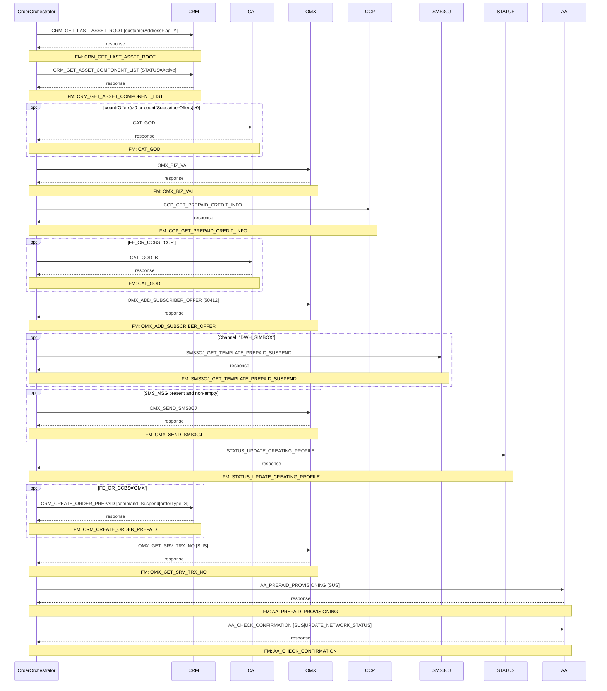

# PREPAID_SUSPEND

> Prepaid subscriber suspension order journey — full flow from asset retrieval through AA provisioning and confirmation.

**Total steps:** 14 | **Unique FMs:** 12 | **Entry point:** CRM_GET_LAST_ASSET_ROOT | **Generated:** 2026-09-16

---

## §2 — Order Flow

| Step | Step ID | FM (ActivityID) | Parameter(s) | PreExecCheck | Previous | Next |
|------|---------|-----------------|--------------|--------------|----------|------|
| 1 | CRM_GET_LAST_ASSET_ROOT | CRM_GET_LAST_ASSET_ROOT | customerAddressFlag=Y | — | START | CRM_GET_ASSET_COMPONENT_LIST |
| 2 | CRM_GET_ASSET_COMPONENT_LIST | CRM_GET_ASSET_COMPONENT_LIST | STATUS=Active | — | CRM_GET_LAST_ASSET_ROOT | CAT_GOD |
| 3 | CAT_GOD | CAT_GOD | — | `count(//Offers) > 0 or count(//SubscriberOffers) > 0` | CRM_GET_ASSET_COMPONENT_LIST | OMX_BIZ_VAL |
| 4 | OMX_BIZ_VAL | OMX_BIZ_VAL | — | — | CAT_GOD | CCP_GET_PREPAID_CREDIT_INFO |
| 5 | CCP_GET_PREPAID_CREDIT_INFO | CCP_GET_PREPAID_CREDIT_INFO | — | — | OMX_BIZ_VAL | CAT_GOD_B |
| 6 | CAT_GOD_B | CAT_GOD | — | `//SubscriberOffers/ExtendedInfo[Name='FE_OR_CCBS']/Value/text()='CCP'` | CCP_GET_PREPAID_CREDIT_INFO | OMX_ADD_SUBSCRIBER_OFFER |
| 7 | OMX_ADD_SUBSCRIBER_OFFER | OMX_ADD_SUBSCRIBER_OFFER ⚠ | 50412 | — | CAT_GOD_B | SMS3CJ_GET_TEMPLATE_PREPAID_SUSPEND |
| 8 | SMS3CJ_GET_TEMPLATE_PREPAID_SUSPEND | SMS3CJ_GET_TEMPLATE_PREPAID_SUSPEND | — | `/ns0:OrderRequest/OrderData/Channel/text()="DWH_SIMBOX"` | OMX_ADD_SUBSCRIBER_OFFER | OMX_SEND_SMS3CJ |
| 9 | OMX_SEND_SMS3CJ | OMX_SEND_SMS3CJ | — | `count(//Subscriber//ExtendedInfo[Name/text()='SMS_MSG' and Value/text()!='']) > 0` | SMS3CJ_GET_TEMPLATE_PREPAID_SUSPEND | STATUS_UPDATE_CREATING_PROFILE |
| 10 | STATUS_UPDATE_CREATING_PROFILE | STATUS_UPDATE_CREATING_PROFILE | — | — | OMX_SEND_SMS3CJ | CRM_CREATE_ORDER_PREPAID |
| 11 | CRM_CREATE_ORDER_PREPAID | CRM_CREATE_ORDER_PREPAID | command=Suspend \| orderType=S \| listOfRootLineItemAction=Update \| ... | `//SubscriberOffers/ExtendedInfo[Name='FE_OR_CCBS']/Value/text()='OMX'` | STATUS_UPDATE_CREATING_PROFILE | OMX_GET_SRV_TRX_NO |
| 12 | OMX_GET_SRV_TRX_NO | OMX_GET_SRV_TRX_NO | SUS | — | CRM_CREATE_ORDER_PREPAID | AA_PREPAID_PROVISIONING |
| 13 | AA_PREPAID_PROVISIONING | AA_PREPAID_PROVISIONING | SUS | — | OMX_GET_SRV_TRX_NO | AA_CHECK_CONFIRMATION |
| 14 | AA_CHECK_CONFIRMATION | AA_CHECK_CONFIRMATION | SUS \| UPDATE_NETWORK_STATUS | — | AA_PREPAID_PROVISIONING | END |

> ⚠ Step 7 (OMX_ADD_SUBSCRIBER_OFFER): rule file not found in source repository.

---

## §3 — PreExecCheck Details

### Step 3 — CAT_GOD

**FM:** `CAT_GOD`

Skips CAT_GOD if no Offers or SubscriberOffers are present on the subscriber.

```xpath
count(//Offers) > 0 or count(//SubscriberOffers) > 0
```

---

### Step 6 — CAT_GOD_B

**FM:** `CAT_GOD`

Only executes the second CAT_GOD call when the subscriber's price-plan routing is CCP. This is the CCP-specific offer retrieval for prepaid suspension.

```xpath
//SubscriberOffers/ExtendedInfo[Name='FE_OR_CCBS']/Value/text()='CCP'
```

---

### Step 8 — SMS3CJ_GET_TEMPLATE_PREPAID_SUSPEND

**FM:** `SMS3CJ_GET_TEMPLATE_PREPAID_SUSPEND` | [FM Doc](../FMlogic/Request_SMS3CJ_GET_TEMPLATE_PREPAID_SUSPEND.html)

The SMS notification flow is only triggered when the order originates from the DWH_SIMBOX channel. All other channels bypass SMS entirely.

```xpath
/ns0:OrderRequest/OrderData/Channel/text()="DWH_SIMBOX"
```

---

### Step 9 — OMX_SEND_SMS3CJ

**FM:** `OMX_SEND_SMS3CJ` | [FM Doc](../FMlogic/Request_OMX_SEND_SMS3CJ.html)

Sends the SMS only if a non-empty SMS_MSG ExtendedInfo was successfully populated by the template fetch step (step 8).

```xpath
count(//Subscriber//ExtendedInfo[Name/text()='SMS_MSG' and Value/text()!='']) > 0
```

---

### Step 11 — CRM_CREATE_ORDER_PREPAID

**FM:** `CRM_CREATE_ORDER_PREPAID` | [FM Doc](../FMlogic/Request_CRM_CREATE_ORDER_PREPAID.html)

Creates a CRM Suspend order only when the subscriber is on the OMX (own platform) route. CCP-routed subscribers skip this step.

```xpath
//SubscriberOffers/ExtendedInfo[Name='FE_OR_CCBS']/Value/text()='OMX'
```

---

## §4 — FM Documentation Index

| FM (ActivityID) | Used in Steps | Status | Doc Link |
|-----------------|---------------|--------|----------|
| CRM_GET_LAST_ASSET_ROOT | 1 | Exists | [Request_CRM_GET_LAST_ASSET_ROOT.html](../FMlogic/Request_CRM_GET_LAST_ASSET_ROOT.html) |
| CRM_GET_ASSET_COMPONENT_LIST | 2 | Exists | [Request_CRM_GET_ASSET_COMPONENT_LIST.html](../FMlogic/Request_CRM_GET_ASSET_COMPONENT_LIST.html) |
| CAT_GOD | 3, 6 | Exists | [Request_CAT_GOD.html](../FMlogic/Request_CAT_GOD.html) |
| OMX_BIZ_VAL | 4 | Exists | [Request_OMX_BIZ_VAL.html](../FMlogic/Request_OMX_BIZ_VAL.html) |
| CCP_GET_PREPAID_CREDIT_INFO | 5 | Exists | [Request_CCP_GET_PREPAID_CREDIT_INFO.html](../FMlogic/Request_CCP_GET_PREPAID_CREDIT_INFO.html) |
| OMX_ADD_SUBSCRIBER_OFFER | 7 | ⚠ Not Found | — |
| SMS3CJ_GET_TEMPLATE_PREPAID_SUSPEND | 8 | Generated | [Request_SMS3CJ_GET_TEMPLATE_PREPAID_SUSPEND.html](../FMlogic/Request_SMS3CJ_GET_TEMPLATE_PREPAID_SUSPEND.html) |
| OMX_SEND_SMS3CJ | 9 | Generated | [Request_OMX_SEND_SMS3CJ.html](../FMlogic/Request_OMX_SEND_SMS3CJ.html) |
| STATUS_UPDATE_CREATING_PROFILE | 10 | Exists | [Request_STATUS_UPDATE_CREATING_PROFILE.html](../FMlogic/Request_STATUS_UPDATE_CREATING_PROFILE.html) |
| CRM_CREATE_ORDER_PREPAID | 11 | Exists | [Request_CRM_CREATE_ORDER_PREPAID.html](../FMlogic/Request_CRM_CREATE_ORDER_PREPAID.html) |
| OMX_GET_SRV_TRX_NO | 12 | Exists | [Request_OMX_GET_SRV_TRX_NO.html](../FMlogic/Request_OMX_GET_SRV_TRX_NO.html) |
| AA_PREPAID_PROVISIONING | 13 | Generated | [Request_AA_PREPAID_PROVISIONING.html](../FMlogic/Request_AA_PREPAID_PROVISIONING.html) |
| AA_CHECK_CONFIRMATION | 14 | Exists | [Request_AA_CHECK_CONFIRMATION.html](../FMlogic/Request_AA_CHECK_CONFIRMATION.html) |

---

## §5 — Sequence Diagram



> Rendered from ProcessConfig activity chain. Conditional steps wrapped in `opt` blocks.
> Full sequence diagram with Mermaid rendering: see `output/order/PREPAID_SUSPEND.html`

---

## §6 — Flow Diagram

```mermaid
flowchart TD
    START([START]) --> S1[CRM_GET_LAST_ASSET_ROOT\nFM: CRM_GET_LAST_ASSET_ROOT]
    S1 --> S2[CRM_GET_ASSET_COMPONENT_LIST\nFM: CRM_GET_ASSET_COMPONENT_LIST]
    S2 --> S3{CAT_GOD\nFM: CAT_GOD\nConditional: count Offers}
    S3 --> S4[OMX_BIZ_VAL\nFM: OMX_BIZ_VAL]
    S4 --> S5[CCP_GET_PREPAID_CREDIT_INFO\nFM: CCP_GET_PREPAID_CREDIT_INFO]
    S5 --> S6{CAT_GOD_B\nFM: CAT_GOD\nConditional: FE_OR_CCBS=CCP}
    S6 --> S7[OMX_ADD_SUBSCRIBER_OFFER\nparam: 50412\nRule not found]
    S7 --> S8{SMS3CJ_GET_TEMPLATE\nFM: SMS3CJ_GET_TEMPLATE_PREPAID_SUSPEND\nConditional: Channel=DWH_SIMBOX}
    S8 --> S9{OMX_SEND_SMS3CJ\nFM: OMX_SEND_SMS3CJ\nConditional: SMS_MSG present}
    S9 --> S10[STATUS_UPDATE_CREATING_PROFILE\nFM: STATUS_UPDATE_CREATING_PROFILE]
    S10 --> S11{CRM_CREATE_ORDER_PREPAID\nFM: CRM_CREATE_ORDER_PREPAID\nConditional: FE_OR_CCBS=OMX}
    S11 --> S12[OMX_GET_SRV_TRX_NO\nFM: OMX_GET_SRV_TRX_NO\nparam: SUS]
    S12 --> S13[AA_PREPAID_PROVISIONING\nFM: AA_PREPAID_PROVISIONING\nparam: SUS]
    S13 --> S14[AA_CHECK_CONFIRMATION\nFM: AA_CHECK_CONFIRMATION\nparam: SUS|UPDATE_NETWORK_STATUS]
    S14 --> END([END])
```

> Diamond shapes = conditional steps (PreExecCheck). 14 activities — flowchart rendered in full.

---

*TRUE Corporation OMX · Order Journey Documentation · PREPAID_SUSPEND*
