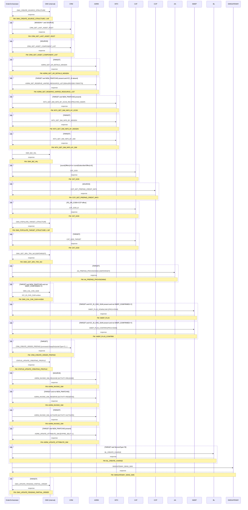

# PREPAID_SWAP_SIM

> Process Configuration for PREPAID_SWAP_SIM.

**Total steps:** 28 | **Unique FMs:** 24 | **Entry point:** OMX_CREATE_SOURCE_STRUCTURE | **Generated:** 2026-09-23

---

## §2 — Order Flow

| Step | Step ID | FM (ActivityID) | Parameter(s) | PreExecCheck | Previous | Next |
|------|---------|-----------------|--------------|--------------|----------|------|
| 1 | OMX_CREATE_SOURCE_STRUCTURE | OMX_CREATE_SOURCE_STRUCTURE ⚠ | — | — | START | CRM_GET_LAST_ASSET_ROOT |
| 2 | CRM_GET_LAST_ASSET_ROOT | CRM_GET_LAST_ASSET_ROOT | — | `MSISDN != "" and SOURCE_OR_TARGET='SOURCE'` | OMX_CREATE_SOURCE_STRUCTURE | CRM_GET_ASSET_COMPONENT_LIST |
| 3 | CRM_GET_ASSET_COMPONENT_LIST | CRM_GET_ASSET_COMPONENT_LIST | — | `SOURCE_OR_TARGET='SOURCE'` | CRM_GET_LAST_ASSET_ROOT | ASRM_GET_UR_DETAILS_MSISDN |
| 4 | ASRM_GET_UR_DETAILS_MSISDN | ASRM_GET_UR_DETAILS_MSISDN | — | `SOURCE_OR_TARGET='TARGET'` | CRM_GET_ASSET_COMPONENT_LIST | ASRM_GET_RESERVE_UNIFIED_RESOURCE_LIST |
| 5 | ASRM_GET_RESERVE_UNIFIED_RESOURCE_LIST | ASRM_GET_RESERVE_UNIFIED_RESOURCE_LIST | DEALERCODE=70000776 | `TARGET and ResourceInfo[NEW_PMATCHID] present and ExtendedInfo[ICC_ID] absent` | ASRM_GET_UR_DETAILS_MSISDN | INTX_GET_SIM_INFO_BY_ICCID_RIO |
| 6 | INTX_GET_SIM_INFO_BY_ICCID_RIO | INTX_GET_SIM_INFO_BY_ICCID | PROJ=RIO_SWAP | `TARGET and ResourceInfo[NEW_PMATCHID] present` | ASRM_GET_RESERVE_UNIFIED_RESOURCE_LIST | INTX_GET_SIM_INFO_BY_MSISDN |
| 7 | INTX_GET_SIM_INFO_BY_MSISDN | INTX_GET_SIM_INFO_BY_MSISDN | — | `SOURCE_OR_TARGET='TARGET'` | INTX_GET_SIM_INFO_BY_ICCID_RIO | INTX_GET_SIM_INFO_BY_SIM |
| 8 | INTX_GET_SIM_INFO_BY_SIM | INTX_GET_SIM_INFO_BY_SIM | — | `SOURCE_OR_TARGET='TARGET'` | INTX_GET_SIM_INFO_BY_MSISDN | OMX_BIZ_VAL |
| 9 | OMX_BIZ_VAL | OMX_BIZ_VAL | — | — | INTX_GET_SIM_INFO_BY_SIM | CAT_GOD |
| 10 | CAT_GOD | CAT_GOD | — | `count(//Offers) > 0 or count(//SubscriberOffers) > 0` | OMX_BIZ_VAL | CCP_GET_PREPAID_CREDIT_INFO |
| 11 | CCP_GET_PREPAID_CREDIT_INFO | CCP_GET_PREPAID_CREDIT_INFO | — | `SOURCE_OR_TARGET='SOURCE'` | CAT_GOD | CAT_GOD_B |
| 12 | CAT_GOD_B | CAT_GOD | — | `SubscriberOffers/ExtendedInfo[FE_OR_CCBS]='CCP'` | CCP_GET_PREPAID_CREDIT_INFO | OMX_POPULATE_TARGET_STRUCTURE |
| 13 | OMX_POPULATE_TARGET_STRUCTURE | OMX_POPULATE_TARGET_STRUCTURE ⚠ | — | — | CAT_GOD_B | CAT_GOD_TARGET |
| 14 | CAT_GOD_TARGET | CAT_GOD | — | `SOURCE_OR_TARGET='TARGET'` | OMX_POPULATE_TARGET_STRUCTURE | OMX_GET_SRV_TRX_NO |
| 15 | OMX_GET_SRV_TRX_NO | OMX_GET_SRV_TRX_NO | SSP \| TARGET | — | CAT_GOD_TARGET | AA_PREPAID_PROVISIONING |
| 16 | AA_PREPAID_PROVISIONING | AA_PREPAID_PROVISIONING | SSP \| TARGET | `SOURCE_OR_TARGET='TARGET'` | OMX_GET_SRV_TRX_NO | OMX_CAL_CHK_SUM |
| 17 | OMX_CAL_CHK_SUM | OMX_CAL_CHK_SUM ★ | — | `TARGET and ResourceInfo[NEW_PMATCHID] present and ExtendedInfo[SMDP_COMFIRMED] != 'Y'` | AA_PREPAID_PROVISIONING | SMDP_PLUS_DOWNLOAD |
| 18 | SMDP_PLUS_DOWNLOAD | SMDP_PLUS | PROJ=ESIM | `TARGET and ExtendedInfo[ICC_ID_CHG_SUM] present and SMDP_COMFIRMED != 'Y'` | OMX_CAL_CHK_SUM | SMDP_PLUS_CONFIRM |
| 19 | SMDP_PLUS_CONFIRM | SMDP_PLUS_CONFIRM | PROJ=ESIM | `TARGET and ExtendedInfo[ICC_ID_CHG_SUM] present and SMDP_COMFIRMED != 'Y'` | SMDP_PLUS_DOWNLOAD | CRM_CREATE_ORDER_PREPAID |
| 20 | CRM_CREATE_ORDER_PREPAID | CRM_CREATE_ORDER_PREPAID | command=SwapSim \| orderType=C \| listOfLineItemAction=Add \| listOfLineItemStatus=Active \| mappingValueFrom=SOURCE \| USE_ROWID_CRM=N | `SOURCE_OR_TARGET='TARGET'` | SMDP_PLUS_CONFIRM | STATUS_UPDATE_CREATING_PROFILE |
| 21 | STATUS_UPDATE_CREATING_PROFILE | STATUS_UPDATE_CREATING_PROFILE | — | — | CRM_CREATE_ORDER_PREPAID | ASRM_INVOKE_SIM_RELEASE |
| 22 | ASRM_INVOKE_SIM_RELEASE | ASRM_INVOKE_SIM | ACTIVITY=RELEASE | `SOURCE_OR_TARGET='SOURCE'` | STATUS_UPDATE_CREATING_PROFILE | ASRM_INVOKE_SIM_RESERVE |
| 23 | ASRM_INVOKE_SIM_RESERVE | ASRM_INVOKE_SIM | ACTIVITY=RESERVE | `TARGET and count(ResourceInfo[NEW_PMATCHID]) = 0` | ASRM_INVOKE_SIM_RELEASE | ASRM_INVOKE_SIM_ACTIVATE |
| 24 | ASRM_INVOKE_SIM_ACTIVATE | ASRM_INVOKE_SIM | ACTIVITY=ACTIVATE | `SOURCE_OR_TARGET='TARGET'` | ASRM_INVOKE_SIM_RESERVE | ASRM_UPDATE_ATTRIBUTE_SIM |
| 25 | ASRM_UPDATE_ATTRIBUTE_SIM | ASRM_UPDATE_ATTRIBUTE_SIM | EXPIRE_SELF=-1 | `TARGET and ResourceInfo[NEW_PMATCHID] present` | ASRM_INVOKE_SIM_ACTIVATE | BL_CREATE_CHARGE |
| 26 | BL_CREATE_CHARGE | BL_CREATE_CHARGE | — | `TARGET and SubscriberOffers/ServiceType/text()='79' (FE/BRMS)` | ASRM_UPDATE_ATTRIBUTE_SIM | SMSGATEWAY_SEND_SMS |
| 27 | SMSGATEWAY_SEND_SMS | SMSGATEWAY_SEND_SMS | — | — | BL_CREATE_CHARGE | OMX_UPDATE_PENDING_PARTIAL_ORDER |
| 28 | OMX_UPDATE_PENDING_PARTIAL_ORDER | OMX_UPDATE_PENDING_PARTIAL_ORDER | — | `SOURCE_OR_TARGET='TARGET'` | SMSGATEWAY_SEND_SMS | END |

> ⚠ = internal OMX function (no rule file) &nbsp; ★ = newly generated FM doc

---

## §3 — PreExecCheck Details

### Step 2 — CRM_GET_LAST_ASSET_ROOT
**FM:** `CRM_GET_LAST_ASSET_ROOT`
```xpath
//Subscriber/MSISDN/text() != ""
and //Subscriber/SOURCE_OR_TARGET/text() = 'SOURCE'
```
Retrieves the subscriber's last asset root from CRM when processing the SOURCE subscriber record.

### Step 3 — CRM_GET_ASSET_COMPONENT_LIST
**FM:** `CRM_GET_ASSET_COMPONENT_LIST`
```xpath
//Subscriber/SOURCE_OR_TARGET/text() = 'SOURCE'
```
Retrieves the asset component list for the SOURCE subscriber.

### Step 4 — ASRM_GET_UR_DETAILS_MSISDN
**FM:** `ASRM_GET_UR_DETAILS_MSISDN`
```xpath
//Subscriber/SOURCE_OR_TARGET/text() = 'TARGET'
```
Retrieves unified resource details by MSISDN for the TARGET subscriber.

### Step 5 — ASRM_GET_RESERVE_UNIFIED_RESOURCE_LIST
**FM:** `ASRM_GET_RESERVE_UNIFIED_RESOURCE_LIST` | **Parameter:** DEALERCODE=70000776
```xpath
//Subscriber/SOURCE_OR_TARGET/text() = 'TARGET'
and count(//Subscriber/ResourceInfo[ResourceName='NEW_PMATCHID']) > 0
and count(//Subscriber/ExtendedInfo[Name='ICC_ID']) = 0
```
Reserves a new physical SIM from the unified resource pool for RIO eSIM swap when NEW_PMATCHID is specified but ICC_ID not yet known.

### Step 6 — INTX_GET_SIM_INFO_BY_ICCID_RIO
**FM:** `INTX_GET_SIM_INFO_BY_ICCID` | **Parameter:** PROJ=RIO_SWAP
```xpath
//Subscriber/SOURCE_OR_TARGET/text() = 'TARGET'
and count(//Subscriber/ResourceInfo[ResourceName='NEW_PMATCHID']) > 0
```
Retrieves SIM details by ICCID from INTX for RIO eSIM swap scenario.

### Step 7 — INTX_GET_SIM_INFO_BY_MSISDN
**FM:** `INTX_GET_SIM_INFO_BY_MSISDN`
```xpath
//Subscriber/SOURCE_OR_TARGET/text() = 'TARGET'
```
Retrieves SIM information by MSISDN from INTX.

### Step 8 — INTX_GET_SIM_INFO_BY_SIM
**FM:** `INTX_GET_SIM_INFO_BY_SIM`
```xpath
//Subscriber/SOURCE_OR_TARGET/text() = 'TARGET'
```
Retrieves SIM information by SIM ICC_ID from INTX.

### Step 10 — CAT_GOD
**FM:** `CAT_GOD`
```xpath
count(//Offers) > 0 or count(//SubscriberOffers) > 0
```
Only invokes Catalogue Get-Offer-Details when offers exist on the order.

### Step 11 — CCP_GET_PREPAID_CREDIT_INFO
**FM:** `CCP_GET_PREPAID_CREDIT_INFO`
```xpath
//Subscriber/SOURCE_OR_TARGET/text() = 'SOURCE'
```
Retrieves prepaid credit info for the SOURCE subscriber.

### Step 12 — CAT_GOD_B
**FM:** `CAT_GOD` (second invocation)
```xpath
count(//Subscriber/SubscriberOffers/ExtendedInfo[Name='FE_OR_CCBS' and Value='CCP']) > 0
```
Second CAT_GOD call specifically for CCP-type offers.

### Step 14 — CAT_GOD_TARGET
**FM:** `CAT_GOD` (third invocation)
```xpath
//Subscriber/SOURCE_OR_TARGET/text() = 'TARGET'
```
CAT_GOD call scoped to the TARGET subscriber.

### Step 16 — AA_PREPAID_PROVISIONING
**FM:** `AA_PREPAID_PROVISIONING` | **Parameter:** SSP | TARGET
```xpath
//Subscriber/SOURCE_OR_TARGET/text() = 'TARGET'
```
Prepaid AA provisioning for the TARGET subscriber.

### Step 17 — OMX_CAL_CHK_SUM ★ NEW
**FM:** `OMX_CAL_CHK_SUM`
```xpath
//Subscriber/SOURCE_OR_TARGET/text() = 'TARGET'
and count(//Subscriber/ResourceInfo[ResourceName='NEW_PMATCHID']) > 0
and //Subscriber/ExtendedInfo[Name='SMDP_COMFIRMED']/Value/text() != 'Y'
```
Calculates Luhn checksum for ICC_ID; creates ICC_ID_CHG_SUM ExtendedInfo that gates SMDP+ eSIM download.

### Step 18 — SMDP_PLUS_DOWNLOAD
**FM:** `SMDP_PLUS` | **Parameter:** PROJ=ESIM
```xpath
//Subscriber/SOURCE_OR_TARGET/text() = 'TARGET'
and count(//Subscriber/ExtendedInfo[Name='ICC_ID_CHG_SUM']) > 0
and //Subscriber/ExtendedInfo[Name='SMDP_COMFIRMED']/Value/text() != 'Y'
```
Downloads eSIM profile to device via SM-DP+ server. Only runs on eSIM swap paths.

### Step 19 — SMDP_PLUS_CONFIRM
**FM:** `SMDP_PLUS_CONFIRM` | **Parameter:** PROJ=ESIM
```xpath
//Subscriber/SOURCE_OR_TARGET/text() = 'TARGET'
and count(//Subscriber/ExtendedInfo[Name='ICC_ID_CHG_SUM']) > 0
and //Subscriber/ExtendedInfo[Name='SMDP_COMFIRMED']/Value/text() != 'Y'
```
Confirms eSIM profile download on SM-DP+ server.

### Step 20 — CRM_CREATE_ORDER_PREPAID
**FM:** `CRM_CREATE_ORDER_PREPAID` | **Parameter:** command=SwapSim | orderType=C | ...
```xpath
//Subscriber/SOURCE_OR_TARGET/text() = 'TARGET'
```
Creates SwapSim order in CRM with parameters: command=SwapSim, orderType=C, listOfLineItemAction=Add, listOfLineItemStatus=Active, mappingValueFrom=SOURCE, USE_ROWID_CRM=N.

### Step 22 — ASRM_INVOKE_SIM_RELEASE
**FM:** `ASRM_INVOKE_SIM` | **Parameter:** ACTIVITY=RELEASE
```xpath
//Subscriber/SOURCE_OR_TARGET/text() = 'SOURCE'
```
Releases the old SIM from ASRM inventory (SOURCE subscriber).

### Step 23 — ASRM_INVOKE_SIM_RESERVE
**FM:** `ASRM_INVOKE_SIM` | **Parameter:** ACTIVITY=RESERVE
```xpath
//Subscriber/SOURCE_OR_TARGET/text() = 'TARGET'
and count(//Subscriber/ResourceInfo[ResourceName='NEW_PMATCHID']) = 0
```
Reserves the new SIM in ASRM. Skipped for eSIM RIO swap (NEW_PMATCHID present).

### Step 24 — ASRM_INVOKE_SIM_ACTIVATE
**FM:** `ASRM_INVOKE_SIM` | **Parameter:** ACTIVITY=ACTIVATE
```xpath
//Subscriber/SOURCE_OR_TARGET/text() = 'TARGET'
```
Activates the new SIM in ASRM.

### Step 25 — ASRM_UPDATE_ATTRIBUTE_SIM
**FM:** `ASRM_UPDATE_ATTRIBUTE_SIM` | **Parameter:** EXPIRE_SELF=-1
```xpath
//Subscriber/SOURCE_OR_TARGET/text() = 'TARGET'
and count(//Subscriber/ResourceInfo[ResourceName='NEW_PMATCHID']) > 0
```
Updates SIM attributes on ASRM; EXPIRE_SELF=-1 disables self-expiry. Only for eSIM (NEW_PMATCHID present).

### Step 26 — BL_CREATE_CHARGE
**FM:** `BL_CREATE_CHARGE`
```xpath
//Subscriber/SOURCE_OR_TARGET/text() = 'TARGET'
and count(//Subscriber/SubscriberOffers[ServiceType='79'][ExtendedInfo[FE_OR_CCBS='FE' or FE_OR_CCBS='BRMS']]) > 0
```
Creates billing charge for SIM swap fee (ServiceType=79 offers).

### Step 28 — OMX_UPDATE_PENDING_PARTIAL_ORDER
**FM:** `OMX_UPDATE_PENDING_PARTIAL_ORDER`
```xpath
//Subscriber/SOURCE_OR_TARGET/text() = 'TARGET'
```
Updates pending partial order status at the end of the flow.

---

## §4 — FM Documentation Index

| FM (ActivityID) | Used in Steps | Doc | Status |
|-----------------|---------------|-----|--------|
| OMX_CREATE_SOURCE_STRUCTURE | 1 | — | ⚠ Not Found (internal) |
| CRM_GET_LAST_ASSET_ROOT | 2 | [Request_CRM_GET_LAST_ASSET_ROOT.html](../FMlogic/Request_CRM_GET_LAST_ASSET_ROOT.html) | ✓ |
| CRM_GET_ASSET_COMPONENT_LIST | 3 | [Request_CRM_GET_ASSET_COMPONENT_LIST.html](../FMlogic/Request_CRM_GET_ASSET_COMPONENT_LIST.html) | ✓ |
| ASRM_GET_UR_DETAILS_MSISDN | 4 | [Request_ASRM_GET_UR_DETAILS_MSISDN.html](../FMlogic/Request_ASRM_GET_UR_DETAILS_MSISDN.html) | ✓ |
| ASRM_GET_RESERVE_UNIFIED_RESOURCE_LIST | 5 | [Request_ASRM_GET_RESERVE_UNIFIED_RESOURCE_LIST.html](../FMlogic/Request_ASRM_GET_RESERVE_UNIFIED_RESOURCE_LIST.html) | ✓ |
| INTX_GET_SIM_INFO_BY_ICCID | 6 | [Request_INTX_GET_SIM_INFO_BY_ICCID.html](../FMlogic/Request_INTX_GET_SIM_INFO_BY_ICCID.html) | ✓ |
| INTX_GET_SIM_INFO_BY_MSISDN | 7 | [Request_INTX_GET_SIM_INFO_BY_MSISDN.html](../FMlogic/Request_INTX_GET_SIM_INFO_BY_MSISDN.html) | ✓ |
| INTX_GET_SIM_INFO_BY_SIM | 8 | [Request_INTX_GET_SIM_INFO_BY_SIM.html](../FMlogic/Request_INTX_GET_SIM_INFO_BY_SIM.html) | ✓ |
| OMX_BIZ_VAL | 9 | [Request_OMX_BIZ_VAL.html](../FMlogic/Request_OMX_BIZ_VAL.html) | ✓ |
| CAT_GOD | 10, 12, 14 | [Request_CAT_GOD.html](../FMlogic/Request_CAT_GOD.html) | ✓ |
| CCP_GET_PREPAID_CREDIT_INFO | 11 | [Request_CCP_GET_PREPAID_CREDIT_INFO.html](../FMlogic/Request_CCP_GET_PREPAID_CREDIT_INFO.html) | ✓ |
| OMX_POPULATE_TARGET_STRUCTURE | 13 | — | ⚠ Not Found (internal) |
| OMX_GET_SRV_TRX_NO | 15 | [Request_OMX_GET_SRV_TRX_NO.html](../FMlogic/Request_OMX_GET_SRV_TRX_NO.html) | ✓ |
| AA_PREPAID_PROVISIONING | 16 | [Request_AA_PREPAID_PROVISIONING.html](../FMlogic/Request_AA_PREPAID_PROVISIONING.html) | ✓ |
| OMX_CAL_CHK_SUM | 17 | [Request_OMX_CAL_CHK_SUM.html](../FMlogic/Request_OMX_CAL_CHK_SUM.html) | ★ NEW |
| SMDP_PLUS | 18 | [Request_SMDP_PLUS.html](../FMlogic/Request_SMDP_PLUS.html) | ✓ |
| SMDP_PLUS_CONFIRM | 19 | [Request_SMDP_PLUS_CONFIRM.html](../FMlogic/Request_SMDP_PLUS_CONFIRM.html) | ✓ |
| CRM_CREATE_ORDER_PREPAID | 20 | [Request_CRM_CREATE_ORDER_PREPAID.html](../FMlogic/Request_CRM_CREATE_ORDER_PREPAID.html) | ✓ |
| STATUS_UPDATE_CREATING_PROFILE | 21 | [Request_STATUS_UPDATE_CREATING_PROFILE.html](../FMlogic/Request_STATUS_UPDATE_CREATING_PROFILE.html) | ✓ |
| ASRM_INVOKE_SIM | 22, 23, 24 | [Request_ASRM_INVOKE_SIM.html](../FMlogic/Request_ASRM_INVOKE_SIM.html) | ✓ |
| ASRM_UPDATE_ATTRIBUTE_SIM | 25 | [Request_ASRM_UPDATE_ATTRIBUTE_SIM.html](../FMlogic/Request_ASRM_UPDATE_ATTRIBUTE_SIM.html) | ✓ |
| BL_CREATE_CHARGE | 26 | [Request_BL_CREATE_CHARGE.html](../FMlogic/Request_BL_CREATE_CHARGE.html) | ✓ |
| SMSGATEWAY_SEND_SMS | 27 | [Request_SMSGATEWAY_SEND_SMS.html](../FMlogic/Request_SMSGATEWAY_SEND_SMS.html) | ✓ |
| OMX_UPDATE_PENDING_PARTIAL_ORDER | 28 | [Request_OMX_UPDATE_PENDING_PARTIAL_ORDER.html](../FMlogic/Request_OMX_UPDATE_PENDING_PARTIAL_ORDER.html) | ✓ |

---

## §5 — Sequence Diagram



> Rendered from ProcessConfig activity chain. Conditional steps wrapped in `opt` blocks.
> Full HTML page: `output/order/PREPAID_SWAP_SIM.html`

---

*TRUE Corporation OMX · Order Journey Documentation*
