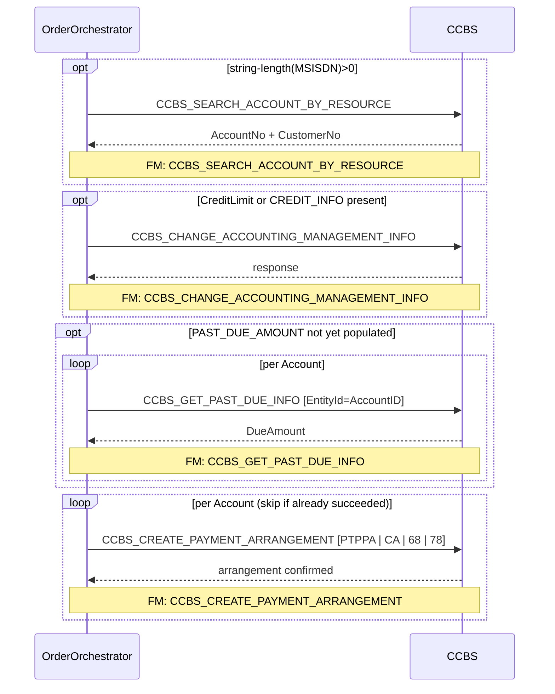

# PROMISE_TO_PAY

> Process Configuration for PROMISE_TO_PAY — Account search, credit/priority update, past-due fetch, and payment arrangement creation in CCBS.

**Total steps:** 4 | **Unique FMs:** 4 | **Entry point:** `CCBS_SEARCH_ACCOUNT_BY_RESOURCE`

> **Note:** The ProcessConfig XML contains 13 additional commented-out activities that are inactive. Only 4 steps are active.

---

## §2 — Order Flow

| Step | Step ID | FM (ActivityID) | Parameter(s) | PreExecCheck | Previous | Next |
|------|---------|-----------------|--------------|--------------|----------|------|
| 1 | CCBS_SEARCH_ACCOUNT_BY_RESOURCE | CCBS_SEARCH_ACCOUNT_BY_RESOURCE | — | `string-length(//Subscriber/MSISDN/text()) > 0` | START | CCBS_CHANGE_ACCOUNTING_MANAGEMENT_INFO |
| 2 | CCBS_CHANGE_ACCOUNTING_MANAGEMENT_INFO | CCBS_CHANGE_ACCOUNTING_MANAGEMENT_INFO | — | `count(//Account/CreditLimit/text())>0 or count(//Account/ExtendedInfo[Name='CREDIT_INFO']/Value/text())>0` | CCBS_SEARCH_ACCOUNT_BY_RESOURCE | CCBS_GET_PAST_DUE_INFO |
| 3 | CCBS_GET_PAST_DUE_INFO | CCBS_GET_PAST_DUE_INFO | — | `string-length(//Account/ExtendedInfo[Name='PAST_DUE_AMOUNT']/Value/text())=0` | CCBS_CHANGE_ACCOUNTING_MANAGEMENT_INFO | CCBS_CREATE_PAYMENT_ARRANGEMENT |
| 4 | CCBS_CREATE_PAYMENT_ARRANGEMENT | CCBS_CREATE_PAYMENT_ARRANGEMENT | — | — | CCBS_GET_PAST_DUE_INFO | END |

---

## §3 — PreExecCheck Details

### Step 1 — CCBS_SEARCH_ACCOUNT_BY_RESOURCE

**FM:** `CCBS_SEARCH_ACCOUNT_BY_RESOURCE`

```xpath
string-length(//Subscriber/MSISDN/text()) > 0
```

Skips account search if no MSISDN is present. The order must carry a phone number for CCBS search to be meaningful.

---

### Step 2 — CCBS_CHANGE_ACCOUNTING_MANAGEMENT_INFO

**FM:** `CCBS_CHANGE_ACCOUNTING_MANAGEMENT_INFO`

```xpath
count(//Account/CreditLimit/text())>0
or count(//Account/ExtendedInfo[Name='CREDIT_INFO']/Value/text())>0
```

Only updates credit/management info if the order carries a credit limit or CREDIT_INFO extended attribute.

---

### Step 3 — CCBS_GET_PAST_DUE_INFO

**FM:** `CCBS_GET_PAST_DUE_INFO`

```xpath
string-length(//Account/ExtendedInfo[Name='PAST_DUE_AMOUNT']/Value/text())=0
```

Skips the CCBS past-due query if PAST_DUE_AMOUNT is already populated (idempotency guard).

**Note:** This PreExecCheck is evaluated against `orderRequest.OrderData` in the rule (not the full `orderRequest`). XPath must be relative to OrderData.

---

## §4 — FM Documentation Index

| FM (ActivityID) | Used in Steps | Doc Link |
|-----------------|---------------|----------|
| CCBS_SEARCH_ACCOUNT_BY_RESOURCE | 1 | [Request_CCBS_SEARCH_ACCOUNT_BY_RESOURCE.html](../FMlogic/Request_CCBS_SEARCH_ACCOUNT_BY_RESOURCE.html) |
| CCBS_CHANGE_ACCOUNTING_MANAGEMENT_INFO | 2 | [Request_CCBS_CHANGE_ACCOUNTING_MANAGEMENT_INFO.html](../FMlogic/Request_CCBS_CHANGE_ACCOUNTING_MANAGEMENT_INFO.html) |
| CCBS_GET_PAST_DUE_INFO | 3 | [Request_CCBS_GET_PAST_DUE_INFO.html](../FMlogic/Request_CCBS_GET_PAST_DUE_INFO.html) |
| CCBS_CREATE_PAYMENT_ARRANGEMENT | 4 | [Request_CCBS_CREATE_PAYMENT_ARRANGEMENT.html](../FMlogic/Request_CCBS_CREATE_PAYMENT_ARRANGEMENT.html) |

---

## §5 — Sequence Diagram



> Rendered from ProcessConfig activity chain. Conditional steps wrapped in `opt` blocks.
> Full sequence diagram with flow chart: see companion HTML at `output/order/PROMISE_TO_PAY.html`

---

## Warnings & Observations

| Severity | Activity | Issue |
|----------|----------|-------|
| [MEDIUM] | CCBS_CREATE_PAYMENT_ARRANGEMENT | `Account[1]/AccountID` used inside per-account loop — may always reference first account for multi-account orders |
| [MEDIUM] | CCBS_GET_PAST_DUE_INFO | Event type double prefix: `CCBS_CCBS_GET_PAST_DUE_INFO` — verify ESB channel |
| [LOW] | CCBS_GET_PAST_DUE_INFO | `LogicalDate` read but not used in payload (dead code / TODO) |
| [LOW] | CCBS_CREATE_PAYMENT_ARRANGEMENT | All business constants hardcoded (PTPPA, RESUME, CA, 68, 78) |
| [LOW] | CCBS_SEARCH_ACCOUNT_BY_RESOURCE | `isActResub` computed but `PurgePendingRequestsBeforeResubmit` never called |
| [NOTE] | CCBS_GET_PAST_DUE_INFO | PreExecCheck evaluated against `orderRequest.OrderData` not full `orderRequest` |
| [NOTE] | Source XML | 13 activities in ProcessConfig XML are commented out — only 4 steps active |

---

*TRUE Corporation OMX · Order Journey Documentation*
