# RESTORE

> Process Configuration for RESTORE

**Total steps:** 48 | **Unique FMs:** 34 | **Entry point:** CCBS_GET_CUST_ACC_SUB_ID | **Generated:** 2026-09-23

---

## Notable Patterns & Anomalies

- **OMX_GET_SRV_TRX_NO** called ×3: steps 10 (SRS), 12 (RSP), 44 (CCD) — activation path depends on subscriber status
- **AA_ACTIVATE_SUBS** called ×3: steps 11 (SRS), 13 (RSP), 45 (CCD) — mirrors GET_SRV_TRX_NO
- **AA_ACTIVATE_SUBS_MSIM** called ×2: steps 15 (SRS+UPDATE), 17 (RSP+UPDATE) — MultiSIM activate
- **CCBS_REMOVE_BAR_SOFTSPND** called ×2: step 20 (non-CCBS channel, Soc 50412 status=65/83), step 22 (CCBS channel, Soc 50412 status=84)
- **OMX_NOTI_TO_KAFKA** called ×2: step 26 (knoxEvent=UNLOCK), step 31 (knoxEvent=COMPLETE)
- **PSA_UPDATE_KNOX_STATUS** called ×2: step 30 (COMPLETE), step 32 (ACTIVE)
- **CCBS_CHANGE_PACKAGE_SUBSCRIBER** called ×2: step 29 (REMOVE+REMOVE_IMMEDIATE, Knox path), step 43 (REMOVE, CALL_VER path)
- **OMX_SEARCH_FUT** called ×2: step 35 (ORDER_TYPE=18), step 37 (ORDER_TYPE=12)
- **OMX_EXP_FUT_BALOS** called ×2: step 36 (no param → FULLSUS), step 38 (EXT=_CANCEL → CANCEL)
- **ICC_TVS_SUBMIT_ORDER** called ×3: step 33 (TDISCOTT/non-CCBS), step 34 (TFULLOTT/CCBS), step 48 (TFULL/CVG)

---

## §2 — Order Flow

| Step | Step ID | FM (ActivityID) | Parameter(s) | PreExecCheck | Previous | Next |
|------|---------|-----------------|--------------|--------------|----------|------|
| 1 | CCBS_GET_CUST_ACC_SUB_ID | CCBS_GET_CUST_ACC_SUB_ID | — | `exists(//Subscriber/MSISDN[./text()])` | START | CCBS_GET_SUBS_INFO |
| 2 | CCBS_GET_SUBS_INFO | CCBS_GET_SUBS_INFO | — | — | CCBS_GET_CUST_ACC_SUB_ID | CCBS_GET_SUBSCRIBER_HEADER |
| 3 | CCBS_GET_SUBSCRIBER_HEADER | CCBS_GET_SUBSCRIBER_HEADER | — | `Channel!="OMX" and Channel!="CCBS"` | CCBS_GET_SUBS_INFO | CCBS_GET_ACCOUNT_HEADER |
| 4 | CCBS_GET_ACCOUNT_HEADER | CCBS_GET_ACCOUNT_HEADER | — | `SubscriberType!="6A"` | CCBS_GET_SUBSCRIBER_HEADER | OMX_BIZ_VAL |
| 5 | OMX_BIZ_VAL | OMX_BIZ_VAL | — | — | CCBS_GET_ACCOUNT_HEADER | OMX_INJECT_OFFER |
| 6 | OMX_INJECT_OFFER | OMX_INJECT_OFFER | soc=15510927,serviceType=85,action=REMOVE,offerName=PROFCVBAR,level=SUB | `CALL_VER_STATUS=PASS and OfferName=PROFCVBAR and FE_OR_CCBS=CCBS` | OMX_BIZ_VAL | AA_GET_SWITCH_FEATURE_OFFER |
| 7 | AA_GET_SWITCH_FEATURE_OFFER | AA_GET_SWITCH_FEATURE_OFFER | — | `SubscriberType!="6A"` | OMX_INJECT_OFFER | INTX_GET_MASTER_MINOR_SIM_INFO |
| 8 | INTX_GET_MASTER_MINOR_SIM_INFO | INTX_GET_MASTER_MINOR_SIM_INFO | — | `FE_OR_CCBS=CCBS and MultiSIM (RES/REE)` | AA_GET_SWITCH_FEATURE_OFFER | OMX_TRANSFORM_NETWORK_CMD_TO_IOT |
| 9 | OMX_TRANSFORM_NETWORK_CMD_TO_IOT | OMX_TRANSFORM_NETWORK_CMD_TO_IOT | — | `SubscriberType=INB or ICA` | INTX_GET_MASTER_MINOR_SIM_INFO | OMX_GET_SRV_TRX_NO_FROM_SOFT |
| 10 | OMX_GET_SRV_TRX_NO_FROM_SOFT | OMX_GET_SRV_TRX_NO | SRS | `Not MultiSIM and (50412/non-CCBS or CCBS) and Status=65` | OMX_TRANSFORM_NETWORK_CMD_TO_IOT | AA_ACTIVATE_FROM_SOFT |
| 11 | AA_ACTIVATE_FROM_SOFT | AA_ACTIVATE_SUBS | SRS | Same as step 10 | OMX_GET_SRV_TRX_NO_FROM_SOFT | OMX_GET_SRV_TRX_NO_FROM_FULL |
| 12 | OMX_GET_SRV_TRX_NO_FROM_FULL | OMX_GET_SRV_TRX_NO | RSP | `Not MultiSIM and SubscriberType!="6A" and Status=83 or 85` | AA_ACTIVATE_FROM_SOFT | AA_ACTIVATE_FROM_FULL |
| 13 | AA_ACTIVATE_FROM_FULL | AA_ACTIVATE_SUBS | RSP | Same as step 12 | OMX_GET_SRV_TRX_NO_FROM_FULL | OMX_GET_SRV_TRX_NO_MSIM_FROM_SOFT |
| 14 | OMX_GET_SRV_TRX_NO_MSIM_FROM_SOFT | OMX_GET_SRV_TRX_NO_MSIM | SRS | `MultiSIM PREV_MSIM and (50412/non-CCBS or CCBS) and Status=65` | AA_ACTIVATE_FROM_FULL | AA_ACTIVATE_SUBS_MSIM_FROM_SOFT |
| 15 | AA_ACTIVATE_SUBS_MSIM_FROM_SOFT | AA_ACTIVATE_SUBS_MSIM | SRS \| UPDATE | Same as step 14 | OMX_GET_SRV_TRX_NO_MSIM_FROM_SOFT | OMX_GET_SRV_TRX_NO_MSIM_FROM_FULL |
| 16 | OMX_GET_SRV_TRX_NO_MSIM_FROM_FULL | OMX_GET_SRV_TRX_NO_MSIM | RSP | `MultiSIM PREV_MSIM and Status=83 or 85` | AA_ACTIVATE_SUBS_MSIM_FROM_SOFT | AA_ACTIVATE_SUBS_MSIM_FROM_FULL |
| 17 | AA_ACTIVATE_SUBS_MSIM_FROM_FULL | AA_ACTIVATE_SUBS_MSIM | RSP \| UPDATE | Same as step 16 | OMX_GET_SRV_TRX_NO_MSIM_FROM_FULL | SMSGATEWAY_SEND_SMS |
| 18 | SMSGATEWAY_SEND_SMS | SMSGATEWAY_SEND_SMS | — | `Channel!="CCBS" and Channel!="OMX"` | AA_ACTIVATE_SUBS_MSIM_FROM_FULL | CCBS_RESTORE_SUBSCRIBERS |
| 19 | CCBS_RESTORE_SUBSCRIBERS | CCBS_RESTORE_SUBSCRIBERS | — | `Channel!="CCBS" and Status=83` | SMSGATEWAY_SEND_SMS | CCBS_REMOVE_BAR_SOFTSPND |
| 20 | CCBS_REMOVE_BAR_SOFTSPND | CCBS_REMOVE_BAR_SOFTSPND ✨ | SYSREQ | `Channel!="CCBS" and FE_OR_CCBS=CCBS and Soc=50412 (status=65/83)` | CCBS_RESTORE_SUBSCRIBERS | CCBS_APPLY_COLL_ACTIVITIES |
| 21 | CCBS_APPLY_COLL_ACTIVITIES | CCBS_APPLY_COLL_ACTIVITIES | RESTORE | `Channel="CCBS"` | CCBS_REMOVE_BAR_SOFTSPND | CCBS_REMOVE_BAR_SOFTSPND_FROM_COLLECTION |
| 22 | CCBS_REMOVE_BAR_SOFTSPND_FROM_COLLECTION | CCBS_REMOVE_BAR_SOFTSPND ✨ | SYSREQ | `Channel="CCBS" and Status=85 and Soc=50412 (SocStatus=84)` | CCBS_APPLY_COLL_ACTIVITIES | STATUS_UPDATE_CREATING_PROFILE |
| 23 | STATUS_UPDATE_CREATING_PROFILE | STATUS_UPDATE_CREATING_PROFILE | — | — | CCBS_REMOVE_BAR_SOFTSPND_FROM_COLLECTION | PSA_GET_DEVICE_INFO |
| 24 | PSA_GET_DEVICE_INFO | PSA_GET_DEVICE_INFO | — | `FE_OR_CCBS=CCBS and IMEI_KNOX!=''` | STATUS_UPDATE_CREATING_PROFILE | KNOX_UNLOCK_DEVICE |
| 25 | KNOX_UNLOCK_DEVICE | KNOX_UNLOCK_DEVICE ✨ | — | `FE_OR_CCBS=CCBS and DEVICE_STATUS=LOCKED` | PSA_GET_DEVICE_INFO | OMX_NOTIFY_KNOX_EVENT_UNLOCK |
| 26 | OMX_NOTIFY_KNOX_EVENT_UNLOCK | OMX_NOTI_TO_KAFKA | knoxEvent=UNLOCK | Same as step 25 | KNOX_UNLOCK_DEVICE | OMX_SEARCH_FUT_ALL |
| 27 | OMX_SEARCH_FUT_ALL | OMX_SEARCH_FUT_ALL | STATUS=1 \| ORDER_TYPE=4 \| GET_FUT_EXP_DATE=Y | `FE_OR_CCBS=CCBS and TR_ORIG_CONTRACT_EXPIRE_DATE!=''` | OMX_NOTIFY_KNOX_EVENT_UNLOCK | OMX_CAL_OFFER_FUT_DATE |
| 28 | OMX_CAL_OFFER_FUT_DATE | OMX_CAL_OFFER_FUT_DATE | CAL_PARAM_EXP=Y | Same as step 27 | OMX_SEARCH_FUT_ALL | CCBS_CHANGE_PACKAGE_SUBSCRIBER_REMOVE |
| 29 | CCBS_CHANGE_PACKAGE_SUBSCRIBER_REMOVE | CCBS_CHANGE_PACKAGE_SUBSCRIBER | REMOVE \| REMOVE_IMMEDIATE=Y \| ACTIVITY_REASON=SYSREQ | `FE_OR_CCBS=CCBS and TR_ORIG_CONTRACT_EXPIRE_DATE!='' and EXP_TYPE!='FUT'` | OMX_CAL_OFFER_FUT_DATE | PSA_UPDATE_KNOX_STATUS_COMPLETE |
| 30 | PSA_UPDATE_KNOX_STATUS_COMPLETE | PSA_UPDATE_KNOX_STATUS | KNOX_STATUS=COMPLETE | `FE_OR_CCBS=CCBS and IMEI_KNOX!='' and EXP_TYPE!='FUT'` | CCBS_CHANGE_PACKAGE_SUBSCRIBER_REMOVE | OMX_NOTIFY_KNOX_EVENT_COMPLETE |
| 31 | OMX_NOTIFY_KNOX_EVENT_COMPLETE | OMX_NOTI_TO_KAFKA | knoxEvent=COMPLETE | Same as step 30 | PSA_UPDATE_KNOX_STATUS_COMPLETE | PSA_UPDATE_KNOX_STATUS_ACTIVE |
| 32 | PSA_UPDATE_KNOX_STATUS_ACTIVE | PSA_UPDATE_KNOX_STATUS | KNOX_STATUS=ACTIVE | `FE_OR_CCBS=CCBS and IMEI_KNOX!='' and DEVICE_STATUS=LOCKED and EXP_TYPE='FUT'` | OMX_NOTIFY_KNOX_EVENT_COMPLETE | ICC_TVS_SUBMIT_ORDER_BY_REQ |
| 33 | ICC_TVS_SUBMIT_ORDER_BY_REQ | ICC_TVS_SUBMIT_ORDER | ORDER_TYPE=collection \| ACTION_CODE=R \| REASON=TDISCOTT | `Channel!="CCBS" and trueIDTV!='' and ActivityReason!=MONRS/MRESR` | PSA_UPDATE_KNOX_STATUS_ACTIVE | ICC_TVS_SUBMIT_ORDER_BY_COLLECTION |
| 34 | ICC_TVS_SUBMIT_ORDER_BY_COLLECTION | ICC_TVS_SUBMIT_ORDER | ORDER_TYPE=collection \| ACTION_CODE=R \| REASON=TFULLOTT | `Channel="CCBS" and trueIDTV!='' and ActivityReason!=MONRS/MRESR` | ICC_TVS_SUBMIT_ORDER_BY_REQ | OMX_SEARCH_FUT |
| 35 | OMX_SEARCH_FUT | OMX_SEARCH_FUT | STATUS=1 \| ORDER_TYPE=18 | `Channel!="CCBS"` | ICC_TVS_SUBMIT_ORDER_BY_COLLECTION | OMX_EXP_FUT_BALOS |
| 36 | OMX_EXP_FUT_BALOS | OMX_EXP_FUT_BALOS ✨ | — | `Channel!="CCBS"` | OMX_SEARCH_FUT | OMX_SEARCH_FUT_CANCEL |
| 37 | OMX_SEARCH_FUT_CANCEL | OMX_SEARCH_FUT | STATUS=1 \| ORDER_TYPE=12 | `Channel!="CCBS"` | OMX_EXP_FUT_BALOS | OMX_EXP_FUT_CANCEL |
| 38 | OMX_EXP_FUT_CANCEL | OMX_EXP_FUT_BALOS ✨ | EXT=_CANCEL | `Channel!="CCBS"` | OMX_SEARCH_FUT_CANCEL | TDG_RESUME_SUBSCRIBER |
| 39 | TDG_RESUME_SUBSCRIBER | TDG_RESUME_SUBSCRIBER ✨ | — | `FE_OR_CCBS=CCBS and TR_SPECIAL_OFFER_IND=IOTBU` | OMX_EXP_FUT_CANCEL | MCS_GET_PACKCODE |
| 40 | MCS_GET_PACKCODE | MCS_GET_PACKCODE | — | — | TDG_RESUME_SUBSCRIBER | MCS_CANCEL_AFTER_SALE |
| 41 | MCS_CANCEL_AFTER_SALE | MCS_CANCEL_AFTER_SALE | — | `MCS_CANCEL_AFS='Y'` | MCS_GET_PACKCODE | CJ_UPDATE_CALL_VERIFICATION |
| 42 | CJ_UPDATE_CALL_VERIFICATION | CJ_UPDATE_CALL_VERIFICATION | — | `CALL_VER_STATUS=PASS` | MCS_CANCEL_AFTER_SALE | CCBS_CHANGE_PACKAGE_SUBSCRIBER |
| 43 | CCBS_CHANGE_PACKAGE_SUBSCRIBER | CCBS_CHANGE_PACKAGE_SUBSCRIBER | REMOVE \| ACTIVITY_REASON=SYSREQ | `CALL_VER_STATUS=PASS and OfferName=PROFCVBAR and FE_OR_CCBS=INJECT_OFFER` | CJ_UPDATE_CALL_VERIFICATION | OMX_GET_SRV_TRX_NO |
| 44 | OMX_GET_SRV_TRX_NO | OMX_GET_SRV_TRX_NO | CCD | `CALL_VER_STATUS=PASS and OfferName=PROFCVBAR` | CCBS_CHANGE_PACKAGE_SUBSCRIBER | AA_ACTIVATE_SUBS |
| 45 | AA_ACTIVATE_SUBS | AA_ACTIVATE_SUBS | CCD | Same as step 44 | OMX_GET_SRV_TRX_NO | OMX_SUBMIT_POSTPAID_CHANGE_PACKAGE |
| 46 | OMX_SUBMIT_POSTPAID_CHANGE_PACKAGE | OMX_SUBMIT_POSTPAID_CHANGE_PACKAGE | ORDER_TYPE=4 \| OFFER=offerName=TSNTSS02,serviceType=85,reasonCode=CREQ | `TSNTSS02 offer with FE_OR_CCBS=CCBS` | AA_ACTIVATE_SUBS | ATS_ENQUIRY_CAMPAIGN_CVG |
| 47 | ATS_ENQUIRY_CAMPAIGN_CVG | ATS_ENQUIRY_CAMPAIGN_CVG | FUNCTION=Convergence | — | OMX_SUBMIT_POSTPAID_CHANGE_PACKAGE | ICC_TVS_SUBMIT_ORDER_CVG |
| 48 | ICC_TVS_SUBMIT_ORDER_CVG | ICC_TVS_SUBMIT_ORDER | ORDER_TYPE=collection \| ACTION_CODE=R \| REASON=TFULL | `TVS_NO exists` | ATS_ENQUIRY_CAMPAIGN_CVG | END |

> ✨ = New FM doc generated this session

---

## §3 — PreExecCheck Details

### Step 1 — CCBS_GET_CUST_ACC_SUB_ID
**FM:** `CCBS_GET_CUST_ACC_SUB_ID`
```xpath
exists(//Subscriber/MSISDN[./text()])
```

### Step 3 — CCBS_GET_SUBSCRIBER_HEADER
**FM:** `CCBS_GET_SUBSCRIBER_HEADER`
```xpath
/ns0:OrderRequest/OrderData/Channel/text()!="OMX" and /ns0:OrderRequest/OrderData/Channel/text()!="CCBS"
```

### Step 4 — CCBS_GET_ACCOUNT_HEADER
**FM:** `CCBS_GET_ACCOUNT_HEADER`
```xpath
//Subscriber/SubscriberType[./text()]!="6A"
```

### Step 6 — OMX_INJECT_OFFER (CALL_VER sub-flow)
**FM:** `OMX_INJECT_OFFER`
```xpath
boolean(//Customer/ParentOU/Subscriber/ExtendedInfo[Name="CALL_VER_STATUS" and Value='PASS'])
and boolean(//SubscriberOffers/OfferName/text() = 'PROFCVBAR')
and //SubscriberOffers/ExtendedInfo[Name='FE_OR_CCBS']/Value/text()='CCBS'
```

### Step 7 — AA_GET_SWITCH_FEATURE_OFFER
**FM:** `AA_GET_SWITCH_FEATURE_OFFER`
```xpath
//Subscriber/SubscriberType[./text()]!="6A"
```

### Step 8 — INTX_GET_MASTER_MINOR_SIM_INFO
**FM:** `INTX_GET_MASTER_MINOR_SIM_INFO`
```xpath
count(//SubscriberOffers[ExtendedInfo[Name='FE_OR_CCBS' and Value='CCBS']
  and (contains(SocProperties, 'TR_MULTISIM_IND=RES') or contains(SocProperties, 'TR_MULTISIM_IND=REE'))]) > 0
```

### Step 9 — OMX_TRANSFORM_NETWORK_CMD_TO_IOT
**FM:** `OMX_TRANSFORM_NETWORK_CMD_TO_IOT`
```xpath
boolean(//Subscriber[SubscriberType="INB" or SubscriberType="ICA"])
```

### Steps 10–11 — SRS Activation (SoftSuspend restore)
**FM:** `OMX_GET_SRV_TRX_NO` / `AA_ACTIVATE_SUBS`
```xpath
not(boolean(//Subscriber/MultiSIMInfo))
and ((//Subscriber/SubscriberType[./text()]!="6A" and boolean(//Subscriber/SubscriberOffers[Soc[.='50412']]) and /ns0:OrderRequest/OrderData/Channel/text()!="CCBS")
     or (//Subscriber/SubscriberType[./text()]!="6A" and /ns0:OrderRequest/OrderData/Channel/text()="CCBS"))
and (//Subscriber/Status/text()="65" and not(boolean(//Subscriber/SubscriberOffers[SocStatus[.='84']])))
```

### Steps 12–13 — RSP Activation (Full/RSP restore)
**FM:** `OMX_GET_SRV_TRX_NO` / `AA_ACTIVATE_SUBS`
```xpath
not(boolean(//Subscriber/MultiSIMInfo))
and (//Subscriber/SubscriberType[./text()]!="6A"
     and (//Subscriber/Status/text()="83" or //Subscriber/Status/text()="85"))
```

### Steps 14–15 — MultiSIM SRS Activation
**FM:** `OMX_GET_SRV_TRX_NO_MSIM` / `AA_ACTIVATE_SUBS_MSIM`
```xpath
(boolean(//Subscriber/MultiSIMInfo/Master[Source='PREV_MSIM']) or boolean(//Subscriber/MultiSIMInfo/Minor[Source='PREV_MSIM']))
and ((//Subscriber/SubscriberType[./text()]!="6A" and boolean(//Subscriber/SubscriberOffers[Soc[.='50412']])
      and /ns0:OrderRequest/OrderData/Channel/text()!="CCBS")
     or (//Subscriber/SubscriberType[./text()]!="6A" and /ns0:OrderRequest/OrderData/Channel/text()="CCBS"))
and (//Subscriber/Status/text()="65" and not(boolean(//Subscriber/SubscriberOffers[SocStatus[.='84']])))
```

### Step 20 — CCBS_REMOVE_BAR_SOFTSPND (non-CCBS)
**FM:** `CCBS_REMOVE_BAR_SOFTSPND` ✨
```xpath
not(/ns0:OrderRequest/OrderData/Channel/text()="CCBS")
and (//SubscriberOffers/ExtendedInfo[Name/text() = 'FE_OR_CCBS']/Value/text() = 'CCBS'
     and boolean(//Subscriber/SubscriberOffers[Soc[.='50412'] and SocStatus[.='65' or .='83']]))
```

### Step 22 — CCBS_REMOVE_BAR_SOFTSPND (CCBS channel)
**FM:** `CCBS_REMOVE_BAR_SOFTSPND` ✨
```xpath
/ns0:OrderRequest/OrderData/Channel/text()="CCBS"
and //Subscriber/Status/text()="85"
and (//SubscriberOffers/ExtendedInfo[Name/text() = 'FE_OR_CCBS']/Value/text() = 'CCBS'
     and boolean(//Subscriber/SubscriberOffers[Soc[.='50412'] and SocStatus[.='84']]))
```

### Step 25 — KNOX_UNLOCK_DEVICE
**FM:** `KNOX_UNLOCK_DEVICE` ✨
```xpath
boolean(//SubscriberOffers[ExtendedInfo[Name='FE_OR_CCBS' and Value='CCBS']
  and ExtendedInfo[Name='DEVICE_STATUS' and Value='LOCKED']])
```

### Step 39 — TDG_RESUME_SUBSCRIBER
**FM:** `TDG_RESUME_SUBSCRIBER` ✨
```xpath
boolean(//Subscriber/SubscriberOffers[(ExtendedInfo[Name='FE_OR_CCBS' and Value='CCBS'])
  and contains(SocProperties,'TR_SPECIAL_OFFER_IND=IOTBU')])
```

---

## §4 — FM Documentation Index

| FM (ActivityID) | Used in Steps | Doc |
|-----------------|---------------|-----|
| CCBS_GET_CUST_ACC_SUB_ID | 1 | [Request_CCBS_GET_CUST_ACC_SUB_ID.html](../FMlogic/Request_CCBS_GET_CUST_ACC_SUB_ID.html) |
| CCBS_GET_SUBS_INFO | 2 | [Request_CCBS_GET_SUBS_INFO.html](../FMlogic/Request_CCBS_GET_SUBS_INFO.html) |
| CCBS_GET_SUBSCRIBER_HEADER | 3 | [Request_CCBS_GET_SUBSCRIBER_HEADER.html](../FMlogic/Request_CCBS_GET_SUBSCRIBER_HEADER.html) |
| CCBS_GET_ACCOUNT_HEADER | 4 | [Request_CCBS_GET_ACCOUNT_HEADER.html](../FMlogic/Request_CCBS_GET_ACCOUNT_HEADER.html) |
| OMX_BIZ_VAL | 5 | [Request_OMX_BIZ_VAL.html](../FMlogic/Request_OMX_BIZ_VAL.html) |
| OMX_INJECT_OFFER | 6 | [Request_OMX_INJECT_OFFER.html](../FMlogic/Request_OMX_INJECT_OFFER.html) |
| AA_GET_SWITCH_FEATURE_OFFER | 7 | [Request_AA_GET_SWITCH_FEATURE_OFFER.html](../FMlogic/Request_AA_GET_SWITCH_FEATURE_OFFER.html) |
| INTX_GET_MASTER_MINOR_SIM_INFO | 8 | [Request_INTX_GET_MASTER_MINOR_SIM_INFO.html](../FMlogic/Request_INTX_GET_MASTER_MINOR_SIM_INFO.html) |
| OMX_TRANSFORM_NETWORK_CMD_TO_IOT | 9 | [Request_OMX_TRANSFORM_NETWORK_CMD_TO_IOT.html](../FMlogic/Request_OMX_TRANSFORM_NETWORK_CMD_TO_IOT.html) |
| OMX_GET_SRV_TRX_NO | 10, 12, 44 | [Request_OMX_GET_SRV_TRX_NO.html](../FMlogic/Request_OMX_GET_SRV_TRX_NO.html) |
| AA_ACTIVATE_SUBS | 11, 13, 45 | [Request_AA_ACTIVATE_SUBS.html](../FMlogic/Request_AA_ACTIVATE_SUBS.html) |
| OMX_GET_SRV_TRX_NO_MSIM | 14, 16 | [Request_OMX_GET_SRV_TRX_NO_MSIM.html](../FMlogic/Request_OMX_GET_SRV_TRX_NO_MSIM.html) |
| AA_ACTIVATE_SUBS_MSIM | 15, 17 | [Request_AA_ACTIVATE_SUBS_MSIM.html](../FMlogic/Request_AA_ACTIVATE_SUBS_MSIM.html) |
| SMSGATEWAY_SEND_SMS | 18 | [Request_SMSGATEWAY_SEND_SMS.html](../FMlogic/Request_SMSGATEWAY_SEND_SMS.html) |
| CCBS_RESTORE_SUBSCRIBERS | 19 | [Request_CCBS_RESTORE_SUBSCRIBERS.html](../FMlogic/Request_CCBS_RESTORE_SUBSCRIBERS.html) |
| **CCBS_REMOVE_BAR_SOFTSPND** ✨ | **20, 22** | [Request_CCBS_REMOVE_BAR_SOFTSPND.html](../FMlogic/Request_CCBS_REMOVE_BAR_SOFTSPND.html) |
| CCBS_APPLY_COLL_ACTIVITIES | 21 | [Request_CCBS_APPLY_COLL_ACTIVITIES.html](../FMlogic/Request_CCBS_APPLY_COLL_ACTIVITIES.html) |
| STATUS_UPDATE_CREATING_PROFILE | 23 | [Request_STATUS_UPDATE_CREATING_PROFILE.html](../FMlogic/Request_STATUS_UPDATE_CREATING_PROFILE.html) |
| PSA_GET_DEVICE_INFO | 24 | [Request_PSA_GET_DEVICE_INFO.html](../FMlogic/Request_PSA_GET_DEVICE_INFO.html) |
| **KNOX_UNLOCK_DEVICE** ✨ | **25** | [Request_KNOX_UNLOCK_DEVICE.html](../FMlogic/Request_KNOX_UNLOCK_DEVICE.html) |
| OMX_NOTI_TO_KAFKA | 26, 31 | [Request_OMX_NOTI_TO_KAFKA.html](../FMlogic/Request_OMX_NOTI_TO_KAFKA.html) |
| OMX_SEARCH_FUT_ALL | 27 | [Request_OMX_SEARCH_FUT_ALL.html](../FMlogic/Request_OMX_SEARCH_FUT_ALL.html) |
| OMX_CAL_OFFER_FUT_DATE | 28 | [Request_OMX_CAL_OFFER_FUT_DATE.html](../FMlogic/Request_OMX_CAL_OFFER_FUT_DATE.html) |
| CCBS_CHANGE_PACKAGE_SUBSCRIBER | 29, 43 | [Request_CCBS_CHANGE_PACKAGE_SUBSCRIBER.html](../FMlogic/Request_CCBS_CHANGE_PACKAGE_SUBSCRIBER.html) |
| PSA_UPDATE_KNOX_STATUS | 30, 32 | [Request_PSA_UPDATE_KNOX_STATUS.html](../FMlogic/Request_PSA_UPDATE_KNOX_STATUS.html) |
| ICC_TVS_SUBMIT_ORDER | 33, 34, 48 | [Request_ICC_TVS_SUBMIT_ORDER.html](../FMlogic/Request_ICC_TVS_SUBMIT_ORDER.html) |
| OMX_SEARCH_FUT | 35, 37 | [Request_OMX_SEARCH_FUT.html](../FMlogic/Request_OMX_SEARCH_FUT.html) |
| **OMX_EXP_FUT_BALOS** ✨ | **36, 38** | [Request_OMX_EXP_FUT_BALOS.html](../FMlogic/Request_OMX_EXP_FUT_BALOS.html) |
| **TDG_RESUME_SUBSCRIBER** ✨ | **39** | [Request_TDG_RESUME_SUBSCRIBER.html](../FMlogic/Request_TDG_RESUME_SUBSCRIBER.html) |
| MCS_GET_PACKCODE | 40 | [Request_MCS_GET_PACKCODE.html](../FMlogic/Request_MCS_GET_PACKCODE.html) |
| MCS_CANCEL_AFTER_SALE | 41 | [Request_MCS_CANCEL_AFTER_SALE.html](../FMlogic/Request_MCS_CANCEL_AFTER_SALE.html) |
| CJ_UPDATE_CALL_VERIFICATION | 42 | [Request_CJ_UPDATE_CALL_VERIFICATION.html](../FMlogic/Request_CJ_UPDATE_CALL_VERIFICATION.html) |
| OMX_SUBMIT_POSTPAID_CHANGE_PACKAGE | 46 | [Request_OMX_SUBMIT_POSTPAID_CHANGE_PACKAGE.html](../FMlogic/Request_OMX_SUBMIT_POSTPAID_CHANGE_PACKAGE.html) |
| ATS_ENQUIRY_CAMPAIGN_CVG | 47 | [Request_ATS_ENQUIRY_CAMPAIGN_CVG.html](../FMlogic/Request_ATS_ENQUIRY_CAMPAIGN_CVG.html) |

> ✨ = New FM doc generated this session

---

## §5 — Sequence Diagram

```mermaid
sequenceDiagram
    participant O as OrderOrchestrator
    participant CCBS as CCBS
    participant OMX as OMX
    participant AA as AA
    participant INTX as INTX
    participant SMS as SMSGATEWAY
    participant PSA as PSA
    participant KNOX as KNOX
    participant ICC as ICC
    participant TDG as TDG
    participant MCS as MCS
    participant CJ as CJ
    participant ATS as ATS

    opt exists(MSISDN)
        O->>CCBS: CCBS_GET_CUST_ACC_SUB_ID
        CCBS-->>O: response
    end
    O->>CCBS: CCBS_GET_SUBS_INFO
    CCBS-->>O: response
    opt Channel!=OMX/CCBS
        O->>CCBS: CCBS_GET_SUBSCRIBER_HEADER
        CCBS-->>O: response
    end
    opt SubscriberType!=6A
        O->>CCBS: CCBS_GET_ACCOUNT_HEADER
        CCBS-->>O: response
    end
    O->>OMX: OMX_BIZ_VAL
    OMX-->>O: response
    opt CALL_VER_STATUS=PASS and PROFCVBAR
        O->>OMX: OMX_INJECT_OFFER [REMOVE PROFCVBAR]
        OMX-->>O: response
    end
    opt SubscriberType!=6A
        O->>AA: AA_GET_SWITCH_FEATURE_OFFER
        AA-->>O: response
    end
    opt FE_OR_CCBS=CCBS and MultiSIM
        O->>INTX: INTX_GET_MASTER_MINOR_SIM_INFO
        INTX-->>O: response
    end
    opt INB/ICA SubscriberType
        O->>OMX: OMX_TRANSFORM_NETWORK_CMD_TO_IOT
        OMX-->>O: response
    end
    opt Not MultiSIM, Status=65
        O->>OMX: OMX_GET_SRV_TRX_NO [SRS]
        OMX-->>O: response
        O->>AA: AA_ACTIVATE_SUBS [SRS]
        AA-->>O: response
    end
    opt Not MultiSIM, Status=83/85
        O->>OMX: OMX_GET_SRV_TRX_NO [RSP]
        OMX-->>O: response
        O->>AA: AA_ACTIVATE_SUBS [RSP]
        AA-->>O: response
    end
    opt MultiSIM PREV_MSIM, Status=65
        O->>OMX: OMX_GET_SRV_TRX_NO_MSIM [SRS]
        OMX-->>O: response
        O->>AA: AA_ACTIVATE_SUBS_MSIM [SRS|UPDATE]
        AA-->>O: response
    end
    opt MultiSIM PREV_MSIM, Status=83/85
        O->>OMX: OMX_GET_SRV_TRX_NO_MSIM [RSP]
        OMX-->>O: response
        O->>AA: AA_ACTIVATE_SUBS_MSIM [RSP|UPDATE]
        AA-->>O: response
    end
    opt Channel!=CCBS/OMX
        O->>SMS: SMSGATEWAY_SEND_SMS
        SMS-->>O: response
    end
    opt Channel!=CCBS, Status=83
        O->>CCBS: CCBS_RESTORE_SUBSCRIBERS
        CCBS-->>O: response
    end
    opt Channel!=CCBS, FE_OR_CCBS=CCBS, Soc=50412(65/83)
        O->>CCBS: CCBS_REMOVE_BAR_SOFTSPND [SYSREQ]
        CCBS-->>O: response
    end
    opt Channel=CCBS
        O->>CCBS: CCBS_APPLY_COLL_ACTIVITIES [RESTORE]
        CCBS-->>O: response
    end
    opt Channel=CCBS, Status=85, Soc=50412(84)
        O->>CCBS: CCBS_REMOVE_BAR_SOFTSPND [SYSREQ]
        CCBS-->>O: response
    end
    O->>OMX: STATUS_UPDATE_CREATING_PROFILE
    OMX-->>O: response
    opt FE_OR_CCBS=CCBS, IMEI_KNOX!=''
        O->>PSA: PSA_GET_DEVICE_INFO
        PSA-->>O: response
    end
    opt FE_OR_CCBS=CCBS, DEVICE_STATUS=LOCKED
        O->>KNOX: KNOX_UNLOCK_DEVICE
        KNOX-->>O: response
        O->>OMX: OMX_NOTI_TO_KAFKA [knoxEvent=UNLOCK]
        OMX-->>O: response
    end
    opt FE_OR_CCBS=CCBS, EXPIRE_DATE!=''
        O->>OMX: OMX_SEARCH_FUT_ALL [STATUS=1,ORDER_TYPE=4]
        OMX-->>O: response
        O->>OMX: OMX_CAL_OFFER_FUT_DATE [CAL_PARAM_EXP=Y]
        OMX-->>O: response
    end
    opt EXP_TYPE!='FUT'
        O->>CCBS: CCBS_CHANGE_PACKAGE_SUBSCRIBER [REMOVE, REMOVE_IMMEDIATE=Y]
        CCBS-->>O: response
        O->>PSA: PSA_UPDATE_KNOX_STATUS [COMPLETE]
        PSA-->>O: response
        O->>OMX: OMX_NOTI_TO_KAFKA [knoxEvent=COMPLETE]
        OMX-->>O: response
    end
    opt EXP_TYPE='FUT', DEVICE_STATUS=LOCKED
        O->>PSA: PSA_UPDATE_KNOX_STATUS [ACTIVE]
        PSA-->>O: response
    end
    opt Channel!=CCBS, trueIDTV!=''
        O->>ICC: ICC_TVS_SUBMIT_ORDER [TDISCOTT]
        ICC-->>O: response
    end
    opt Channel=CCBS, trueIDTV!=''
        O->>ICC: ICC_TVS_SUBMIT_ORDER [TFULLOTT]
        ICC-->>O: response
    end
    opt Channel!=CCBS
        O->>OMX: OMX_SEARCH_FUT [STATUS=1,ORDER_TYPE=18]
        OMX-->>O: response
        O->>OMX: OMX_EXP_FUT_BALOS [no param]
        OMX-->>O: response
        O->>OMX: OMX_SEARCH_FUT [STATUS=1,ORDER_TYPE=12]
        OMX-->>O: response
        O->>OMX: OMX_EXP_FUT_BALOS [EXT=_CANCEL]
        OMX-->>O: response
    end
    opt FE_OR_CCBS=CCBS, TR_SPECIAL_OFFER_IND=IOTBU
        O->>TDG: TDG_RESUME_SUBSCRIBER
        TDG-->>O: response
    end
    O->>MCS: MCS_GET_PACKCODE
    MCS-->>O: response
    opt MCS_CANCEL_AFS='Y'
        O->>MCS: MCS_CANCEL_AFTER_SALE
        MCS-->>O: response
    end
    opt CALL_VER_STATUS=PASS
        O->>CJ: CJ_UPDATE_CALL_VERIFICATION
        CJ-->>O: response
    end
    opt CALL_VER=PASS, PROFCVBAR, FE=INJECT_OFFER
        O->>CCBS: CCBS_CHANGE_PACKAGE_SUBSCRIBER [REMOVE]
        CCBS-->>O: response
        O->>OMX: OMX_GET_SRV_TRX_NO [CCD]
        OMX-->>O: response
        O->>AA: AA_ACTIVATE_SUBS [CCD]
        AA-->>O: response
    end
    opt TSNTSS02 offer
        O->>OMX: OMX_SUBMIT_POSTPAID_CHANGE_PACKAGE
        OMX-->>O: response
    end
    O->>ATS: ATS_ENQUIRY_CAMPAIGN_CVG [FUNCTION=Convergence]
    ATS-->>O: response
    opt TVS_NO exists
        O->>ICC: ICC_TVS_SUBMIT_ORDER [TFULL]
        ICC-->>O: response
    end
```



> Rendered from ProcessConfig activity chain. Conditional steps wrapped in `opt` blocks.
> Full sequence diagram: see the companion HTML at `output/order/RESTORE.html`

---

*TRUE Corporation OMX · Order Journey Documentation*
