# SWAPSIM

> Process Configuration for SWAP SIM. Orchestrates the full SIM swap journey for both physical (MSIM) and eSIM (eSIM/RIO/RIO_SWAP) scenarios across SOURCE and TARGET subscribers, including ASRM resource management, CCBS subscriber updates, SM-DP+ eSIM profile operations, network activation, and billing.

**Total steps:** 45 | **Unique FMs:** 39 | **Entry point:** CCBS_SEARCH_SUBSCRIBER_BY_RESOURCE | **Generated:** 2026-09-22

**Primary discriminator:** `ExtendedInfo[Name='SOURCE_OR_TARGET']/Value` = 'SOURCE' or 'TARGET' governs most conditional branches.

---

## §2 — Order Flow

| Step | Step ID | FM (ActivityID) | Parameter(s) | PreExecCheck | Previous | Next |
|------|---------|-----------------|--------------|--------------|----------|------|
| 1 | CCBS_SEARCH_SUBSCRIBER_BY_RESOURCE | CCBS_SEARCH_SUBSCRIBER_BY_RESOURCE | — | `string-length(//Subscriber/SubscriberId/text())=0` | START | OMX_CREATE_SOURCE_STRUCTURE |
| 2 | OMX_CREATE_SOURCE_STRUCTURE | OMX_CREATE_SOURCE_STRUCTURE ⚠ | — | — | CCBS_SEARCH_SUBSCRIBER_BY_RESOURCE | ASRM_GET_UR_DETAILS_MSISDN |
| 3 | ASRM_GET_UR_DETAILS_MSISDN | ASRM_GET_UR_DETAILS_MSISDN | — | `SOURCE_OR_TARGET='TARGET'` | OMX_CREATE_SOURCE_STRUCTURE | INTX_GET_SIM_INFO_BY_MSISDN |
| 4 | INTX_GET_SIM_INFO_BY_MSISDN | INTX_GET_SIM_INFO_BY_MSISDN | — | `SOURCE_OR_TARGET='TARGET'` | ASRM_GET_UR_DETAILS_MSISDN | INTX_GET_SIM_INFO_BY_SIM |
| 5 | INTX_GET_SIM_INFO_BY_SIM | INTX_GET_SIM_INFO_BY_SIM | — | `SOURCE_OR_TARGET='TARGET'` | INTX_GET_SIM_INFO_BY_MSISDN | CCBS_GET_SUBSCRIBER_HEADER |
| 6 | CCBS_GET_SUBSCRIBER_HEADER | CCBS_GET_SUBSCRIBER_HEADER | — | `SOURCE_OR_TARGET='SOURCE'` | INTX_GET_SIM_INFO_BY_SIM | CCBS_GET_SUBS_INFO_FOR_SUB |
| 7 | CCBS_GET_SUBS_INFO_FOR_SUB | CCBS_GET_SUBS_INFO | — | `SOURCE_OR_TARGET='SOURCE' and Subscriber[Status!=67,76,84]` | CCBS_GET_SUBSCRIBER_HEADER | CCBS_GOD |
| 8 | CCBS_GOD | CCBS_GOD | — | `boolean(//SubscriberOffers[ExtendedInfo[FE_OR_CCBS=FE or BRMS]])` | CCBS_GET_SUBS_INFO_FOR_SUB | GET_SPECIAL_OFFER_INDICATOR |
| 9 | GET_SPECIAL_OFFER_INDICATOR | GET_SPECIAL_OFFER_INDICATOR | ADD_PROP=TR_MULTISIM_IND | `(not(EFF_TYPE) or EFF_TYPE!=FUT) or LOGICALDATE_PROV` | CCBS_GOD | CCBS_GET_CUST_ACC_SUB_ID |
| 10 | CCBS_GET_CUST_ACC_SUB_ID | CCBS_GET_CUST_ACC_SUB_ID | — | `SOURCE_OR_TARGET='SOURCE'` | GET_SPECIAL_OFFER_INDICATOR | OMX_BIZ_VAL |
| 11 | OMX_BIZ_VAL | OMX_BIZ_VAL | — | — | CCBS_GET_CUST_ACC_SUB_ID | CCBS_GET_ACCOUNT_HEADER |
| 12 | CCBS_GET_ACCOUNT_HEADER | CCBS_GET_ACCOUNT_HEADER | — | `SOURCE_OR_TARGET='SOURCE'` | OMX_BIZ_VAL | ASRM_GET_NEXT_AVAILABLE_UNIFIED_RESOURCE_LIST |
| 13 | ASRM_GET_NEXT_AVAILABLE_UNIFIED_RESOURCE_LIST | ASRM_GET_NEXT_AVAILABLE_UNIFIED_RESOURCE_LIST | PROJ=RIO_SWAP, DEALERCODE=70000776 | `TARGET + no SIM(FE) + no NEW/OLD_PMATCHID` | CCBS_GET_ACCOUNT_HEADER | ASRM_GET_RESERVE_UNIFIED_RESOURCE_LIST_ESIM |
| 14 | ASRM_GET_RESERVE_UNIFIED_RESOURCE_LIST_ESIM | ASRM_GET_RESERVE_UNIFIED_RESOURCE_LIST | DEALERCODE=70000776 | `TARGET + NEW_PMATCHID>0 + no ICC_ID` | ASRM_GET_NEXT_AVAILABLE_UNIFIED_RESOURCE_LIST | INTX_GET_SIM_INFO_BY_ICCID_ESIM |
| 15 | INTX_GET_SIM_INFO_BY_ICCID_ESIM | INTX_GET_SIM_INFO_BY_ICCID | PROJ=RIO_SWAP | `TARGET + NEW_PMATCHID>0` | ASRM_GET_RESERVE_UNIFIED_RESOURCE_LIST_ESIM | INTX_GET_SIM_INFO_BY_ICCID |
| 16 | INTX_GET_SIM_INFO_BY_ICCID | INTX_GET_SIM_INFO_BY_ICCID | PROJ=RIO_SWAP | `TR_MULTISIM_IND in (RES,RCM,REE,RCE)` | INTX_GET_SIM_INFO_BY_ICCID_ESIM | OMX_CAL_CHK_SUM_SUB_LEVEL |
| 17 | OMX_CAL_CHK_SUM_SUB_LEVEL | OMX_CAL_CHK_SUM_SUB_LEVEL | — | `not(SMDP_COMFIRMED=Y)` | INTX_GET_SIM_INFO_BY_ICCID | SMDP_PLUS_DOWNLOAD |
| 18 | SMDP_PLUS_DOWNLOAD | SMDP_PLUS | PROJ=RIO_SWAP, ORDER=RESUME | `ICC_ID_CHG_SUM exists` | OMX_CAL_CHK_SUM_SUB_LEVEL | SMDP_PLUS_CONFIRM |
| 19 | SMDP_PLUS_CONFIRM | SMDP_PLUS_CONFIRM | PROJ=RIO_SWAP, ORDER=RESUME | `ICC_ID_CHG_SUM exists` | SMDP_PLUS_DOWNLOAD | INTX_GET_CANCELLED_SIM_WITH_RESUME_LIST |
| 20 | INTX_GET_CANCELLED_SIM_WITH_RESUME_LIST | INTX_GET_CANCELLED_SIM_WITH_RESUME_LIST | — | `TR_MULTISIM_IND in (RES,REE)` | SMDP_PLUS_CONFIRM | OMX_TRANSFORM_NETWORK_CMD_TO_IOT |
| 21 | OMX_TRANSFORM_NETWORK_CMD_TO_IOT | OMX_TRANSFORM_NETWORK_CMD_TO_IOT | — | `SubscriberType=INB or ICA` | INTX_GET_CANCELLED_SIM_WITH_RESUME_LIST | INTX_GET_MASTER_MINOR_SIM_INFO |
| 22 | INTX_GET_MASTER_MINOR_SIM_INFO | INTX_GET_MASTER_MINOR_SIM_INFO | CCD | `TR_MULTISIM_IND in (RES,RCM,REE,RCE)` | OMX_TRANSFORM_NETWORK_CMD_TO_IOT | CCBS_MSIM_SWAP_SIM |
| 23 | CCBS_MSIM_SWAP_SIM | CCBS_MSIM_SWAP_SIM | — | `TARGET + OLD_SIM>0 + no NEW/OLD_PMATCHID` | INTX_GET_MASTER_MINOR_SIM_INFO | OMX_POPULATE_TARGET_STRUCTURE |
| 24 | OMX_POPULATE_TARGET_STRUCTURE | OMX_POPULATE_TARGET_STRUCTURE ⚠ | — | — | CCBS_MSIM_SWAP_SIM | SMDP_PLUS_DOWNLOAD_ESIM |
| 25 | SMDP_PLUS_DOWNLOAD_ESIM | SMDP_PLUS | PROJ=ESIM | `TARGET + ICC_ID_CHG_SUM + not SMDP_COMFIRMED=Y` | OMX_POPULATE_TARGET_STRUCTURE | SMDP_PLUS_CONFIRM_ESIM |
| 26 | SMDP_PLUS_CONFIRM_ESIM | SMDP_PLUS_CONFIRM | PROJ=ESIM | `TARGET + ICC_ID_CHG_SUM + not SMDP_COMFIRMED=Y` | SMDP_PLUS_DOWNLOAD_ESIM | CCBS_ESIM_SWAP_SIM |
| 27 | CCBS_ESIM_SWAP_SIM | CCBS_ESIM_SWAP_SIM | — | `no FILE_ID + TARGET + NEW/OLD_PMATCHID>0 + no NEW/OLD_EID + not IS_CALLED_MSIM_SWAP_SIM` | SMDP_PLUS_CONFIRM_ESIM | CCBS_ESIM_SWAP_SIM_BULK |
| 28 | CCBS_ESIM_SWAP_SIM_BULK | CCBS_ESIM_SWAP_SIM | — | `FILE_ID exists + TARGET + NEW/OLD_PMATCHID>0` | CCBS_ESIM_SWAP_SIM | AA_GET_SWITCH_FEATURE_OFFER |
| 29 | AA_GET_SWITCH_FEATURE_OFFER | AA_GET_SWITCH_FEATURE_OFFER | — | `SOURCE_OR_TARGET='TARGET'` | CCBS_ESIM_SWAP_SIM_BULK | OMX_GET_SRV_TRX_NO_4SWAPSIM_MSIM |
| 30 | OMX_GET_SRV_TRX_NO_4SWAPSIM_MSIM | OMX_GET_SRV_TRX_NO_MSIM | SSP, TARGET | `MultiSIMInfo/Master[PREV_MSIM] + TARGET` | AA_GET_SWITCH_FEATURE_OFFER | AA_ACTIVATE_SUBS_4SWAPSIM_MSIM |
| 31 | AA_ACTIVATE_SUBS_4SWAPSIM_MSIM | AA_ACTIVATE_SUBS_MSIM | SSP, UPDATE, TARGET | `MultiSIMInfo/Master[PREV_MSIM] + TARGET` | OMX_GET_SRV_TRX_NO_4SWAPSIM_MSIM | OMX_GET_SRV_TRX_NO_4SWAPSIM |
| 32 | OMX_GET_SRV_TRX_NO_4SWAPSIM | OMX_GET_SRV_TRX_NO | SSP, TARGET | `no MultiSIMInfo + TARGET` | AA_ACTIVATE_SUBS_4SWAPSIM_MSIM | AA_ACTIVATE_SUBS_4SWAPSIM |
| 33 | AA_ACTIVATE_SUBS_4SWAPSIM | AA_ACTIVATE_SUBS | SSP, TARGET | `no MultiSIMInfo + TARGET` | OMX_GET_SRV_TRX_NO_4SWAPSIM | CCBS_SWAP_SIM_POSTPAID_SUB |
| 34 | CCBS_SWAP_SIM_POSTPAID_SUB | CCBS_SWAP_SIM_POSTPAID_SUB | — | `TARGET + IS_CALLED_MSIM_SWAP_SIM count=0` | AA_ACTIVATE_SUBS_4SWAPSIM | STATUS_UPDATE_CREATING_PROFILE |
| 35 | STATUS_UPDATE_CREATING_PROFILE | STATUS_UPDATE_CREATING_PROFILE | — | — | CCBS_SWAP_SIM_POSTPAID_SUB | ASRM_INVOKE_SIM_RELEASE |
| 36 | ASRM_INVOKE_SIM_RELEASE | ASRM_INVOKE_SIM | ACTIVITY=RELEASE | `SOURCE_OR_TARGET='SOURCE'` | STATUS_UPDATE_CREATING_PROFILE | ASRM_INVOKE_MINOR_SIM_AGE_OUT |
| 37 | ASRM_INVOKE_MINOR_SIM_AGE_OUT | ASRM_INVOKE_MINOR_SIM | ACTIVITY=AGE OUT | `TARGET + OLD_EID(FE)>0` | ASRM_INVOKE_SIM_RELEASE | ASRM_INVOKE_SIM_RESERVE |
| 38 | ASRM_INVOKE_SIM_RESERVE | ASRM_INVOKE_SIM | ACTIVITY=RESERVE | `TARGET + (no OLD_EID(FE) or not REE/RCE) + no NEW_PMATCHID` | ASRM_INVOKE_MINOR_SIM_AGE_OUT | ASRM_INVOKE_SIM_ACTIVATE |
| 39 | ASRM_INVOKE_SIM_ACTIVATE | ASRM_INVOKE_SIM | ACTIVITY=ACTIVATE, PROJ=RIO | `SOURCE_OR_TARGET='TARGET'` | ASRM_INVOKE_SIM_RESERVE | ASRM_UPDATE_ATTRIBUTE_SIM |
| 40 | ASRM_UPDATE_ATTRIBUTE_SIM | ASRM_UPDATE_ATTRIBUTE_SIM | EXPIRE_SELF=-1 | `TARGET + (OLD_EID>0 or (REE+FE) or NEW_PMATCHID>0)` | ASRM_INVOKE_SIM_ACTIVATE | CCBS_GET_CUSTOMER_HEADER |
| 41 | CCBS_GET_CUSTOMER_HEADER | CCBS_GET_CUSTOMER_HEADER | — | `Subscriber[SOURCE_OR_TARGET=TARGET]` | ASRM_UPDATE_ATTRIBUTE_SIM | BL_CREATE_CHARGE |
| 42 | BL_CREATE_CHARGE | BL_CREATE_CHARGE | — | `TARGET + SubscriberOffers[ST=79 and FE/BRMS]` | CCBS_GET_CUSTOMER_HEADER | SMSGATEWAY_SEND_SMS |
| 43 | SMSGATEWAY_SEND_SMS | SMSGATEWAY_SEND_SMS | — | `Subscriber[SOURCE_OR_TARGET=SOURCE]` | BL_CREATE_CHARGE | TMN_CREATE_WALLET_MINIMAL_PROFILE |
| 44 | TMN_CREATE_WALLET_MINIMAL_PROFILE | TMN_CREATE_WALLET_MINIMAL_PROFILE | — | `CustomerTypeInfo/Type=73 + TARGET` | SMSGATEWAY_SEND_SMS | OMX_UPDATE_PENDING_PARTIAL_ORDER |
| 45 | OMX_UPDATE_PENDING_PARTIAL_ORDER | OMX_UPDATE_PENDING_PARTIAL_ORDER | — | `SOURCE_OR_TARGET='TARGET'` | TMN_CREATE_WALLET_MINIMAL_PROFILE | END |

> ⚠ = rule file not found (internal OMX function with no BE rule)

---

## §3 — PreExecCheck Details

### Step 1 — CCBS_SEARCH_SUBSCRIBER_BY_RESOURCE
**FM:** `CCBS_SEARCH_SUBSCRIBER_BY_RESOURCE`
Only search when subscriber has no SubscriberId yet (initial lookup by resource).
```xpath
string-length(//Subscriber/SubscriberId/text())=0
```

### Step 3 — ASRM_GET_UR_DETAILS_MSISDN
**FM:** `ASRM_GET_UR_DETAILS_MSISDN`
TARGET subscriber only (looking up new SIM resources).
```xpath
ExtendedInfo[Name='SOURCE_OR_TARGET']/Value='TARGET'
```

### Step 7 — CCBS_GET_SUBS_INFO_FOR_SUB
**FM:** `CCBS_GET_SUBS_INFO`
SOURCE subscriber only; excludes suspended/barred status codes.
```xpath
ExtendedInfo[Name='SOURCE_OR_TARGET']/Value='SOURCE'
and boolean(//Subscriber[Status!='67' and Status!='76' and Status!='84'])
```

### Step 8 — CCBS_GOD
**FM:** `CCBS_GOD`
Only when FE or BRMS offers exist to retrieve.
```xpath
boolean(//SubscriberOffers[ExtendedInfo[Name='FE_OR_CCBS' and (Value='FE' or Value='BRMS')]])
```

### Step 9 — GET_SPECIAL_OFFER_INDICATOR
**FM:** `GET_SPECIAL_OFFER_INDICATOR` — Param: ADD_PROP=TR_MULTISIM_IND
Skips future-dated orders unless logical date provisioning is active.
```xpath
(not(//ExtendedInfo[Name='EFF_TYPE']) or //ExtendedInfo[Name='EFF_TYPE']/Value!='FUT')
or boolean(//ExtendedInfo[Name='LOGICALDATE_PROV'])
```

### Step 13 — ASRM_GET_NEXT_AVAILABLE_UNIFIED_RESOURCE_LIST
**FM:** `ASRM_GET_NEXT_AVAILABLE_UNIFIED_RESOURCE_LIST` — Param: PROJ=RIO_SWAP, DEALERCODE=70000776
TARGET subscriber with no FE SIM already assigned and no PMATCHID eSIM route.
```xpath
SOURCE_OR_TARGET='TARGET'
and not(ResourceInfo[ResourceName='SIM' and Source='FE'])
and not(ExtendedInfo[Name='NEW_PMATCHID'] or ExtendedInfo[Name='OLD_PMATCHID'])
```

### Step 14 — ASRM_GET_RESERVE_UNIFIED_RESOURCE_LIST_ESIM
**FM:** `ASRM_GET_RESERVE_UNIFIED_RESOURCE_LIST` — Param: DEALERCODE=70000776
TARGET eSIM subscriber with PMATCHID but no ICC_ID yet assigned.
```xpath
SOURCE_OR_TARGET='TARGET'
and string-length(ExtendedInfo[Name='NEW_PMATCHID']/Value)>0
and not(ExtendedInfo[Name='ICC_ID'])
```

### Step 16 — INTX_GET_SIM_INFO_BY_ICCID
**FM:** `INTX_GET_SIM_INFO_BY_ICCID` — Param: PROJ=RIO_SWAP
For MultiSIM resume scenarios.
```xpath
ExtendedInfo[Name='TR_MULTISIM_IND']/Value = 'RES' or 'RCM' or 'REE' or 'RCE'
```

### Step 17 — OMX_CAL_CHK_SUM_SUB_LEVEL
**FM:** `OMX_CAL_CHK_SUM_SUB_LEVEL`
Skip if SM-DP+ already confirmed this session.
```xpath
not(//ExtendedInfo[Name='SMDP_COMFIRMED' and Value='Y'])
```

### Step 18 — SMDP_PLUS_DOWNLOAD
**FM:** `SMDP_PLUS` — Param: PROJ=RIO_SWAP, ORDER=RESUME
SM-DP+ download (RIO/resume path) — only when ICC_ID change checksum computed.
```xpath
string-length(//ExtendedInfo[Name='ICC_ID_CHG_SUM']/Value)>0
```

### Step 20 — INTX_GET_CANCELLED_SIM_WITH_RESUME_LIST
**FM:** `INTX_GET_CANCELLED_SIM_WITH_RESUME_LIST`
MultiSIM resume scenarios only.
```xpath
ExtendedInfo[Name='TR_MULTISIM_IND']/Value = 'RES' or 'REE'
```

### Step 21 — OMX_TRANSFORM_NETWORK_CMD_TO_IOT
**FM:** `OMX_TRANSFORM_NETWORK_CMD_TO_IOT`
IoT-type subscribers (INB or ICA) only.
```xpath
SubscriberType = 'INB' or SubscriberType = 'ICA'
```

### Step 22 — INTX_GET_MASTER_MINOR_SIM_INFO
**FM:** `INTX_GET_MASTER_MINOR_SIM_INFO` — Param: CCD
MultiSIM resume subscribers.
```xpath
ExtendedInfo[Name='TR_MULTISIM_IND']/Value in ('RES','RCM','REE','RCE')
```

### Step 23 — CCBS_MSIM_SWAP_SIM
**FM:** `CCBS_MSIM_SWAP_SIM`
TARGET subscriber with a source SIM to release, no eSIM PMATCHID route.
```xpath
SOURCE_OR_TARGET='TARGET'
and string-length(ExtendedInfo[Name='OLD_SIM']/Value)>0
and not(ExtendedInfo[Name='NEW_PMATCHID'] or ExtendedInfo[Name='OLD_PMATCHID'])
```

### Steps 25-26 — SMDP_PLUS_DOWNLOAD_ESIM / SMDP_PLUS_CONFIRM_ESIM
**FM:** `SMDP_PLUS` / `SMDP_PLUS_CONFIRM` — Param: PROJ=ESIM
eSIM SM-DP+ path for TARGET subscribers with ICC_ID change checksum and not yet confirmed.
```xpath
SOURCE_OR_TARGET='TARGET'
and string-length(ExtendedInfo[Name='ICC_ID_CHG_SUM']/Value)>0
and not(ExtendedInfo[Name='SMDP_COMFIRMED' and Value='Y'])
```

### Steps 27-28 — CCBS_ESIM_SWAP_SIM / CCBS_ESIM_SWAP_SIM_BULK
**FM:** `CCBS_ESIM_SWAP_SIM`
Step 27: non-bulk eSIM swap (no FILE_ID, has PMATCHID, no direct EID, not already called MSIM_SWAP_SIM)
Step 28: bulk eSIM swap (FILE_ID present, has PMATCHID)

### Step 34 — CCBS_SWAP_SIM_POSTPAID_SUB
**FM:** `CCBS_SWAP_SIM_POSTPAID_SUB`
TARGET subscriber that didn't go through CCBS_MSIM_SWAP_SIM.
```xpath
SOURCE_OR_TARGET='TARGET'
and count(//ExtendedInfo[Name='IS_CALLED_MSIM_SWAP_SIM' and Value='Y'])=0
```

### Step 36 — ASRM_INVOKE_SIM_RELEASE
**FM:** `ASRM_INVOKE_SIM` — Param: ACTIVITY=RELEASE
Release old SIM from SOURCE subscriber in ASRM.
```xpath
ExtendedInfo[Name='SOURCE_OR_TARGET']/Value='SOURCE'
```

### Step 37 — ASRM_INVOKE_MINOR_SIM_AGE_OUT
**FM:** `ASRM_INVOKE_MINOR_SIM` — Param: ACTIVITY=AGE OUT
Age out eSIM when TARGET subscriber has OLD_EID with Source=FE.
```xpath
SOURCE_OR_TARGET='TARGET'
and string-length(ResourceInfo[ResourceName='OLD_EID' and Source='FE']/ValuesArray)>0
```

### Steps 38-39 — ASRM_INVOKE_SIM_RESERVE / ASRM_INVOKE_SIM_ACTIVATE
**FM:** `ASRM_INVOKE_SIM`
Step 38 (RESERVE): TARGET with no FE OLD_EID or not REE/RCE, no PMATCHID
Step 39 (ACTIVATE, PROJ=RIO): TARGET subscriber in ASRM

---

## §4 — FM Documentation Index

| FM (ActivityID) | Used in Steps | Doc Link | Status |
|-----------------|---------------|----------|--------|
| CCBS_SEARCH_SUBSCRIBER_BY_RESOURCE | 1 | [Request_CCBS_SEARCH_SUBSCRIBER_BY_RESOURCE.html](../FMlogic/Request_CCBS_SEARCH_SUBSCRIBER_BY_RESOURCE.html) | ✓ |
| OMX_CREATE_SOURCE_STRUCTURE | 2 | — | ⚠ Not Found |
| ASRM_GET_UR_DETAILS_MSISDN | 3 | [Request_ASRM_GET_UR_DETAILS_MSISDN.html](../FMlogic/Request_ASRM_GET_UR_DETAILS_MSISDN.html) | ✓ |
| INTX_GET_SIM_INFO_BY_MSISDN | 4 | [Request_INTX_GET_SIM_INFO_BY_MSISDN.html](../FMlogic/Request_INTX_GET_SIM_INFO_BY_MSISDN.html) | ✓ |
| INTX_GET_SIM_INFO_BY_SIM | 5 | [Request_INTX_GET_SIM_INFO_BY_SIM.html](../FMlogic/Request_INTX_GET_SIM_INFO_BY_SIM.html) | ✓ |
| CCBS_GET_SUBSCRIBER_HEADER | 6 | [Request_CCBS_GET_SUBSCRIBER_HEADER.html](../FMlogic/Request_CCBS_GET_SUBSCRIBER_HEADER.html) | ✓ |
| CCBS_GET_SUBS_INFO | 7 | [Request_CCBS_GET_SUBS_INFO.html](../FMlogic/Request_CCBS_GET_SUBS_INFO.html) | ✓ |
| CCBS_GOD | 8 | [Request_CCBS_GOD.html](../FMlogic/Request_CCBS_GOD.html) | ✓ |
| GET_SPECIAL_OFFER_INDICATOR | 9 | [Request_GET_SPECIAL_OFFER_INDICATOR.html](../FMlogic/Request_GET_SPECIAL_OFFER_INDICATOR.html) | ✓ |
| CCBS_GET_CUST_ACC_SUB_ID | 10 | [Request_CCBS_GET_CUST_ACC_SUB_ID.html](../FMlogic/Request_CCBS_GET_CUST_ACC_SUB_ID.html) | ✓ |
| OMX_BIZ_VAL | 11 | [Request_OMX_BIZ_VAL.html](../FMlogic/Request_OMX_BIZ_VAL.html) | ✓ |
| CCBS_GET_ACCOUNT_HEADER | 12 | [Request_CCBS_GET_ACCOUNT_HEADER.html](../FMlogic/Request_CCBS_GET_ACCOUNT_HEADER.html) | ✓ |
| ASRM_GET_NEXT_AVAILABLE_UNIFIED_RESOURCE_LIST | 13 | [Request_ASRM_GET_NEXT_AVAILABLE_UNIFIED_RESOURCE_LIST.html](../FMlogic/Request_ASRM_GET_NEXT_AVAILABLE_UNIFIED_RESOURCE_LIST.html) | ✓ |
| ASRM_GET_RESERVE_UNIFIED_RESOURCE_LIST | 14 | [Request_ASRM_GET_RESERVE_UNIFIED_RESOURCE_LIST.html](../FMlogic/Request_ASRM_GET_RESERVE_UNIFIED_RESOURCE_LIST.html) | ✓ |
| INTX_GET_SIM_INFO_BY_ICCID | 15, 16 | [Request_INTX_GET_SIM_INFO_BY_ICCID.html](../FMlogic/Request_INTX_GET_SIM_INFO_BY_ICCID.html) | ✓ |
| OMX_CAL_CHK_SUM_SUB_LEVEL | 17 | [Request_OMX_CAL_CHK_SUM_SUB_LEVEL.html](../FMlogic/Request_OMX_CAL_CHK_SUM_SUB_LEVEL.html) | ✓ |
| SMDP_PLUS | 18, 25 | [Request_SMDP_PLUS.html](../FMlogic/Request_SMDP_PLUS.html) | ✓ |
| SMDP_PLUS_CONFIRM | 19, 26 | [Request_SMDP_PLUS_CONFIRM.html](../FMlogic/Request_SMDP_PLUS_CONFIRM.html) | ✓ |
| INTX_GET_CANCELLED_SIM_WITH_RESUME_LIST | 20 | [Request_INTX_GET_CANCELLED_SIM_WITH_RESUME_LIST.html](../FMlogic/Request_INTX_GET_CANCELLED_SIM_WITH_RESUME_LIST.html) | ✓ |
| OMX_TRANSFORM_NETWORK_CMD_TO_IOT | 21 | [Request_OMX_TRANSFORM_NETWORK_CMD_TO_IOT.html](../FMlogic/Request_OMX_TRANSFORM_NETWORK_CMD_TO_IOT.html) | ✓ |
| INTX_GET_MASTER_MINOR_SIM_INFO | 22 | [Request_INTX_GET_MASTER_MINOR_SIM_INFO.html](../FMlogic/Request_INTX_GET_MASTER_MINOR_SIM_INFO.html) | ✓ |
| CCBS_MSIM_SWAP_SIM | 23 | [Request_CCBS_MSIM_SWAP_SIM.html](../FMlogic/Request_CCBS_MSIM_SWAP_SIM.html) | ✓ |
| OMX_POPULATE_TARGET_STRUCTURE | 24 | — | ⚠ Not Found |
| CCBS_ESIM_SWAP_SIM | 27, 28 | [Request_CCBS_ESIM_SWAP_SIM.html](../FMlogic/Request_CCBS_ESIM_SWAP_SIM.html) | ✓ |
| AA_GET_SWITCH_FEATURE_OFFER | 29 | [Request_AA_GET_SWITCH_FEATURE_OFFER.html](../FMlogic/Request_AA_GET_SWITCH_FEATURE_OFFER.html) | ✓ |
| OMX_GET_SRV_TRX_NO_MSIM | 30 | [Request_OMX_GET_SRV_TRX_NO_MSIM.html](../FMlogic/Request_OMX_GET_SRV_TRX_NO_MSIM.html) | ✓ |
| AA_ACTIVATE_SUBS_MSIM | 31 | [Request_AA_ACTIVATE_SUBS_MSIM.html](../FMlogic/Request_AA_ACTIVATE_SUBS_MSIM.html) | ✓ |
| OMX_GET_SRV_TRX_NO | 32 | [Request_OMX_GET_SRV_TRX_NO.html](../FMlogic/Request_OMX_GET_SRV_TRX_NO.html) | ✓ |
| AA_ACTIVATE_SUBS | 33 | [Request_AA_ACTIVATE_SUBS.html](../FMlogic/Request_AA_ACTIVATE_SUBS.html) | ✓ |
| CCBS_SWAP_SIM_POSTPAID_SUB | 34 | [Request_CCBS_SWAP_SIM_POSTPAID_SUB.html](../FMlogic/Request_CCBS_SWAP_SIM_POSTPAID_SUB.html) | ✓ |
| STATUS_UPDATE_CREATING_PROFILE | 35 | [Request_STATUS_UPDATE_CREATING_PROFILE.html](../FMlogic/Request_STATUS_UPDATE_CREATING_PROFILE.html) | ✓ |
| ASRM_INVOKE_SIM | 36, 38, 39 | [Request_ASRM_INVOKE_SIM.html](../FMlogic/Request_ASRM_INVOKE_SIM.html) | ✓ |
| ASRM_INVOKE_MINOR_SIM | 37 | [Request_ASRM_INVOKE_MINOR_SIM.html](../FMlogic/Request_ASRM_INVOKE_MINOR_SIM.html) | ✓ |
| ASRM_UPDATE_ATTRIBUTE_SIM | 40 | [Request_ASRM_UPDATE_ATTRIBUTE_SIM.html](../FMlogic/Request_ASRM_UPDATE_ATTRIBUTE_SIM.html) | ✓ |
| CCBS_GET_CUSTOMER_HEADER | 41 | [Request_CCBS_GET_CUSTOMER_HEADER.html](../FMlogic/Request_CCBS_GET_CUSTOMER_HEADER.html) | ✓ |
| BL_CREATE_CHARGE | 42 | [Request_BL_CREATE_CHARGE.html](../FMlogic/Request_BL_CREATE_CHARGE.html) | ✓ |
| SMSGATEWAY_SEND_SMS | 43 | [Request_SMSGATEWAY_SEND_SMS.html](../FMlogic/Request_SMSGATEWAY_SEND_SMS.html) | ✓ |
| TMN_CREATE_WALLET_MINIMAL_PROFILE | 44 | [Request_TMN_CREATE_WALLET_MINIMAL_PROFILE.html](../FMlogic/Request_TMN_CREATE_WALLET_MINIMAL_PROFILE.html) | ✓ |
| OMX_UPDATE_PENDING_PARTIAL_ORDER | 45 | [Request_OMX_UPDATE_PENDING_PARTIAL_ORDER.html](../FMlogic/Request_OMX_UPDATE_PENDING_PARTIAL_ORDER.html) | ✓ |

---

## §5 — Sequence Diagram

```mermaid
sequenceDiagram
    participant O as OrderOrchestrator
    participant CCBS as CCBS
    participant OMX as OMX
    participant ASRM as ASRM
    participant INTX as INTX
    participant SMDP as SMDP
    participant AA as AA
    participant STATUS as STATUS
    participant BL as BL
    participant SMS as SMSGATEWAY
    participant TMN as TMN

    opt SubscriberId absent
        O->>CCBS: CCBS_SEARCH_SUBSCRIBER_BY_RESOURCE
        CCBS-->>O: response
    end
    O->>OMX: OMX_CREATE_SOURCE_STRUCTURE [internal]
    OMX-->>O: response
    opt SOURCE_OR_TARGET=TARGET
        O->>ASRM: ASRM_GET_UR_DETAILS_MSISDN
        ASRM-->>O: response
    end
    opt SOURCE_OR_TARGET=TARGET
        O->>INTX: INTX_GET_SIM_INFO_BY_MSISDN
        INTX-->>O: response
    end
    opt SOURCE_OR_TARGET=TARGET
        O->>INTX: INTX_GET_SIM_INFO_BY_SIM
        INTX-->>O: response
    end
    opt SOURCE_OR_TARGET=SOURCE
        O->>CCBS: CCBS_GET_SUBSCRIBER_HEADER
        CCBS-->>O: response
    end
    opt SOURCE + Status not 67/76/84
        O->>CCBS: CCBS_GET_SUBS_INFO_FOR_SUB [FM: CCBS_GET_SUBS_INFO]
        CCBS-->>O: response
    end
    opt FE/BRMS offers exist
        O->>CCBS: CCBS_GOD
        CCBS-->>O: response
    end
    opt not FUT order
        O->>OMX: GET_SPECIAL_OFFER_INDICATOR [ADD_PROP=TR_MULTISIM_IND]
        OMX-->>O: response
    end
    opt SOURCE_OR_TARGET=SOURCE
        O->>CCBS: CCBS_GET_CUST_ACC_SUB_ID
        CCBS-->>O: response
    end
    O->>OMX: OMX_BIZ_VAL
    OMX-->>O: response
    opt SOURCE_OR_TARGET=SOURCE
        O->>CCBS: CCBS_GET_ACCOUNT_HEADER
        CCBS-->>O: response
    end
    opt TARGET + no FE_SIM + no PMATCHID
        O->>ASRM: ASRM_GET_NEXT_AVAILABLE_UNIFIED_RESOURCE_LIST [PROJ=RIO_SWAP]
        ASRM-->>O: response
    end
    opt TARGET + PMATCHID>0 + no ICC_ID
        O->>ASRM: ASRM_GET_RESERVE_UNIFIED_RESOURCE_LIST_ESIM [FM: ASRM_GET_RESERVE]
        ASRM-->>O: response
    end
    opt TARGET + PMATCHID>0
        O->>INTX: INTX_GET_SIM_INFO_BY_ICCID_ESIM [PROJ=RIO_SWAP]
        INTX-->>O: response
    end
    opt TR_MULTISIM_IND in RES/RCM/REE/RCE
        O->>INTX: INTX_GET_SIM_INFO_BY_ICCID [PROJ=RIO_SWAP]
        INTX-->>O: response
    end
    opt not SMDP_COMFIRMED=Y
        O->>OMX: OMX_CAL_CHK_SUM_SUB_LEVEL
        OMX-->>O: response
    end
    opt ICC_ID_CHG_SUM exists
        O->>SMDP: SMDP_PLUS_DOWNLOAD [FM: SMDP_PLUS, PROJ=RIO_SWAP]
        SMDP-->>O: response
    end
    opt ICC_ID_CHG_SUM exists
        O->>SMDP: SMDP_PLUS_CONFIRM [PROJ=RIO_SWAP]
        SMDP-->>O: response
    end
    opt TR_MULTISIM_IND in RES/REE
        O->>INTX: INTX_GET_CANCELLED_SIM_WITH_RESUME_LIST
        INTX-->>O: response
    end
    opt SubscriberType=INB or ICA
        O->>OMX: OMX_TRANSFORM_NETWORK_CMD_TO_IOT
        OMX-->>O: response
    end
    opt TR_MULTISIM_IND in RES/RCM/REE/RCE
        O->>INTX: INTX_GET_MASTER_MINOR_SIM_INFO [CCD]
        INTX-->>O: response
    end
    opt TARGET + OLD_SIM>0 + no PMATCHID
        O->>CCBS: CCBS_MSIM_SWAP_SIM
        CCBS-->>O: response
    end
    O->>OMX: OMX_POPULATE_TARGET_STRUCTURE [internal]
    OMX-->>O: response
    opt TARGET + ICC_ID_CHG_SUM + not SMDP_CONFIRMED
        O->>SMDP: SMDP_PLUS_DOWNLOAD_ESIM [FM: SMDP_PLUS, PROJ=ESIM]
        SMDP-->>O: response
    end
    opt TARGET + ICC_ID_CHG_SUM + not SMDP_CONFIRMED
        O->>SMDP: SMDP_PLUS_CONFIRM_ESIM [PROJ=ESIM]
        SMDP-->>O: response
    end
    opt no FILE_ID + TARGET + PMATCHID>0 + no EID + not IS_CALLED
        O->>CCBS: CCBS_ESIM_SWAP_SIM
        CCBS-->>O: response
    end
    opt FILE_ID + TARGET + PMATCHID>0
        O->>CCBS: CCBS_ESIM_SWAP_SIM_BULK [FM: CCBS_ESIM_SWAP_SIM]
        CCBS-->>O: response
    end
    opt SOURCE_OR_TARGET=TARGET
        O->>AA: AA_GET_SWITCH_FEATURE_OFFER
        AA-->>O: response
    end
    opt MultiSIMInfo/Master[PREV_MSIM] + TARGET
        O->>OMX: OMX_GET_SRV_TRX_NO_4SWAPSIM_MSIM [FM: OMX_GET_SRV_TRX_NO_MSIM]
        OMX-->>O: response
    end
    opt MultiSIMInfo/Master[PREV_MSIM] + TARGET
        O->>AA: AA_ACTIVATE_SUBS_4SWAPSIM_MSIM [FM: AA_ACTIVATE_SUBS_MSIM]
        AA-->>O: response
    end
    opt no MultiSIMInfo + TARGET
        O->>OMX: OMX_GET_SRV_TRX_NO_4SWAPSIM [FM: OMX_GET_SRV_TRX_NO]
        OMX-->>O: response
    end
    opt no MultiSIMInfo + TARGET
        O->>AA: AA_ACTIVATE_SUBS_4SWAPSIM [FM: AA_ACTIVATE_SUBS]
        AA-->>O: response
    end
    opt TARGET + IS_CALLED_MSIM_SWAP_SIM count=0
        O->>CCBS: CCBS_SWAP_SIM_POSTPAID_SUB
        CCBS-->>O: response
    end
    O->>STATUS: STATUS_UPDATE_CREATING_PROFILE
    STATUS-->>O: response
    opt SOURCE_OR_TARGET=SOURCE
        O->>ASRM: ASRM_INVOKE_SIM_RELEASE [FM: ASRM_INVOKE_SIM, ACTIVITY=RELEASE]
        ASRM-->>O: response
    end
    opt TARGET + OLD_EID(FE)>0
        O->>ASRM: ASRM_INVOKE_MINOR_SIM_AGE_OUT [FM: ASRM_INVOKE_MINOR_SIM]
        ASRM-->>O: response
    end
    opt TARGET + no OLD_EID(FE) or not REE/RCE + no PMATCHID
        O->>ASRM: ASRM_INVOKE_SIM_RESERVE [FM: ASRM_INVOKE_SIM, ACTIVITY=RESERVE]
        ASRM-->>O: response
    end
    opt SOURCE_OR_TARGET=TARGET
        O->>ASRM: ASRM_INVOKE_SIM_ACTIVATE [FM: ASRM_INVOKE_SIM, PROJ=RIO]
        ASRM-->>O: response
    end
    opt TARGET + OLD_EID>0 or REE/FE or PMATCHID>0
        O->>ASRM: ASRM_UPDATE_ATTRIBUTE_SIM [EXPIRE_SELF=-1]
        ASRM-->>O: response
    end
    opt Subscriber[TARGET]
        O->>CCBS: CCBS_GET_CUSTOMER_HEADER
        CCBS-->>O: response
    end
    opt TARGET + ST=79 + FE/BRMS offers
        O->>BL: BL_CREATE_CHARGE
        BL-->>O: response
    end
    opt Subscriber[SOURCE]
        O->>SMS: SMSGATEWAY_SEND_SMS
        SMS-->>O: response
    end
    opt CustomerType=73 + TARGET
        O->>TMN: TMN_CREATE_WALLET_MINIMAL_PROFILE
        TMN-->>O: response
    end
    opt SOURCE_OR_TARGET=TARGET
        O->>OMX: OMX_UPDATE_PENDING_PARTIAL_ORDER
        OMX-->>O: response
    end
```



> Rendered from ProcessConfig activity chain. Conditional steps wrapped in `opt` blocks.
> Full interactive page: `output/order/SWAPSIM.html`

---

## §6 — Migration Warnings

| Severity | Issue | Step |
|----------|-------|------|
| [CRITICAL] | CCBS_ESIM_SWAP_SIM response always returns "true" — no fan-in count check | 27, 28 |
| [HIGH] | ASRM_GET_NEXT_AVAILABLE_UNIFIED_RESOURCE_LIST AUDIT_TRACE has wrong operation name | 13 |
| [MEDIUM] | CCBS_SWAP_SIM_POSTPAID_SUB OPERATION_NAME typo "CCBS_SPWAP_SIM_POSTPAID_SUB" | 34 |
| [MEDIUM] | CCBS_SWAP_SIM_POSTPAID_SUB loads LogicalDate but never uses it (dead code) | 34 |
| [LOW] | OMX_CREATE_SOURCE_STRUCTURE — no rule file found (internal OMX function) | 2 |
| [LOW] | OMX_POPULATE_TARGET_STRUCTURE — no rule file found (internal OMX function) | 24 |

---

*TRUE Corporation OMX · Order Journey Documentation*
