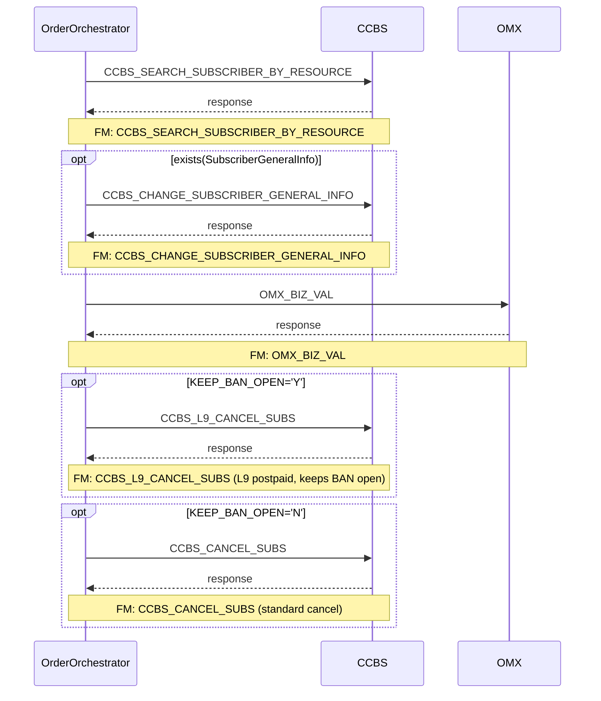

# TNP_CANCEL_SUB

> Process Configuration for TNP_CANCEL_SUB.

**Total steps:** 5 | **Unique FMs:** 5 | **Entry point:** CCBS_SEARCH_SUBSCRIBER_BY_RESOURCE | **Generated:** 2026-09-23

---

## Notable Pattern

Steps 4 and 5 are **mutually exclusive** — gated by `KEEP_BAN_OPEN` extended info:
- `KEEP_BAN_OPEN='Y'` → step 4: **CCBS_L9_CANCEL_SUBS** (L9/postpaid cancel — keeps BAN open)
- `KEEP_BAN_OPEN='N'` → step 5: **CCBS_CANCEL_SUBS** (standard cancel — closes BAN)

---

## §2 — Order Flow

| Step | Step ID | FM (ActivityID) | Parameter(s) | PreExecCheck | Previous | Next |
|------|---------|-----------------|--------------|--------------|----------|------|
| 1 | CCBS_SEARCH_SUBSCRIBER_BY_RESOURCE | CCBS_SEARCH_SUBSCRIBER_BY_RESOURCE | — | — | START | CCBS_CHANGE_SUBSCRIBER_GENERAL_INFO |
| 2 | CCBS_CHANGE_SUBSCRIBER_GENERAL_INFO | CCBS_CHANGE_SUBSCRIBER_GENERAL_INFO | — | `exists(//ParentOU/Subscriber/SubscriberGeneralInfo)` | CCBS_SEARCH_SUBSCRIBER_BY_RESOURCE | OMX_BIZ_VAL |
| 3 | OMX_BIZ_VAL | OMX_BIZ_VAL | — | — | CCBS_CHANGE_SUBSCRIBER_GENERAL_INFO | CCBS_L9_CANCEL_SUBS |
| 4 | CCBS_L9_CANCEL_SUBS ✨ | CCBS_L9_CANCEL_SUBS | — | `KEEP_BAN_OPEN='Y'` (OrderData.ExtendedInfo) | OMX_BIZ_VAL | CCBS_CANCEL_SUBS |
| 5 | CCBS_CANCEL_SUBS | CCBS_CANCEL_SUBS | — | `KEEP_BAN_OPEN='N'` (OrderData.ExtendedInfo) | CCBS_L9_CANCEL_SUBS | END |

> ✨ = New FM doc generated this session

---

## §3 — PreExecCheck Details

### Step 2 — CCBS_CHANGE_SUBSCRIBER_GENERAL_INFO
**FM:** `CCBS_CHANGE_SUBSCRIBER_GENERAL_INFO`
```xpath
exists(//ParentOU/Subscriber/SubscriberGeneralInfo)
```

### Step 4 — CCBS_L9_CANCEL_SUBS ✨ (KEEP_BAN_OPEN path)
**FM:** `CCBS_L9_CANCEL_SUBS`
```xpath
/ns0:OrderRequest/OrderData/ExtendedInfo[Name='KEEP_BAN_OPEN']/Value/text()="Y"
```

### Step 5 — CCBS_CANCEL_SUBS (standard cancel path)
**FM:** `CCBS_CANCEL_SUBS`
```xpath
/ns0:OrderRequest/OrderData/ExtendedInfo[Name='KEEP_BAN_OPEN']/Value/text()="N"
```

---

## §4 — FM Documentation Index

| FM (ActivityID) | Used in Steps | Doc |
|-----------------|---------------|-----|
| CCBS_SEARCH_SUBSCRIBER_BY_RESOURCE | 1 | [Request_CCBS_SEARCH_SUBSCRIBER_BY_RESOURCE.html](../FMlogic/Request_CCBS_SEARCH_SUBSCRIBER_BY_RESOURCE.html) |
| CCBS_CHANGE_SUBSCRIBER_GENERAL_INFO | 2 | [Request_CCBS_CHANGE_SUBSCRIBER_GENERAL_INFO.html](../FMlogic/Request_CCBS_CHANGE_SUBSCRIBER_GENERAL_INFO.html) |
| OMX_BIZ_VAL | 3 | [Request_OMX_BIZ_VAL.html](../FMlogic/Request_OMX_BIZ_VAL.html) |
| **CCBS_L9_CANCEL_SUBS** ✨ | **4** | [Request_CCBS_L9_CANCEL_SUBS.html](../FMlogic/Request_CCBS_L9_CANCEL_SUBS.html) |
| CCBS_CANCEL_SUBS | 5 | [Request_CCBS_CANCEL_SUBS.html](../FMlogic/Request_CCBS_CANCEL_SUBS.html) |

> ✨ = New FM doc generated this session

---

## §5 — Sequence Diagram



> Steps 4 and 5 are mutually exclusive — only one executes per order depending on KEEP_BAN_OPEN flag.

---

*TRUE Corporation OMX · Order Journey Documentation*
