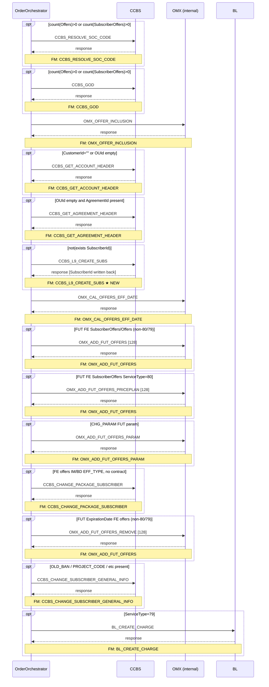

# TNP_CREATE_SUB

> Process Configuration for TNP_CREATE_SUB.

**Total steps:** 14 | **Unique FMs:** 12 | **Entry point:** CCBS_RESOLVE_SOC_CODE | **Generated:** 2026-09-23

---

## §2 — Order Flow

| Step | Step ID | FM (ActivityID) | Parameter(s) | PreExecCheck | Previous | Next |
|------|---------|-----------------|--------------|--------------|----------|------|
| 1 | CCBS_RESOLVE_SOC_CODE | CCBS_RESOLVE_SOC_CODE | — | `count(//Offers) > 0 or count(//SubscriberOffers) > 0` | START | CCBS_GOD |
| 2 | CCBS_GOD | CCBS_GOD | — | `count(//Offers) > 0 or count(//SubscriberOffers) > 0` | CCBS_RESOLVE_SOC_CODE | OMX_OFFER_INCLUSION |
| 3 | OMX_OFFER_INCLUSION | OMX_OFFER_INCLUSION | — | — | CCBS_GOD | CCBS_GET_ACCOUNT_HEADER |
| 4 | CCBS_GET_ACCOUNT_HEADER | CCBS_GET_ACCOUNT_HEADER | — | `CustomerId="" or len(ParentOU/OUId)=0 or len(ChildOU/OUId)=0` | OMX_OFFER_INCLUSION | CCBS_GET_AGREEMENT_HEADER |
| 5 | CCBS_GET_AGREEMENT_HEADER | CCBS_GET_AGREEMENT_HEADER | — | `(ParentOU/ChildOU OUId empty) and AgreementId present` | CCBS_GET_ACCOUNT_HEADER | CCBS_L9_CREATE_SUBS |
| 6 | CCBS_L9_CREATE_SUBS | CCBS_L9_CREATE_SUBS ★ | — | `not(exists(//Subscriber/SubscriberId))` | CCBS_GET_AGREEMENT_HEADER | OMX_CAL_OFFERS_EFF_DATE |
| 7 | OMX_CAL_OFFERS_EFF_DATE | OMX_CAL_OFFERS_EFF_DATE | — | — | CCBS_L9_CREATE_SUBS | OMX_ADD_FUT_OFFERS |
| 8 | OMX_ADD_FUT_OFFERS | OMX_ADD_FUT_OFFERS | 128 | FUT FE SubscriberOffers/Agreement Offers (ServiceType!=80/79) | OMX_CAL_OFFERS_EFF_DATE | OMX_ADD_FUT_OFFERS_PRICEPLAN |
| 9 | OMX_ADD_FUT_OFFERS_PRICEPLAN | OMX_ADD_FUT_OFFERS | 128 | FUT FE SubscriberOffers (ServiceType=80), ADD count > 0 | OMX_ADD_FUT_OFFERS | OMX_ADD_FUT_OFFERS_PARAM |
| 10 | OMX_ADD_FUT_OFFERS_PARAM | OMX_ADD_FUT_OFFERS_PARAM | — | CHG_PARAM FUT param for Subscriber or Agreement | OMX_ADD_FUT_OFFERS_PRICEPLAN | CCBS_CHANGE_PACKAGE_SUBSCRIBER |
| 11 | CCBS_CHANGE_PACKAGE_SUBSCRIBER | CCBS_CHANGE_PACKAGE_SUBSCRIBER | — | ParentOU.Subscriber present, FE offers (non-79/80), IM/BD EFF_TYPE, no contract | OMX_ADD_FUT_OFFERS_PARAM | OMX_ADD_FUT_OFFERS_REMOVE |
| 12 | OMX_ADD_FUT_OFFERS_REMOVE | OMX_ADD_FUT_OFFERS | 128 | FUT ExpirationDate offers (FE), non-80/79 | CCBS_CHANGE_PACKAGE_SUBSCRIBER | CCBS_CHANGE_SUBSCRIBER_GENERAL_INFO |
| 13 | CCBS_CHANGE_SUBSCRIBER_GENERAL_INFO | CCBS_CHANGE_SUBSCRIBER_GENERAL_INFO | — | OLD_BAN/OLD_BAN_DATE/PROJECT_CODE/MARKET_CODE/SALE_CHANNEL/PHASE_CODE/INSTALLATION_TYPE present | OMX_ADD_FUT_OFFERS_REMOVE | BL_CREATE_CHARGE |
| 14 | BL_CREATE_CHARGE | BL_CREATE_CHARGE | — | `//SubscriberOffers/ServiceType/text()=79` | CCBS_CHANGE_SUBSCRIBER_GENERAL_INFO | END |

---

## §3 — PreExecCheck Details

### Step 1 — CCBS_RESOLVE_SOC_CODE
**FM:** `CCBS_RESOLVE_SOC_CODE`
```xpath
count(//Offers) > 0 or count(//SubscriberOffers) > 0
```
Only runs if there are any offers or subscriber offers on the order.

### Step 2 — CCBS_GOD
**FM:** `CCBS_GOD`
```xpath
count(//Offers) > 0 or count(//SubscriberOffers) > 0
```

### Step 4 — CCBS_GET_ACCOUNT_HEADER
**FM:** `CCBS_GET_ACCOUNT_HEADER`
```xpath
/ns0:OrderRequest/OrderData/Customer/CustomerId/text()=""
or string-length(//ParentOU/OUId/text())=0
or string-length(//ChildOU/OUId/text())=0
```
Retrieves account header when CRM customer has not yet been resolved to a CCBS OUId.

### Step 5 — CCBS_GET_AGREEMENT_HEADER
**FM:** `CCBS_GET_AGREEMENT_HEADER`
```xpath
(string-length(//ParentOU/OUId/text())=0 or string-length(//ChildOU/OUId/text())=0)
and
(string-length(//ParentOU/Agreement/AgreementId/text()) > 0
 or string-length(//ChildOU/Agreement/AgreementId/text()) > 0)
```
OUId is missing but AgreementId is present — used to look up OU from agreement.

### Step 6 — CCBS_L9_CREATE_SUBS ★ NEW
**FM:** `CCBS_L9_CREATE_SUBS`
```xpath
not(exists(//Subscriber/SubscriberId))
```
Only creates subscriber when SubscriberId has not yet been assigned. Skipped on resubmit when already created.

### Step 8 — OMX_ADD_FUT_OFFERS
**FM:** `OMX_ADD_FUT_OFFERS`
```xpath
boolean(
  //Subscriber/SubscriberOffers[ExtendedInfo[Name='OfferActivityDate' and Value='FUT']][ExtendedInfo[Name='FE_OR_CCBS' and Value='FE']]
  and //SubscriberOffers/ServiceType/text() != '80'
  and //SubscriberOffers/ServiceType/text() != '79'
)
or boolean(
  //Agreement/Offers[ExtendedInfo[Name='OfferActivityDate' and Value='FUT']][ExtendedInfo[Name='FE_OR_CCBS' and Value='FE']]
  and //Agreement/Offers/ServiceType/text() != '80'
  and //Agreement/Offers/ServiceType/text() != '79'
)
```

### Step 10 — OMX_ADD_FUT_OFFERS_PARAM
**FM:** `OMX_ADD_FUT_OFFERS_PARAM`
```xpath
boolean(
  //Subscriber/SubscriberOffers[ExtendedInfo[Name='FE_OR_CCBS' and Value='FE']]
  and //Subscriber/SubscriberOffers[Action='CHG_PARAM']
  and //Subscriber/SubscriberOffers/ParameterInfo[ExtendedInfo[Name='OfferParamActivityDate' and Value='FUT']]
)
or boolean(
  //Agreement/Offers[ExtendedInfo[Name='FE_OR_CCBS' and Value='FE']]
  and //Agreement/Offers[Action='CHG_PARAM']
  and //Agreement/Offers/ParameterInfo[ExtendedInfo[Name='OfferParamActivityDate' and Value='FUT']]
)
```

### Step 13 — CCBS_CHANGE_SUBSCRIBER_GENERAL_INFO
**FM:** `CCBS_CHANGE_SUBSCRIBER_GENERAL_INFO`
```xpath
//Subscriber/ExtendedInfo[Name='OLD_BAN']/Value/text()!=''
or //Subscriber/ExtendedInfo[Name='OLD_BAN_DATE']/Value/text()!=''
or //Subscriber/ExtendedInfo[Name='PROJECT_CODE']/Value/text()!=''
or //Subscriber/ExtendedInfo[Name='MARKET_CODE']/Value/text()!=''
or //Subscriber/ExtendedInfo[Name='SALE_CHANNEL']/Value/text()!=''
or //Subscriber/ExtendedInfo[Name='PHASE_CODE']/Value/text()!=''
or //Subscriber/ExtendedInfo[Name='INSTALLATION_TYPE']/Value/text()!=''
```

---

## §4 — FM Documentation Index

| FM (ActivityID) | Used in Steps | Doc | Status |
|-----------------|---------------|-----|--------|
| CCBS_RESOLVE_SOC_CODE | 1 | [Request_CCBS_RESOLVE_SOC_CODE.html](../FMlogic/Request_CCBS_RESOLVE_SOC_CODE.html) | ✓ |
| CCBS_GOD | 2 | [Request_CCBS_GOD.html](../FMlogic/Request_CCBS_GOD.html) | ✓ |
| OMX_OFFER_INCLUSION | 3 | [Request_OMX_OFFER_INCLUSION.html](../FMlogic/Request_OMX_OFFER_INCLUSION.html) | ✓ |
| CCBS_GET_ACCOUNT_HEADER | 4 | [Request_CCBS_GET_ACCOUNT_HEADER.html](../FMlogic/Request_CCBS_GET_ACCOUNT_HEADER.html) | ✓ |
| CCBS_GET_AGREEMENT_HEADER | 5 | [Request_CCBS_GET_AGREEMENT_HEADER.html](../FMlogic/Request_CCBS_GET_AGREEMENT_HEADER.html) | ✓ |
| CCBS_L9_CREATE_SUBS | 6 | [Request_CCBS_L9_CREATE_SUBS.html](../FMlogic/Request_CCBS_L9_CREATE_SUBS.html) | ★ NEW |
| OMX_CAL_OFFERS_EFF_DATE | 7 | [Request_OMX_CAL_OFFERS_EFF_DATE.html](../FMlogic/Request_OMX_CAL_OFFERS_EFF_DATE.html) | ✓ |
| OMX_ADD_FUT_OFFERS | 8, 9, 12 | [Request_OMX_ADD_FUT_OFFERS.html](../FMlogic/Request_OMX_ADD_FUT_OFFERS.html) | ✓ |
| OMX_ADD_FUT_OFFERS_PARAM | 10 | [Request_OMX_ADD_FUT_OFFERS_PARAM.html](../FMlogic/Request_OMX_ADD_FUT_OFFERS_PARAM.html) | ✓ |
| CCBS_CHANGE_PACKAGE_SUBSCRIBER | 11 | [Request_CCBS_CHANGE_PACKAGE_SUBSCRIBER.html](../FMlogic/Request_CCBS_CHANGE_PACKAGE_SUBSCRIBER.html) | ✓ |
| CCBS_CHANGE_SUBSCRIBER_GENERAL_INFO | 13 | [Request_CCBS_CHANGE_SUBSCRIBER_GENERAL_INFO.html](../FMlogic/Request_CCBS_CHANGE_SUBSCRIBER_GENERAL_INFO.html) | ✓ |
| BL_CREATE_CHARGE | 14 | [Request_BL_CREATE_CHARGE.html](../FMlogic/Request_BL_CREATE_CHARGE.html) | ✓ |

---

## §5 — Sequence Diagram



---

*TRUE Corporation OMX · Order Journey Documentation*
