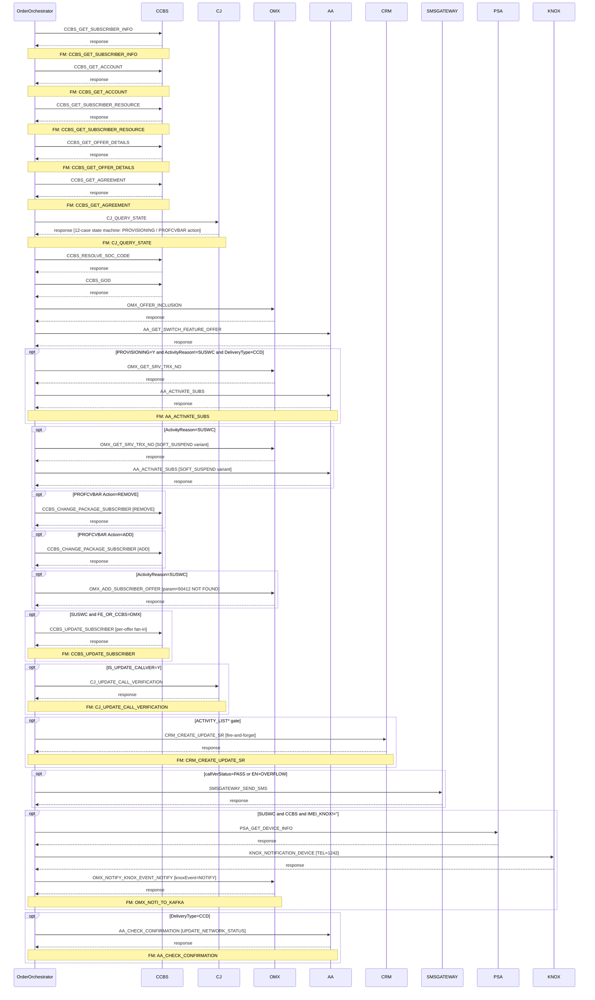

# UPDATE_CALL_VERIFICATION

> Call Verification Status Update — CCBS, CJ, CRM, AA Orchestration

**Total steps:** 25 | **Unique FMs:** 22 | **Entry point:** CCBS_GET_SUBSCRIBER_INFO | **Generated:** 2026-09-18

---

## §2 — Order Flow

| Step | Step ID | FM (ActivityID) | Parameter(s) | PreExecCheck | Previous | Next |
|------|---------|-----------------|--------------|--------------|----------|------|
| 1 | CCBS_GET_SUBSCRIBER_INFO | CCBS_GET_SUBSCRIBER_INFO | — | — | START | CCBS_GET_ACCOUNT |
| 2 | CCBS_GET_ACCOUNT | CCBS_GET_ACCOUNT | — | — | CCBS_GET_SUBSCRIBER_INFO | CCBS_GET_SUBSCRIBER_RESOURCE |
| 3 | CCBS_GET_SUBSCRIBER_RESOURCE | CCBS_GET_SUBSCRIBER_RESOURCE | — | — | CCBS_GET_ACCOUNT | CCBS_GET_OFFER_DETAILS |
| 4 | CCBS_GET_OFFER_DETAILS | CCBS_GET_OFFER_DETAILS | — | — | CCBS_GET_SUBSCRIBER_RESOURCE | CCBS_GET_AGREEMENT |
| 5 | CCBS_GET_AGREEMENT | CCBS_GET_AGREEMENT | — | — | CCBS_GET_OFFER_DETAILS | CJ_QUERY_STATE |
| 6 | CJ_QUERY_STATE | CJ_QUERY_STATE | — | — | CCBS_GET_AGREEMENT | CCBS_RESOLVE_SOC_CODE |
| 7 | CCBS_RESOLVE_SOC_CODE | CCBS_RESOLVE_SOC_CODE | — | — | CJ_QUERY_STATE | CCBS_GOD |
| 8 | CCBS_GOD | CCBS_GOD | — | — | CCBS_RESOLVE_SOC_CODE | OMX_OFFER_INCLUSION |
| 9 | OMX_OFFER_INCLUSION | OMX_OFFER_INCLUSION | — | — | CCBS_GOD | AA_GET_SWITCH_FEATURE_OFFER |
| 10 | AA_GET_SWITCH_FEATURE_OFFER | AA_GET_SWITCH_FEATURE_OFFER | — | — | OMX_OFFER_INCLUSION | OMX_GET_SRV_TRX_NO |
| 11 | OMX_GET_SRV_TRX_NO | OMX_GET_SRV_TRX_NO | — | `PROVISIONING=Y and ActivityReason!=SUSWC and DeliveryType=CCD` | AA_GET_SWITCH_FEATURE_OFFER | AA_ACTIVATE_SUBS |
| 12 | AA_ACTIVATE_SUBS | AA_ACTIVATE_SUBS | — | `PROVISIONING=Y and ActivityReason!=SUSWC and DeliveryType=CCD` | OMX_GET_SRV_TRX_NO | OMX_GET_SRV_TRX_NO_SOFT_SUSPEND |
| 13 | OMX_GET_SRV_TRX_NO_SOFT_SUSPEND | OMX_GET_SRV_TRX_NO | — | `ActivityReason=SUSWC` | AA_ACTIVATE_SUBS | AA_ACTIVATE_SUBS_SOFT_SUSPEND |
| 14 | AA_ACTIVATE_SUBS_SOFT_SUSPEND | AA_ACTIVATE_SUBS | — | `ActivityReason=SUSWC` | OMX_GET_SRV_TRX_NO_SOFT_SUSPEND | CCBS_CHANGE_PACKAGE_SUBSCRIBER_REMOVE |
| 15 | CCBS_CHANGE_PACKAGE_SUBSCRIBER_REMOVE | CCBS_CHANGE_PACKAGE_SUBSCRIBER | ACTION=REMOVE | `PROFCVBAR offer with Action=REMOVE exists` | AA_ACTIVATE_SUBS_SOFT_SUSPEND | CCBS_CHANGE_PACKAGE_SUBSCRIBER_ADD |
| 16 | CCBS_CHANGE_PACKAGE_SUBSCRIBER_ADD | CCBS_CHANGE_PACKAGE_SUBSCRIBER | ACTION=ADD | `PROFCVBAR offer with Action=ADD exists` | CCBS_CHANGE_PACKAGE_SUBSCRIBER_REMOVE | OMX_ADD_SUBSCRIBER_OFFER |
| 17 | OMX_ADD_SUBSCRIBER_OFFER | OMX_ADD_SUBSCRIBER_OFFER ⚠ | PARAM=50412 | `ActivityReason=SUSWC` | CCBS_CHANGE_PACKAGE_SUBSCRIBER_ADD | CCBS_UPDATE_SUBSCRIBER |
| 18 | CCBS_UPDATE_SUBSCRIBER | CCBS_UPDATE_SUBSCRIBER | FE_OR_CCBS=OMX | `ActivityReason=SUSWC and FE_OR_CCBS=OMX` | OMX_ADD_SUBSCRIBER_OFFER | CJ_UPDATE_CALL_VERIFICATION |
| 19 | CJ_UPDATE_CALL_VERIFICATION | CJ_UPDATE_CALL_VERIFICATION | — | `IS_UPDATE_CALLVER=Y` | CCBS_UPDATE_SUBSCRIBER | CRM_CREATE_UPDATE_SR |
| 20 | CRM_CREATE_UPDATE_SR | CRM_CREATE_UPDATE_SR | ACTIVITY_LIST* | `starts-with(ACTIVITY_LIST*, currentActivity)` | CJ_UPDATE_CALL_VERIFICATION | SMSGATEWAY_SEND_SMS |
| 21 | SMSGATEWAY_SEND_SMS | SMSGATEWAY_SEND_SMS | — | `callVerStatus=PASS or (IVR_LANG=EN and callVerStatus=OVERFLOW)` | CRM_CREATE_UPDATE_SR | PSA_GET_DEVICE_INFO |
| 22 | PSA_GET_DEVICE_INFO | PSA_GET_DEVICE_INFO | — | `ActivityReason=SUSWC and FE_OR_CCBS=CCBS and IMEI_KNOX!=''` | SMSGATEWAY_SEND_SMS | KNOX_NOTIFICATION_DEVICE |
| 23 | KNOX_NOTIFICATION_DEVICE | KNOX_NOTIFICATION_DEVICE | TEL=1242 | `ActivityReason=SUSWC and FE_OR_CCBS=CCBS and IMEI_KNOX!=''` | PSA_GET_DEVICE_INFO | OMX_NOTIFY_KNOX_EVENT_NOTIFY |
| 24 | OMX_NOTIFY_KNOX_EVENT_NOTIFY | OMX_NOTI_TO_KAFKA | knoxEvent=NOTIFY | `ActivityReason=SUSWC and FE_OR_CCBS=CCBS and IMEI_KNOX!=''` | KNOX_NOTIFICATION_DEVICE | AA_CHECK_CONFIRMATION |
| 25 | AA_CHECK_CONFIRMATION | AA_CHECK_CONFIRMATION | UPDATE_NETWORK_STATUS | `DeliveryType=CCD` | OMX_NOTIFY_KNOX_EVENT_NOTIFY | END |

> ⚠ Step 17 `OMX_ADD_SUBSCRIBER_OFFER` — rule file not found in source repository.

---

## §3 — PreExecCheck Details

### Step 11 — OMX_GET_SRV_TRX_NO

**FM:** `OMX_GET_SRV_TRX_NO`

```xpath
PROVISIONING=Y and ActivityReason!=SUSWC and DeliveryType=CCD
```

Provisioning path only. Skipped on SUSWC sub-flow. Requires CCD delivery type.

---

### Step 12 — AA_ACTIVATE_SUBS

**FM:** `AA_ACTIVATE_SUBS`

```xpath
PROVISIONING=Y and ActivityReason!=SUSWC and DeliveryType=CCD
```

---

### Step 13 — OMX_GET_SRV_TRX_NO_SOFT_SUSPEND

**FM:** `OMX_GET_SRV_TRX_NO`

```xpath
ActivityReason=SUSWC
```

SUSWC sub-path variant. Same FM as step 11 but with different extId instance.

---

### Step 14 — AA_ACTIVATE_SUBS_SOFT_SUSPEND

**FM:** `AA_ACTIVATE_SUBS`

```xpath
ActivityReason=SUSWC
```

---

### Step 15 — CCBS_CHANGE_PACKAGE_SUBSCRIBER_REMOVE

**FM:** `CCBS_CHANGE_PACKAGE_SUBSCRIBER`

```xpath
PROFCVBAR offer with Action=REMOVE exists in subscriber offers
```

Created by `Response_CJ_QUERY_STATE` when OVERFLOW→NOTPASS state transition detected. `action=ADD` in that case creates a new SubscriberOffer(PROFCVBAR, ServiceType=85).

---

### Step 16 — CCBS_CHANGE_PACKAGE_SUBSCRIBER_ADD

**FM:** `CCBS_CHANGE_PACKAGE_SUBSCRIBER`

```xpath
PROFCVBAR offer with Action=ADD exists in subscriber offers
```

---

### Step 17 — OMX_ADD_SUBSCRIBER_OFFER

**FM:** `OMX_ADD_SUBSCRIBER_OFFER` ⚠ (not found)

```xpath
ActivityReason=SUSWC
```

Parameter: `50412`

---

### Step 18 — CCBS_UPDATE_SUBSCRIBER

**FM:** `CCBS_UPDATE_SUBSCRIBER`

```xpath
ActivityReason=SUSWC and FE_OR_CCBS=OMX
```

Per-offer update for SUSWC path. FE_OR_CCBS must be OMX (not FE).

---

### Step 19 — CJ_UPDATE_CALL_VERIFICATION

**FM:** `CJ_UPDATE_CALL_VERIFICATION`

```xpath
IS_UPDATE_CALLVER=Y
```

Set by `Response_CJ_QUERY_STATE`. False when `callVerStatus` transitions are PASS→NOTPASS or PASS→OVERFLOW (no CJ update needed for those cases).

---

### Step 20 — CRM_CREATE_UPDATE_SR

**FM:** `CRM_CREATE_UPDATE_SR`

```xpath
starts-with(ACTIVITY_LIST*, currentActivityName)
```

Parameter: `ACTIVITY_LIST*` — gating on allowed activity list prefix.

---

### Step 21 — SMSGATEWAY_SEND_SMS

**FM:** `SMSGATEWAY_SEND_SMS`

```xpath
callVerStatus=PASS or (IVR_LANG=EN and callVerStatus=OVERFLOW)
```

SMS notification sent on PASS, or on OVERFLOW for EN-language IVR subscribers.

---

### Step 22 — PSA_GET_DEVICE_INFO

**FM:** `PSA_GET_DEVICE_INFO`

```xpath
ActivityReason=SUSWC and FE_OR_CCBS=CCBS and IMEI_KNOX!=''
```

Knox NOTIFY block. All three steps 22-24 share this same PreExecCheck.

---

### Step 23 — KNOX_NOTIFICATION_DEVICE

**FM:** `KNOX_NOTIFICATION_DEVICE`

```xpath
ActivityReason=SUSWC and FE_OR_CCBS=CCBS and IMEI_KNOX!=''
```

Parameter: `TEL=1242`

---

### Step 24 — OMX_NOTIFY_KNOX_EVENT_NOTIFY

**FM:** `OMX_NOTI_TO_KAFKA`

```xpath
ActivityReason=SUSWC and FE_OR_CCBS=CCBS and IMEI_KNOX!=''
```

Parameter: `knoxEvent=NOTIFY`

> Note: extId is `OMX_NOTIFY_KNOX_EVENT_NOTIFY` but ActivityID (FM) is `OMX_NOTI_TO_KAFKA`.

---

### Step 25 — AA_CHECK_CONFIRMATION

**FM:** `AA_CHECK_CONFIRMATION`

```xpath
DeliveryType=CCD
```

Parameter: `UPDATE_NETWORK_STATUS`

---

## §4 — FM Documentation Index

| FM (ActivityID) | Used in Steps | Status | Doc Link |
|-----------------|---------------|--------|----------|
| CCBS_GET_SUBSCRIBER_INFO | 1 | Generated | [Request_CCBS_GET_SUBSCRIBER_INFO.html](../FMlogic/Request_CCBS_GET_SUBSCRIBER_INFO.html) |
| CCBS_GET_ACCOUNT | 2 | Generated | [Request_CCBS_GET_ACCOUNT.html](../FMlogic/Request_CCBS_GET_ACCOUNT.html) |
| CCBS_GET_SUBSCRIBER_RESOURCE | 3 | Generated | [Request_CCBS_GET_SUBSCRIBER_RESOURCE.html](../FMlogic/Request_CCBS_GET_SUBSCRIBER_RESOURCE.html) |
| CCBS_GET_OFFER_DETAILS | 4 | Generated | [Request_CCBS_GET_OFFER_DETAILS.html](../FMlogic/Request_CCBS_GET_OFFER_DETAILS.html) |
| CCBS_GET_AGREEMENT | 5 | Generated | [Request_CCBS_GET_AGREEMENT.html](../FMlogic/Request_CCBS_GET_AGREEMENT.html) |
| CJ_QUERY_STATE | 6 | Generated | [Request_CJ_QUERY_STATE.html](../FMlogic/Request_CJ_QUERY_STATE.html) |
| CCBS_RESOLVE_SOC_CODE | 7 | Generated | [Request_CCBS_RESOLVE_SOC_CODE.html](../FMlogic/Request_CCBS_RESOLVE_SOC_CODE.html) |
| CCBS_GOD | 8 | Generated | [Request_CCBS_GOD.html](../FMlogic/Request_CCBS_GOD.html) |
| OMX_OFFER_INCLUSION | 9 | Generated | [Request_OMX_OFFER_INCLUSION.html](../FMlogic/Request_OMX_OFFER_INCLUSION.html) |
| AA_GET_SWITCH_FEATURE_OFFER | 10 | Generated | [Request_AA_GET_SWITCH_FEATURE_OFFER.html](../FMlogic/Request_AA_GET_SWITCH_FEATURE_OFFER.html) |
| OMX_GET_SRV_TRX_NO | 11, 13 | Generated | [Request_OMX_GET_SRV_TRX_NO.html](../FMlogic/Request_OMX_GET_SRV_TRX_NO.html) |
| AA_ACTIVATE_SUBS | 12, 14 | Generated | [Request_AA_ACTIVATE_SUBS.html](../FMlogic/Request_AA_ACTIVATE_SUBS.html) |
| CCBS_CHANGE_PACKAGE_SUBSCRIBER | 15, 16 | Generated | [Request_CCBS_CHANGE_PACKAGE_SUBSCRIBER.html](../FMlogic/Request_CCBS_CHANGE_PACKAGE_SUBSCRIBER.html) |
| OMX_ADD_SUBSCRIBER_OFFER | 17 | **Not Found** | — |
| CCBS_UPDATE_SUBSCRIBER | 18 | Generated | [Request_CCBS_UPDATE_SUBSCRIBER.html](../FMlogic/Request_CCBS_UPDATE_SUBSCRIBER.html) |
| CJ_UPDATE_CALL_VERIFICATION | 19 | Generated | [Request_CJ_UPDATE_CALL_VERIFICATION.html](../FMlogic/Request_CJ_UPDATE_CALL_VERIFICATION.html) |
| CRM_CREATE_UPDATE_SR | 20 | Generated | [Request_CRM_CREATE_UPDATE_SR.html](../FMlogic/Request_CRM_CREATE_UPDATE_SR.html) |
| SMSGATEWAY_SEND_SMS | 21 | Generated | [Request_SMSGATEWAY_SEND_SMS.html](../FMlogic/Request_SMSGATEWAY_SEND_SMS.html) |
| PSA_GET_DEVICE_INFO | 22 | Generated | [Request_PSA_GET_DEVICE_INFO.html](../FMlogic/Request_PSA_GET_DEVICE_INFO.html) |
| KNOX_NOTIFICATION_DEVICE | 23 | Generated | [Request_KNOX_NOTIFICATION_DEVICE.html](../FMlogic/Request_KNOX_NOTIFICATION_DEVICE.html) |
| OMX_NOTI_TO_KAFKA | 24 | Generated | [Request_OMX_NOTI_TO_KAFKA.html](../FMlogic/Request_OMX_NOTI_TO_KAFKA.html) |
| AA_CHECK_CONFIRMATION | 25 | Generated | [Request_AA_CHECK_CONFIRMATION.html](../FMlogic/Request_AA_CHECK_CONFIRMATION.html) |

---

## §5 — Sequence Diagram



> Conditional steps wrapped in `opt` blocks. Full diagrams with flow chart: see [UPDATE_CALL_VERIFICATION.html](../order/UPDATE_CALL_VERIFICATION.html).

---

## §6 — Key Business Logic Notes

### CJ State Machine (Step 6 Response)

The `Response_CJ_QUERY_STATE` handler applies a 12-case truth table:

| currentStatus (CJ) | newStatus (Order CALL_VER_STATUS) | PROVISIONING | PROFCVBAR action | IS_UPDATE_CALLVER |
|---|---|---|---|---|
| NOFCR | PASS | Y | REMOVE | Y |
| NOFCR | OVERFLOW | Y | REMOVE | Y |
| NOFCR | NOTPASS | N | — | Y |
| NOTPASS | PASS | Y | REMOVE | Y |
| NOTPASS | OVERFLOW | Y | REMOVE | Y |
| NOTPASS | NOTPASS | N | — | Y |
| OVERFLOW | PASS | N | — | Y |
| OVERFLOW | OVERFLOW | N | — | Y |
| OVERFLOW | NOTPASS | Y | **ADD** ★ | Y |
| PASS | PASS | Y | REMOVE | Y |
| PASS | NOTPASS | N | — | **N** |
| PASS | OVERFLOW | N | — | **N** |

> ★ OVERFLOW→NOTPASS creates new SubscriberOffer(PROFCVBAR, ServiceType=85, FE_OR_CCBS=FE)
> IS_UPDATE_CALLVER=N → Step 19 is skipped

### SUSWC Sub-flow (Steps 13-14, 17-18)

When `ActivityReason=SUSWC`, the soft-suspend path runs steps 13-14 (alternative AA activation) and steps 17-18 (OMX offer add + CCBS update). The Knox NOTIFY block (steps 22-24) also requires `ActivityReason=SUSWC`.

### CRM Fire-and-Forget (Step 20)

`CRM_CREATE_UPDATE_SR` uses `sendEventImmediate` (not `assertEvent`). No IntraActivitySequencing. Manual `RequestCount++` per sent event. Response fan-in via `successResponseCount` XPath: `count($currActivity/Response[tib:right(tib:trim(ResponseCode), 3) = "000"])`.

**Known issue:** Activity parameter key `"FCR_GLAG"` is a typo — do not correct independently of the ProcessConfig.

---

*TRUE Corporation OMX · Order Journey Documentation · UPDATE_CALL_VERIFICATION*
